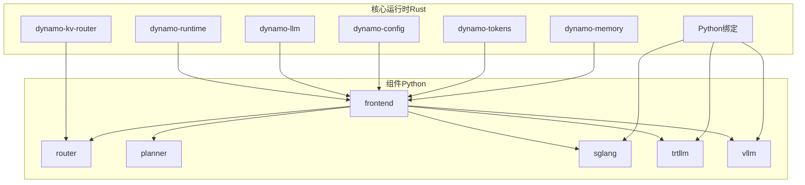
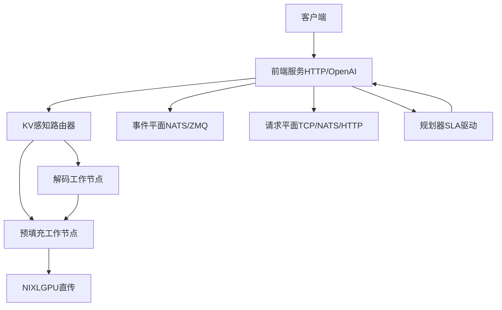
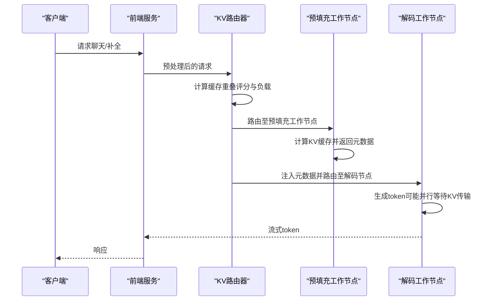
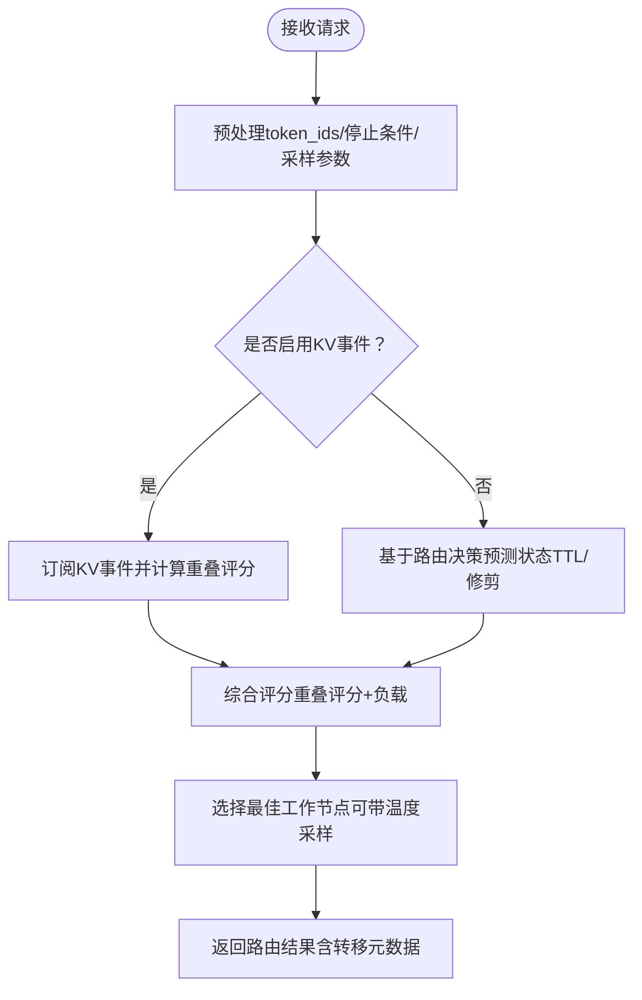
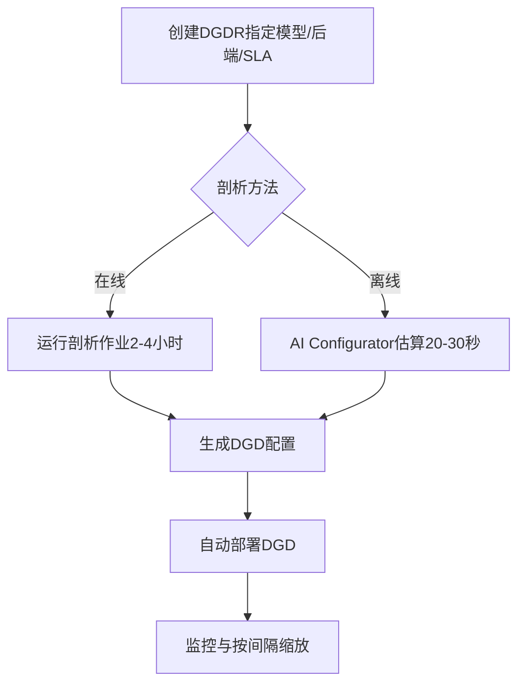
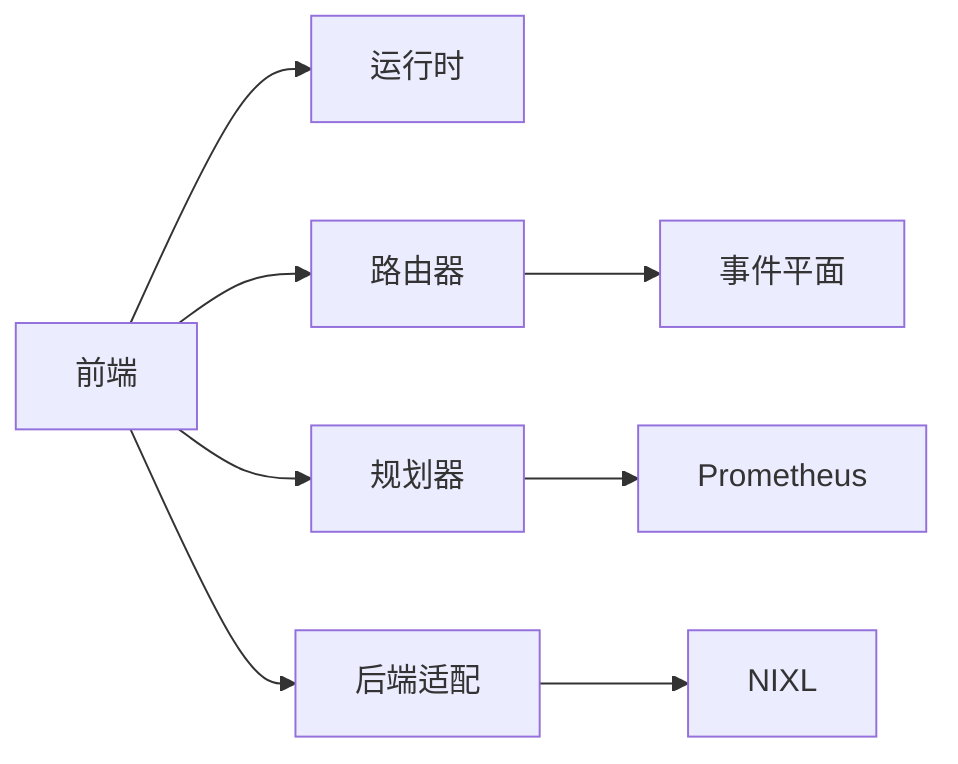

# 项目概述

<cite>
**本文档引用的文件**
- [README.md](file://README.md)
- [architecture.md](file://docs/pages/design-docs/architecture.md)
- [disagg-serving.md](file://docs/pages/design-docs/disagg-serving.md)
- [README.md](file://docs/pages/components/router/README.md)
- [planner-guide.md](file://docs/pages/components/planner/planner-guide.md)
- [README.md](file://docs/pages/components/kvbm/README.md)
- [README.md](file://docs/pages/backends/sglang/README.md)
- [README.md](file://docs/pages/backends/trtllm/README.md)
- [README.md](file://docs/pages/backends/vllm/README.md)
- [main.py](file://components/src/dynamo/frontend/main.py)
- [__main__.py](file://components/src/dynamo/router/__main__.py)
- [main.py](file://components/src/dynamo/sglang/main.py)
- [main.py](file://components/src/dynamo/trtllm/main.py)
- [main.py](file://components/src/dynamo/vllm/main.py)
- [Cargo.toml](file://Cargo.toml)
- [pyproject.toml](file://pyproject.toml)
</cite>

## 目录
1. [引言](#引言)
2. [项目结构](#项目结构)
3. [核心组件](#核心组件)
4. [架构总览](#架构总览)
5. [详细组件分析](#详细组件分析)
6. [依赖关系分析](#依赖关系分析)
7. [性能考量](#性能考量)
8. [故障排查指南](#故障排查指南)
9. [结论](#结论)
10. [附录](#附录)

## 引言
NVIDIA Dynamo 是面向生成式AI与推理模型的高性能、低延迟分布式推理框架，专为多节点环境设计，具备以下核心价值主张：
- 分割式预填充与解码：最大化GPU吞吐量并平衡延迟与吞吐
- 动态GPU调度：基于实时需求优化性能
- LLM感知请求路由：消除不必要的KV缓存重算
- 加速数据传输：通过NIXL降低推理响应时间
- KV缓存卸载：利用多层级内存提升吞吐与降低延迟

Dynamo采用“Rust高性能+Python可扩展”的混合架构，支持SGLang、TensorRT-LLM、vLLM三大后端，并提供从单机到Kubernetes生产级部署的完整工具链。

## 项目结构
仓库采用模块化分层组织：
- components/src/dynamo：核心运行时与组件（前端、路由器、规划器、后端适配）
- lib：Rust库与绑定（引擎、运行时、配置、令牌、内存、KV路由器等）
- deploy：平台与Operator部署资源
- docs：设计文档与用户指南
- examples/recipes：端到端示例与部署配方
- benchmarks：基准测试与性能分析工具

图示来源
- [Cargo.toml](file://Cargo.toml#L4-L36)
- [pyproject.toml](file://pyproject.toml#L106-L109)

章节来源
- [Cargo.toml](file://Cargo.toml#L4-L36)
- [pyproject.toml](file://pyproject.toml#L106-L109)

## 核心组件
- 前端服务（Frontend）：OpenAI兼容HTTP服务、自动发现、预处理与路由，默认轮询；支持KV感知路由与多协议（TCP/NATS/HTTP）请求平面
- 路由器（Router）：KV感知路由，基于缓存重叠评分与负载选择最优工作节点；支持事件平面（NATS/ZMQ）与快照/修剪策略
- 规划器（Planner）：SLA驱动的部署规划，结合Prometheus指标进行动态扩缩容与资源调度
- 后端适配（SGLang/TRT-LLM/vLLM）：统一接入不同推理引擎，提供预填充/解码分离、KV事件发布、指标采集与健康检查
- KV块管理器（KVBM）：跨层级内存的KV块统一管理与远程共享，配合NIXL加速传输

章节来源
- [main.py](file://components/src/dynamo/frontend/main.py#L368-L518)
- [README.md](file://docs/pages/components/router/README.md#L1-L104)
- [planner-guide.md](file://docs/pages/components/planner/planner-guide.md#L1-L458)
- [README.md](file://docs/pages/components/kvbm/README.md#L1-L65)

## 架构总览
Dynamo的整体架构围绕“分割式推理、KV感知路由、动态调度与高效数据传输”展开，通过事件平面与请求平面实现跨节点协调与低延迟数据交换。

图示来源
- [architecture.md](file://docs/pages/design-docs/architecture.md#L38-L56)
- [disagg-serving.md](file://docs/pages/design-docs/disagg-serving.md#L21-L54)

章节来源
- [architecture.md](file://docs/pages/design-docs/architecture.md#L38-L56)
- [disagg-serving.md](file://docs/pages/design-docs/disagg-serving.md#L21-L54)

## 详细组件分析

### 前端服务（Frontend）
- 职责：启动OpenAI兼容HTTP服务、自动发现后端、预处理与路由；支持TLS、KServe gRPC、指标前缀自定义
- 关键特性：KV感知路由配置、请求迁移限制、请求/事件平面选择、多处理器模式（Dynamo/VLLM）
- 部署方式：本地快速启动、容器镜像、Kubernetes部署

图示来源
- [disagg-serving.md](file://docs/pages/design-docs/disagg-serving.md#L25-L45)
- [main.py](file://components/src/dynamo/frontend/main.py#L368-L518)

章节来源
- [main.py](file://components/src/dynamo/frontend/main.py#L82-L366)
- [main.py](file://components/src/dynamo/frontend/main.py#L368-L518)

### 路由器（Router）
- 职责：根据KV缓存重叠评分与负载选择最佳工作节点；支持事件同步（NATS JetStream）、树索引修剪与快照
- 配置项：重叠评分权重、温度采样、事件平面、活跃块跟踪、输出块跟踪、TTL与最大树大小、线程数等
- 支持场景：静态端点不支持KV路由；多模态路由（图像哈希）

图示来源
- [README.md](file://docs/pages/components/router/README.md#L27-L78)
- [__main__.py](file://components/src/dynamo/router/__main__.py#L156-L267)

章节来源
- [README.md](file://docs/pages/components/router/README.md#L82-L104)
- [__main__.py](file://components/src/dynamo/router/__main__.py#L31-L154)

### 规划器（Planner）
- 职责：以SLA为目标（TTFT/ITL/ISL/OSL）自动寻找最优拓扑与资源配置；基于Prometheus指标周期性调整副本数
- 工作流：DGDR声明意图→在线/离线（AI Configurator）剖析→生成DGD→部署与监控→按需缩放
- 指标来源：前端暴露的指标端点；支持虚拟部署模式对接外部编排系统

图示来源
- [planner-guide.md](file://docs/pages/components/planner/planner-guide.md#L74-L90)

章节来源
- [planner-guide.md](file://docs/pages/components/planner/planner-guide.md#L10-L458)

### KV块管理器（KVBM）
- 职责：统一KV块生命周期管理与跨层级内存（GPU/HBM、主机/DRAM、本地/分布式SSD、对象存储/云存储）共享
- 特性：块生命周期（分配→注册→匹配）、与NIXL集成、支持聚合/拆分拓扑
- 应用：长会话/多轮对话、高并发场景下避免昂贵的KV重算，显著降低首Token延迟

章节来源
- [README.md](file://docs/pages/components/kvbm/README.md#L17-L65)

### 后端适配（SGLang/TRT-LLM/vLLM）
- 共同能力：拆分式预填充/解码、KV感知路由、请求迁移、指标与健康检查
- 差异化特性：
  - SGLang：支持RDMA引导信息、多模态（图像/扩散）、注意力数据并行（DP）路由
  - TRT-LLM：支持KVBM集成、视频扩散（实验）、日志处理器插件、DP秩路由
  - vLLM：原生KV事件、NIXL传输、LMCache集成、提示嵌入、Omni模式

章节来源
- [README.md](file://docs/pages/backends/sglang/README.md#L31-L86)
- [README.md](file://docs/pages/backends/trtllm/README.md#L39-L116)
- [README.md](file://docs/pages/backends/vllm/README.md#L32-L124)

## 依赖关系分析
- 语言与构建
  - Rust工作区成员涵盖运行时、LLM接口、配置、令牌、内存、KV路由器、绑定等
  - Python项目提供后端可选依赖（vLLM/SGLang/TensorRT-LLM）与打包入口
- 组件耦合
  - 前端依赖KV路由器与运行时；路由器依赖事件平面与KV事件；后端适配依赖统一的注册与指标接口
- 外部依赖
  - NATS（JetStream可选）、ZMQ、etcd（可选）、Prometheus、NIXL（数据传输）

图示来源
- [Cargo.toml](file://Cargo.toml#L4-L36)
- [pyproject.toml](file://pyproject.toml#L50-L70)

章节来源
- [Cargo.toml](file://Cargo.toml#L4-L36)
- [pyproject.toml](file://pyproject.toml#L50-L70)

## 性能考量
- 分割式推理：将预填充（计算密集）与解码（延迟敏感）分离，提升整体吞吐与TTFT表现
- KV感知路由：最大化缓存命中率，减少重复计算，降低平均请求延迟
- 动态GPU调度：依据负载与SLA自动扩缩容，避免静态分配导致的资源浪费
- 加速数据传输：NIXL在多节点环境下实现GPU直传，减少同步与拷贝开销
- KV缓存卸载：利用CPU内存/SSD/对象存储扩展可用缓存，缓解显存压力

## 故障排查指南
- 端口冲突与系统指标：前端不暴露系统指标服务器，避免与后端占用相同端口
- NATS与事件平面：KV感知路由需要事件平面（NATS/ZMQ），必要时启用JetStream以保证多副本一致性
- 请求平面选择：TCP通常最快，NATS适合动态路由与事件，HTTP用于简单场景
- 后端特定问题：
  - TRT-LLM：注意KV缓存耗尽导致的死锁，确保缓冲阈值大于最大输入序列长度
  - vLLM：开启前缀缓存时确保哈希一致性（如设置PYTHONHASHSEED或sha256算法）
- 日志与可观测性：通过DYN_LOG与后端日志级别映射，结合Prometheus/Grafana仪表盘定位瓶颈

章节来源
- [main.py](file://components/src/dynamo/frontend/main.py#L380-L420)
- [README.md](file://docs/pages/backends/trtllm/README.md#L372-L397)
- [README.md](file://docs/pages/backends/vllm/README.md#L173-L184)

## 结论
Dynamo通过“分割式推理+KV感知路由+动态调度+高效数据传输”的组合拳，在生成式AI推理领域实现了高吞吐、低延迟与强可扩展性。其多后端支持与多语言架构使其既能满足高性能需求，又便于生态集成与二次开发。对于初学者，建议从本地快速启动开始；对于有经验的开发者，可深入规划器与KVBM，结合真实SLA目标进行端到端优化。

## 附录
- 快速启动与部署参考：README中的本地快速启动、Kubernetes部署与构建指南
- 设计文档与组件指南：架构、路由器、规划器、KVBM与后端适配的详细设计文档链接

章节来源
- [README.md](file://README.md#L77-L398)