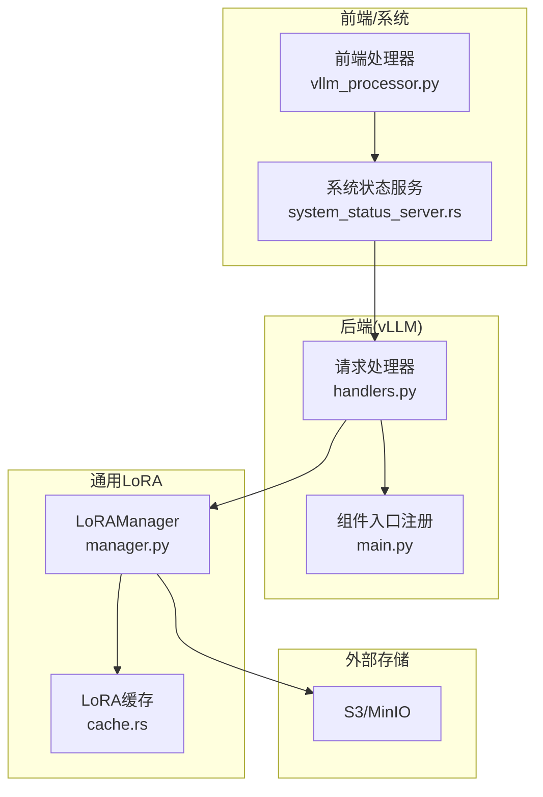
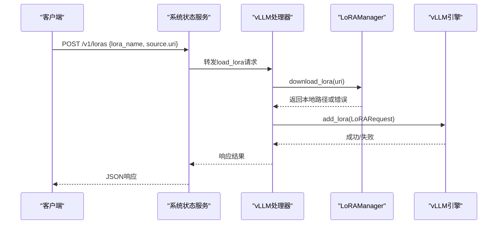
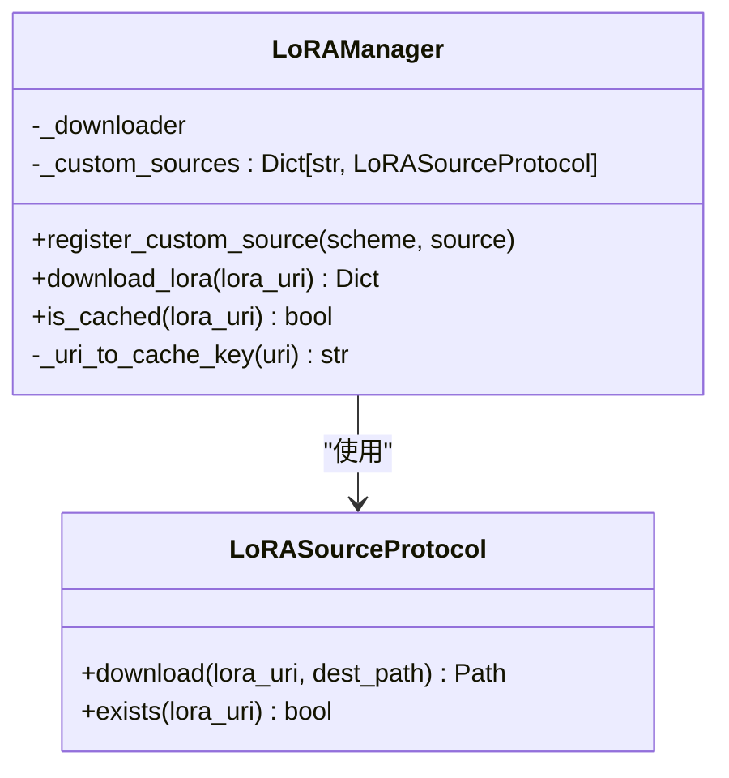
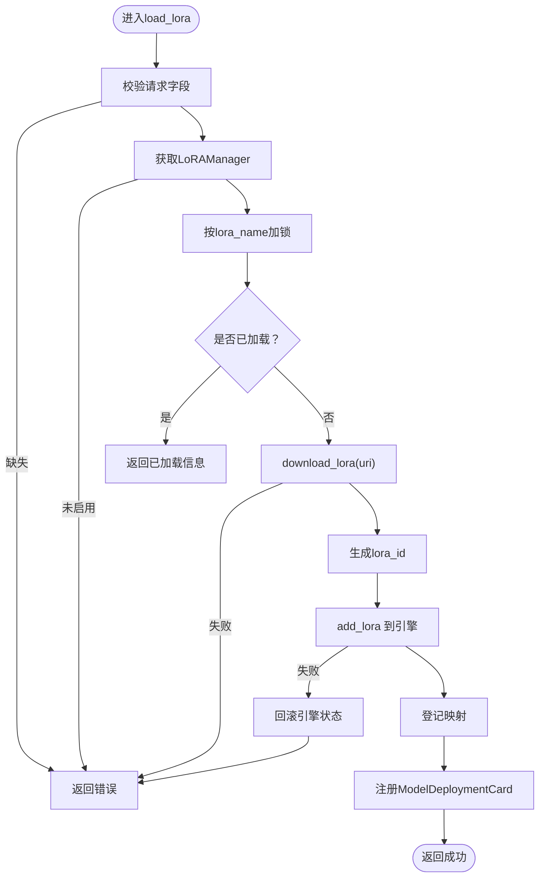
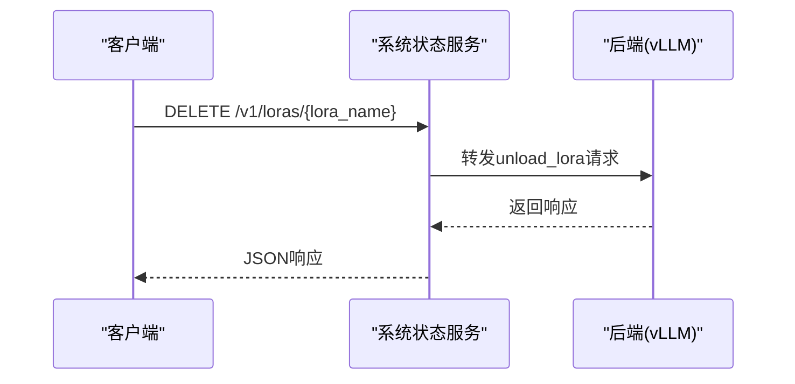
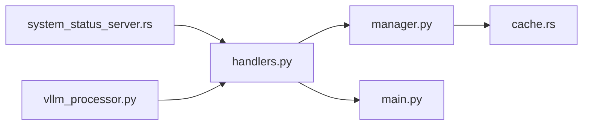

# LoRA微调集成

<cite>
**本文引用的文件**
- [components/src/dynamo/common/lora/manager.py](file://components/src/dynamo/common/lora/manager.py)
- [components/src/dynamo/vllm/handlers.py](file://components/src/dynamo/vllm/handlers.py)
- [components/src/dynamo/vllm/main.py](file://components/src/dynamo/vllm/main.py)
- [lib/runtime/src/system_status_server.rs](file://lib/runtime/src/system_status_server.rs)
- [lib/llm/src/lora/cache.rs](file://lib/llm/src/lora/cache.rs)
- [tests/serve/lora_utils.py](file://tests/serve/lora_utils.py)
- [components/src/dynamo/frontend/vllm_processor.py](file://components/src/dynamo/frontend/vllm_processor.py)
- [deploy/operator/internal/modelendpoint/client_test.go](file://deploy/operator/internal/modelendpoint/client_test.go)
- [deploy/operator/internal/modelendpoint/lora_test.go](file://deploy/operator/internal/modelendpoint/lora_test.go)
</cite>

## 目录
1. [简介](#简介)
2. [项目结构](#项目结构)
3. [核心组件](#核心组件)
4. [架构总览](#架构总览)
5. [组件详解](#组件详解)
6. [依赖关系分析](#依赖关系分析)
7. [性能考量](#性能考量)
8. [故障排查指南](#故障排查指南)
9. [结论](#结论)
10. [附录](#附录)

## 简介
本技术文档系统阐述Dynamo中LoRA（低秩适配）微调集成功能的设计与实现，覆盖LoRA基本原理、模型加载机制、参数管理、服务集成、多LoRA并行与动态切换、资源管理、部署配置、模型上传与推理调用示例、最佳实践、性能优化与故障排查，以及安全、版本与扩展性设计建议。读者可据此在Dynamo平台上完成LoRA的端到端落地与运维。

## 项目结构
Dynamo的LoRA能力由“前端/后端服务层”“通用LoRA管理器”“运行时系统状态接口”“缓存与下载”等模块协同实现，关键位置如下：
- Python侧LoRA管理器：封装统一下载与缓存逻辑，支持自定义源扩展
- vLLM后端处理器：负责LoRA的加载/卸载/枚举，对接vLLM引擎
- 运行时系统状态服务：对外暴露/loras相关HTTP接口，转发至各后端
- 缓存与下载：基于环境变量的本地缓存路径与一致性校验
- 测试与示例：提供S3兼容存储的LoRA上传与加载流程验证

图表来源
- [lib/runtime/src/system_status_server.rs](file://lib/runtime/src/system_status_server.rs#L356-L491)
- [components/src/dynamo/vllm/handlers.py](file://components/src/dynamo/vllm/handlers.py#L452-L765)
- [components/src/dynamo/vllm/main.py](file://components/src/dynamo/vllm/main.py#L689-L880)
- [components/src/dynamo/common/lora/manager.py](file://components/src/dynamo/common/lora/manager.py#L30-L115)
- [lib/llm/src/lora/cache.rs](file://lib/llm/src/lora/cache.rs#L14-L44)

章节来源
- [lib/runtime/src/system_status_server.rs](file://lib/runtime/src/system_status_server.rs#L356-L491)
- [components/src/dynamo/vllm/handlers.py](file://components/src/dynamo/vllm/handlers.py#L452-L765)
- [components/src/dynamo/vllm/main.py](file://components/src/dynamo/vllm/main.py#L689-L880)
- [components/src/dynamo/common/lora/manager.py](file://components/src/dynamo/common/lora/manager.py#L30-L115)
- [lib/llm/src/lora/cache.rs](file://lib/llm/src/lora/cache.rs#L14-L44)

## 核心组件
- LoRAManager（Python）
  - 统一下载与缓存：支持file://、s3://与自定义协议；通过Rust侧LoRADownloader实现
  - 自定义源扩展：通过LoRASourceProtocol注册自定义scheme
  - 缓存键生成与存在性检查：与Rust侧保持一致
- vLLM处理器（Python）
  - 加载/卸载/枚举LoRA：序列化同名并发请求；与vLLM引擎交互；注册/注销ModelDeploymentCard
  - 并发控制：按lora_name加锁，保证幂等与一致性
  - 错误回滚：异常时尝试恢复引擎状态
- 系统状态服务（Rust）
  - 对外HTTP接口：POST/DELETE/GET /v1/loras；转发到各后端
  - 统一日志与错误响应格式
- 缓存与下载（Rust/Python）
  - 环境变量DYN_LORA_PATH决定缓存根目录，默认$HOME/.cache/dynamo_loras
  - 按URI生成稳定缓存键，避免重复下载

章节来源
- [components/src/dynamo/common/lora/manager.py](file://components/src/dynamo/common/lora/manager.py#L30-L115)
- [components/src/dynamo/vllm/handlers.py](file://components/src/dynamo/vllm/handlers.py#L452-L765)
- [lib/runtime/src/system_status_server.rs](file://lib/runtime/src/system_status_server.rs#L356-L491)
- [lib/llm/src/lora/cache.rs](file://lib/llm/src/lora/cache.rs#L14-L44)

## 架构总览
Dynamo的LoRA集成采用“系统状态服务统一入口 + 后端具体实现”的分层设计。系统状态服务接收外部请求，解析并转发到对应后端（如vLLM），后端通过LoRAManager完成下载与缓存，再与引擎交互完成加载/卸载。

图表来源
- [lib/runtime/src/system_status_server.rs](file://lib/runtime/src/system_status_server.rs#L356-L396)
- [components/src/dynamo/vllm/handlers.py](file://components/src/dynamo/vllm/handlers.py#L452-L553)
- [components/src/dynamo/common/lora/manager.py](file://components/src/dynamo/common/lora/manager.py#L62-L106)

## 组件详解

### LoRAManager（Python）
- 设计要点
  - 单一Rust接口：统一处理file://与s3://下载与缓存
  - 扩展点：自定义协议通过LoRASourceProtocol注入
  - 缓存键一致性：与Rust侧uri_to_cache_key保持一致
- 关键行为
  - download_lora：根据scheme选择自定义源或Rust下载器
  - is_cached：基于缓存键判断是否已缓存
- 复杂度
  - 下载：O(1)缓存命中，否则取决于网络/存储IO
  - 缓存键生成：O(1)

图表来源
- [components/src/dynamo/common/lora/manager.py](file://components/src/dynamo/common/lora/manager.py#L15-L115)

章节来源
- [components/src/dynamo/common/lora/manager.py](file://components/src/dynamo/common/lora/manager.py#L30-L115)

### vLLM处理器（Python）
- 设计要点
  - 幂等加载：同名并发请求串行化，避免重复加载
  - 引擎交互：add_lora/remove_lora；跟踪lora_id与路径映射
  - 注册/注销：与ModelDeploymentCard交互，支持动态发现
  - 回滚机制：异常时尝试恢复引擎状态，维持一致性
- 关键行为
  - load_lora：下载→生成lora_id→add_lora→登记→注册
  - unload_lora：remove_lora→清理登记→注销ModelDeploymentCard
  - list_loras：返回当前已加载列表
- 并发与一致性
  - 使用锁确保同一lora_name的串行化
  - 异常回滚与最终一致性保障

图表来源
- [components/src/dynamo/vllm/handlers.py](file://components/src/dynamo/vllm/handlers.py#L452-L553)
- [components/src/dynamo/vllm/handlers.py](file://components/src/dynamo/vllm/handlers.py#L642-L765)

章节来源
- [components/src/dynamo/vllm/handlers.py](file://components/src/dynamo/vllm/handlers.py#L452-L765)

### 系统状态服务（Rust）
- 设计要点
  - 统一HTTP接口：POST/DELETE/GET /v1/loras
  - 转发到各后端：call_lora_endpoint遍历可用后端
  - 错误聚合：统一错误响应结构
- 关键行为
  - load_lora：构造请求体并转发
  - unload_lora：删除指定lora_name
  - list_loras：列举所有已加载LoRA

图表来源
- [lib/runtime/src/system_status_server.rs](file://lib/runtime/src/system_status_server.rs#L401-L450)

章节来源
- [lib/runtime/src/system_status_server.rs](file://lib/runtime/src/system_status_server.rs#L356-L491)

### 缓存与下载（Rust/Python）
- 设计要点
  - 环境变量DYN_LORA_PATH：默认$HOME/.cache/dynamo_loras，不存在则回退/tmp
  - 缓存路径：按lora_id拼接
  - 缓存键：统一由Rust侧生成，保证跨语言一致性
- 关键行为
  - from_env：从环境变量或默认值构建缓存根
  - get_cache_path/is_cached：查询缓存路径与存在性

章节来源
- [lib/llm/src/lora/cache.rs](file://lib/llm/src/lora/cache.rs#L14-L44)
- [components/src/dynamo/common/lora/manager.py](file://components/src/dynamo/common/lora/manager.py#L107-L115)

### 前端处理器（Python）
- 设计要点
  - 将LoRARequest透传给引擎；若未设置则为None
  - 与vLLM引擎输出结构对齐，便于后续推理链路复用

章节来源
- [components/src/dynamo/frontend/vllm_processor.py](file://components/src/dynamo/frontend/vllm_processor.py#L174-L182)
- [components/src/dynamo/frontend/vllm_processor.py](file://components/src/dynamo/frontend/vllm_processor.py#L331-L331)

## 依赖关系分析
- 组件耦合
  - vLLM处理器依赖LoRAManager进行下载与缓存
  - 系统状态服务作为统一入口，依赖后端组件实现具体逻辑
  - 前端处理器依赖vLLM引擎，间接依赖LoRA加载结果
- 外部依赖
  - S3/MinIO：用于LoRA模型的远程存储与上传
  - vLLM引擎：执行LoRA的动态加载与推理
- 可能的循环依赖
  - 当前结构清晰，无明显循环依赖

图表来源
- [lib/runtime/src/system_status_server.rs](file://lib/runtime/src/system_status_server.rs#L356-L491)
- [components/src/dynamo/vllm/handlers.py](file://components/src/dynamo/vllm/handlers.py#L452-L765)
- [components/src/dynamo/common/lora/manager.py](file://components/src/dynamo/common/lora/manager.py#L30-L115)
- [lib/llm/src/lora/cache.rs](file://lib/llm/src/lora/cache.rs#L14-L44)
- [components/src/dynamo/vllm/main.py](file://components/src/dynamo/vllm/main.py#L689-L880)
- [components/src/dynamo/frontend/vllm_processor.py](file://components/src/dynamo/frontend/vllm_processor.py#L174-L182)

章节来源
- [components/src/dynamo/vllm/main.py](file://components/src/dynamo/vllm/main.py#L689-L880)
- [components/src/dynamo/vllm/handlers.py](file://components/src/dynamo/vllm/handlers.py#L452-L765)
- [components/src/dynamo/common/lora/manager.py](file://components/src/dynamo/common/lora/manager.py#L30-L115)
- [lib/runtime/src/system_status_server.rs](file://lib/runtime/src/system_status_server.rs#L356-L491)
- [lib/llm/src/lora/cache.rs](file://lib/llm/src/lora/cache.rs#L14-L44)
- [components/src/dynamo/frontend/vllm_processor.py](file://components/src/dynamo/frontend/vllm_processor.py#L174-L182)

## 性能考量
- 下载与缓存
  - 利用DYN_LORA_PATH减少重复下载，提升冷启动性能
  - 自定义源需注意I/O与并发限制，避免成为瓶颈
- 并发与锁
  - 按lora_name加锁保证幂等，但可能形成热点；可通过命名策略降低冲突
- 引擎交互
  - add_lora/remove_lora为同步操作，建议批量或异步触发以降低延迟抖动
- 推理路径
  - LoRARequest透传至引擎，避免额外拷贝；注意内存占用与显存碎片

## 故障排查指南
- 启用LoRA管理器失败
  - 症状：返回“LoRAManager未初始化”
  - 处理：确认DYN_LORA_ENABLED=true且环境变量正确
- 下载失败
  - 症状：download_lora返回错误
  - 处理：检查URI格式、权限与网络；确认S3/MinIO可用
- 加载失败
  - 症状：add_lora失败或抛出异常
  - 处理：查看回滚日志；核对引擎状态与磁盘空间
- 卸载失败
  - 症状：remove_lora失败或ModelDeploymentCard注销失败
  - 处理：重试注销；必要时手动回滚引擎状态
- 接口调用问题
  - 症状：DELETE /v1/loras/{lora_name}返回非200
  - 处理：检查URL路径与方法；参考测试用例验证

章节来源
- [components/src/dynamo/vllm/handlers.py](file://components/src/dynamo/vllm/handlers.py#L494-L499)
- [components/src/dynamo/vllm/handlers.py](file://components/src/dynamo/vllm/handlers.py#L642-L765)
- [lib/runtime/src/system_status_server.rs](file://lib/runtime/src/system_status_server.rs#L401-L450)
- [deploy/operator/internal/modelendpoint/client_test.go](file://deploy/operator/internal/modelendpoint/client_test.go#L195-L220)
- [deploy/operator/internal/modelendpoint/lora_test.go](file://deploy/operator/internal/modelendpoint/lora_test.go#L30-L51)

## 结论
Dynamo的LoRA微调集成功能通过“系统状态服务统一入口 + 后端具体实现 + 通用LoRA管理器 + 缓存与下载”的分层设计，实现了从模型上传、下载缓存、动态加载/卸载到注册/注销的完整闭环。该方案具备良好的扩展性与可维护性，适合在生产环境中进行多LoRA并行与动态切换的推理场景。

## 附录

### 部署配置与环境变量
- DYN_LORA_ENABLED：启用/禁用URI-based LoRA加载
- DYN_LORA_PATH：LoRA缓存根目录（默认$HOME/.cache/dynamo_loras）
- AWS_ENDPOINT/AWS_ACCESS_KEY_ID/AWS_SECRET_ACCESS_KEY/AWS_REGION/AWS_ALLOW_HTTP：S3/MinIO访问凭据与端点

章节来源
- [components/src/dynamo/vllm/handlers.py](file://components/src/dynamo/vllm/handlers.py#L56-L75)
- [lib/llm/src/lora/cache.rs](file://lib/llm/src/lora/cache.rs#L19-L34)
- [tests/serve/lora_utils.py](file://tests/serve/lora_utils.py#L56-L66)

### 模型上传与推理调用示例（步骤）
- 准备S3/MinIO
  - 创建桶与凭据；准备LoRA文件
- 上传LoRA
  - 使用S3客户端将LoRA目录上传至桶内指定路径
- 启用LoRA管理器
  - 设置DYN_LORA_ENABLED=true与DYN_LORA_PATH
- 加载LoRA
  - 通过系统状态服务POST /v1/loras，携带lora_name与source.uri
- 推理调用
  - 在请求中携带LoRARequest（若需要），由前端处理器透传至引擎

章节来源
- [tests/serve/lora_utils.py](file://tests/serve/lora_utils.py#L233-L319)
- [components/src/dynamo/vllm/handlers.py](file://components/src/dynamo/vllm/handlers.py#L521-L553)
- [components/src/dynamo/frontend/vllm_processor.py](file://components/src/dynamo/frontend/vllm_processor.py#L174-L182)

### 最佳实践
- 命名规范：lora_name应全局唯一且稳定，便于缓存与追踪
- 并发控制：避免大量并发同名加载；必要时引入队列或限速
- 缓存策略：定期清理过期缓存；监控磁盘空间
- 安全加固：最小权限原则访问S3/MinIO；TLS传输；鉴权与审计
- 版本管理：固定LoRA版本号与URI，避免漂移
- 扩展性设计：通过LoRASourceProtocol扩展新协议；抽象引擎接口以支持多后端

### 安全、版本与扩展性设计
- 安全
  - 仅在可信网络内暴露/loras接口；启用鉴权与HTTPS
  - 严格校验source.uri与权限；避免路径穿越
- 版本管理
  - 以lora_name+版本号组合生成稳定缓存键
  - 提供版本回滚与灰度发布策略
- 扩展性
  - LoRASourceProtocol支持新增协议（如HF、自建对象存储）
  - 引擎抽象层便于替换不同推理后端