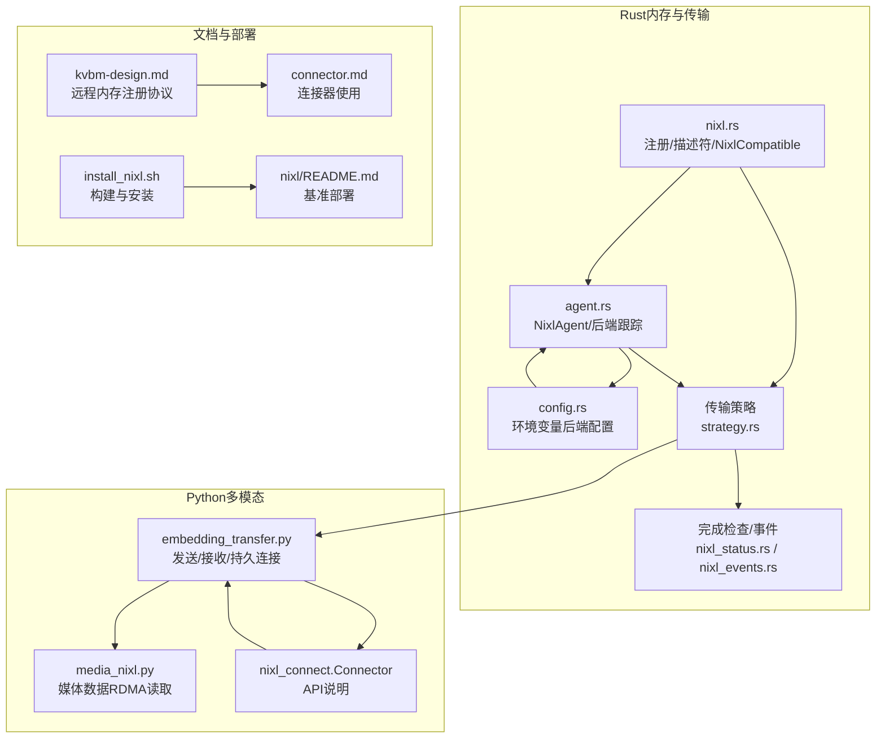
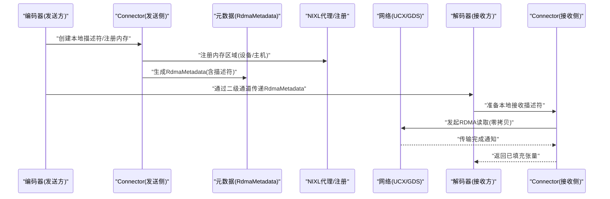
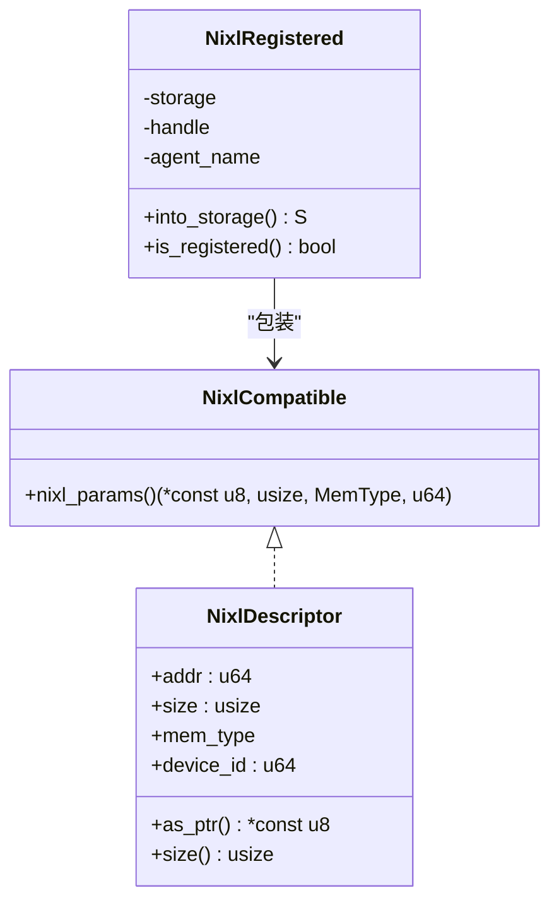
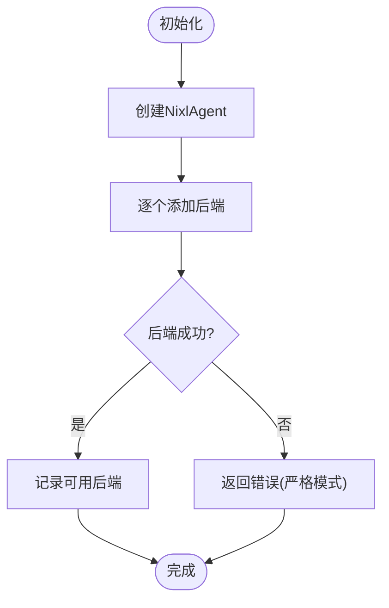
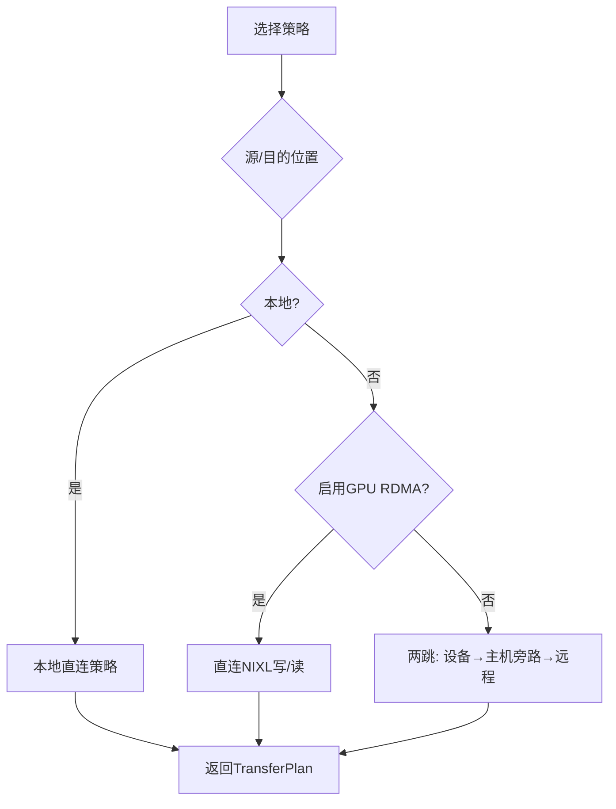
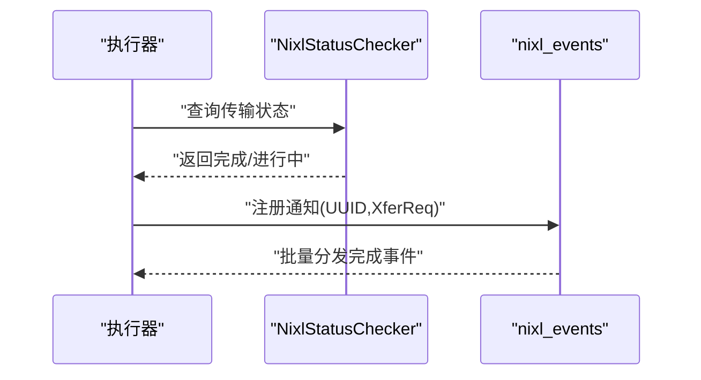
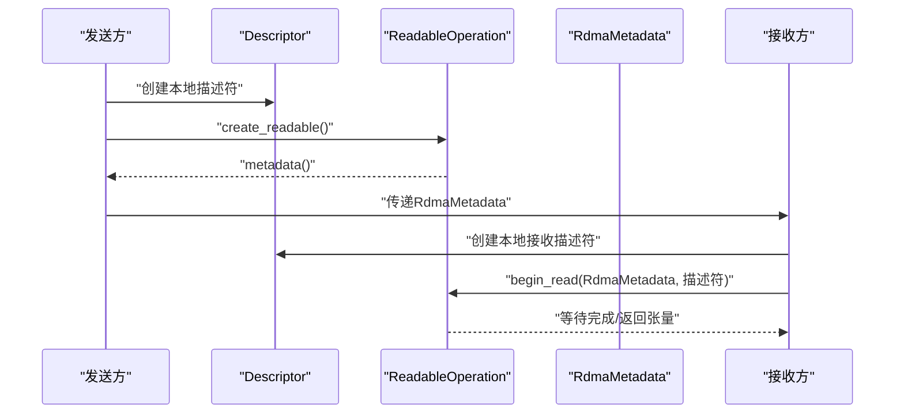
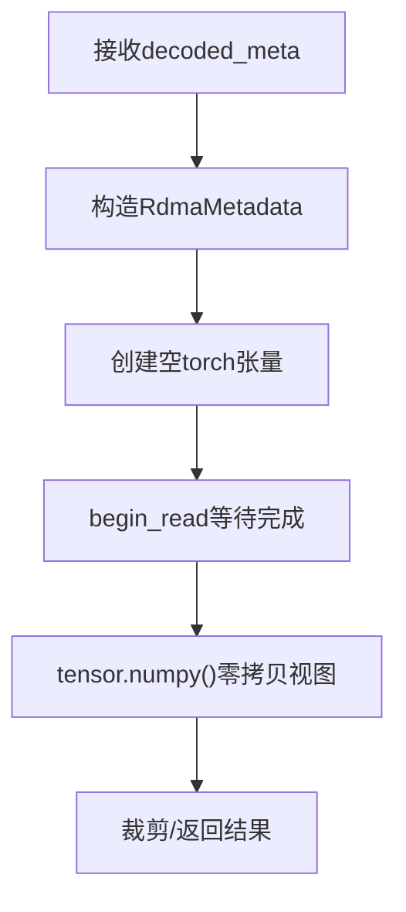
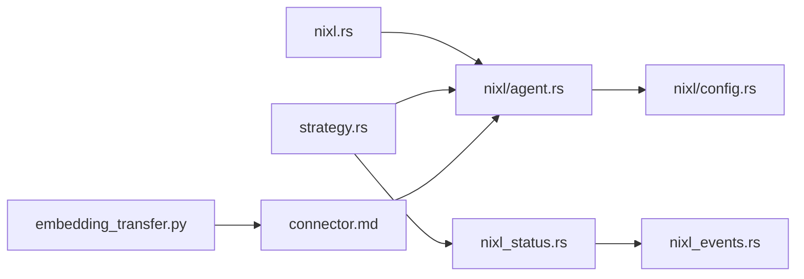

# NIXL传输机制

<cite>
**本文档引用的文件**
- [lib/memory/src/nixl.rs](file://lib/memory/src/nixl.rs)
- [lib/memory/src/nixl/agent.rs](file://lib/memory/src/nixl/agent.rs)
- [lib/memory/src/nixl/config.rs](file://lib/memory/src/nixl/config.rs)
- [lib/llm/src/block_manager/v2/physical/transfer/strategy.rs](file://lib/llm/src/block_manager/v2/physical/transfer/strategy.rs)
- [lib/llm/src/block_manager/v2/physical/transfer/context.rs](file://lib/llm/src/block_manager/v2/physical/transfer/context.rs)
- [lib/llm/src/block_manager/v2/physical/transfer/notifications/nixl_status.rs](file://lib/llm/src/block_manager/v2/physical/transfer/notifications/nixl_status.rs)
- [lib/llm/src/block_manager/v2/physical/transfer/notifications/nixl_events.rs](file://lib/llm/src/block_manager/v2/physical/transfer/notifications/nixl_events.rs)
- [components/src/dynamo/common/utils/media_nixl.py](file://components/src/dynamo/common/utils/media_nixl.py)
- [components/src/dynamo/common/multimodal/embedding_transfer.py](file://components/src/dynamo/common/multimodal/embedding_transfer.py)
- [docs/pages/api/nixl-connect/connector.md](file://docs/pages/api/nixl-connect/connector.md)
- [docs/pages/design-docs/kvbm-design.md](file://docs/pages/design-docs/kvbm-design.md)
- [container/deps/trtllm/install_nixl.sh](file://container/deps/trtllm/install_nixl.sh)
- [deploy/pre-deployment/nixl/README.md](file://deploy/pre-deployment/nixl/README.md)
</cite>

## 目录
1. [简介](#简介)
2. [项目结构](#项目结构)
3. [核心组件](#核心组件)
4. [架构总览](#架构总览)
5. [详细组件分析](#详细组件分析)
6. [依赖关系分析](#依赖关系分析)
7. [性能考量](#性能考量)
8. [故障排查指南](#故障排查指南)
9. [结论](#结论)

## 简介
本文件系统性阐述Dynamo多模态NIXL（NVIDIA InfiniBand RDMA）传输机制，覆盖嵌入向量的序列化、网络传输与反序列化全流程；解释CUDA IPC、内存共享与零拷贝传输；给出性能优化策略、错误恢复与安全注意事项，并提供NIXL配置指南与故障排查方法。内容基于仓库中实际代码与文档进行归纳总结。

## 项目结构
围绕NIXL传输的关键模块分布于以下位置：
- Rust层：内存注册与描述符封装、后端配置与代理管理、传输策略选择与通知机制
- Python层：多模态嵌入向量的发送/接收、媒体数据通过RDMA读取
- 文档与部署：NIXL连接器API说明、KVBM设计文档、安装脚本与基准部署



**图表来源**
- [lib/memory/src/nixl.rs](file://lib/memory/src/nixl.rs#L1-L204)
- [lib/memory/src/nixl/agent.rs](file://lib/memory/src/nixl/agent.rs#L1-L204)
- [lib/memory/src/nixl/config.rs](file://lib/memory/src/nixl/config.rs#L1-L160)
- [lib/llm/src/block_manager/v2/physical/transfer/strategy.rs](file://lib/llm/src/block_manager/v2/physical/transfer/strategy.rs#L1-L507)
- [lib/llm/src/block_manager/v2/physical/transfer/notifications/nixl_status.rs](file://lib/llm/src/block_manager/v2/physical/transfer/notifications/nixl_status.rs#L1-L33)
- [lib/llm/src/block_manager/v2/physical/transfer/notifications/nixl_events.rs](file://lib/llm/src/block_manager/v2/physical/transfer/notifications/nixl_events.rs#L1-L84)
- [components/src/dynamo/common/multimodal/embedding_transfer.py](file://components/src/dynamo/common/multimodal/embedding_transfer.py#L1-L464)
- [components/src/dynamo/common/utils/media_nixl.py](file://components/src/dynamo/common/utils/media_nixl.py#L1-L80)
- [docs/pages/api/nixl-connect/connector.md](file://docs/pages/api/nixl-connect/connector.md#L1-L179)
- [docs/pages/design-docs/kvbm-design.md](file://docs/pages/design-docs/kvbm-design.md#L170-L355)
- [container/deps/trtllm/install_nixl.sh](file://container/deps/trtllm/install_nixl.sh#L32-L80)
- [deploy/pre-deployment/nixl/README.md](file://deploy/pre-deployment/nixl/README.md#L1-L292)

**章节来源**
- [lib/memory/src/nixl.rs](file://lib/memory/src/nixl.rs#L1-L204)
- [lib/memory/src/nixl/agent.rs](file://lib/memory/src/nixl/agent.rs#L1-L204)
- [lib/memory/src/nixl/config.rs](file://lib/memory/src/nixl/config.rs#L1-L160)
- [lib/llm/src/block_manager/v2/physical/transfer/strategy.rs](file://lib/llm/src/block_manager/v2/physical/transfer/strategy.rs#L1-L507)
- [components/src/dynamo/common/multimodal/embedding_transfer.py](file://components/src/dynamo/common/multimodal/embedding_transfer.py#L1-L464)
- [components/src/dynamo/common/utils/media_nixl.py](file://components/src/dynamo/common/utils/media_nixl.py#L1-L80)
- [docs/pages/api/nixl-connect/connector.md](file://docs/pages/api/nixl-connect/connector.md#L1-L179)
- [docs/pages/design-docs/kvbm-design.md](file://docs/pages/design-docs/kvbm-design.md#L170-L355)
- [container/deps/trtllm/install_nixl.sh](file://container/deps/trtllm/install_nixl.sh#L32-L80)
- [deploy/pre-deployment/nixl/README.md](file://deploy/pre-deployment/nixl/README.md#L1-L292)

## 核心组件
- 内存注册与描述符
  - NixlCompatible与NixlDescriptor定义跨节点可访问的内存描述信息
  - NixlRegistered包装存储，确保注册句柄先于存储释放，避免悬挂指针
- NIXL代理与后端配置
  - NixlAgent封装nixl_sys::Agent，跟踪可用后端，支持严格/宽松初始化模式
  - NixlBackendConfig从环境变量提取后端启用列表，默认启用UCX
- 传输策略与执行
  - TransferStrategy/TransferPlan根据源/目的位置与能力标志选择直连或两跳路径
  - 支持GPU RDMA直传、主机旁路缓冲、设备到磁盘等组合
- 完成通知与状态轮询
  - NixlStatusChecker轮询传输状态
  - nixl_events基于通知事件批量处理完成回调
- Python侧多模态传输
  - embedding_transfer.py提供本地/远程嵌入向量发送/接收抽象
  - media_nixl.py演示预解码媒体数据的RDMA读取与零拷贝转换

**章节来源**
- [lib/memory/src/nixl.rs](file://lib/memory/src/nixl.rs#L19-L204)
- [lib/memory/src/nixl/agent.rs](file://lib/memory/src/nixl/agent.rs#L14-L156)
- [lib/memory/src/nixl/config.rs](file://lib/memory/src/nixl/config.rs#L14-L106)
- [lib/llm/src/block_manager/v2/physical/transfer/strategy.rs](file://lib/llm/src/block_manager/v2/physical/transfer/strategy.rs#L11-L80)
- [lib/llm/src/block_manager/v2/physical/transfer/notifications/nixl_status.rs](file://lib/llm/src/block_manager/v2/physical/transfer/notifications/nixl_status.rs#L11-L33)
- [lib/llm/src/block_manager/v2/physical/transfer/notifications/nixl_events.rs](file://lib/llm/src/block_manager/v2/physical/transfer/notifications/nixl_events.rs#L16-L84)
- [components/src/dynamo/common/multimodal/embedding_transfer.py](file://components/src/dynamo/common/multimodal/embedding_transfer.py#L55-L464)
- [components/src/dynamo/common/utils/media_nixl.py](file://components/src/dynamo/common/utils/media_nixl.py#L18-L80)

## 架构总览
下图展示从编码器到解码器的嵌入向量传输路径，涵盖注册、元数据交换、RDMA读写与零拷贝：



**图表来源**
- [docs/pages/api/nixl-connect/connector.md](file://docs/pages/api/nixl-connect/connector.md#L48-L136)
- [lib/memory/src/nixl.rs](file://lib/memory/src/nixl.rs#L162-L204)
- [components/src/dynamo/common/multimodal/embedding_transfer.py](file://components/src/dynamo/common/multimodal/embedding_transfer.py#L200-L293)

## 详细组件分析

### 内存注册与描述符（NIXL兼容）
- NixlCompatible要求提供(ptr,size,mem_type,device_id)，用于构造NixlDescriptor
- NixlRegistered确保注册句柄在存储释放前被显式drop，避免资源泄漏
- 注册接口register_with_nixl消费存储并返回包装类型，失败时回退原始存储



**图表来源**
- [lib/memory/src/nixl.rs](file://lib/memory/src/nixl.rs#L19-L160)

**章节来源**
- [lib/memory/src/nixl.rs](file://lib/memory/src/nixl.rs#L19-L160)

### NIXL代理与后端配置
- NixlAgent支持按需添加后端，严格模式要求所有指定后端均成功初始化
- 后端可用性通过集合跟踪，提供require_backend校验
- NixlBackendConfig从环境变量解析后端启用列表，默认启用UCX



**图表来源**
- [lib/memory/src/nixl/agent.rs](file://lib/memory/src/nixl/agent.rs#L32-L112)
- [lib/memory/src/nixl/config.rs](file://lib/memory/src/nixl/config.rs#L34-L79)

**章节来源**
- [lib/memory/src/nixl/agent.rs](file://lib/memory/src/nixl/agent.rs#L14-L156)
- [lib/memory/src/nixl/config.rs](file://lib/memory/src/nixl/config.rs#L14-L106)

### 传输策略选择（直连/两跳）
- 本地直连：Host↔Host/CPU memcpy；Host/Device互转使用CUDA异步/同步；Device↔Device直接CUDA
- 设备到远程：默认两跳(Device→Pinned→Remote)，启用GPU RDMA则直连
- 磁盘到远程：强制两跳(Disk→Pinned→Remote)
- 能力标志控制：allow_gpu_rdma/allow_gds决定是否允许直连



**图表来源**
- [lib/llm/src/block_manager/v2/physical/transfer/strategy.rs](file://lib/llm/src/block_manager/v2/physical/transfer/strategy.rs#L141-L281)

**章节来源**
- [lib/llm/src/block_manager/v2/physical/transfer/strategy.rs](file://lib/llm/src/block_manager/v2/physical/transfer/strategy.rs#L81-L281)

### 完成通知与状态轮询
- NixlStatusChecker基于XferStatus轮询传输完成
- nixl_events通过消息队列批量处理通知，超时警告与清理



**图表来源**
- [lib/llm/src/block_manager/v2/physical/transfer/notifications/nixl_status.rs](file://lib/llm/src/block_manager/v2/physical/transfer/notifications/nixl_status.rs#L11-L33)
- [lib/llm/src/block_manager/v2/physical/transfer/notifications/nixl_events.rs](file://lib/llm/src/block_manager/v2/physical/transfer/notifications/nixl_events.rs#L57-L84)

**章节来源**
- [lib/llm/src/block_manager/v2/physical/transfer/notifications/nixl_status.rs](file://lib/llm/src/block_manager/v2/physical/transfer/notifications/nixl_status.rs#L1-L33)
- [lib/llm/src/block_manager/v2/physical/transfer/notifications/nixl_events.rs](file://lib/llm/src/block_manager/v2/physical/transfer/notifications/nixl_events.rs#L1-L84)

### Python多模态嵌入向量传输
- 发送方：创建Descriptor并调用create_readable，返回RdmaMetadata供接收方使用
- 接收方：验证RdmaMetadata，创建本地描述符，begin_read等待完成
- 持久连接：复用Connector与注册的描述符，减少重复建立开销
- 零拷贝：接收端直接使用torch.empty创建CPU张量，numpy()零拷贝视图



**图表来源**
- [components/src/dynamo/common/multimodal/embedding_transfer.py](file://components/src/dynamo/common/multimodal/embedding_transfer.py#L200-L293)
- [components/src/dynamo/common/utils/media_nixl.py](file://components/src/dynamo/common/utils/media_nixl.py#L18-L80)
- [docs/pages/api/nixl-connect/connector.md](file://docs/pages/api/nixl-connect/connector.md#L48-L136)

**章节来源**
- [components/src/dynamo/common/multimodal/embedding_transfer.py](file://components/src/dynamo/common/multimodal/embedding_transfer.py#L200-L464)
- [components/src/dynamo/common/utils/media_nixl.py](file://components/src/dynamo/common/utils/media_nixl.py#L18-L80)
- [docs/pages/api/nixl-connect/connector.md](file://docs/pages/api/nixl-connect/connector.md#L1-L179)

### 媒体数据零拷贝读取流程
- 解析前端decoded_meta，构造RdmaMetadata与本地空张量
- begin_read完成后，tensor.numpy()即为零拷贝视图
- 忽略alpha通道，返回CPU数组与可选元数据



**图表来源**
- [components/src/dynamo/common/utils/media_nixl.py](file://components/src/dynamo/common/utils/media_nixl.py#L18-L80)

**章节来源**
- [components/src/dynamo/common/utils/media_nixl.py](file://components/src/dynamo/common/utils/media_nixl.py#L18-L80)

### 远程内存注册协议（KVBM设计）
- 双向注册：双方独立创建NixlAgent并注册内存区域
- 元数据交换：SerializedNixlBlockLayout携带布局配置、基址/步长、设备ID等
- 序列化/反序列化：保证不同TP配置下的语义对齐与正确gather/scatter

```mermaid
sequenceDiagram
participant W1 as "Worker 1"
participant W2 as "Worker 2"
W1->>W1 : "创建NixlAgent并注册内存"
W2->>W2 : "创建NixlAgent并注册内存"
W1<->>W2 : "交换SerializedNixlBlockLayout"
W1->>W1 : "deserialize重建布局视图"
W2->>W2 : "deserialize重建布局视图"
```

**图表来源**
- [docs/pages/design-docs/kvbm-design.md](file://docs/pages/design-docs/kvbm-design.md#L173-L222)

**章节来源**
- [docs/pages/design-docs/kvbm-design.md](file://docs/pages/design-docs/kvbm-design.md#L170-L222)

## 依赖关系分析
- 组件耦合
  - nixl.rs与nixl/agent.rs强耦合：前者依赖后者提供的注册接口与后端状态
  - 传输策略依赖NixlAgent与能力标志，间接影响Python侧Connector行为
  - 完成通知与状态轮询作为横切关注点，被传输执行器复用
- 外部依赖
  - UCX/GDS等后端由NixlAgent动态加载，受环境变量与平台架构限制
  - Python侧通过nixl_connect封装底层RDMA操作



**图表来源**
- [lib/memory/src/nixl.rs](file://lib/memory/src/nixl.rs#L1-L204)
- [lib/memory/src/nixl/agent.rs](file://lib/memory/src/nixl/agent.rs#L1-L204)
- [lib/memory/src/nixl/config.rs](file://lib/memory/src/nixl/config.rs#L1-L160)
- [lib/llm/src/block_manager/v2/physical/transfer/strategy.rs](file://lib/llm/src/block_manager/v2/physical/transfer/strategy.rs#L1-L507)
- [lib/llm/src/block_manager/v2/physical/transfer/notifications/nixl_status.rs](file://lib/llm/src/block_manager/v2/physical/transfer/notifications/nixl_status.rs#L1-L33)
- [lib/llm/src/block_manager/v2/physical/transfer/notifications/nixl_events.rs](file://lib/llm/src/block_manager/v2/physical/transfer/notifications/nixl_events.rs#L1-L84)
- [components/src/dynamo/common/multimodal/embedding_transfer.py](file://components/src/dynamo/common/multimodal/embedding_transfer.py#L1-L464)
- [docs/pages/api/nixl-connect/connector.md](file://docs/pages/api/nixl-connect/connector.md#L1-L179)

**章节来源**
- [lib/memory/src/nixl.rs](file://lib/memory/src/nixl.rs#L1-L204)
- [lib/llm/src/block_manager/v2/physical/transfer/strategy.rs](file://lib/llm/src/block_manager/v2/physical/transfer/strategy.rs#L1-L507)
- [components/src/dynamo/common/multimodal/embedding_transfer.py](file://components/src/dynamo/common/multimodal/embedding_transfer.py#L1-L464)

## 性能考量
- 直连优先：启用GPU RDMA与GDS可显著降低旁路缓冲带来的延迟与带宽浪费
- 旁路缓冲优化：两跳路径中Pinned内存作为主机旁路缓冲，提升吞吐稳定性
- 持久连接与描述符复用：Python侧持久化Connector与预热描述符，减少反复注册/注销开销
- 张量形状与内存对齐：KVBM元数据交换确保不同TP配置下的布局一致性，避免误对齐导致的性能下降
- 平台与后端选择：x86_64平台默认启用UCX；aarch64平台当前不支持NIXL后端

[本节为通用指导，无需特定文件分析]

## 故障排查指南
- 后端初始化失败
  - 症状：NixlAgent严格模式初始化报错
  - 排查：确认环境变量DYN_KVBM_NIXL_BACKEND_*配置合法；检查后端插件参数；核对平台架构支持
- GPU RDMA不可用
  - 症状：Device→Remote直传被拒绝
  - 排查：启用allow_gpu_rdma能力；确认UCX后端可用；检查硬件与驱动版本
- 传输长时间挂起
  - 症状：超过阈值未完成
  - 排查：查看nixl_events日志警告；核对网络拓扑与UCX配置；检查通知通道是否正常
- 元数据不匹配
  - 症状：反序列化失败或数据错位
  - 排查：确认双方SerializedNixlBlockLayout交换完整；核对LayoutConfig、基址/步长、设备ID一致
- 安装与部署问题
  - 症状：构建失败/镜像拉取失败/部署文件缺失
  - 排查：运行预部署检查脚本；确认Docker与ETCD可用；按脚本提示更新部署文件

**章节来源**
- [lib/memory/src/nixl/agent.rs](file://lib/memory/src/nixl/agent.rs#L65-L112)
- [lib/memory/src/nixl/config.rs](file://lib/memory/src/nixl/config.rs#L34-L79)
- [lib/llm/src/block_manager/v2/physical/transfer/notifications/nixl_events.rs](file://lib/llm/src/block_manager/v2/physical/transfer/notifications/nixl_events.rs#L32-L55)
- [docs/pages/design-docs/kvbm-design.md](file://docs/pages/design-docs/kvbm-design.md#L173-L222)
- [deploy/pre-deployment/nixl/README.md](file://deploy/pre-deployment/nixl/README.md#L210-L276)

## 结论
Dynamo的NIXL传输机制通过内存注册、元数据交换与RDMA直连，实现了多模态嵌入向量的高效跨节点传输。结合CUDA IPC与零拷贝视图，配合持久连接与旁路缓冲策略，可在不同硬件与拓扑条件下获得稳定且高性能的数据通路。建议在生产环境中启用GPU RDMA与UCX后端，合理配置元数据与描述符生命周期，并通过通知机制监控传输状态以保障可靠性。