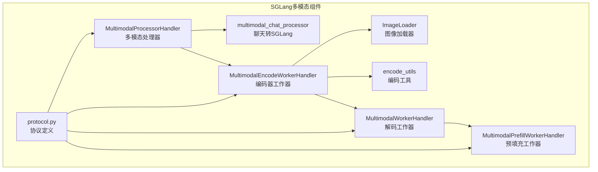
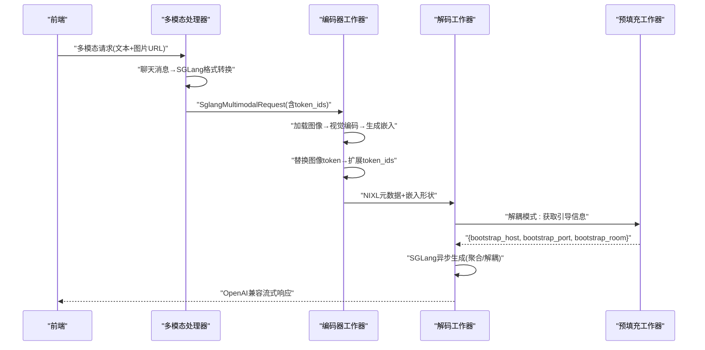
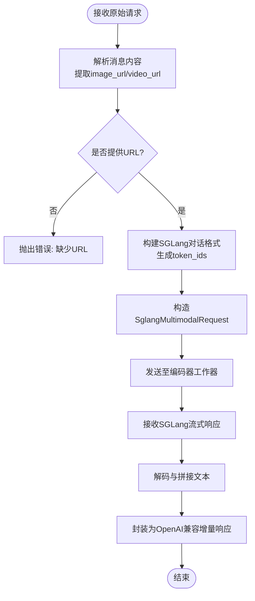
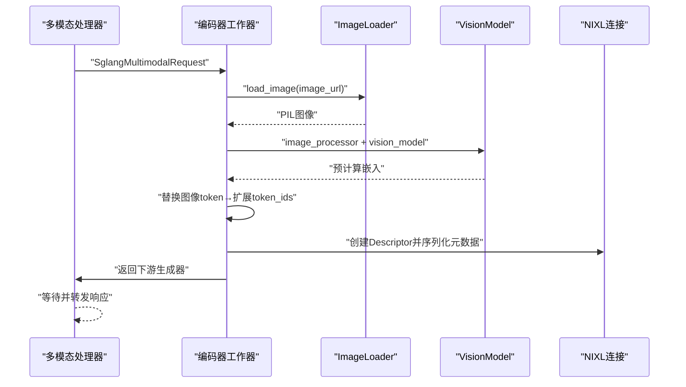
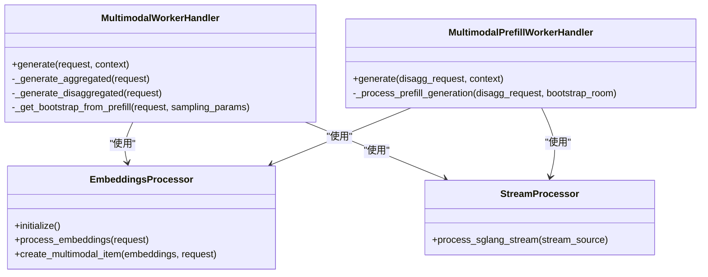
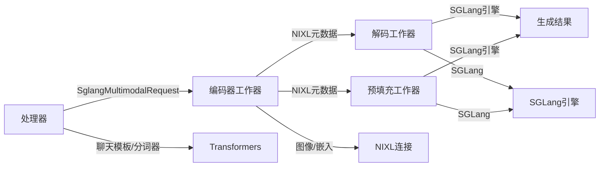

# SGLang多模态支持

<cite>
**本文档引用的文件**
- [components/src/dynamo/sglang/request_handlers/multimodal/processor_handler.py](file://components/src/dynamo/sglang/request_handlers/multimodal/processor_handler.py)
- [components/src/dynamo/sglang/request_handlers/multimodal/encode_worker_handler.py](file://components/src/dynamo/sglang/request_handlers/multimodal/encode_worker_handler.py)
- [components/src/dynamo/sglang/request_handlers/multimodal/worker_handler.py](file://components/src/dynamo/sglang/request_handlers/multimodal/worker_handler.py)
- [components/src/dynamo/sglang/multimodal_utils/multimodal_chat_processor.py](file://components/src/dynamo/sglang/multimodal_utils/multimodal_chat_processor.py)
- [components/src/dynamo/sglang/multimodal_utils/__init__.py](file://components/src/dynamo/sglang/multimodal_utils/__init__.py)
- [examples/multimodal/utils/image_loader.py](file://examples/multimodal/utils/image_loader.py)
- [examples/multimodal/utils/encode_utils.py](file://examples/multimodal/utils/encode_utils.py)
- [components/src/dynamo/sglang/protocol.py](file://components/src/dynamo/sglang/protocol.py)
- [docs/pages/features/multimodal/multimodal-sglang.md](file://docs/pages/features/multimodal/multimodal-sglang.md)
- [components/src/dynamo/sglang/main.py](file://components/src/dynamo/sglang/main.py)
- [components/src/dynamo/common/tests/multimodal/test_async_encoder_cache.py](file://components/src/dynamo/common/tests/multimodal/test_async_encoder_cache.py)
- [components/src/dynamo/common/tests/memory/test_multimodal_embedding_cache_manager.py](file://components/src/dynamo/common/tests/memory/test_multimodal_embedding_cache_manager.py)
</cite>

## 目录
1. [简介](#简介)
2. [项目结构](#项目结构)
3. [核心组件](#核心组件)
4. [架构总览](#架构总览)
5. [详细组件分析](#详细组件分析)
6. [依赖关系分析](#依赖关系分析)
7. [性能考量](#性能考量)
8. [故障排查指南](#故障排查指南)
9. [结论](#结论)
10. [附录](#附录)

## 简介
本文件系统性阐述SGLang后端在Dynamo中的多模态推理能力，重点覆盖以下方面：
- 图像扩散处理与多模态聊天处理器的实现
- SGLang特有“多模态数据加载器”和“编码工具”的工作机制
- 完整部署配置指南（含图像扩散模型设置要求）
- SGLang原生多模态处理流程与性能特性
- 与SGLang生态系统的集成方式
- 实际使用示例与最佳实践建议

## 项目结构
围绕SGLang多模态的关键目录与文件如下：
- 请求处理器：多模态处理器、编码器工作器、解码/预填充工作器
- 多模态工具：聊天消息到SGLang格式转换、流式响应解码、图像加载
- 协议定义：多模态请求/响应、图像生成请求等
- 文档与部署：多模态SGLang功能说明、部署模式与限制
- 示例与测试：图像加载器、编码工具、缓存测试

**图表来源**
- [components/src/dynamo/sglang/request_handlers/multimodal/processor_handler.py](file://components/src/dynamo/sglang/request_handlers/multimodal/processor_handler.py#L29-L226)
- [components/src/dynamo/sglang/request_handlers/multimodal/encode_worker_handler.py](file://components/src/dynamo/sglang/request_handlers/multimodal/encode_worker_handler.py#L38-L193)
- [components/src/dynamo/sglang/request_handlers/multimodal/worker_handler.py](file://components/src/dynamo/sglang/request_handlers/multimodal/worker_handler.py#L242-L543)
- [components/src/dynamo/sglang/multimodal_utils/multimodal_chat_processor.py](file://components/src/dynamo/sglang/multimodal_utils/multimodal_chat_processor.py#L11-L163)
- [examples/multimodal/utils/image_loader.py](file://examples/multimodal/utils/image_loader.py#L31-L111)
- [examples/multimodal/utils/encode_utils.py](file://examples/multimodal/utils/encode_utils.py#L58-L133)
- [components/src/dynamo/sglang/protocol.py](file://components/src/dynamo/sglang/protocol.py#L105-L177)

**章节来源**
- [components/src/dynamo/sglang/request_handlers/multimodal/processor_handler.py](file://components/src/dynamo/sglang/request_handlers/multimodal/processor_handler.py#L1-L226)
- [components/src/dynamo/sglang/request_handlers/multimodal/encode_worker_handler.py](file://components/src/dynamo/sglang/request_handlers/multimodal/encode_worker_handler.py#L1-L193)
- [components/src/dynamo/sglang/request_handlers/multimodal/worker_handler.py](file://components/src/dynamo/sglang/request_handlers/multimodal/worker_handler.py#L1-L543)
- [components/src/dynamo/sglang/multimodal_utils/multimodal_chat_processor.py](file://components/src/dynamo/sglang/multimodal_utils/multimodal_chat_processor.py#L1-L163)
- [examples/multimodal/utils/image_loader.py](file://examples/multimodal/utils/image_loader.py#L1-L111)
- [examples/multimodal/utils/encode_utils.py](file://examples/multimodal/utils/encode_utils.py#L1-L133)
- [components/src/dynamo/sglang/protocol.py](file://components/src/dynamo/sglang/protocol.py#L1-L177)

## 核心组件
- 多模态处理器（Processor）：负责将用户消息转换为SGLang对话格式，构建输入token序列，并将请求转发给编码器工作器。
- 编码器工作器（Encode Worker）：加载并处理图像，运行视觉编码器生成预计算嵌入，替换单个图像token为对应patch数量的图像token，并通过NIXL/RDMA传输嵌入至下游。
- 解码工作器（Decode Worker）：在聚合模式下直接将嵌入注入SGLang引擎；在解耦模式下等待预填充工作器返回引导信息后进行解码。
- 预填充工作器（Prefill Worker）：在解耦模式下先执行预填充阶段，共享KV缓存状态，随后由解码工作器继续生成。
- 多模态工具：
  - 聊天消息到SGLang转换：根据模板将消息内容映射为SGLang期望的对话结构与token序列。
  - 流式响应解码：对SGLang输出进行分段解码与拼接，生成OpenAI兼容的增量响应。
  - 图像加载器：支持HTTP/HTTPS与data URL（受限），带缓存与线程池避免阻塞事件循环。
  - 编码工具：按模型类型选择合适的视觉编码路径（如Qwen风格特征提取）。

**章节来源**
- [components/src/dynamo/sglang/request_handlers/multimodal/processor_handler.py](file://components/src/dynamo/sglang/request_handlers/multimodal/processor_handler.py#L29-L226)
- [components/src/dynamo/sglang/request_handlers/multimodal/encode_worker_handler.py](file://components/src/dynamo/sglang/request_handlers/multimodal/encode_worker_handler.py#L38-L193)
- [components/src/dynamo/sglang/request_handlers/multimodal/worker_handler.py](file://components/src/dynamo/sglang/request_handlers/multimodal/worker_handler.py#L242-L543)
- [components/src/dynamo/sglang/multimodal_utils/multimodal_chat_processor.py](file://components/src/dynamo/sglang/multimodal_utils/multimodal_chat_processor.py#L11-L163)
- [examples/multimodal/utils/image_loader.py](file://examples/multimodal/utils/image_loader.py#L31-L111)
- [examples/multimodal/utils/encode_utils.py](file://examples/multimodal/utils/encode_utils.py#L58-L133)

## 架构总览
SGLang多模态在Dynamo中支持EPD、E/PD、E/P/D三种模式，其中E/P/D为完全解耦，通过NIXL实现零拷贝张量传输；EPD/E/PD为内部编码或分离编码模式。消息从前端进入，经由处理器转换为SGLang格式，再由编码器工作器生成嵌入并通过NIXL传递给解码/预填充工作器，最终由SGLang引擎完成生成。

**图表来源**
- [components/src/dynamo/sglang/request_handlers/multimodal/processor_handler.py](file://components/src/dynamo/sglang/request_handlers/multimodal/processor_handler.py#L93-L120)
- [components/src/dynamo/sglang/request_handlers/multimodal/encode_worker_handler.py](file://components/src/dynamo/sglang/request_handlers/multimodal/encode_worker_handler.py#L114-L180)
- [components/src/dynamo/sglang/request_handlers/multimodal/worker_handler.py](file://components/src/dynamo/sglang/request_handlers/multimodal/worker_handler.py#L314-L375)
- [components/src/dynamo/sglang/request_handlers/multimodal/worker_handler.py](file://components/src/dynamo/sglang/request_handlers/multimodal/worker_handler.py#L424-L543)

## 详细组件分析

### 多模态处理器（Processor）
职责与流程：
- 校验并解析原始多模态请求，提取图像/视频URL
- 将消息转换为SGLang对话格式，生成token_ids
- 构造SGLang多模态请求并发送至编码器工作器
- 接收并解码SGLang流式响应，封装为OpenAI兼容的增量响应

关键点：
- 支持图像URL与视频URL二选一，不支持同时提供
- 使用聊天模板与分词器生成SGLang输入
- 对Annotated响应对象进行统一解包与JSON化

**图表来源**
- [components/src/dynamo/sglang/request_handlers/multimodal/processor_handler.py](file://components/src/dynamo/sglang/request_handlers/multimodal/processor_handler.py#L61-L226)
- [components/src/dynamo/sglang/multimodal_utils/multimodal_chat_processor.py](file://components/src/dynamo/sglang/multimodal_utils/multimodal_chat_processor.py#L11-L48)

**章节来源**
- [components/src/dynamo/sglang/request_handlers/multimodal/processor_handler.py](file://components/src/dynamo/sglang/request_handlers/multimodal/processor_handler.py#L29-L226)
- [components/src/dynamo/sglang/multimodal_utils/multimodal_chat_processor.py](file://components/src/dynamo/sglang/multimodal_utils/multimodal_chat_processor.py#L11-L163)

### 编码器工作器（Encode Worker）
职责与流程：
- 加载图像（支持HTTP/HTTPS与受限data URL）
- 使用AutoImageProcessor与AutoModel进行视觉编码
- 生成预计算嵌入，记录image_grid_thw与嵌入形状
- 替换单个图像token为对应patch数量的图像token
- 通过NIXL创建可读描述符，将嵌入以零拷贝方式传输给下游

关键点：
- 设备映射自动选择GPU/CPU，半精度浮点以节省显存
- 模板特定的图像token替换逻辑（如Qwen2.5-VL）
- 错误处理与异常收集，保证批量任务的健壮性

**图表来源**
- [components/src/dynamo/sglang/request_handlers/multimodal/encode_worker_handler.py](file://components/src/dynamo/sglang/request_handlers/multimodal/encode_worker_handler.py#L98-L184)
- [examples/multimodal/utils/image_loader.py](file://examples/multimodal/utils/image_loader.py#L41-L111)
- [examples/multimodal/utils/encode_utils.py](file://examples/multimodal/utils/encode_utils.py#L58-L133)

**章节来源**
- [components/src/dynamo/sglang/request_handlers/multimodal/encode_worker_handler.py](file://components/src/dynamo/sglang/request_handlers/multimodal/encode_worker_handler.py#L38-L193)
- [examples/multimodal/utils/image_loader.py](file://examples/multimodal/utils/image_loader.py#L31-L111)
- [examples/multimodal/utils/encode_utils.py](file://examples/multimodal/utils/encode_utils.py#L58-L133)

### 解码/预填充工作器（Decode/Prefill Workers）
职责与流程：
- 解码工作器：
  - 聚合模式：直接将嵌入注入SGLang引擎进行异步生成
  - 解耦模式：从预填充工作器获取引导信息（bootstrap_host/port/room），再进行解码
- 预填充工作器：
  - 先行执行预填充阶段，共享KV缓存状态
  - 生成完成后消费结果（不返回文本）

关键点：
- 统一的流式处理与错误标准化
- 嵌入维度一致性校验与对齐提示
- 引导信息的可靠传递与超时处理

**图表来源**
- [components/src/dynamo/sglang/request_handlers/multimodal/worker_handler.py](file://components/src/dynamo/sglang/request_handlers/multimodal/worker_handler.py#L242-L543)

**章节来源**
- [components/src/dynamo/sglang/request_handlers/multimodal/worker_handler.py](file://components/src/dynamo/sglang/request_handlers/multimodal/worker_handler.py#L242-L543)

### 多模态聊天处理器与编码工具
- 聊天消息到SGLang转换：复制模板、清空消息列表、按角色拼接文本、插入图像占位符、生成token_ids
- 流式响应解码：处理Annotated对象、解码token_ids、拼接增量文本、识别完成信号
- 图像加载器：支持HTTP/HTTPS与受限data URL，带缓存队列与格式白名单，避免阻塞事件循环
- 编码工具：按模型类型选择编码路径（如Qwen风格特征提取），规范化输出维度

**章节来源**
- [components/src/dynamo/sglang/multimodal_utils/multimodal_chat_processor.py](file://components/src/dynamo/sglang/multimodal_utils/multimodal_chat_processor.py#L11-L163)
- [examples/multimodal/utils/image_loader.py](file://examples/multimodal/utils/image_loader.py#L31-L111)
- [examples/multimodal/utils/encode_utils.py](file://examples/multimodal/utils/encode_utils.py#L58-L133)
- [components/src/dynamo/sglang/multimodal_utils/__init__.py](file://components/src/dynamo/sglang/multimodal_utils/__init__.py#L4-L18)

## 依赖关系分析
- 组件内聚与耦合：
  - 处理器与编码器通过SglangMultimodalRequest协议耦合，编码器与下游通过NIXL元数据耦合
  - 解码/预填充工作器共享嵌入处理器与流式处理器，降低重复逻辑
- 外部依赖：
  - Transformers（分词器、图像处理器）、SGLang引擎、NIXL连接
  - 运行时分布式组件（DistributedRuntime）用于组件注册与健康检查

**图表来源**
- [components/src/dynamo/sglang/request_handlers/multimodal/processor_handler.py](file://components/src/dynamo/sglang/request_handlers/multimodal/processor_handler.py#L103-L115)
- [components/src/dynamo/sglang/request_handlers/multimodal/encode_worker_handler.py](file://components/src/dynamo/sglang/request_handlers/multimodal/encode_worker_handler.py#L164-L180)
- [components/src/dynamo/sglang/request_handlers/multimodal/worker_handler.py](file://components/src/dynamo/sglang/request_handlers/multimodal/worker_handler.py#L366-L375)

**章节来源**
- [components/src/dynamo/sglang/request_handlers/multimodal/processor_handler.py](file://components/src/dynamo/sglang/request_handlers/multimodal/processor_handler.py#L1-L226)
- [components/src/dynamo/sglang/request_handlers/multimodal/encode_worker_handler.py](file://components/src/dynamo/sglang/request_handlers/multimodal/encode_worker_handler.py#L1-L193)
- [components/src/dynamo/sglang/request_handlers/multimodal/worker_handler.py](file://components/src/dynamo/sglang/request_handlers/multimodal/worker_handler.py#L1-L543)

## 性能考量
- 张量传输优化：使用NIXL/RDMA实现零拷贝嵌入传输，减少CPU/GPU间数据拷贝
- Token扩展与对齐：按patch数量替换图像token，确保token序列与嵌入维度一致
- 设备选择：优先使用GPU（CuPy），回退至CPU（NumPy），半精度浮点降低显存占用
- 并发与缓存：图像加载器具备缓存队列，避免重复下载；编码器工作器支持批量图像处理
- 解耦模式：预填充阶段共享KV缓存，提升长序列生成效率

[本节为通用性能讨论，无需具体文件分析]

## 故障排查指南
常见问题与定位：
- 形状不匹配：当token数量与嵌入维度不一致时，会触发形状不匹配错误，需检查分词与图像token扩展逻辑
- URL格式错误：仅支持HTTP/HTTPS；data URL受限；空响应内容或无效格式会报错
- 无编码器可用：在E/PD/E/P/D模式下，若未正确启动编码器工作器，将无法处理多模态输入
- 引导信息缺失：解耦模式下若预填充工作器未返回引导信息，解码工作器将报错

建议措施：
- 启用详细日志，关注NIXL元数据与嵌入形状
- 在多请求场景下验证图像缓存命中率
- 对于新模型，确认图像token替换策略与模板一致性

**章节来源**
- [components/src/dynamo/sglang/request_handlers/multimodal/worker_handler.py](file://components/src/dynamo/sglang/request_handlers/multimodal/worker_handler.py#L376-L392)
- [examples/multimodal/utils/image_loader.py](file://examples/multimodal/utils/image_loader.py#L105-L111)
- [components/src/dynamo/sglang/request_handlers/multimodal/encode_worker_handler.py](file://components/src/dynamo/sglang/request_handlers/multimodal/encode_worker_handler.py#L182-L184)

## 结论
SGLang在Dynamo中的多模态推理通过清晰的组件边界与协议设计实现了高内聚、低耦合的流水线：处理器负责对话格式转换，编码器工作器负责视觉编码与嵌入传输，解码/预填充工作器负责生成与状态管理。借助NIXL零拷贝传输与半精度优化，系统在聚合与解耦模式下均具备良好的吞吐与延迟表现。当前主要支持图像输入与Qwen系列模型，未来可通过扩展编码工具与模板适配更多模型。

[本节为总结性内容，无需具体文件分析]

## 附录

### 部署配置指南（图像扩散模型）
- 支持矩阵与部署模式
  - 支持图像输入（HTTP/HTTPS URL），不支持data URL、视频与音频
  - 支持EPD、E/PD、E/P/D三种部署模式
  - 解耦模式通过SGLang内部引导机制共享KV缓存
- 关键配置项
  - 模型路径与服务模型名：用于初始化分词器、图像处理器与视觉编码器
  - 聊天模板：决定图像token占位符与对话格式
  - 采样参数：温度、top_p、top_k、最大新token数等
- 启动与注册
  - 解码工作器在解耦模式下需要预填充客户端
  - 健康检查负载包含SGLang引擎状态
- 已知限制
  - 不支持预计算嵌入文件；每次请求均运行视觉编码器
  - 不支持视频与音频编码
  - 仅支持图像基础的视觉语言模型

**章节来源**
- [docs/pages/features/multimodal/multimodal-sglang.md](file://docs/pages/features/multimodal/multimodal-sglang.md#L10-L409)
- [components/src/dynamo/sglang/main.py](file://components/src/dynamo/sglang/main.py#L751-L826)
- [components/src/dynamo/sglang/protocol.py](file://components/src/dynamo/sglang/protocol.py#L151-L177)

### 协议与数据结构
- 多模态请求/响应
  - MultiModalRequest：包含模型、消息列表、采样参数
  - SglangMultimodalRequest：包含预处理后的token_ids与多模态输入
  - DisaggSglangMultimodalRequest：解耦模式下的请求包装
- 图像扩散请求
  - CreateImageRequest：OpenAI兼容的图像生成请求，支持NVIDIA扩展字段
  - ImagesResponse：返回图像URL或base64数据

**章节来源**
- [components/src/dynamo/sglang/protocol.py](file://components/src/dynamo/sglang/protocol.py#L105-L177)

### 使用示例与最佳实践
- 使用示例
  - 前端发送包含文本与图像URL的消息，处理器将其转换为SGLang格式并生成token_ids
  - 编码器工作器加载图像、运行视觉编码器、替换图像token并传输嵌入
  - 解码工作器在聚合模式下直接生成，在解耦模式下通过引导信息共享KV缓存
- 最佳实践
  - 保持聊天模板与模型一致，确保图像token替换正确
  - 控制图像URL来源，优先使用HTTP/HTTPS并启用缓存
  - 在解耦模式下确保预填充工作器与解码工作器的引导信息同步
  - 对新模型扩展编码工具与模板，避免形状不匹配

**章节来源**
- [components/src/dynamo/sglang/request_handlers/multimodal/processor_handler.py](file://components/src/dynamo/sglang/request_handlers/multimodal/processor_handler.py#L61-L226)
- [components/src/dynamo/sglang/request_handlers/multimodal/encode_worker_handler.py](file://components/src/dynamo/sglang/request_handlers/multimodal/encode_worker_handler.py#L114-L184)
- [components/src/dynamo/sglang/request_handlers/multimodal/worker_handler.py](file://components/src/dynamo/sglang/request_handlers/multimodal/worker_handler.py#L314-L375)

### 缓存与内存管理（测试参考）
- 异步编码缓存：支持并发请求合并与失败清理，避免重复计算
- LRU内存缓存：按容量字节管理嵌入缓存，满载时按LRU淘汰

**章节来源**
- [components/src/dynamo/common/tests/multimodal/test_async_encoder_cache.py](file://components/src/dynamo/common/tests/multimodal/test_async_encoder_cache.py#L38-L206)
- [components/src/dynamo/common/tests/memory/test_multimodal_embedding_cache_manager.py](file://components/src/dynamo/common/tests/memory/test_multimodal_embedding_cache_manager.py#L50-L85)