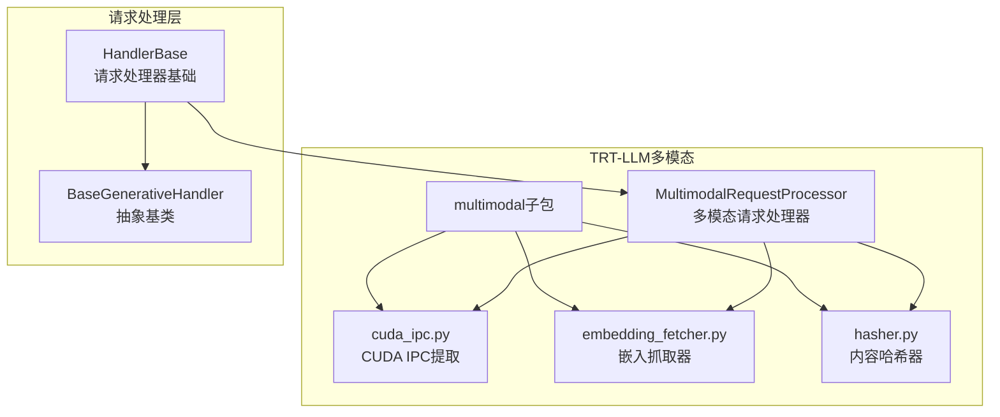
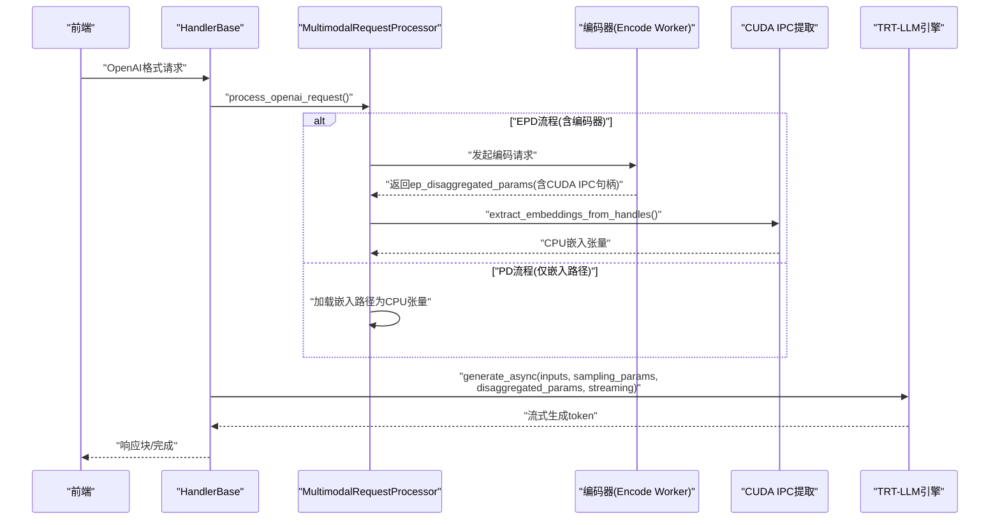
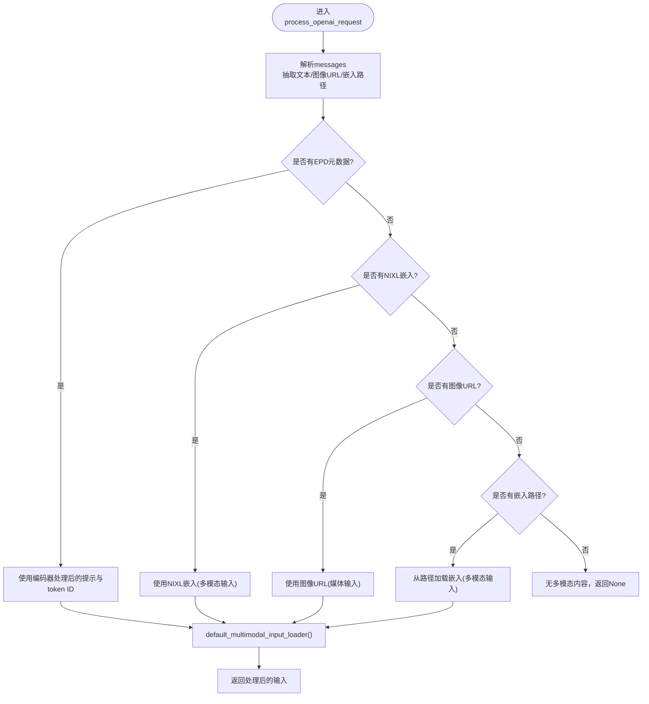
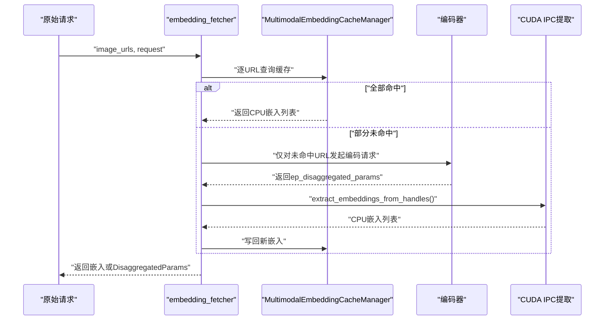
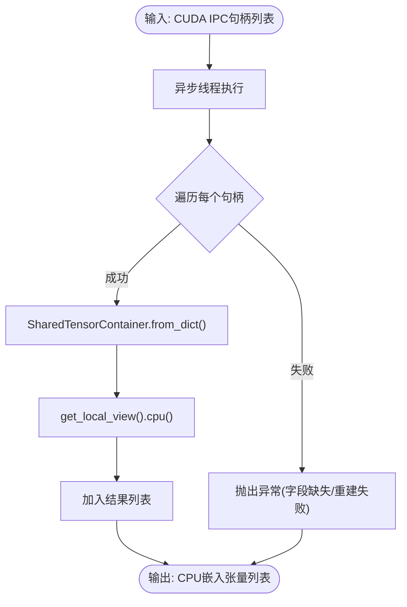
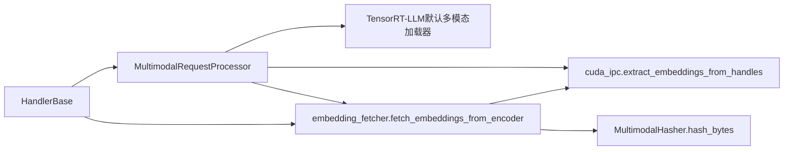

# TRT-LLM多模态支持

<cite>
**本文引用的文件**
- [multimodal/__init__.py](file://components/src/dynamo/trtllm/multimodal/__init__.py)
- [cuda_ipc.py](file://components/src/dynamo/trtllm/multimodal/cuda_ipc.py)
- [embedding_fetcher.py](file://components/src/dynamo/trtllm/multimodal/embedding_fetcher.py)
- [hasher.py](file://components/src/dynamo/trtllm/multimodal/hasher.py)
- [multimodal_processor.py](file://components/src/dynamo/trtllm/multimodal_processor.py)
- [handler_base.py](file://components/src/dynamo/trtllm/request_handlers/handler_base.py)
- [base_generative_handler.py](file://components/src/dynamo/trtllm/request_handlers/base_generative_handler.py)
- [test_multimodal_embedding_cache_manager.py](file://components/src/dynamo/common/tests/memory/test_multimodal_embedding_cache_manager.py)
- [README.md](file://examples/multimodal/README.md)
- [router_standalone_trtllm/worker.py](file://examples/deployments/router_standalone_trtllm/worker.py)
</cite>

## 目录
1. [简介](#简介)
2. [项目结构](#项目结构)
3. [核心组件](#核心组件)
4. [架构总览](#架构总览)
5. [详细组件分析](#详细组件分析)
6. [依赖关系分析](#依赖关系分析)
7. [性能考虑](#性能考虑)
8. [故障排查指南](#故障排查指南)
9. [结论](#结论)
10. [附录](#附录)

## 简介
本文件面向TensorRT-LLM后端在Dynamo框架中的多模态推理能力，系统性阐述其在图像、视频与音频场景下的处理流程与数据传输机制。重点覆盖以下方面：
- 唯一的CUDA IPC内存共享机制：通过CUDA IPC句柄在编码器与解码器之间零拷贝传递嵌入向量，避免CPU-GPU往返开销。
- 哈希索引系统：基于BLAKE3对原始字节进行内容级哈希，用于多模态嵌入缓存的键管理。
- 多模态输入预处理：OpenAI格式消息解析、图像/嵌入路径加载、视频/音频编码工作流。
- 部署配置与多节点设置：单机与多节点环境下的参数与网络要求。
- CUDA优化与性能调优：线程池化、异步提取、缓存策略等。
- 特有组件说明：embedding fetcher与hasher的工作原理与使用场景。

## 项目结构
TRT-LLM多模态相关代码主要位于components/src/dynamo/trtllm目录下，按职责划分为：
- 多模态处理与传输：multimodal子包（CUDA IPC、嵌入抓取、哈希器）
- 请求处理器：request_handlers（通用生成处理器与基础类）
- 多模态请求处理器：multimodal_processor（OpenAI格式消息解析与输入构造）

**图表来源**
- [multimodal_processor.py](file://components/src/dynamo/trtllm/multimodal_processor.py#L46-L281)
- [cuda_ipc.py](file://components/src/dynamo/trtllm/multimodal/cuda_ipc.py#L14-L63)
- [embedding_fetcher.py](file://components/src/dynamo/trtllm/multimodal/embedding_fetcher.py#L26-L258)
- [hasher.py](file://components/src/dynamo/trtllm/multimodal/hasher.py#L21-L50)
- [handler_base.py](file://components/src/dynamo/trtllm/request_handlers/handler_base.py#L77-L869)
- [base_generative_handler.py](file://components/src/dynamo/trtllm/request_handlers/base_generative_handler.py#L16-L47)

**章节来源**
- [multimodal/__init__.py](file://components/src/dynamo/trtllm/multimodal/__init__.py#L1-L13)
- [multimodal_processor.py](file://components/src/dynamo/trtllm/multimodal_processor.py#L1-L281)
- [handler_base.py](file://components/src/dynamo/trtllm/request_handlers/handler_base.py#L1-L869)

## 核心组件
- MultimodalRequestProcessor：负责解析OpenAI格式消息，抽取文本提示与多模态内容（图像URL或嵌入路径），并调用TensorRT-LLM默认多模态输入加载器构造输入。
- embedding_fetcher：从远程编码器抓取嵌入，支持缓存与EPD（Encoder-PreFill-Decode）完整流程；在无缓存时返回包含CUDA IPC句柄的DisaggregatedParams。
- cuda_ipc：将CUDA IPC句柄重建为本地张量并迁移至CPU，避免阻塞事件循环。
- MultimodalHasher：基于BLAKE3对原始字节进行哈希，作为缓存键。
- HandlerBase：统一的请求处理入口，协调多模态输入准备、参数打包与解码阶段优化。

**章节来源**
- [multimodal_processor.py](file://components/src/dynamo/trtllm/multimodal_processor.py#L46-L281)
- [embedding_fetcher.py](file://components/src/dynamo/trtllm/multimodal/embedding_fetcher.py#L26-L258)
- [cuda_ipc.py](file://components/src/dynamo/trtllm/multimodal/cuda_ipc.py#L14-L63)
- [hasher.py](file://components/src/dynamo/trtllm/multimodal/hasher.py#L21-L50)
- [handler_base.py](file://components/src/dynamo/trtllm/request_handlers/handler_base.py#L77-L869)

## 架构总览
下图展示TRT-LLM多模态在Dynamo中的端到端数据流：前端将OpenAI格式请求传入，请求处理器根据模式选择是否走EPD流程；在EPD流程中，编码器通过CUDA IPC将嵌入句柄传递给解码器，解码器再通过CUDA IPC提取CPU张量，最终由TRT-LLM引擎生成文本输出。

**图表来源**
- [handler_base.py](file://components/src/dynamo/trtllm/request_handlers/handler_base.py#L574-L800)
- [multimodal_processor.py](file://components/src/dynamo/trtllm/multimodal_processor.py#L168-L235)
- [embedding_fetcher.py](file://components/src/dynamo/trtllm/multimodal/embedding_fetcher.py#L26-L112)
- [cuda_ipc.py](file://components/src/dynamo/trtllm/multimodal/cuda_ipc.py#L14-L63)

## 详细组件分析

### 组件A：MultimodalRequestProcessor（多模态请求处理器）
- 职责
  - 解析OpenAI消息，抽取文本与图像/嵌入内容。
  - 支持三种路径：EPD（编码器+预填充+解码）、图像URL直接处理、嵌入路径（PD）。
  - 使用TensorRT-LLM默认多模态输入加载器同步下载与预处理图像，通过异步线程池提升并发吞吐。
- 关键点
  - 文件大小限制与本地路径白名单校验，防止越权访问。
  - 对于EPD流程，优先使用编码器提供的已处理提示与token ID，避免重复计算。
  - 流式响应增量文本拼接，基于tokenizer增量解码。

**图表来源**
- [multimodal_processor.py](file://components/src/dynamo/trtllm/multimodal_processor.py#L168-L235)

**章节来源**
- [multimodal_processor.py](file://components/src/dynamo/trtllm/multimodal_processor.py#L46-L281)

### 组件B：embedding_fetcher（嵌入抓取器）
- 职责
  - 从远程编码器获取多模态嵌入，支持缓存与非缓存两种路径。
  - 在缓存路径中，逐URL检查缓存命中，未命中的URL单独编码并批量写回缓存。
  - 在非缓存路径中，直接返回包含CUDA IPC句柄的DisaggregatedParams，供后续CUDA IPC提取。
- 关键点
  - 使用MultimodalHasher对URL进行哈希，作为缓存键。
  - 深拷贝原始请求，仅保留未命中URL，减少网络与GPU负载。
  - 将编码器返回的ep_disaggregated_params转换为DisaggregatedParams对象，便于后续传输。

**图表来源**
- [embedding_fetcher.py](file://components/src/dynamo/trtllm/multimodal/embedding_fetcher.py#L26-L204)
- [cuda_ipc.py](file://components/src/dynamo/trtllm/multimodal/cuda_ipc.py#L14-L63)

**章节来源**
- [embedding_fetcher.py](file://components/src/dynamo/trtllm/multimodal/embedding_fetcher.py#L26-L258)
- [hasher.py](file://components/src/dynamo/trtllm/multimodal/hasher.py#L21-L50)

### 组件C：cuda_ipc（CUDA IPC内存共享）
- 职责
  - 将编码器侧的CUDA IPC句柄重建为本地可访问的SharedTensorContainer，并将其CPU视图取出。
  - 在独立线程中执行，避免阻塞事件循环。
- 关键点
  - 每个生产者-消费者一一对应，确保引用计数归零，避免内存泄漏。
  - 支持批量化提取，逐条记录日志便于诊断。

**图表来源**
- [cuda_ipc.py](file://components/src/dynamo/trtllm/multimodal/cuda_ipc.py#L14-L63)

**章节来源**
- [cuda_ipc.py](file://components/src/dynamo/trtllm/multimodal/cuda_ipc.py#L14-L63)

### 组件D：MultimodalHasher（内容哈希器）
- 职责
  - 基于BLAKE3对原始字节进行哈希，作为多模态嵌入缓存的键。
- 关键点
  - 不对语义内容进行解码，直接对文件原始字节计算，速度快且确定性强。
  - 不同容器格式的同一视觉内容会产生不同哈希，属于设计预期。

**章节来源**
- [hasher.py](file://components/src/dynamo/trtllm/multimodal/hasher.py#L21-L50)

### 组件E：HandlerBase（请求处理器基础）
- 职责
  - 统一处理PREFILL/DECODE模式，准备输入、编码/解码DisaggregatedParams、打包EPD元数据以优化解码阶段。
  - 在DECODE阶段复用KV缓存，避免重复加载图像。
- 关键点
  - EPD流程中保留multimodal_embedding_handles，确保解码阶段仍能正确访问嵌入。
  - 将预填充阶段的提示与token ID打包到disaggregated_params中，供解码阶段直接使用。

**章节来源**
- [handler_base.py](file://components/src/dynamo/trtllm/request_handlers/handler_base.py#L266-L454)
- [handler_base.py](file://components/src/dynamo/trtllm/request_handlers/handler_base.py#L456-L524)

## 依赖关系分析
- MultimodalRequestProcessor依赖TensorRT-LLM的默认多模态输入加载器，负责将图像URL或嵌入路径转换为引擎可消费的输入。
- embedding_fetcher依赖cuda_ipc与MultimodalHasher，分别用于句柄提取与缓存键生成。
- HandlerBase协调多模态输入准备与参数打包，贯穿EPD完整流程。

**图表来源**
- [multimodal_processor.py](file://components/src/dynamo/trtllm/multimodal_processor.py#L26-L281)
- [embedding_fetcher.py](file://components/src/dynamo/trtllm/multimodal/embedding_fetcher.py#L26-L258)
- [cuda_ipc.py](file://components/src/dynamo/trtllm/multimodal/cuda_ipc.py#L14-L63)
- [hasher.py](file://components/src/dynamo/trtllm/multimodal/hasher.py#L21-L50)
- [handler_base.py](file://components/src/dynamo/trtllm/request_handlers/handler_base.py#L77-L869)

**章节来源**
- [multimodal_processor.py](file://components/src/dynamo/trtllm/multimodal_processor.py#L1-L281)
- [embedding_fetcher.py](file://components/src/dynamo/trtllm/multimodal/embedding_fetcher.py#L1-L258)
- [cuda_ipc.py](file://components/src/dynamo/trtllm/multimodal/cuda_ipc.py#L1-L63)
- [hasher.py](file://components/src/dynamo/trtllm/multimodal/hasher.py#L1-L50)
- [handler_base.py](file://components/src/dynamo/trtllm/request_handlers/handler_base.py#L1-L869)

## 性能考虑
- CUDA IPC零拷贝：通过CUDA IPC句柄在编码器与解码器间传递嵌入，避免CPU-GPU往返与额外内存拷贝。
- 异步提取：在独立线程中执行CUDA IPC重建与CPU迁移，避免阻塞事件循环。
- 缓存策略：基于URL哈希的LRU缓存，命中率高时显著降低重复编码成本。
- 并发优化：MultimodalRequestProcessor对图像下载与预处理使用异步线程池，提升高并发场景吞吐。
- 解码优化：HandlerBase在DECODE阶段复用KV缓存与预填充元数据，避免重复加载图像。

**章节来源**
- [cuda_ipc.py](file://components/src/dynamo/trtllm/multimodal/cuda_ipc.py#L14-L63)
- [embedding_fetcher.py](file://components/src/dynamo/trtllm/multimodal/embedding_fetcher.py#L114-L204)
- [multimodal_processor.py](file://components/src/dynamo/trtllm/multimodal_processor.py#L215-L235)
- [handler_base.py](file://components/src/dynamo/trtllm/request_handlers/handler_base.py#L480-L524)

## 故障排查指南
- CUDA IPC相关错误
  - 现象：提取嵌入时报错或句柄无效。
  - 排查：确认句柄字段完整性；确保生产者-消费者一一对应，避免跨进程共享导致引用计数异常。
- 缓存未命中或命中率低
  - 现象：频繁触发编码器，CPU嵌入提取耗时增加。
  - 排查：检查URL哈希是否一致；确认缓存容量与LRU策略；验证嵌入形状与dtype一致性。
- 本地文件访问被拒绝
  - 现象：加载嵌入路径失败。
  - 排查：确认allowed_local_media_path配置；检查路径白名单与文件大小限制。
- 解码阶段缺少参数
  - 现象：DECODE模式报“缺少disaggregated_params”。
  - 排查：确认PREFILL阶段已正确打包并返回ep_disaggregated_params；检查元数据是否随请求转发。

**章节来源**
- [cuda_ipc.py](file://components/src/dynamo/trtllm/multimodal/cuda_ipc.py#L14-L63)
- [embedding_fetcher.py](file://components/src/dynamo/trtllm/multimodal/embedding_fetcher.py#L114-L204)
- [multimodal_processor.py](file://components/src/dynamo/trtllm/multimodal_processor.py#L72-L140)
- [handler_base.py](file://components/src/dynamo/trtllm/request_handlers/handler_base.py#L620-L627)

## 结论
TRT-LLM在Dynamo中的多模态推理通过CUDA IPC实现了高效的嵌入传输，结合基于BLAKE3的内容哈希与LRU缓存，显著降低了重复编码成本。请求处理器在EPD流程中对参数进行编码/解码与元数据打包，配合KV缓存复用，使解码阶段无需重新加载图像。整体方案在吞吐与延迟上取得良好平衡，适合大规模部署与多节点扩展。

## 附录

### 部署配置指南（多节点）
- 网络与通信
  - 确保编码器与解码器节点间网络连通，支持NATS/消息总线用于请求路由与响应投递。
  - CUDA IPC需要在同一物理设备或具备共享内存能力的节点间使用；跨节点需通过网络传输或缓存共享。
- 资源规划
  - 编码器侧：分配足够GPU显存以容纳嵌入张量；启用异步提取线程池。
  - 解码器侧：预留CPU内存以接收来自CUDA IPC的嵌入张量；根据QPS调整线程池大小。
- 参数建议
  - 缓存容量：按峰值并发与平均嵌入尺寸估算；监控命中率与淘汰频率。
  - 超时与重试：为编码器RPC设置合理超时与指数退避，避免雪崩效应。
- 示例参考
  - 参考standalone TRT-LLM路由示例，了解生成接口与输出格式。

**章节来源**
- [router_standalone_trtllm/worker.py](file://examples/deployments/router_standalone_trtllm/worker.py#L525-L559)

### 实际部署示例
- 单机示例
  - 使用examples/multimodal中的组件启动编码与解码工作流，验证图像/嵌入路径加载与生成输出。
- 多节点示例
  - 在多节点环境中，将编码器与解码器分别部署在不同节点，通过Dynamo路由与发布器进行连接；必要时启用缓存共享以减少跨节点传输。

**章节来源**
- [README.md](file://examples/multimodal/README.md)
- [router_standalone_trtllm/worker.py](file://examples/deployments/router_standalone_trtllm/worker.py#L525-L559)

### 缓存管理测试参考
- LRU淘汰与命中统计：验证缓存容量、命中率与淘汰行为。
- 内存跟踪：确认当前字节数与利用率计算正确。
- 连续性约束：非连续张量将被拒绝缓存，确保数据布局满足要求。

**章节来源**
- [test_multimodal_embedding_cache_manager.py](file://components/src/dynamo/common/tests/memory/test_multimodal_embedding_cache_manager.py#L1-L224)