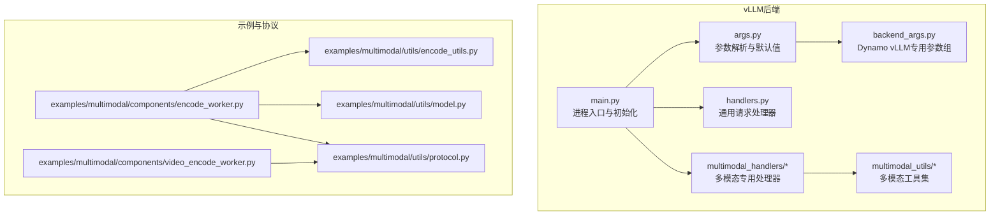
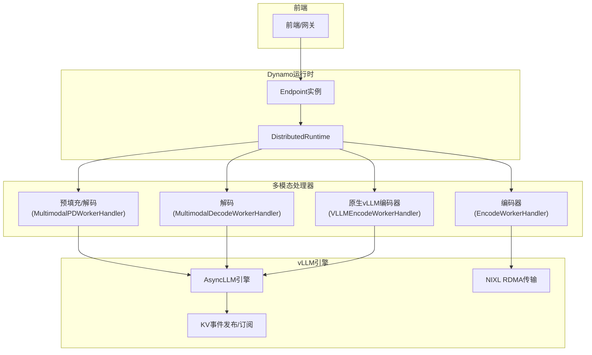
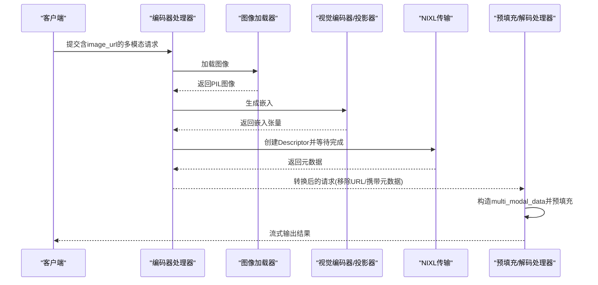
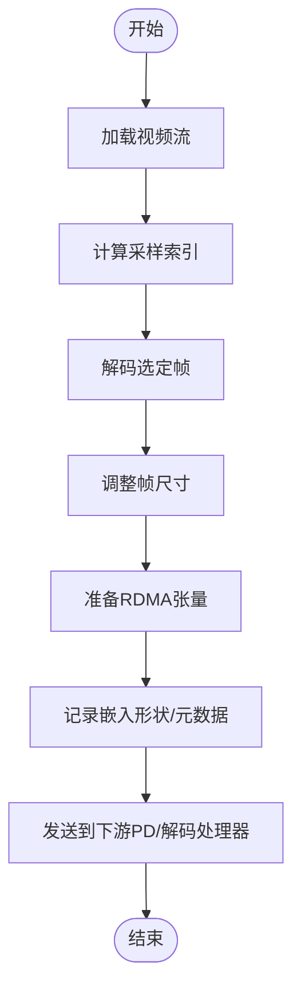
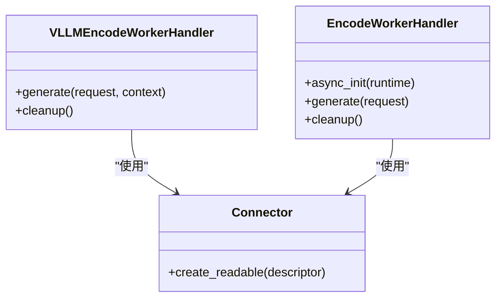
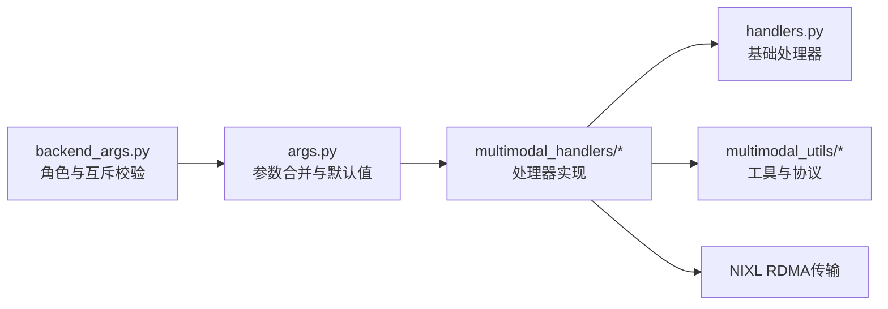

# vLLM多模态支持

<cite>
**本文档引用的文件**
- [components/src/dynamo/vllm/main.py](file://components/src/dynamo/vllm/main.py)
- [components/src/dynamo/vllm/args.py](file://components/src/dynamo/vllm/args.py)
- [components/src/dynamo/vllm/backend_args.py](file://components/src/dynamo/vllm/backend_args.py)
- [components/src/dynamo/vllm/handlers.py](file://components/src/dynamo/vllm/handlers.py)
- [components/src/dynamo/vllm/multimodal_handlers/__init__.py](file://components/src/dynamo/vllm/multimodal_handlers/__init__.py)
- [components/src/dynamo/vllm/multimodal_handlers/encode_worker_handler.py](file://components/src/dynamo/vllm/multimodal_handlers/encode_worker_handler.py)
- [components/src/dynamo/vllm/multimodal_handlers/worker_handler.py](file://components/src/dynamo/vllm/multimodal_handlers/worker_handler.py)
- [components/src/dynamo/vllm/multimodal_utils/__init__.py](file://components/src/dynamo/vllm/multimodal_utils/__init__.py)
- [components/src/dynamo/vllm/multimodal_utils/image_loader.py](file://components/src/dynamo/vllm/multimodal_utils/image_loader.py)
- [examples/multimodal/utils/encode_utils.py](file://examples/multimodal/utils/encode_utils.py)
- [examples/multimodal/utils/model.py](file://examples/multimodal/utils/model.py)
- [examples/multimodal/utils/protocol.py](file://examples/multimodal/utils/protocol.py)
- [examples/multimodal/components/encode_worker.py](file://examples/multimodal/components/encode_worker.py)
- [examples/multimodal/components/video_encode_worker.py](file://examples/multimodal/components/video_encode_worker.py)
</cite>

## 目录
1. [简介](#简介)
2. [项目结构](#项目结构)
3. [核心组件](#核心组件)
4. [架构总览](#架构总览)
5. [详细组件分析](#详细组件分析)
6. [依赖关系分析](#依赖关系分析)
7. [性能考虑](#性能考虑)
8. [故障排除指南](#故障排除指南)
9. [结论](#结论)
10. [附录](#附录)

## 简介
本文件系统性阐述Dynamo中vLLM后端的多模态推理能力，覆盖图像、视频、音频三类模态的处理路径与集成方式；详述vLLM特有的安全要求（--enable-multimodal标志）与组件标志配置；解释EPD、E/PD、E/P/D、EP/D等不同部署模式的工作原理与适用场景；提供完整的启动脚本使用指南与客户端调用示例；介绍ECConnector原生编码器的使用方法与NIXL数据传输优化；并列出支持的模型清单与已知限制。

## 项目结构
围绕vLLM多模态功能的关键目录与文件组织如下：
- 后端入口与运行时：components/src/dynamo/vllm/main.py、components/src/dynamo/vllm/args.py、components/src/dynamo/vllm/backend_args.py
- 多模态处理器与工具：components/src/dynamo/vllm/multimodal_handlers/*、components/src/dynamo/vllm/multimodal_utils/*
- 示例编码器与协议：examples/multimodal/components/*、examples/multimodal/utils/*

**图表来源**
- [components/src/dynamo/vllm/main.py](file://components/src/dynamo/vllm/main.py#L1-L1373)
- [components/src/dynamo/vllm/args.py](file://components/src/dynamo/vllm/args.py#L1-L437)
- [components/src/dynamo/vllm/backend_args.py](file://components/src/dynamo/vllm/backend_args.py#L1-L289)
- [components/src/dynamo/vllm/handlers.py](file://components/src/dynamo/vllm/handlers.py#L1-L1600)
- [components/src/dynamo/vllm/multimodal_handlers/__init__.py](file://components/src/dynamo/vllm/multimodal_handlers/__init__.py#L1-L25)
- [components/src/dynamo/vllm/multimodal_utils/__init__.py](file://components/src/dynamo/vllm/multimodal_utils/__init__.py#L1-L61)
- [examples/multimodal/components/encode_worker.py](file://examples/multimodal/components/encode_worker.py#L1-L265)
- [examples/multimodal/components/video_encode_worker.py](file://examples/multimodal/components/video_encode_worker.py#L1-L312)
- [examples/multimodal/utils/encode_utils.py](file://examples/multimodal/utils/encode_utils.py#L1-L133)
- [examples/multimodal/utils/model.py](file://examples/multimodal/utils/model.py#L1-L92)
- [examples/multimodal/utils/protocol.py](file://examples/multimodal/utils/protocol.py#L1-L191)

**章节来源**
- [components/src/dynamo/vllm/main.py](file://components/src/dynamo/vllm/main.py#L1-L1373)
- [components/src/dynamo/vllm/args.py](file://components/src/dynamo/vllm/args.py#L1-L437)
- [components/src/dynamo/vllm/backend_args.py](file://components/src/dynamo/vllm/backend_args.py#L1-L289)

## 核心组件
- 参数系统：统一解析Dynamo运行时参数与vLLM引擎参数，自动注入KV事件与传输配置，校验连接器与执行后端兼容性。
- 多模态处理器：按角色划分的处理器集合，包括编码器、预填充/解码器、原生vLLM编码器等。
- 工具与加载器：图像加载器、嵌入构造与缓存、协议定义与序列化。
- 示例编码器：演示如何通过NIXL RDMA或本地文件传递嵌入，以及视频编码流程。

**章节来源**
- [components/src/dynamo/vllm/args.py](file://components/src/dynamo/vllm/args.py#L1-L437)
- [components/src/dynamo/vllm/backend_args.py](file://components/src/dynamo/vllm/backend_args.py#L1-L289)
- [components/src/dynamo/vllm/multimodal_handlers/__init__.py](file://components/src/dynamo/vllm/multimodal_handlers/__init__.py#L1-L25)
- [components/src/dynamo/vllm/multimodal_utils/__init__.py](file://components/src/dynamo/vllm/multimodal_utils/__init__.py#L1-L61)

## 架构总览
vLLM多模态在Dynamo中的整体架构由“前端路由—多模态处理器—vLLM引擎—KV事件/传输层”构成。根据部署模式不同，可选择集中式或分布式（编码/预填充/解码分离）路径。

**图表来源**
- [components/src/dynamo/vllm/main.py](file://components/src/dynamo/vllm/main.py#L535-L800)
- [components/src/dynamo/vllm/multimodal_handlers/encode_worker_handler.py](file://components/src/dynamo/vllm/multimodal_handlers/encode_worker_handler.py#L1-L427)
- [components/src/dynamo/vllm/multimodal_handlers/worker_handler.py](file://components/src/dynamo/vllm/multimodal_handlers/worker_handler.py#L1-L315)
- [components/src/dynamo/vllm/args.py](file://components/src/dynamo/vllm/args.py#L304-L393)

## 详细组件分析

### 安全要求与组件标志
- --enable-multimodal：启用多模态处理的总开关，未设置时任何多模态组件均不可用。
- 组件互斥：同一时间仅允许一个多模态角色被启用（处理器、编码器、解码器、PD工作器、原生编码器等）。
- 原生编码器专用：--vllm-native-encoder-worker需配合--ec-*系列参数使用，且需要共享存储。
- 前端解码：--frontend-decoding开启后，图像在Rust前端解码并通过NIXL RDMA传给后端。

**章节来源**
- [components/src/dynamo/vllm/backend_args.py](file://components/src/dynamo/vllm/backend_args.py#L62-L175)
- [components/src/dynamo/vllm/backend_args.py](file://components/src/dynamo/vllm/backend_args.py#L224-L289)
- [components/src/dynamo/vllm/args.py](file://components/src/dynamo/vllm/args.py#L107-L111)

### 图像多模态处理流程
- 编码阶段：从URL加载图像，经图像处理器与视觉编码器/投影器生成嵌入，通过NIXL Descriptor或本地safetensors缓存，返回带元数据的请求。
- 解码阶段：将嵌入作为multi_modal_data传入vLLM，保持提示展开一致性，确保KV块计数匹配。

**图表来源**
- [components/src/dynamo/vllm/multimodal_handlers/encode_worker_handler.py](file://components/src/dynamo/vllm/multimodal_handlers/encode_worker_handler.py#L105-L282)
- [components/src/dynamo/vllm/multimodal_handlers/worker_handler.py](file://components/src/dynamo/vllm/multimodal_handlers/worker_handler.py#L173-L315)
- [components/src/dynamo/vllm/multimodal_utils/image_loader.py](file://components/src/dynamo/vllm/multimodal_utils/image_loader.py#L41-L111)

**章节来源**
- [components/src/dynamo/vllm/multimodal_handlers/encode_worker_handler.py](file://components/src/dynamo/vllm/multimodal_handlers/encode_worker_handler.py#L1-L427)
- [components/src/dynamo/vllm/multimodal_handlers/worker_handler.py](file://components/src/dynamo/vllm/multimodal_handlers/worker_handler.py#L1-L315)
- [components/src/dynamo/vllm/multimodal_utils/image_loader.py](file://components/src/dynamo/vllm/multimodal_utils/image_loader.py#L1-L111)

### 视频多模态处理流程
- 视频编码：从URL加载视频，采样关键帧，调整尺寸，准备RDMA张量，返回元数据。
- 预填充/解码：将视频帧作为multi_modal_data传入vLLM，保持提示展开一致性。

**图表来源**
- [examples/multimodal/components/video_encode_worker.py](file://examples/multimodal/components/video_encode_worker.py#L82-L196)
- [examples/multimodal/utils/protocol.py](file://examples/multimodal/utils/protocol.py#L157-L165)

**章节来源**
- [examples/multimodal/components/video_encode_worker.py](file://examples/multimodal/components/video_encode_worker.py#L1-L312)
- [examples/multimodal/utils/protocol.py](file://examples/multimodal/utils/protocol.py#L1-L191)

### 音频多模态处理流程
- 当前仓库示例展示了音频嵌入的构造与传递方式（如Qwen2-Audio），但未提供独立的音频编码器组件。音频推理可通过将嵌入作为multi_modal_data传入vLLM实现。

**章节来源**
- [examples/multimodal/utils/model.py](file://examples/multimodal/utils/model.py#L44-L92)
- [examples/multimodal/utils/protocol.py](file://examples/multimodal/utils/protocol.py#L157-L165)

### ECConnector原生编码器与NIXL数据传输优化
- ECConnector原生编码器：通过--vllm-native-encoder-worker启用，直接调用vLLM引擎进行编码，返回mm_hash与连接器元数据，便于后续消费端检索。
- NIXL RDMA：在编码器与下游处理器之间建立Connector，使用Descriptor进行零拷贝传输，显著降低CPU开销与内存复制。

**图表来源**
- [components/src/dynamo/vllm/multimodal_handlers/encode_worker_handler.py](file://components/src/dynamo/vllm/multimodal_handlers/encode_worker_handler.py#L284-L427)
- [components/src/dynamo/vllm/multimodal_handlers/encode_worker_handler.py](file://components/src/dynamo/vllm/multimodal_handlers/encode_worker_handler.py#L63-L104)

**章节来源**
- [components/src/dynamo/vllm/multimodal_handlers/encode_worker_handler.py](file://components/src/dynamo/vllm/multimodal_handlers/encode_worker_handler.py#L1-L427)

### 不同部署模式与适用场景
- EPD（编码-预填充-解码一体化）：适合对延迟敏感、资源受限的场景，所有阶段在同一组件内完成。
- E/PD（编码+预填充/解码分离）：编码器独立，预填充/解码在另一组件，便于扩展与资源隔离。
- E/P/D（编码+预填充+解码分离）：完全解耦，适合大规模分布式部署与弹性扩缩容。
- EP/D（编码+预填充+解码分离，但预填充与解码在同一组件）：折中方案，兼顾性能与灵活性。

**章节来源**
- [components/src/dynamo/vllm/multimodal_handlers/worker_handler.py](file://components/src/dynamo/vllm/multimodal_handlers/worker_handler.py#L116-L315)

### 启动脚本使用指南
- 基本步骤
  1) 设置命名空间与组件：DYN_NAMESPACE、DYN_COMPONENT等环境变量。
  2) 选择组件角色：--multimodal-processor、--ec-processor、--multimodal-encode-worker、--multimodal-worker、--multimodal-decode-worker、--multimodal-encode-prefill-worker、--vllm-native-encoder-worker。
  3) 启用多模态：--enable-multimodal。
  4) 指定模型与引擎参数：--model、--tensor-parallel-size等。
  5) 连接器配置：--connector或--kv-transfer-config。
  6) 前端解码：--frontend-decoding。
- 示例命令（以编码器为例）
  - dyno-run --component encoder --multimodal-encode-worker --enable-multimodal --model <模型ID> --connector nixl
- 示例命令（以原生编码器为例）
  - dyno-run --component encoder --vllm-native-encoder-worker --enable-multimodal --ec-connector-backend ECExampleConnector --ec-storage-path <共享路径> --model <模型ID>

**章节来源**
- [components/src/dynamo/vllm/backend_args.py](file://components/src/dynamo/vllm/backend_args.py#L28-L175)
- [components/src/dynamo/vllm/args.py](file://components/src/dynamo/vllm/args.py#L76-L127)

### 客户端调用示例
- 协议定义：vLLMMultimodalRequest/MultiModalInput/MultiModalRequest等，支持文本、图像、音频、视频内容组合。
- 请求格式要点
  - multimodal_input支持image_url/audio_url/video_url三者之一或组合。
  - 对于Qwen VL模型，需提供image_grid_thw与embeddings_shape以便解码端重建multi_modal_data。
  - 通过serialized_request携带NIXL元数据或本地缓存路径。
- 输出格式：MyRequestOutput封装vLLM RequestOutput，便于序列化与传输。

**章节来源**
- [examples/multimodal/utils/protocol.py](file://examples/multimodal/utils/protocol.py#L142-L191)
- [components/src/dynamo/vllm/multimodal_utils/__init__.py](file://components/src/dynamo/vllm/multimodal_utils/__init__.py#L26-L35)

## 依赖关系分析
- 参数解析与默认值：args.py负责合并Dynamo与vLLM参数，自动设置KV事件与传输配置，校验连接器合法性。
- 多模态角色与互斥：backend_args.py强制单角色启用与--enable-multimodal约束。
- 处理器链路：handlers.py提供基础处理器能力，multimodal_handlers/*.py实现具体角色逻辑。
- 数据传输：NIXL Connector用于零拷贝传输，提升吞吐与降低延迟。

**图表来源**
- [components/src/dynamo/vllm/backend_args.py](file://components/src/dynamo/vllm/backend_args.py#L224-L289)
- [components/src/dynamo/vllm/args.py](file://components/src/dynamo/vllm/args.py#L220-L302)
- [components/src/dynamo/vllm/multimodal_handlers/worker_handler.py](file://components/src/dynamo/vllm/multimodal_handlers/worker_handler.py#L1-L315)
- [components/src/dynamo/vllm/multimodal_utils/__init__.py](file://components/src/dynamo/vllm/multimodal_utils/__init__.py#L1-L61)

**章节来源**
- [components/src/dynamo/vllm/backend_args.py](file://components/src/dynamo/vllm/backend_args.py#L1-L289)
- [components/src/dynamo/vllm/args.py](file://components/src/dynamo/vllm/args.py#L1-L437)

## 性能考虑
- 执行后端与GIL：当使用NIXL连接器且TP=1时，强制分布式执行后端为mp以避免vLLM的GIL竞争问题。
- 前端解码：--frontend-decoding将图像解码迁移至Rust前端，减少Python端CPU压力，结合NIXL RDMA进一步降低数据搬运成本。
- KV事件与前缀缓存：通过KVEventsConfig与ZMQ发布/订阅，加速重复提示的处理。
- 嵌入缓存：编码器内置缓存机制，避免重复计算相同图像的嵌入。

**章节来源**
- [components/src/dynamo/vllm/args.py](file://components/src/dynamo/vllm/args.py#L224-L247)
- [components/src/dynamo/vllm/args.py](file://components/src/dynamo/vllm/args.py#L304-L343)
- [components/src/dynamo/vllm/multimodal_handlers/encode_worker_handler.py](file://components/src/dynamo/vllm/multimodal_handlers/encode_worker_handler.py#L51-L95)

## 故障排除指南
- 多模态未启用：若未设置--enable-multimodal，任何多模态组件将被拒绝。
- 角色冲突：同时设置多个多模态角色会触发校验错误。
- 原生编码器存储：使用ECExampleConnector后端时必须提供--ec-storage-path。
- NIXL侧通道：当使用NIXL连接器时，确保正确设置侧通道主机地址。
- 图像加载失败：检查URL格式、网络连通性与图片格式是否受支持（JPEG/PNG/WEBP）。

**章节来源**
- [components/src/dynamo/vllm/backend_args.py](file://components/src/dynamo/vllm/backend_args.py#L224-L289)
- [components/src/dynamo/vllm/args.py](file://components/src/dynamo/vllm/args.py#L424-L437)
- [components/src/dynamo/vllm/multimodal_utils/image_loader.py](file://components/src/dynamo/vllm/multimodal_utils/image_loader.py#L41-L111)

## 结论
vLLM在Dynamo中的多模态能力通过严格的参数校验、灵活的角色划分与高效的NIXL传输实现了对图像、视频、音频的统一接入。结合前端解码与嵌入缓存策略，可在保证性能的同时满足多样化的部署需求。建议在生产环境中优先启用--frontend-decoding与合适的连接器配置，并根据业务规模选择EPD/E/PD/E/P/D/EP/D等部署模式。

## 附录

### 支持的模型清单
- LLaVA 1.5 7B：支持图像编码与投影。
- Qwen2.5-VL 7B-Instruct：支持图像编码与网格信息传递。
- LLaVA-NeXT-Video 7B：支持视频编码与帧采样。
- Qwen2-Audio 7B-Instruct：支持音频嵌入构造与传递。

**章节来源**
- [examples/multimodal/utils/model.py](file://examples/multimodal/utils/model.py#L25-L32)
- [examples/multimodal/utils/encode_utils.py](file://examples/multimodal/utils/encode_utils.py#L58-L103)

### 已知限制
- 视频与音频编码器当前示例主要展示协议与数据构造，实际编码器实现可能因模型而异。
- 原生vLLM编码器的ECConnector消费模式尚不完整，视频/音频支持待完善。
- 前端解码仅在图像场景验证，音频/视频的前端解码路径需进一步测试。

**章节来源**
- [components/src/dynamo/vllm/multimodal_handlers/encode_worker_handler.py](file://components/src/dynamo/vllm/multimodal_handlers/encode_worker_handler.py#L344-L358)
- [examples/multimodal/components/video_encode_worker.py](file://examples/multimodal/components/video_encode_worker.py#L1-L312)