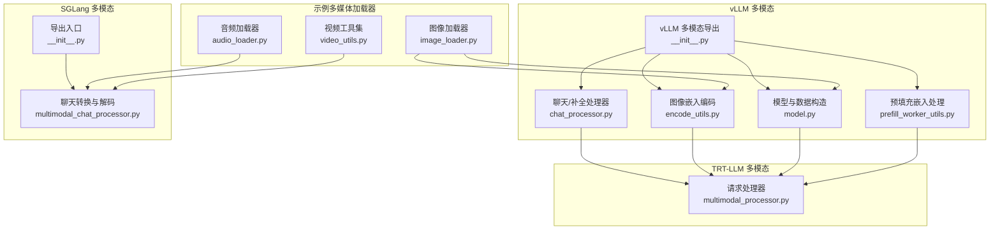
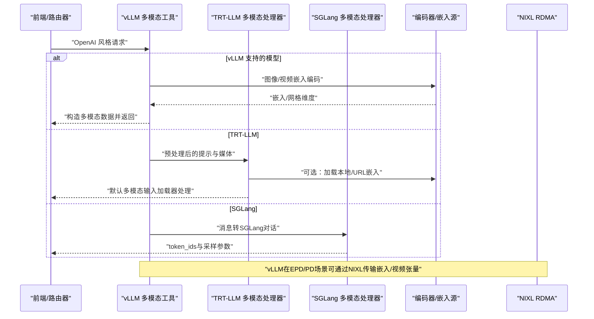
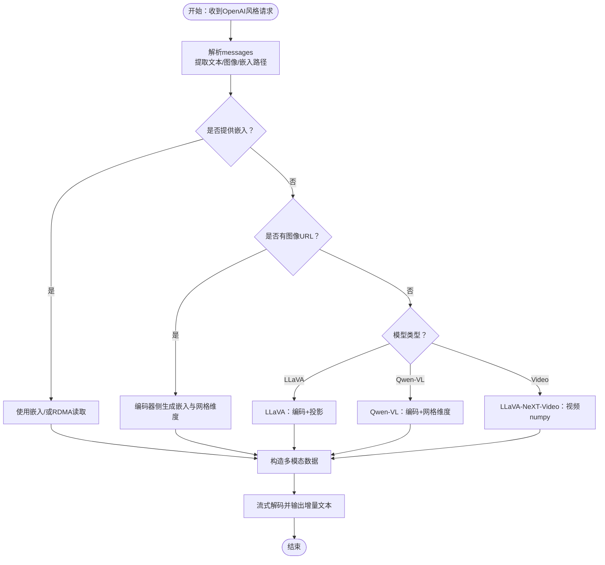
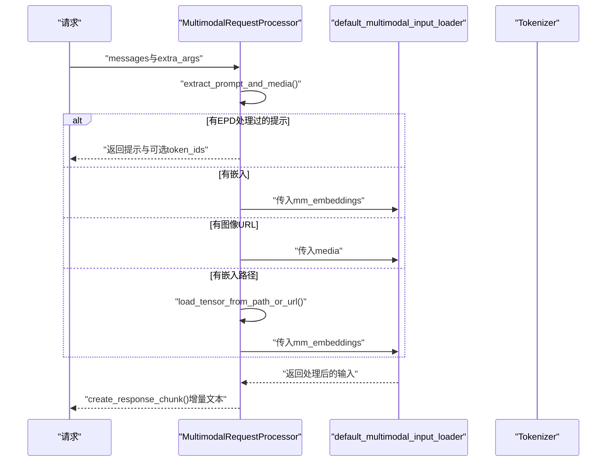
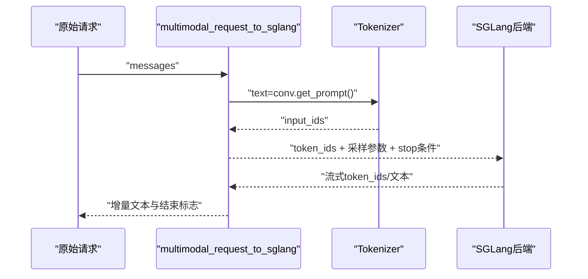
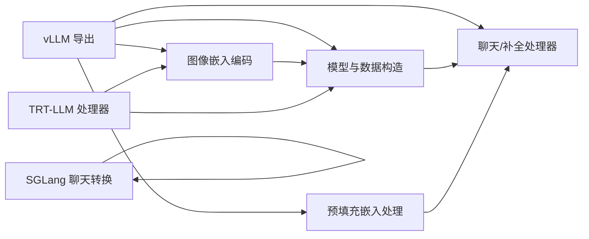

# 后端支持矩阵

<cite>
**本文引用的文件**
- [components/src/dynamo/vllm/multimodal_utils/__init__.py](file://components/src/dynamo/vllm/multimodal_utils/__init__.py)
- [components/src/dynamo/vllm/multimodal_utils/chat_processor.py](file://components/src/dynamo/vllm/multimodal_utils/chat_processor.py)
- [components/src/dynamo/vllm/multimodal_utils/encode_utils.py](file://components/src/dynamo/vllm/multimodal_utils/encode_utils.py)
- [components/src/dynamo/vllm/multimodal_utils/model.py](file://components/src/dynamo/vllm/multimodal_utils/model.py)
- [components/src/dynamo/vllm/multimodal_utils/prefill_worker_utils.py](file://components/src/dynamo/vllm/multimodal_utils/prefill_worker_utils.py)
- [components/src/dynamo/trtllm/multimodal_processor.py](file://components/src/dynamo/trtllm/multimodal_processor.py)
- [components/src/dynamo/sglang/multimodal_utils/__init__.py](file://components/src/dynamo/sglang/multimodal_utils/__init__.py)
- [components/src/dynamo/sglang/multimodal_utils/multimodal_chat_processor.py](file://components/src/dynamo/sglang/multimodal_utils/multimodal_chat_processor.py)
- [examples/multimodal/utils/image_loader.py](file://examples/multimodal/utils/image_loader.py)
- [examples/multimodal/utils/audio_loader.py](file://examples/multimodal/utils/audio_loader.py)
- [examples/multimodal/utils/video_utils.py](file://examples/multimodal/utils/video_utils.py)
- [components/src/dynamo/common/multimodal/__init__.py](file://components/src/dynamo/common/multimodal/__init__.py)
</cite>

## 目录
1. [简介](#简介)
2. [项目结构](#项目结构)
3. [核心组件](#核心组件)
4. [架构总览](#架构总览)
5. [详细组件分析](#详细组件分析)
6. [依赖关系分析](#依赖关系分析)
7. [性能考量](#性能考量)
8. [故障排查指南](#故障排查指南)
9. [结论](#结论)
10. [附录](#附录)

## 简介
本文件面向Dynamo多模态后端支持的技术文档，系统梳理vLLM、TRT-LLM、SGLang三类后端在图像、视频、音频等多模态输入上的能力与限制，并给出输入格式支持（URL、Base64、预计算嵌入）、配置要点、部署注意事项与选型建议。文档同时提供关键流程的时序图与数据流图，帮助读者快速理解各后端在请求预处理、编码器/解码器分离、流式响应等方面的实现差异。

## 项目结构
围绕多模态后端支持的关键代码分布在以下模块：
- vLLM多模态工具：负责聊天/补全预处理、图像嵌入编码、模型类型识别与多模态数据构造、预填充阶段嵌入加载与累加等。
- TRT-LLM多模态处理器：负责OpenAI风格请求解析、媒体提取、本地/远程张量加载、默认多模态输入加载器集成与流式响应构建。
- SGLang多模态处理器：负责消息到对话模板的转换、令牌化、流式响应解码与增量文本拼接。
- 示例多媒体加载器：提供图像、音频、视频的统一加载与缓存策略，支撑前端或编码器侧的数据准备。

图表来源
- [components/src/dynamo/vllm/multimodal_utils/__init__.py](file://components/src/dynamo/vllm/multimodal_utils/__init__.py#L1-L61)
- [components/src/dynamo/trtllm/multimodal_processor.py](file://components/src/dynamo/trtllm/multimodal_processor.py#L1-L281)
- [components/src/dynamo/sglang/multimodal_utils/__init__.py](file://components/src/dynamo/sglang/multimodal_utils/__init__.py#L1-L19)
- [examples/multimodal/utils/image_loader.py](file://examples/multimodal/utils/image_loader.py#L1-L111)
- [examples/multimodal/utils/audio_loader.py](file://examples/multimodal/utils/audio_loader.py#L1-L81)
- [examples/multimodal/utils/video_utils.py](file://examples/multimodal/utils/video_utils.py#L1-L415)

章节来源
- [components/src/dynamo/vllm/multimodal_utils/__init__.py](file://components/src/dynamo/vllm/multimodal_utils/__init__.py#L1-L61)
- [components/src/dynamo/trtllm/multimodal_processor.py](file://components/src/dynamo/trtllm/multimodal_processor.py#L1-L281)
- [components/src/dynamo/sglang/multimodal_utils/__init__.py](file://components/src/dynamo/sglang/multimodal_utils/__init__.py#L1-L19)
- [examples/multimodal/utils/image_loader.py](file://examples/multimodal/utils/image_loader.py#L1-L111)
- [examples/multimodal/utils/audio_loader.py](file://examples/multimodal/utils/audio_loader.py#L1-L81)
- [examples/multimodal/utils/video_utils.py](file://examples/multimodal/utils/video_utils.py#L1-L415)

## 核心组件
- vLLM多模态工具
  - 聊天/补全预处理：将OpenAI风格请求转换为内部对话与引擎提示，支持流式/非流式响应增量内容提取。
  - 图像嵌入编码：按模型类型（如LLaVA、Qwen-VL）调用对应编码器与投影器，生成规范化嵌入。
  - 模型与数据构造：根据模型类型构造多模态数据结构（图像嵌入、视频帧、Qwen网格维度等）。
  - 预填充嵌入处理：从本地safetensors或NIXL RDMA读取预计算嵌入，合并到多模态数据中。
- TRT-LLM多模态处理器
  - 请求解析：从messages中抽取文本、图像URL或嵌入路径；支持EPD（Encoder-PreFill Disaggregation）与PD（PreFill Disaggregation）两种模式。
  - 媒体加载：支持URL与本地路径（受白名单目录限制），并进行大小校验；支持.pt/.pth/.bin嵌入张量直接加载。
  - 输入加载：通过TensorRT LLM默认多模态输入加载器完成同步预处理，异步包装以提升并发吞吐。
  - 流式响应：基于tokenizer解码增量文本，组装OpenAI风格流式chunk。
- SGLang多模态处理器
  - 请求转换：将OpenAI风格messages转换为SGLang对话模板，替换图像占位符，生成token_ids与采样参数。
  - 流式解码：对单条流式响应进行解码与增量文本拼接，支持finished标志判断结束。

章节来源
- [components/src/dynamo/vllm/multimodal_utils/chat_processor.py](file://components/src/dynamo/vllm/multimodal_utils/chat_processor.py#L1-L360)
- [components/src/dynamo/vllm/multimodal_utils/encode_utils.py](file://components/src/dynamo/vllm/multimodal_utils/encode_utils.py#L1-L211)
- [components/src/dynamo/vllm/multimodal_utils/model.py](file://components/src/dynamo/vllm/multimodal_utils/model.py#L1-L305)
- [components/src/dynamo/vllm/multimodal_utils/prefill_worker_utils.py](file://components/src/dynamo/vllm/multimodal_utils/prefill_worker_utils.py#L1-L118)
- [components/src/dynamo/trtllm/multimodal_processor.py](file://components/src/dynamo/trtllm/multimodal_processor.py#L1-L281)
- [components/src/dynamo/sglang/multimodal_utils/multimodal_chat_processor.py](file://components/src/dynamo/sglang/multimodal_utils/multimodal_chat_processor.py#L1-L163)

## 架构总览
下图展示Dynamo多模态请求在三大后端中的典型流转：前端/路由器将OpenAI风格请求传递至各后端，后端根据模型类型与输入形式选择不同的预处理与编码路径，并在必要时通过NIXL RDMA在编码器与解码器之间传输嵌入/视频张量。

图表来源
- [components/src/dynamo/vllm/multimodal_utils/model.py](file://components/src/dynamo/vllm/multimodal_utils/model.py#L203-L247)
- [components/src/dynamo/vllm/multimodal_utils/prefill_worker_utils.py](file://components/src/dynamo/vllm/multimodal_utils/prefill_worker_utils.py#L21-L58)
- [components/src/dynamo/trtllm/multimodal_processor.py](file://components/src/dynamo/trtllm/multimodal_processor.py#L168-L235)
- [components/src/dynamo/sglang/multimodal_utils/multimodal_chat_processor.py](file://components/src/dynamo/sglang/multimodal_utils/multimodal_chat_processor.py#L11-L48)

## 详细组件分析

### vLLM 多模态能力与限制
- 支持的模型族
  - LLaVA-1.5-7B：需要视觉编码器与多模态投影器，嵌入经投影器映射后进入语言模型。
  - Qwen-VL系列（含Qwen3-VL-30B-A3B-Instruct-FP8）：使用原生vLLM视觉编码器，需提供image_grid_thw网格维度信息。
  - LLaVA-NeXT-Video-7B：支持视频输入，需提供视频numpy数组。
- 输入格式
  - 文本：直接拼接为提示。
  - 图像：支持URL（HTTP/HTTPS）、data URI（需image/且base64）、本地路径（需在允许范围内，但vLLM侧主要通过外部编码器生成嵌入）。
  - 嵌入：支持.pt/.pth/.bin张量文件，或通过NIXL RDMA接收预计算嵌入（EPD/PD）。
- 关键流程
  - 编码器侧：按模型类型调用encode_utils与model.py中的函数，生成规范化嵌入与网格维度。
  - 解码器侧：将嵌入/视频数据封装为多模态数据结构，交由vLLM引擎执行推理。
  - 流式响应：通过chat_processor的流式生成器，增量解码并输出delta。
- 限制与注意
  - Qwen-VL需要image_grid_thw；否则抛出异常。
  - LLaVA-1.5-7B缺少投影器会报错。
  - 视频仅在LLaVA-NeXT-Video-7B模型上验证支持。
  - vLLM在某些Qwen版本上需要特殊环境变量与猴子补丁以启用原生视觉编码器加载。

图表来源
- [components/src/dynamo/vllm/multimodal_utils/encode_utils.py](file://components/src/dynamo/vllm/multimodal_utils/encode_utils.py#L88-L132)
- [components/src/dynamo/vllm/multimodal_utils/model.py](file://components/src/dynamo/vllm/multimodal_utils/model.py#L203-L247)
- [components/src/dynamo/vllm/multimodal_utils/chat_processor.py](file://components/src/dynamo/vllm/multimodal_utils/chat_processor.py#L198-L294)

章节来源
- [components/src/dynamo/vllm/multimodal_utils/encode_utils.py](file://components/src/dynamo/vllm/multimodal_utils/encode_utils.py#L1-L211)
- [components/src/dynamo/vllm/multimodal_utils/model.py](file://components/src/dynamo/vllm/multimodal_utils/model.py#L1-L305)
- [components/src/dynamo/vllm/multimodal_utils/chat_processor.py](file://components/src/dynamo/vllm/multimodal_utils/chat_processor.py#L1-L360)

### TRT-LLM 多模态能力与限制
- 输入格式
  - 文本：拼接为提示。
  - 图像：支持URL（HTTP/HTTPS）与本地路径（file://），并进行大小限制检查；若路径为.pt/.pth/.bin则视为嵌入张量路径。
  - 嵌入：直接加载张量，用于PD场景。
- 关键流程
  - 请求解析：从extra_args/messages中抽取内容，识别模态类型（图像/文本）。
  - 媒体加载：URL走HTTP下载至内存，本地路径受allowed_local_media_path限制；嵌入路径直接torch.load。
  - 默认多模态输入加载：调用default_multimodal_input_loader完成预处理，异步包装以提升并发。
  - 流式响应：基于tokenizer解码增量文本，组装OpenAI风格chunk。
- 限制与注意
  - 本地文件访问需配置allowed_local_media_path，否则拒绝访问。
  - 文件大小超过阈值会报错。
  - 默认加载器为同步操作，通过异步线程池包装以避免阻塞事件循环。

图表来源
- [components/src/dynamo/trtllm/multimodal_processor.py](file://components/src/dynamo/trtllm/multimodal_processor.py#L168-L235)
- [components/src/dynamo/trtllm/multimodal_processor.py](file://components/src/dynamo/trtllm/multimodal_processor.py#L218-L229)

章节来源
- [components/src/dynamo/trtllm/multimodal_processor.py](file://components/src/dynamo/trtllm/multimodal_processor.py#L1-L281)

### SGLang 多模态能力与限制
- 输入格式
  - 文本：按角色拼接。
  - 图像：通过对话模板中的图像占位符替换，最终生成token_ids。
- 关键流程
  - 请求转换：遍历messages，将text部分拼接，image_url替换为模板占位符，生成完整prompt并tokenize。
  - 流式解码：对响应进行解码，累积增量文本，依据finished标志判断结束。
- 限制与注意
  - 依赖对话模板与tokenizer；需确保模板中包含图像占位符。
  - 对于Annotated对象，具备data字段时优先解析其JSON或字符串表示。

图表来源
- [components/src/dynamo/sglang/multimodal_utils/multimodal_chat_processor.py](file://components/src/dynamo/sglang/multimodal_utils/multimodal_chat_processor.py#L11-L48)
- [components/src/dynamo/sglang/multimodal_utils/multimodal_chat_processor.py](file://components/src/dynamo/sglang/multimodal_utils/multimodal_chat_processor.py#L109-L163)

章节来源
- [components/src/dynamo/sglang/multimodal_utils/multimodal_chat_processor.py](file://components/src/dynamo/sglang/multimodal_utils/multimodal_chat_processor.py#L1-L163)
- [components/src/dynamo/sglang/multimodal_utils/__init__.py](file://components/src/dynamo/sglang/multimodal_utils/__init__.py#L1-L19)

### 多媒体加载器（图像/音频/视频）
- 图像加载器
  - 支持HTTP/HTTPS URL、data URI（image/且base64）、本地路径；内置缓存与格式校验（JPEG/PNG/WEBP），并转换为RGB。
- 音频加载器
  - 仅支持HTTP/HTTPS URL，使用librosa加载并重采样，默认16kHz；提供LRU缓存避免重复下载。
- 视频工具集
  - 支持HTTP/HTTPS URL、data URI（video/或octet-stream且base64）、本地文件；使用PyAV解复用/解码，按索引抽帧，支持尺寸缩放与RDMA前张量准备。

章节来源
- [examples/multimodal/utils/image_loader.py](file://examples/multimodal/utils/image_loader.py#L1-L111)
- [examples/multimodal/utils/audio_loader.py](file://examples/multimodal/utils/audio_loader.py#L1-L81)
- [examples/multimodal/utils/video_utils.py](file://examples/multimodal/utils/video_utils.py#L1-L415)

## 依赖关系分析
- vLLM侧
  - vLLM多模态导出聚合了聊天/补全处理器、图像嵌入编码、模型与协议定义，形成统一接口。
  - 预填充嵌入处理依赖NIXL连接器与safetensors，支持本地文件与RDMA两种传输路径。
- TRT-LLM侧
  - 依赖TensorRT LLM的默认多模态输入加载器与tokenizer工厂，结合本地/远程张量加载实现媒体输入。
- SGLang侧
  - 依赖对话模板与tokenizer，将消息转换为token_ids并驱动流式解码。

图表来源
- [components/src/dynamo/vllm/multimodal_utils/__init__.py](file://components/src/dynamo/vllm/multimodal_utils/__init__.py#L1-L61)
- [components/src/dynamo/vllm/multimodal_utils/prefill_worker_utils.py](file://components/src/dynamo/vllm/multimodal_utils/prefill_worker_utils.py#L21-L58)
- [components/src/dynamo/trtllm/multimodal_processor.py](file://components/src/dynamo/trtllm/multimodal_processor.py#L168-L235)
- [components/src/dynamo/sglang/multimodal_utils/multimodal_chat_processor.py](file://components/src/dynamo/sglang/multimodal_utils/multimodal_chat_processor.py#L11-L48)

章节来源
- [components/src/dynamo/vllm/multimodal_utils/__init__.py](file://components/src/dynamo/vllm/multimodal_utils/__init__.py#L1-L61)
- [components/src/dynamo/vllm/multimodal_utils/prefill_worker_utils.py](file://components/src/dynamo/vllm/multimodal_utils/prefill_worker_utils.py#L1-L118)
- [components/src/dynamo/trtllm/multimodal_processor.py](file://components/src/dynamo/trtllm/multimodal_processor.py#L1-L281)
- [components/src/dynamo/sglang/multimodal_utils/multimodal_chat_processor.py](file://components/src/dynamo/sglang/multimodal_utils/multimodal_chat_processor.py#L1-L163)

## 性能考量
- 并发与I/O
  - vLLM：图像嵌入编码在GPU上进行，建议在编码器侧批量处理并利用FP8（如Qwen3-VL-A3B）降低显存占用。
  - TRT-LLM：默认多模态输入加载器为同步，通过异步线程池包装以提升高并发下的吞吐。
  - SGLang：依赖对话模板与tokenizer，建议在前端或编码器侧完成媒体预处理，减少后端tokenize开销。
- 内存与存储
  - vLLM：Qwen-VL在编码器侧加载原生视觉编码器时需设置环境变量与猴子补丁；EPD/PD场景通过NIXL RDMA传输张量，避免频繁磁盘IO。
  - TRT-LLM：本地文件访问受allowed_local_media_path限制，防止越权与路径穿越；文件大小超限直接拒绝。
- 流式响应
  - vLLM与TRT-LLM均提供增量文本拼接，SGLang通过解码器逐步输出文本；合理设置采样参数与停止条件可减少无效输出。

[本节为通用性能讨论，不直接分析具体文件]

## 故障排查指南
- vLLM常见问题
  - 缺少投影器导致LLaVA模型报错：确认模型配置包含multi_modal_projector。
  - Qwen-VL未提供image_grid_thw：检查编码器侧是否正确生成网格维度。
  - NIXL RDMA失败：检查描述符与连接器初始化，确认共享存储路径与权限。
- TRT-LLM常见问题
  - 本地文件访问被拒绝：检查allowed_local_media_path配置与路径合法性。
  - URL下载失败或空内容：检查网络连通性与HTTP状态码。
  - 张量加载错误：确认.pt/.pth/.bin文件完整性与权重仅加载开关。
- SGLang常见问题
  - 对话模板无图像占位符：确保模板中包含图像标记，以便替换。
  - 流式响应未结束：检查finished标志或finish_reason字段。

章节来源
- [components/src/dynamo/vllm/multimodal_utils/encode_utils.py](file://components/src/dynamo/vllm/multimodal_utils/encode_utils.py#L106-L132)
- [components/src/dynamo/vllm/multimodal_utils/model.py](file://components/src/dynamo/vllm/multimodal_utils/model.py#L236-L246)
- [components/src/dynamo/vllm/multimodal_utils/prefill_worker_utils.py](file://components/src/dynamo/vllm/multimodal_utils/prefill_worker_utils.py#L50-L57)
- [components/src/dynamo/trtllm/multimodal_processor.py](file://components/src/dynamo/trtllm/multimodal_processor.py#L106-L139)
- [components/src/dynamo/sglang/multimodal_utils/multimodal_chat_processor.py](file://components/src/dynamo/sglang/multimodal_utils/multimodal_chat_processor.py#L154-L156)

## 结论
- vLLM在多模态方面覆盖LLaVA与Qwen-VL系列，支持EPD/PD嵌入传输与视频（LLaVA-NeXT-Video-7B），适合需要原生视觉编码器与灵活多模态数据构造的场景。
- TRT-LLM提供稳健的OpenAI风格请求处理与默认多模态输入加载器集成，适用于对部署稳定性与资源控制有严格要求的生产环境。
- SGLang在对话模板与流式解码方面表现良好，适合需要轻量级多模态推理与快速集成的场景。
- 选择建议：若需原生视觉编码器与Qwen-VL生态，优先vLLM；若追求稳定与可控的多模态输入加载，优先TRT-LLM；若偏向对话与流式体验，优先SGLang。

[本节为总结性内容，不直接分析具体文件]

## 附录
- 输入格式支持矩阵
  - 图像
    - vLLM：URL（HTTP/HTTPS/data URI）、嵌入路径（.pt/.pth/.bin，EPD/PD）。
    - TRT-LLM：URL（HTTP/HTTPS/file://）、嵌入路径（.pt/.pth/.bin）。
    - SGLang：通过对话模板占位符，实际媒体由前端或编码器提供。
  - 视频
    - vLLM：LLaVA-NeXT-Video-7B支持，需提供视频numpy数组。
    - TRT-LLM：未见视频支持实现。
    - SGLang：未见视频支持实现。
  - 音频
    - vLLM：未见音频支持实现。
    - TRT-LLM：未见音频支持实现。
    - SGLang：未见音频支持实现。
- 特定配置参数与部署注意事项
  - vLLM
    - 环境变量：VLLM_ENABLE_V1_MULTIPROCESSING（影响Qwen-VL视觉编码器加载）。
    - 模型类型：需明确LLaVA/Qwen-VL/Video等，分别提供投影器/网格维度/视频numpy。
    - EPD/PD：通过NIXL RDMA传输嵌入/视频张量，需配置共享存储路径。
  - TRT-LLM
    - allowed_local_media_path：限制本地文件访问范围。
    - max_file_size_mb：限制文件大小，防止过大媒体占用内存。
    - tokenizer_factory：在启动时初始化一次，避免每请求重复开销。
  - SGLang
    - 对话模板：需包含图像占位符。
    - 采样参数：temperature、max_tokens等需与后端兼容。

章节来源
- [components/src/dynamo/vllm/multimodal_utils/model.py](file://components/src/dynamo/vllm/multimodal_utils/model.py#L143-L200)
- [components/src/dynamo/vllm/multimodal_utils/prefill_worker_utils.py](file://components/src/dynamo/vllm/multimodal_utils/prefill_worker_utils.py#L18-L18)
- [components/src/dynamo/trtllm/multimodal_processor.py](file://components/src/dynamo/trtllm/multimodal_processor.py#L56-L70)
- [components/src/dynamo/sglang/multimodal_utils/multimodal_chat_processor.py](file://components/src/dynamo/sglang/multimodal_utils/multimodal_chat_processor.py#L12-L46)