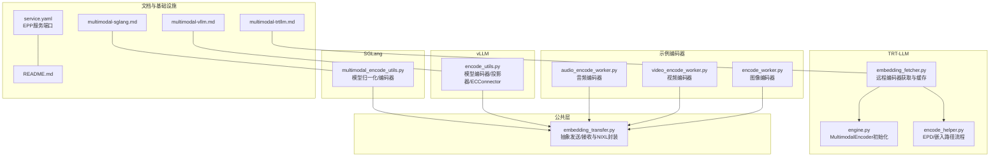
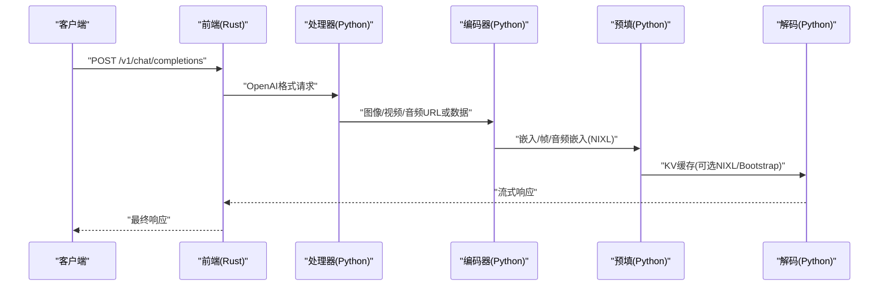
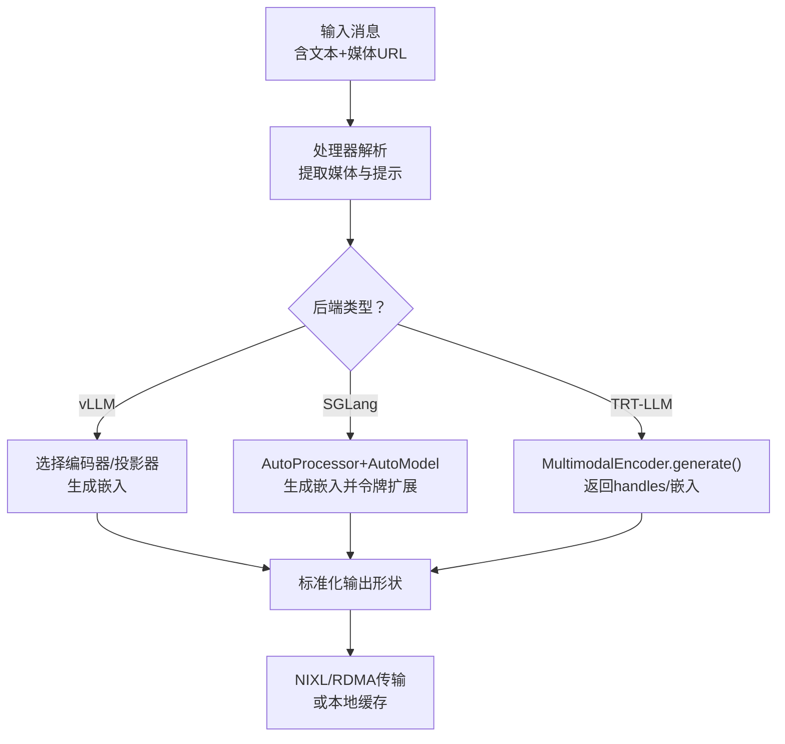
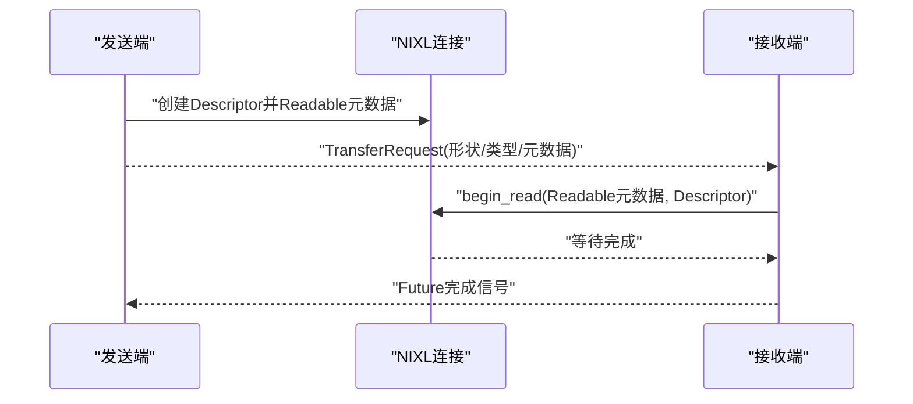
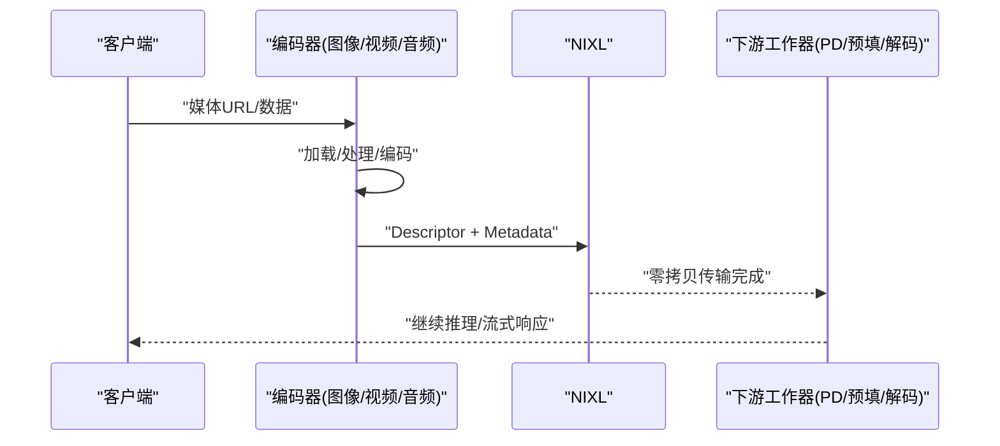
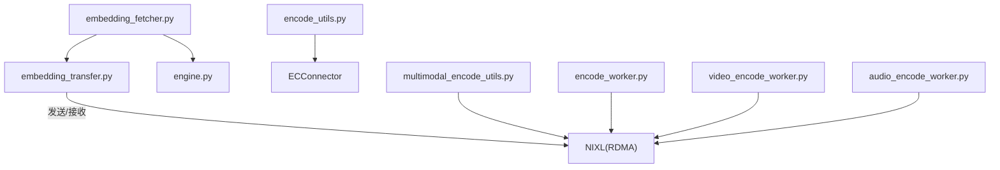

# 多模态处理

<cite>
**本文引用的文件**
- [embedding_transfer.py](file://components/src/dynamo/common/multimodal/embedding_transfer.py)
- [embedding_fetcher.py](file://components/src/dynamo/trtllm/multimodal/embedding_fetcher.py)
- [encode_utils.py](file://components/src/dynamo/vllm/multimodal_utils/encode_utils.py)
- [multimodal_encode_utils.py](file://components/src/dynamo/sglang/multimodal_utils/multimodal_encode_utils.py)
- [encode_worker.py](file://examples/multimodal/components/encode_worker.py)
- [video_encode_worker.py](file://examples/multimodal/components/video_encode_worker.py)
- [audio_encode_worker.py](file://examples/multimodal/components/audio_encode_worker.py)
- [multimodal-vllm.md](file://docs/pages/features/multimodal/multimodal-vllm.md)
- [multimodal-trtllm.md](file://docs/pages/features/multimodal/multimodal-trtllm.md)
- [multimodal-sglang.md](file://docs/pages/features/multimodal/multimodal-sglang.md)
- [README.md](file://docs/pages/features/multimodal/README.md)
- [engine.py](file://components/src/dynamo/trtllm/engine.py)
- [encode_helper.py](file://components/src/dynamo/trtllm/encode_helper.py)
- [service.yaml](file://deploy/inference-gateway/standalone/helm/dynamo-gaie/templates/service.yaml)
</cite>

## 目录
1. [简介](#简介)
2. [项目结构](#项目结构)
3. [核心组件](#核心组件)
4. [架构总览](#架构总览)
5. [详细组件分析](#详细组件分析)
6. [依赖关系分析](#依赖关系分析)
7. [性能考量](#性能考量)
8. [故障排查指南](#故障排查指南)
9. [结论](#结论)
10. [附录](#附录)

## 简介
本技术文档系统化阐述Dynamo在多模态（图像、视频、音频）推理中的整体架构与实现原理，覆盖四种部署模式（EPD、E/PD、E/P/D、EP/D），解释编码器工作机理、嵌入向量生成流程与NIXL（RDMA）零拷贝传输机制，并给出vLLM、TRT-LLM、SGLang三大后端的多模态支持矩阵与配置要点。文档同时提供配置示例、部署脚本指引与常见问题排查方法，帮助读者在不同硬件与模型条件下完成稳定、高性能的多模态服务部署。

## 项目结构
围绕多模态处理的关键目录与文件如下：
- 公共传输层：embedding_transfer.py 提供抽象发送/接收接口与本地/NIXL持久化实现
- TRT-LLM专用：embedding_fetcher.py 负责从远端编码器获取嵌入并缓存；engine.py 针对编码器模式初始化MultimodalEncoder；encode_helper.py 支持预计算嵌入路径与完整EPD流程
- vLLM专用：encode_utils.py 提供模型特定编码器选择、投影器装配与ECConnector配置
- SGLang专用：multimodal_encode_utils.py 提供模型名归一化、编码器选择与Qwen风格特征提取
- 示例编码器：encode_worker.py（图像）、video_encode_worker.py（视频）、audio_encode_worker.py（音频）展示如何通过NIXL/RDMA将嵌入/帧/音频嵌入传递给下游
- 文档：multimodal-vllm.md、multimodal-trtllm.md、multimodal-sglang.md、README.md 提供后端能力矩阵、部署模式与使用说明
- 基础设施：service.yaml 展示EPP服务端口与协议

**图表来源**
- [embedding_transfer.py](file://components/src/dynamo/common/multimodal/embedding_transfer.py#L1-L464)
- [embedding_fetcher.py](file://components/src/dynamo/trtllm/multimodal/embedding_fetcher.py#L1-L258)
- [engine.py](file://components/src/dynamo/trtllm/engine.py#L53-L77)
- [encode_helper.py](file://components/src/dynamo/trtllm/encode_helper.py#L191-L423)
- [encode_utils.py](file://components/src/dynamo/vllm/multimodal_utils/encode_utils.py#L1-L211)
- [multimodal_encode_utils.py](file://components/src/dynamo/sglang/multimodal_utils/multimodal_encode_utils.py#L1-L171)
- [encode_worker.py](file://examples/multimodal/components/encode_worker.py#L1-L265)
- [video_encode_worker.py](file://examples/multimodal/components/video_encode_worker.py#L1-L312)
- [audio_encode_worker.py](file://examples/multimodal/components/audio_encode_worker.py#L1-L308)
- [multimodal-vllm.md](file://docs/pages/features/multimodal/multimodal-vllm.md#L1-L511)
- [multimodal-trtllm.md](file://docs/pages/features/multimodal/multimodal-trtllm.md#L1-L465)
- [multimodal-sglang.md](file://docs/pages/features/multimodal/multimodal-sglang.md#L1-L422)
- [README.md](file://docs/pages/features/multimodal/README.md#L1-L194)
- [service.yaml](file://deploy/inference-gateway/standalone/helm/dynamo-gaie/templates/service.yaml#L1-L28)

**章节来源**
- [README.md](file://docs/pages/features/multimodal/README.md#L1-L194)
- [multimodal-vllm.md](file://docs/pages/features/multimodal/multimodal-vllm.md#L1-L511)
- [multimodal-trtllm.md](file://docs/pages/features/multimodal/multimodal-trtllm.md#L1-L465)
- [multimodal-sglang.md](file://docs/pages/features/multimodal/multimodal-sglang.md#L1-L422)

## 核心组件
- 传输抽象与NIXL封装
  - 抽象发送/接收接口定义了统一的TransferRequest与生命周期管理，支持本地文件缓存与NIXL RDMA零拷贝两种路径
  - 提供LocalEmbeddingSender/Receiver与NixlPersistentEmbeddingSender/Receiver，后者通过持久连接减少重复注册开销
- TRT-LLM嵌入获取与缓存
  - embedding_fetcher.py负责按URL缓存与批量编码，支持直接返回CUDA句柄或CPU张量
  - engine.py针对编码器模式初始化MultimodalEncoder，避免KV缓存参数干扰
  - encode_helper.py区分“预计算嵌入路径”与“完整EPD流程”，前者走NIXL，后者由MultimodalEncoder生成disaggregated_params
- vLLM编码器与ECConnector
  - encode_utils.py根据模型类型选择编码器与投影器，生成ECTransferConfig以启用vLLM原生ECConnector
- SGLang编码器与令牌扩展
  - multimodal_encode_utils.py提供模型名归一化与Qwen风格特征提取，结合NATS+NIXL实现嵌入传输
- 示例编码器
  - encode_worker.py（图像）、video_encode_worker.py（视频）、audio_encode_worker.py（音频）演示如何加载媒体、生成嵌入并通过NIXL/RDMA传给下游

**章节来源**
- [embedding_transfer.py](file://components/src/dynamo/common/multimodal/embedding_transfer.py#L1-L464)
- [embedding_fetcher.py](file://components/src/dynamo/trtllm/multimodal/embedding_fetcher.py#L1-L258)
- [engine.py](file://components/src/dynamo/trtllm/engine.py#L53-L77)
- [encode_helper.py](file://components/src/dynamo/trtllm/encode_helper.py#L191-L423)
- [encode_utils.py](file://components/src/dynamo/vllm/multimodal_utils/encode_utils.py#L1-L211)
- [multimodal_encode_utils.py](file://components/src/dynamo/sglang/multimodal_utils/multimodal_encode_utils.py#L1-L171)
- [encode_worker.py](file://examples/multimodal/components/encode_worker.py#L1-L265)
- [video_encode_worker.py](file://examples/multimodal/components/video_encode_worker.py#L1-L312)
- [audio_encode_worker.py](file://examples/multimodal/components/audio_encode_worker.py#L1-L308)

## 架构总览
Dynamo多模态推理在“前端（Rust）+处理器（Python）+编码器/预填/解码（Python）”之间形成清晰分层。不同后端在“编码阶段是否独立、KV缓存如何转移”上存在差异：
- vLLM：Prefill-first（前端→预填→解码），E/P/D可选NIXL传输嵌入与KV缓存
- SGLang：Decode-first（前端→处理器→编码→解码→预填），解码阶段通过bootstrap协调KV缓存
- TRT-LLM：支持聚合与传统EP/D；E/P/D可选NIXL传输嵌入（预计算文件）

**图表来源**
- [README.md](file://docs/pages/features/multimodal/README.md#L105-L156)
- [multimodal-vllm.md](file://docs/pages/features/multimodal/multimodal-vllm.md#L132-L163)
- [multimodal-trtllm.md](file://docs/pages/features/multimodal/multimodal-trtllm.md#L188-L208)
- [multimodal-sglang.md](file://docs/pages/features/multimodal/multimodal-sglang.md#L180-L205)

## 详细组件分析

### 编码器工作原理与嵌入生成
- vLLM
  - 模型选择：根据模型类型选择LLaVA的视觉塔+投影器或Qwen风格编码器
  - 输出标准化：确保输出维度一致，便于后续拼接与解码
  - ECConnector：通过生产者-消费者模型在编码器与PD工作器间共享嵌入缓存
- SGLang
  - 使用AutoImageProcessor与AutoModel进行图像编码，生成形状为(batch, num_patches, hidden_dim)的嵌入
  - 令牌扩展：单个图像令牌被替换为num_patches个令牌，下游接收展开后的序列
- TRT-LLM
  - MultimodalEncoder.generate()执行视觉编码与投影，返回包含multimodal_embedding_handles的disaggregated_params
  - 支持预计算嵌入文件（.pt/.pth/.bin），通过NIXL RDMA零拷贝传输至预填阶段

**图表来源**
- [encode_utils.py](file://components/src/dynamo/vllm/multimodal_utils/encode_utils.py#L88-L132)
- [multimodal_encode_utils.py](file://components/src/dynamo/sglang/multimodal_utils/multimodal_encode_utils.py#L131-L170)
- [encode_helper.py](file://components/src/dynamo/trtllm/encode_helper.py#L203-L207)

**章节来源**
- [encode_utils.py](file://components/src/dynamo/vllm/multimodal_utils/encode_utils.py#L1-L211)
- [multimodal_encode_utils.py](file://components/src/dynamo/sglang/multimodal_utils/multimodal_encode_utils.py#L1-L171)
- [encode_helper.py](file://components/src/dynamo/trtllm/encode_helper.py#L191-L423)

### 四种部署模式对比与适用场景
- EPD（简单聚合）
  - 全部在单个工作器内完成（编码+预填+解码），适合快速搭建与小模型
  - vLLM/SGLang/TRT-LLM均支持
- E/PD（编码分离）
  - 编码器独立，嵌入经NIXL/RDMA传给PD（预填+解码）工作器，利于独立扩展编码资源
  - vLLM/TRT-LLM支持；SGLang仅支持E/PD（不支持EP/D）
- E/P/D（全分离）
  - 编码→预填→解码三阶段完全分离，vLLM为Prefill-first，SGLang为Decode-first（通过bootstrap协调KV缓存）
  - vLLM与SGLang支持；TRT-LLM支持E/P/D（图像URL）与E/P/D（预计算嵌入）
- EP/D（传统分离）
  - 编码与预填合并，解码单独，适合无预计算嵌入支持的模型（如部分Llama系列）
  - vLLM/TRT-LLM支持；SGLang不支持

**章节来源**
- [README.md](file://docs/pages/features/multimodal/README.md#L49-L184)
- [multimodal-vllm.md](file://docs/pages/features/multimodal/multimodal-vllm.md#L30-L64)
- [multimodal-trtllm.md](file://docs/pages/features/multimodal/multimodal-trtllm.md#L32-L52)
- [multimodal-sglang.md](file://docs/pages/features/multimodal/multimodal-sglang.md#L25-L45)

### NIXL（RDMA）传输机制
- 发送端
  - LocalEmbeddingSender：将张量保存为safetensors文件，通过TransferRequest携带路径
  - NixlPersistentEmbeddingSender：创建Descriptor并生成Readable操作元数据，返回Future等待完成
- 接收端
  - NixlPersistentEmbeddingReceiver：基于持久连接与Descriptors池化，避免重复注册；支持动态Descriptor回退
  - 通过begin_read发起读操作，等待完成后再将张量交还框架使用
- 应用场景
  - vLLM：E/PD/E/P/D中嵌入/帧/音频嵌入的零拷贝传输
  - TRT-LLM：预计算嵌入文件的零拷贝传输

**图表来源**
- [embedding_transfer.py](file://components/src/dynamo/common/multimodal/embedding_transfer.py#L200-L353)
- [embedding_transfer.py](file://components/src/dynamo/common/multimodal/embedding_transfer.py#L356-L464)

**章节来源**
- [embedding_transfer.py](file://components/src/dynamo/common/multimodal/embedding_transfer.py#L1-L464)

### 后端引擎支持矩阵与配置要点
- vLLM
  - 支持：图像（URL/Base64）、视频（URL）、音频（URL，需依赖）、ECConnector
  - 关键标志：--enable-multimodal；组件标志：--multimodal-processor/--multimodal-worker等
  - ECConnector：生产者（编码器）写入缓存，消费者（PD工作器）读取
- TRT-LLM
  - 支持：图像（URL/预计算嵌入）、EP/D、E/P/D（图像URL/预计算嵌入）
  - 组件标志：--disaggregation-mode encode/prefill/decode
  - MultimodalEncoder：仅需模型与batch参数，不涉及KV缓存
- SGLang
  - 支持：图像（URL）
  - 特点：Python侧编码，令牌扩展，NIXL用于嵌入传输；解码阶段通过bootstrap协调KV缓存

**章节来源**
- [multimodal-vllm.md](file://docs/pages/features/multimodal/multimodal-vllm.md#L10-L64)
- [multimodal-trtllm.md](file://docs/pages/features/multimodal/multimodal-trtllm.md#L10-L52)
- [multimodal-sglang.md](file://docs/pages/features/multimodal/multimodal-sglang.md#L8-L52)

### 示例编码器与数据流
- 图像编码器（vLLM）
  - 加载图像、处理器处理、调用encode_image_embeddings生成嵌入，通过NIXL Descriptor传输
- 视频编码器（vLLM）
  - 解复用视频、采样帧、重采样、准备RDMA张量，通过NIXL传输帧序列
- 音频编码器（vLLM）
  - 音频特征提取、注意力掩码构造、多模态投影，生成音频嵌入并通过NIXL传输

**图表来源**
- [encode_worker.py](file://examples/multimodal/components/encode_worker.py#L73-L154)
- [video_encode_worker.py](file://examples/multimodal/components/video_encode_worker.py#L82-L196)
- [audio_encode_worker.py](file://examples/multimodal/components/audio_encode_worker.py#L137-L198)

**章节来源**
- [encode_worker.py](file://examples/multimodal/components/encode_worker.py#L1-L265)
- [video_encode_worker.py](file://examples/multimodal/components/video_encode_worker.py#L1-L312)
- [audio_encode_worker.py](file://examples/multimodal/components/audio_encode_worker.py#L1-L308)

## 依赖关系分析
- 组件耦合
  - 传输层（embedding_transfer.py）与各后端编码器解耦，通过抽象接口对接
  - TRT-LLM的embedding_fetcher依赖MultimodalEmbeddingCacheManager与CUDA IPC句柄提取
  - vLLM的ECConnector与encode_utils紧密绑定，提供生产者/消费者配置
- 外部依赖
  - NIXL（RDMA）：跨节点零拷贝传输
  - Pydantic/Transformers/SGLang/vLLM/TRT-LLM：模型加载与推理
  - NATS：组件间控制流通信

**图表来源**
- [embedding_transfer.py](file://components/src/dynamo/common/multimodal/embedding_transfer.py#L1-L464)
- [embedding_fetcher.py](file://components/src/dynamo/trtllm/multimodal/embedding_fetcher.py#L1-L258)
- [engine.py](file://components/src/dynamo/trtllm/engine.py#L53-L77)
- [encode_utils.py](file://components/src/dynamo/vllm/multimodal_utils/encode_utils.py#L165-L210)
- [multimodal_encode_utils.py](file://components/src/dynamo/sglang/multimodal_utils/multimodal_encode_utils.py#L1-L171)
- [encode_worker.py](file://examples/multimodal/components/encode_worker.py#L1-L265)
- [video_encode_worker.py](file://examples/multimodal/components/video_encode_worker.py#L1-L312)
- [audio_encode_worker.py](file://examples/multimodal/components/audio_encode_worker.py#L1-L308)

**章节来源**
- [embedding_transfer.py](file://components/src/dynamo/common/multimodal/embedding_transfer.py#L1-L464)
- [embedding_fetcher.py](file://components/src/dynamo/trtllm/multimodal/embedding_fetcher.py#L1-L258)
- [encode_utils.py](file://components/src/dynamo/vllm/multimodal_utils/encode_utils.py#L165-L210)
- [multimodal_encode_utils.py](file://components/src/dynamo/sglang/multimodal_utils/multimodal_encode_utils.py#L1-L171)
- [encode_worker.py](file://examples/multimodal/components/encode_worker.py#L1-L265)
- [video_encode_worker.py](file://examples/multimodal/components/video_encode_worker.py#L1-L312)
- [audio_encode_worker.py](file://examples/multimodal/components/audio_encode_worker.py#L1-L308)

## 性能考量
- 零拷贝传输
  - NIXL（RDMA）显著降低CPU拷贝与网络开销，适用于大张量（嵌入/帧/音频嵌入）跨节点传输
- 分离式架构
  - E/PD/E/P/D允许独立扩展编码/预填/解码阶段，提升GPU利用率与弹性
- 缓存策略
  - TRT-LLM的MultimodalEmbeddingCacheManager按URL哈希缓存嵌入，减少重复编码
  - vLLM的ECConnector支持生产者-消费者共享嵌入缓存
- 模型与硬件
  - vLLM：--gpu-memory-utilization、--enforce-eager、--max-running-requests等参数影响吞吐与延迟
  - SGLang：--mem-fraction-static、--max-running-requests
  - TRT-LLM：--free-gpu-memory-fraction、--max-num-tokens、--max-batch-size

**章节来源**
- [embedding_fetcher.py](file://components/src/dynamo/trtllm/multimodal/embedding_fetcher.py#L114-L204)
- [encode_utils.py](file://components/src/dynamo/vllm/multimodal_utils/encode_utils.py#L165-L210)
- [README.md](file://docs/pages/features/multimodal/README.md#L105-L156)
- [container/README.md](file://container/README.md#L475-L479)

## 故障排查指南
- 安全与启动
  - vLLM：必须显式设置--enable-multimodal，否则含多模态标志的组件将无法启动
  - TRT-LLM：预计算嵌入文件需位于白名单目录，受MAX_FILE_SIZE_MB限制
- 模型兼容性
  - TRT-LLM：已知与特定版本的TensorRT LLM存在兼容性问题（如Llava模型下载指定revision）
  - SGLang：不支持Data URL与预计算嵌入文件，仅支持HTTP/HTTPS图像URL
- 传输问题
  - NIXL连接失败：检查持久连接初始化与Remote释放覆盖逻辑
  - 接收端Descriptor不足：确认Descriptors池大小与动态Descriptor回退路径
- 日志与观测
  - 建议开启Dynamo日志与后端日志，定位跨组件通信（NATS）与传输（NIXL）瓶颈

**章节来源**
- [multimodal-vllm.md](file://docs/pages/features/multimodal/multimodal-vllm.md#L10-L13)
- [multimodal-trtllm.md](file://docs/pages/features/multimodal/multimodal-trtllm.md#L270-L281)
- [embedding_transfer.py](file://components/src/dynamo/common/multimodal/embedding_transfer.py#L295-L319)
- [embedding_transfer.py](file://components/src/dynamo/common/multimodal/embedding_transfer.py#L368-L464)

## 结论
Dynamo通过统一的传输抽象与后端适配层，实现了图像、视频、音频三类媒体在vLLM、TRT-LLM、SGLang上的多模态推理。四种部署模式覆盖从快速验证到大规模生产的多种需求，NIXL（RDMA）与ECConnector等机制保障了高吞吐与低延迟。结合缓存策略与参数调优，可在不同硬件与模型条件下获得稳定的性能表现。

## 附录
- 配置示例与部署脚本
  - vLLM：参见multimodal-vllm.md中的launch示例与组件标志
  - TRT-LLM：参见multimodal-trtllm.md中的EP/D与E/P/D脚本与环境变量
  - SGLang：参见multimodal-sglang.md中的EPD/E/PD/E/P/D脚本
- 基础设施
  - EPP服务端口与协议参考service.yaml

**章节来源**
- [multimodal-vllm.md](file://docs/pages/features/multimodal/multimodal-vllm.md#L30-L64)
- [multimodal-trtllm.md](file://docs/pages/features/multimodal/multimodal-trtllm.md#L32-L52)
- [multimodal-sglang.md](file://docs/pages/features/multimodal/multimodal-sglang.md#L25-L45)
- [service.yaml](file://deploy/inference-gateway/standalone/helm/dynamo-gaie/templates/service.yaml#L1-L28)