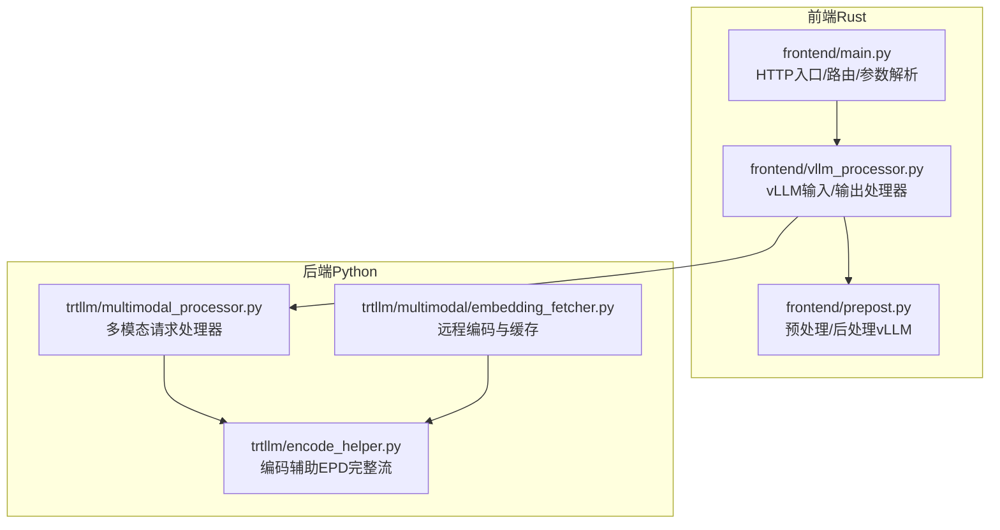
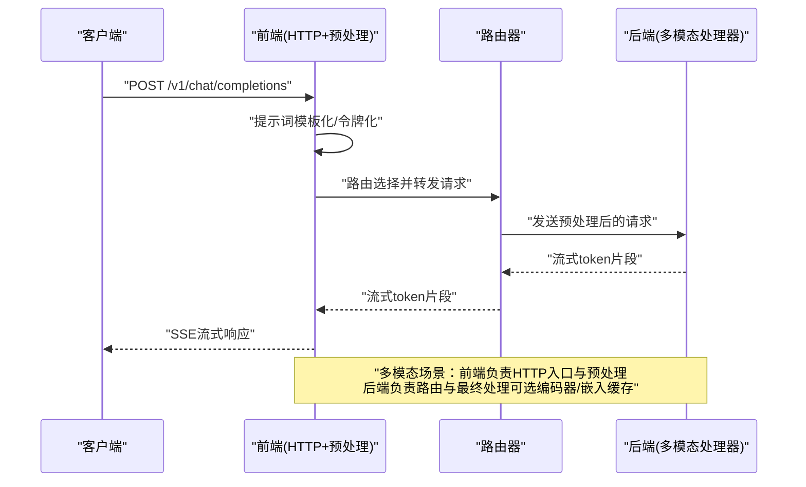
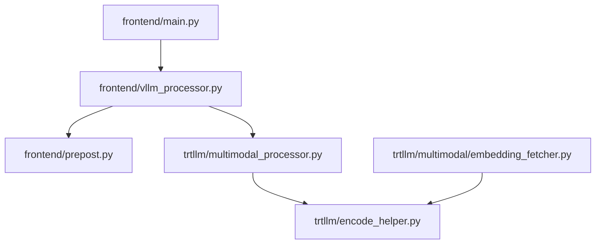

# EPD - 简单聚合模式

<cite>
**本文引用的文件**
- [components/src/dynamo/frontend/main.py](file://components/src/dynamo/frontend/main.py)
- [components/src/dynamo/frontend/prepost.py](file://components/src/dynamo/frontend/prepost.py)
- [components/src/dynamo/frontend/vllm_processor.py](file://components/src/dynamo/frontend/vllm_processor.py)
- [components/src/dynamo/trtllm/encode_helper.py](file://components/src/dynamo/trtllm/encode_helper.py)
- [components/src/dynamo/trtllm/multimodal/embedding_fetcher.py](file://components/src/dynamo/trtllm/multimodal/embedding_fetcher.py)
- [components/src/dynamo/trtllm/multimodal_processor.py](file://components/src/dynamo/trtllm/multimodal_processor.py)
- [examples/backends/vllm/launch/agg_multimodal_epd.sh](file://examples/backends/vllm/launch/agg_multimodal_epd.sh)
- [examples/multimodal/deploy/agg_llava.yaml](file://examples/multimodal/deploy/agg_llava.yaml)
- [examples/multimodal/deploy/agg_qwen.yaml](file://examples/multimodal/deploy/agg_qwen.yaml)
</cite>

## 目录
1. [简介](#简介)
2. [项目结构](#项目结构)
3. [核心组件](#核心组件)
4. [架构总览](#架构总览)
5. [详细组件分析](#详细组件分析)
6. [依赖关系分析](#依赖关系分析)
7. [性能考量](#性能考量)
8. [故障排查指南](#故障排查指南)
9. [结论](#结论)
10. [附录](#附录)

## 简介
EPD（Encode-Prefill-Decode，简单聚合）模式是Dynamo在多模态推理场景下的一种架构设计：将原本需要在多个独立组件中分步执行的“编码-预填充-解码”流程，统一到一个单一工作器（或由前端与后端协作完成）中，以减少跨组件通信、简化部署与运维，并在小规模或开发测试场景下获得更低的延迟与更高的易用性。该模式通过前端负责HTTP入口与提示词模板化、令牌化，以及后端（或前端内部的vLLM处理器）负责路由与流式输出，形成“前端+后端”的轻量协作；同时保留了与TRT-LLM等后端的EPD编码路径兼容能力，以便在需要时接入专用编码器。

## 项目结构
围绕EPD模式的关键代码分布在以下模块：
- 前端（Rust侧）：作为HTTP入口与预处理/路由协调者，负责接收请求、模板化与令牌化、选择后端并返回流式响应。
- 前端Python处理器（vLLM集成）：在前端内部使用vLLM进行输入/输出处理，与后端路由器协作完成请求转发与结果拼装。
- 后端（Python侧）：提供编码器、多模态处理器与预填充/解码工作器，支持EPD完整链路与嵌入缓存等优化。
- 示例与部署：提供一键启动脚本与Kubernetes部署清单，展示EPD模式的快速落地方式。

图表来源
- [components/src/dynamo/frontend/main.py](file://components/src/dynamo/frontend/main.py#L1-L518)
- [components/src/dynamo/frontend/prepost.py](file://components/src/dynamo/frontend/prepost.py#L1-L318)
- [components/src/dynamo/frontend/vllm_processor.py](file://components/src/dynamo/frontend/vllm_processor.py#L1-L465)
- [components/src/dynamo/trtllm/encode_helper.py](file://components/src/dynamo/trtllm/encode_helper.py#L1-L443)
- [components/src/dynamo/trtllm/multimodal/embedding_fetcher.py](file://components/src/dynamo/trtllm/multimodal/embedding_fetcher.py#L1-L258)
- [components/src/dynamo/trtllm/multimodal_processor.py](file://components/src/dynamo/trtllm/multimodal_processor.py#L1-L281)

章节来源
- [components/src/dynamo/frontend/main.py](file://components/src/dynamo/frontend/main.py#L1-L518)
- [components/src/dynamo/frontend/prepost.py](file://components/src/dynamo/frontend/prepost.py#L1-L318)
- [components/src/dynamo/frontend/vllm_processor.py](file://components/src/dynamo/frontend/vllm_processor.py#L1-L465)
- [components/src/dynamo/trtllm/encode_helper.py](file://components/src/dynamo/trtllm/encode_helper.py#L1-L443)
- [components/src/dynamo/trtllm/multimodal/embedding_fetcher.py](file://components/src/dynamo/trtllm/multimodal/embedding_fetcher.py#L1-L258)
- [components/src/dynamo/trtllm/multimodal_processor.py](file://components/src/dynamo/trtllm/multimodal_processor.py#L1-L281)

## 核心组件
- 前端HTTP服务与路由
  - 负责监听HTTP端口、解析路由参数、选择后端实例并转发请求。
  - 支持TLS、键值缓存块大小、多种路由策略（轮询/随机/KV）。
- vLLM集成的前端处理器
  - 在前端内部使用vLLM进行提示词渲染、令牌化、采样参数映射与流式后处理。
  - 将OpenAI格式请求转换为引擎可消费的输入，并将后端输出转换为标准流式响应。
- 多模态请求处理器（后端）
  - 提取文本与图像/嵌入信息，根据是否具备编码器输出决定走EPD或PD路径。
  - 支持从URL加载嵌入、CUDA IPC句柄提取、增量解码与流式响应。
- 编码辅助（后端）
  - 实现EPD完整流程：调用MultimodalEncoder生成编码参数、序列化、返回给预填充阶段。
  - 支持NIXL RDMA读取嵌入、动态张量重建、辅助数据序列化/反序列化。
- 远程编码与缓存（后端）
  - 通过客户端调用远端编码器，按URL粒度缓存嵌入，支持部分缓存命中与批量编码。
  - 可直接返回DisaggregatedParams或提取为CPU张量用于后续处理。

章节来源
- [components/src/dynamo/frontend/main.py](file://components/src/dynamo/frontend/main.py#L1-L518)
- [components/src/dynamo/frontend/prepost.py](file://components/src/dynamo/frontend/prepost.py#L1-L318)
- [components/src/dynamo/frontend/vllm_processor.py](file://components/src/dynamo/frontend/vllm_processor.py#L1-L465)
- [components/src/dynamo/trtllm/multimodal_processor.py](file://components/src/dynamo/trtllm/multimodal_processor.py#L1-L281)
- [components/src/dynamo/trtllm/encode_helper.py](file://components/src/dynamo/trtllm/encode_helper.py#L1-L443)
- [components/src/dynamo/trtllm/multimodal/embedding_fetcher.py](file://components/src/dynamo/trtllm/multimodal/embedding_fetcher.py#L1-L258)

## 架构总览
EPD模式的核心思想是“前端+后端”在一个工作器内完成全部处理，从而避免跨组件的复杂编排与网络开销。对于多模态场景，前端负责HTTP入口、提示词模板化与令牌化，后端负责路由与多模态数据的最终处理（含编码器或嵌入缓存）。该模式适合小规模部署、快速验证与开发测试。

图表来源
- [components/src/dynamo/frontend/main.py](file://components/src/dynamo/frontend/main.py#L368-L518)
- [components/src/dynamo/frontend/vllm_processor.py](file://components/src/dynamo/frontend/vllm_processor.py#L95-L363)
- [components/src/dynamo/trtllm/multimodal_processor.py](file://components/src/dynamo/trtllm/multimodal_processor.py#L168-L235)

## 详细组件分析

### 组件A：前端HTTP入口与路由
- 职责
  - 解析命令行参数与环境变量，初始化分布式运行时与路由配置。
  - 启动HTTP服务或交互模式，暴露OpenAI兼容接口。
  - 支持TLS证书、键值事件平面、请求平面等高级特性。
- 关键点
  - 支持多种路由模式（轮询、随机、KV），并可启用持久化KV事件与副本同步。
  - 可选择使用vLLM作为前端预/后处理器，以获得一致的OpenAI格式体验。
- 适用场景
  - 快速搭建HTTP入口，适配开发测试与小规模生产。

章节来源
- [components/src/dynamo/frontend/main.py](file://components/src/dynamo/frontend/main.py#L82-L365)
- [components/src/dynamo/frontend/main.py](file://components/src/dynamo/frontend/main.py#L368-L518)

### 组件B：前端vLLM处理器（预/后处理）
- 职责
  - 将OpenAI格式请求转换为vLLM内部的输入/输出结构。
  - 使用输入/输出处理器完成令牌化、采样参数映射与流式后处理。
  - 与路由器协作，将请求转发至后端并组装流式响应。
- 关键点
  - 支持工具调用与推理内容解析，保证流式输出的正确性。
  - 对不支持的参数发出警告，确保分布式推理一致性。
- 适用场景
  - 需要一致的OpenAI格式体验与流式输出的前端侧处理。

章节来源
- [components/src/dynamo/frontend/vllm_processor.py](file://components/src/dynamo/frontend/vllm_processor.py#L74-L465)
- [components/src/dynamo/frontend/prepost.py](file://components/src/dynamo/frontend/prepost.py#L18-L318)

### 组件C：后端多模态处理器（EPD/PD路径）
- 职责
  - 从消息中提取文本与媒体信息，判断是否具备编码器输出。
  - 若具备编码器输出，则采用EPD路径（编码器已处理过的提示与token ID）。
  - 若无编码器输出，则根据是否有嵌入或图像URL选择相应路径。
- 关键点
  - 支持从URL加载嵌入、本地路径校验与大小限制、CUDA IPC句柄提取。
  - 提供增量解码与流式响应，便于前端拼装SSE响应。
- 适用场景
  - 多模态推理的最终处理单元，支持EPD/PD两种路径。

章节来源
- [components/src/dynamo/trtllm/multimodal_processor.py](file://components/src/dynamo/trtllm/multimodal_processor.py#L46-L281)

### 组件D：编码辅助（EPD完整流程）
- 职责
  - 实现EPD完整流程：调用MultimodalEncoder生成编码参数，序列化为网络传输格式。
  - 支持NIXL RDMA读取嵌入、动态张量重建、辅助数据序列化/反序列化。
- 关键点
  - 通过异步线程池避免阻塞事件循环，提升高并发下的吞吐。
  - 明确避免在tokenize时添加特殊token，保持EPD各阶段token对齐。
- 适用场景
  - 需要专用编码器参与的多模态推理，或与TRT-LLM后端集成。

章节来源
- [components/src/dynamo/trtllm/encode_helper.py](file://components/src/dynamo/trtllm/encode_helper.py#L16-L443)

### 组件E：远程编码与缓存（EPD路径）
- 职责
  - 通过客户端调用远端编码器，按URL粒度缓存嵌入，支持部分缓存命中与批量编码。
  - 可直接返回DisaggregatedParams或提取为CPU张量用于后续处理。
- 关键点
  - 按URL计算哈希，避免重复编码；对未缓存URL进行批量编码与回填。
  - 支持从CUDA IPC句柄中提取张量，减少不必要的CPU/GPU拷贝。
- 适用场景
  - 多模态推理中的编码器与解码器分离，提升扩展性与资源利用率。

章节来源
- [components/src/dynamo/trtllm/multimodal/embedding_fetcher.py](file://components/src/dynamo/trtllm/multimodal/embedding_fetcher.py#L26-L258)

### 组件F：EPD模式示例与部署
- 脚本与清单
  - 提供一键启动脚本，展示如何在单机或多GPU环境下启动前端与后端组件。
  - 提供Kubernetes部署清单，定义Frontend、EncodeWorker、VLMWorker与Processor的资源配置。
- 关键点
  - 单GPU模式用于CI或资源受限环境，多GPU模式用于真实推理。
  - 支持不同模型（如Qwen/VL、LLaVA）的快速切换与参数调整。
- 适用场景
  - 快速验证EPD模式的可用性与性能表现。

章节来源
- [examples/backends/vllm/launch/agg_multimodal_epd.sh](file://examples/backends/vllm/launch/agg_multimodal_epd.sh#L1-L93)
- [examples/multimodal/deploy/agg_llava.yaml](file://examples/multimodal/deploy/agg_llava.yaml#L1-L64)
- [examples/multimodal/deploy/agg_qwen.yaml](file://examples/multimodal/deploy/agg_qwen.yaml#L1-L65)

## 依赖关系分析
EPD模式的组件间依赖关系如下：
- 前端HTTP服务依赖分布式运行时与路由器配置，负责请求入口与参数传递。
- vLLM处理器依赖前端预处理与后处理模块，完成OpenAI格式的输入/输出转换。
- 多模态处理器依赖编码辅助与远程编码缓存，以支持EPD/PD两条路径。
- 编码辅助与远程编码缓存共同支撑EPD的编码阶段，确保token对齐与高效传输。

图表来源
- [components/src/dynamo/frontend/main.py](file://components/src/dynamo/frontend/main.py#L1-L518)
- [components/src/dynamo/frontend/vllm_processor.py](file://components/src/dynamo/frontend/vllm_processor.py#L1-L465)
- [components/src/dynamo/frontend/prepost.py](file://components/src/dynamo/frontend/prepost.py#L1-L318)
- [components/src/dynamo/trtllm/multimodal_processor.py](file://components/src/dynamo/trtllm/multimodal_processor.py#L1-L281)
- [components/src/dynamo/trtllm/encode_helper.py](file://components/src/dynamo/trtllm/encode_helper.py#L1-L443)
- [components/src/dynamo/trtllm/multimodal/embedding_fetcher.py](file://components/src/dynamo/trtllm/multimodal/embedding_fetcher.py#L1-L258)

## 性能考量
- 优势
  - 简化部署：前端与后端在一个工作器内完成，减少组件间通信与状态同步复杂度。
  - 降低延迟：在小规模或单GPU场景下，避免跨节点传输与调度开销。
  - 易于验证：快速启动与调试，适合开发测试与原型验证。
- 局限性
  - 扩展性受限：单工作器难以横向扩展，无法独立扩展编码器或解码器。
  - 资源耦合：编码与解码共享同一资源，可能在高负载下互相影响。
  - 硬件利用：在多GPU环境中，EPD模式可能无法充分利用编码器与解码器的并行潜力。
- 适用场景
  - 快速设置、小模型、开发测试、边缘设备或资源受限环境。
  - 需要一致OpenAI格式体验且希望简化部署的场景。

## 故障排查指南
- 前端参数与路由问题
  - 检查HTTP端口、TLS证书与路由模式配置，确认环境变量与命令行参数的一致性。
  - 若启用KV路由，检查事件平面与持久化选项是否匹配集群能力。
- vLLM处理器异常
  - 关注日志中对不支持参数的警告，确保分布式推理模式下的行为一致。
  - 检查工具调用与推理内容解析是否正确，避免流式输出错乱。
- 多模态处理异常
  - 确认消息中包含有效的文本与图像/嵌入信息，检查URL访问权限与文件大小限制。
  - 若使用CUDA IPC句柄，请确认句柄有效性与GPU内存状态。
- 编码辅助与远程编码
  - 检查编码器返回的编码参数是否为空，避免在tokenize时添加特殊token导致对齐问题。
  - 若使用NIXL RDMA，请确认连接状态与元数据完整性。

章节来源
- [components/src/dynamo/frontend/main.py](file://components/src/dynamo/frontend/main.py#L368-L518)
- [components/src/dynamo/frontend/vllm_processor.py](file://components/src/dynamo/frontend/vllm_processor.py#L95-L363)
- [components/src/dynamo/trtllm/multimodal_processor.py](file://components/src/dynamo/trtllm/multimodal_processor.py#L168-L235)
- [components/src/dynamo/trtllm/encode_helper.py](file://components/src/dynamo/trtllm/encode_helper.py#L270-L373)
- [components/src/dynamo/trtllm/multimodal/embedding_fetcher.py](file://components/src/dynamo/trtllm/multimodal/embedding_fetcher.py#L70-L112)

## 结论
EPD（简单聚合）模式通过将“编码-预填充-解码”整合到单一工作器中，显著降低了部署复杂度与网络开销，特别适用于小规模、快速验证与开发测试场景。尽管其在扩展性方面存在局限，但在合适的场景下，EPD模式能够提供更简洁、更低延迟的多模态推理体验。结合前端vLLM处理器与后端多模态处理链路，用户可以在保持OpenAI格式一致性的前提下，快速落地多模态应用。

## 附录
- 示例与部署
  - 一键启动脚本展示了如何在单机或多GPU环境下启动前端与后端组件。
  - Kubernetes部署清单定义了Frontend、EncodeWorker、VLMWorker与Processor的资源配置与镜像。
- 相关文档与参考
  - 多模态与EPD模式的背景与实现细节可在相关设计文档与示例脚本中进一步了解。

章节来源
- [examples/backends/vllm/launch/agg_multimodal_epd.sh](file://examples/backends/vllm/launch/agg_multimodal_epd.sh#L1-L93)
- [examples/multimodal/deploy/agg_llava.yaml](file://examples/multimodal/deploy/agg_llava.yaml#L1-L64)
- [examples/multimodal/deploy/agg_qwen.yaml](file://examples/multimodal/deploy/agg_qwen.yaml#L1-L65)