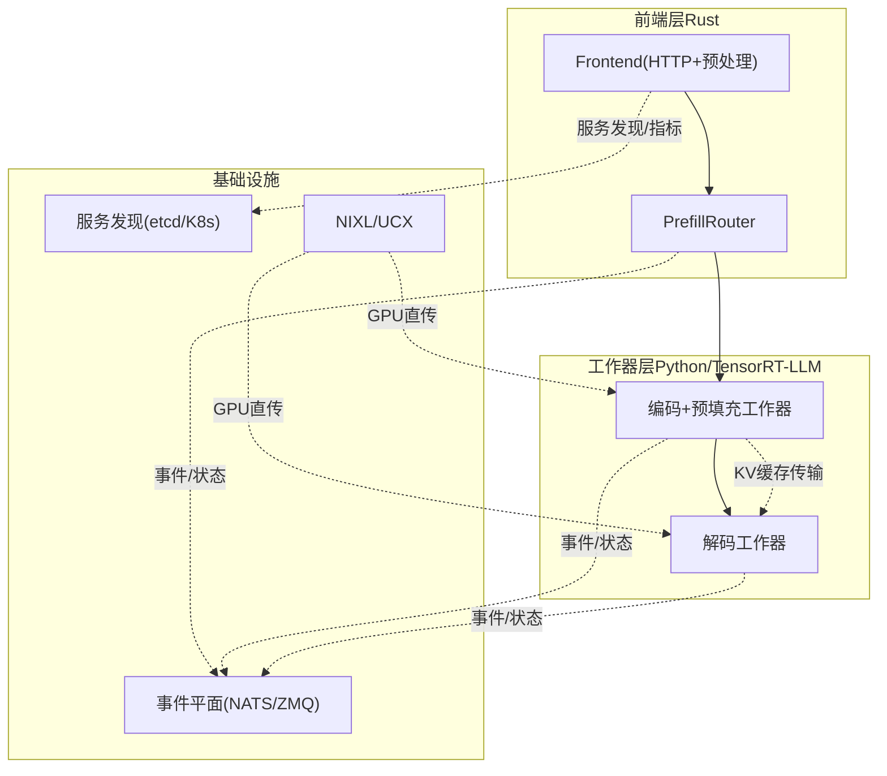
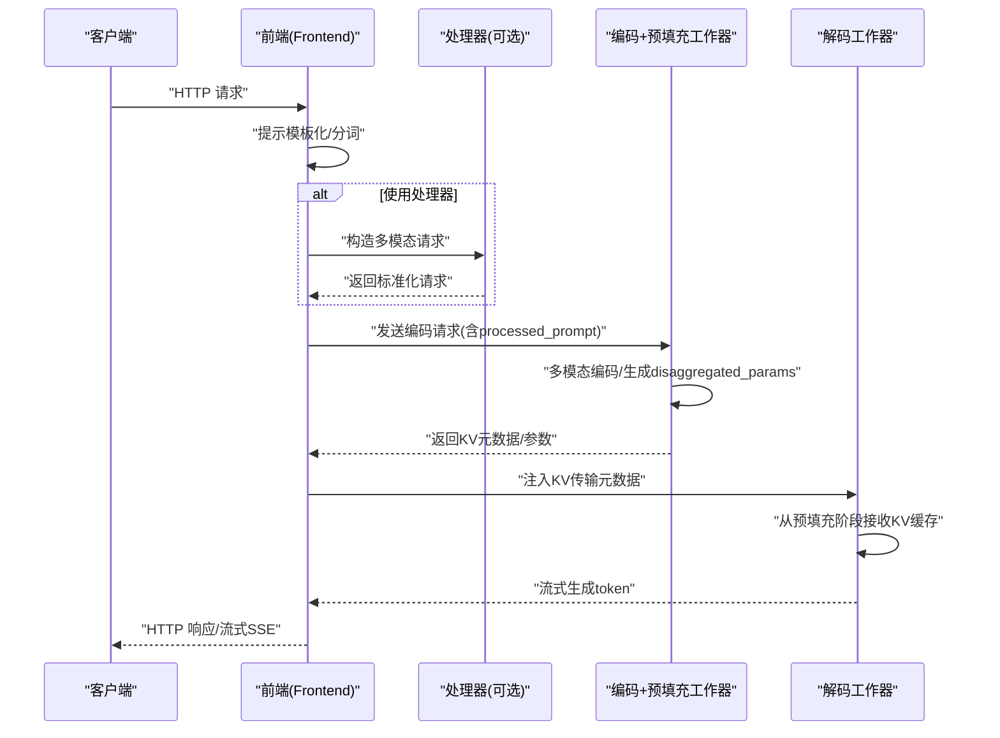
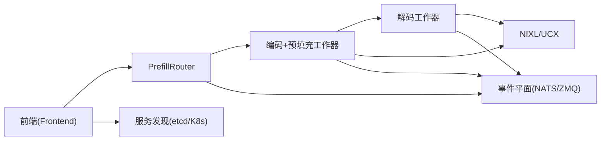

# EP/D - 传统分离模式

<cite>
**本文引用的文件**
- [components/src/dynamo/frontend/main.py](file://components/src/dynamo/frontend/main.py)
- [components/src/dynamo/trtllm/main.py](file://components/src/dynamo/trtllm/main.py)
- [components/src/dynamo/trtllm/encode_helper.py](file://components/src/dynamo/trtllm/encode_helper.py)
- [components/src/dynamo/trtllm/request_handlers/handler_base.py](file://components/src/dynamo/trtllm/request_handlers/handler_base.py)
- [components/src/dynamo/trtllm/utils/disagg_utils.py](file://components/src/dynamo/trtllm/utils/disagg_utils.py)
- [examples/multimodal/components/processor.py](file://examples/multimodal/components/processor.py)
- [examples/multimodal/components/encode_worker.py](file://examples/multimodal/components/encode_worker.py)
- [docs/pages/design-docs/dynamo-flow.md](file://docs/pages/design-docs/dynamo-flow.md)
- [docs/pages/backends/trtllm/kv-cache-transfer.md](file://docs/pages/backends/trtllm/kv-cache-transfer.md)
- [lib/llm/src/kv_router/prefill_router.rs](file://lib/llm/src/kv_router/prefill_router.rs)
- [lib/llm/src/block_manager/v2/physical/transfer/mod.rs](file://lib/llm/src/block_manager/v2/physical/transfer/mod.rs)
- [lib/llm/src/block_manager/v2/physical/transfer/strategy.rs](file://lib/llm/src/block_manager/v2/physical/transfer/strategy.rs)
- [lib/llm/src/block_manager/v2/physical/transfer/preferences.rs](file://lib/llm/src/block_manager/v2/physical/transfer/preferences.rs)
- [lib/llm/src/tokenizers/hf.rs](file://lib/llm/src/tokenizers/hf.rs)
- [lib/llm/src/tokenizers.rs](file://lib/llm/src/tokenizers.rs)
- [lib/llm/src/kv/layer.rs](file://lib/llm/src/kv/layer.rs)
- [docs/pages/design-docs/architecture.md](file://docs/pages/design-docs/architecture.md)
</cite>

## 目录
1. [引言](#引言)
2. [项目结构](#项目结构)
3. [核心组件](#核心组件)
4. [架构总览](#架构总览)
5. [详细组件分析](#详细组件分析)
6. [依赖关系分析](#依赖关系分析)
7. [性能考量](#性能考量)
8. [故障排查指南](#故障排查指南)
9. [结论](#结论)
10. [附录](#附录)

## 引言
本文件面向Dynamo EP/D（传统分离）多模态架构模式，系统化阐述“编码与预填充合并、解码独立”的设计理念与实现细节。EP/D模式通过在前端或专用处理器中完成提示模板化与分词，随后将编码后的多模态嵌入与参数打包传输至预填充工作器进行KV缓存计算；解码阶段由独立的解码工作器执行自回归生成，并通过NIXL在节点间高效搬运KV缓存。文档同时对比完全分离模式（如TRT-LLM中跳过Python处理器、Rust前端直接处理令牌化的实现），并总结EP/D模式的适用场景、数据流与性能特征。

## 项目结构
围绕EP/D模式的关键代码分布在以下模块：
- 前端（Rust）：负责HTTP接入、预处理（提示模板化与分词）、路由与编排
- 处理器（Python）：可选的多模态预处理与请求构造
- 编码+预填充工作器（Python/TensorRT-LLM）：执行多模态编码、生成disaggregated_params并计算KV缓存
- 解码工作器（TensorRT-LLM）：接收经编码的参数与KV缓存，执行自回归解码
- KV缓存传输（NIXL/UCX）：跨节点GPU到GPU的RDMA直传，降低TTFT与ITL

图表来源
- [components/src/dynamo/frontend/main.py](file://components/src/dynamo/frontend/main.py#L368-L518)
- [components/src/dynamo/trtllm/main.py](file://components/src/dynamo/trtllm/main.py#L29-L51)
- [docs/pages/design-docs/dynamo-flow.md](file://docs/pages/design-docs/dynamo-flow.md#L70-L194)

章节来源
- [components/src/dynamo/frontend/main.py](file://components/src/dynamo/frontend/main.py#L1-L518)
- [components/src/dynamo/trtllm/main.py](file://components/src/dynamo/trtllm/main.py#L1-L51)
- [docs/pages/design-docs/dynamo-flow.md](file://docs/pages/design-docs/dynamo-flow.md#L70-L194)

## 核心组件
- 前端（Rust）
  - 提供OpenAI兼容HTTP接口，内置预处理（提示模板化与分词），并根据路由策略选择工作器
  - 支持KV感知路由、迁移限制、TLS、指标前缀等高级特性
- 处理器（Python）
  - 可选的多模态预处理与请求构造，将用户消息转换为引擎可用的格式
- 编码+预填充工作器（Python/TensorRT-LLM）
  - 执行多模态编码（图像/视频/音频），生成disaggregated_params与processed_prompt
  - 计算KV缓存并通过NIXL元数据暴露给下游
- 解码工作器（TensorRT-LLM）
  - 接收编码阶段的参数与KV缓存，进入generation_only模式执行自回归解码
- KV缓存传输（NIXL/UCX）
  - 默认使用NIXL（UCX后端）进行GPU直传，支持本地/远程直连与两跳回退策略

章节来源
- [components/src/dynamo/frontend/main.py](file://components/src/dynamo/frontend/main.py#L82-L366)
- [examples/multimodal/components/processor.py](file://examples/multimodal/components/processor.py#L48-L348)
- [examples/multimodal/components/encode_worker.py](file://examples/multimodal/components/encode_worker.py#L47-L265)
- [components/src/dynamo/trtllm/encode_helper.py](file://components/src/dynamo/trtllm/encode_helper.py#L16-L443)
- [components/src/dynamo/trtllm/request_handlers/handler_base.py](file://components/src/dynamo/trtllm/request_handlers/handler_base.py#L266-L329)
- [docs/pages/backends/trtllm/kv-cache-transfer.md](file://docs/pages/backends/trtllm/kv-cache-transfer.md#L1-L27)

## 架构总览
EP/D模式强调“编码与预填充合并”和“解码独立”。前端或处理器负责提示模板化与分词，编码阶段产出嵌入与disaggregated_params，随后在预填充阶段计算KV缓存并打包传输元数据；解码阶段仅负责自回归生成，避免重复计算KV缓存。

图表来源
- [docs/pages/design-docs/dynamo-flow.md](file://docs/pages/design-docs/dynamo-flow.md#L70-L194)
- [components/src/dynamo/frontend/main.py](file://components/src/dynamo/frontend/main.py#L368-L518)
- [examples/multimodal/components/processor.py](file://examples/multimodal/components/processor.py#L127-L263)
- [examples/multimodal/components/encode_worker.py](file://examples/multimodal/components/encode_worker.py#L73-L155)
- [components/src/dynamo/trtllm/encode_helper.py](file://components/src/dynamo/trtllm/encode_helper.py#L375-L443)

## 详细组件分析

### 前端（Rust）职责与流程
- 负责HTTP接入、TLS、指标前缀、路由模式（轮询/随机/KV）、KV事件开关、迁移限制等
- 预处理阶段完成提示模板化与分词，确保与编码阶段的token对齐一致性
- 通过PrefillRouter进行路由决策，支持强制离散化（enforce_disagg）以保证EP/D路径

章节来源
- [components/src/dynamo/frontend/main.py](file://components/src/dynamo/frontend/main.py#L82-L366)
- [components/src/dynamo/frontend/main.py](file://components/src/dynamo/frontend/main.py#L368-L518)
- [lib/llm/src/kv_router/prefill_router.rs](file://lib/llm/src/kv_router/prefill_router.rs#L94-L111)

### 处理器（Python）与前端协作
- 将用户消息提取为文本提示，构造多模态输入，调用编码工作器
- 返回的响应被转换为OpenAI兼容格式，再由前端聚合或流式返回

章节来源
- [examples/multimodal/components/processor.py](file://examples/multimodal/components/processor.py#L127-L263)

### 编码+预填充工作器（Python/TensorRT-LLM）
- 支持两种路径：
  - 嵌入路径：从URL/路径加载预计算嵌入，通过NIXL创建可读操作，供预填充阶段RDMA读取
  - 全EPD路径：使用TRT-LLM的MultimodalEncoder生成disaggregated_params，包含multimodal_embedding_handles，同时输出processed_prompt与prompt_token_ids
- 对disaggregated_params进行编码以便网络传输，并在必要时保留multimodal_embedding_handles用于预填充阶段

章节来源
- [examples/multimodal/components/encode_worker.py](file://examples/multimodal/components/encode_worker.py#L73-L155)
- [components/src/dynamo/trtllm/encode_helper.py](file://components/src/dynamo/trtllm/encode_helper.py#L211-L373)
- [components/src/dynamo/trtllm/encode_helper.py](file://components/src/dynamo/trtllm/encode_helper.py#L375-L443)
- [components/src/dynamo/trtllm/utils/disagg_utils.py](file://components/src/dynamo/trtllm/utils/disagg_utils.py#L22-L49)

### 解码工作器（TensorRT-LLM）
- 从预填充阶段接收编码参数与KV缓存元数据
- 解码前对disaggregated_params进行解码与清理（移除worker_id、设置generation_only、必要时清空multimodal_embedding_handles）
- 执行自回归解码，流式返回token

章节来源
- [components/src/dynamo/trtllm/request_handlers/handler_base.py](file://components/src/dynamo/trtllm/request_handlers/handler_base.py#L266-L329)

### 嵌入传输机制（NIXL）
- EncodeHelper支持两种嵌入传输路径：
  - 预计算嵌入：通过NIXL Descriptor创建可读操作，预填充阶段RDMA读取
  - 模型内编码：MultimodalEncoder生成disaggregated_params，编码后通过网络传输
- NIXL默认使用UCX后端，支持设备直连与两跳回退策略

章节来源
- [components/src/dynamo/trtllm/encode_helper.py](file://components/src/dynamo/trtllm/encode_helper.py#L130-L190)
- [components/src/dynamo/trtllm/encode_helper.py](file://components/src/dynamo/trtllm/encode_helper.py#L211-L269)
- [docs/pages/backends/trtllm/kv-cache-transfer.md](file://docs/pages/backends/trtllm/kv-cache-transfer.md#L10-L27)
- [lib/llm/src/block_manager/v2/physical/transfer/mod.rs](file://lib/llm/src/block_manager/v2/physical/transfer/mod.rs#L1-L38)
- [lib/llm/src/block_manager/v2/physical/transfer/strategy.rs](file://lib/llm/src/block_manager/v2/physical/transfer/strategy.rs#L215-L262)
- [lib/llm/src/block_manager/v2/physical/transfer/preferences.rs](file://lib/llm/src/block_manager/v2/physical/transfer/preferences.rs#L51-L84)

### KV缓存传输与工作器协调
- 传输策略根据源/目的存储类型自动选择：设备直连（GPU RDMA）、两跳（D2H/Pinned/NIXL）等
- 偏好策略可强制优先原生传输或NIXL，以适配不同硬件能力
- KV层与布局管理器支持多种KV张量布局与排列，保障跨节点高效搬运

章节来源
- [lib/llm/src/block_manager/v2/physical/transfer/strategy.rs](file://lib/llm/src/block_manager/v2/physical/transfer/strategy.rs#L185-L262)
- [lib/llm/src/block_manager/v2/physical/transfer/preferences.rs](file://lib/llm/src/block_manager/v2/physical/transfer/preferences.rs#L51-L84)
- [lib/llm/src/kv/layer.rs](file://lib/llm/src/kv/layer.rs#L1834-L1875)

### 分词器与提示模板一致性
- Rust侧提供统一分词器接口，支持从文件加载与序列解码
- 前端在EP/D模式下避免在解码阶段再次添加特殊token，确保与预填充阶段的token对齐

章节来源
- [lib/llm/src/tokenizers/hf.rs](file://lib/llm/src/tokenizers/hf.rs#L1-L43)
- [lib/llm/src/tokenizers.rs](file://lib/llm/src/tokenizers.rs#L60-L109)
- [components/src/dynamo/trtllm/encode_helper.py](file://components/src/dynamo/trtllm/encode_helper.py#L353-L361)

### 完全分离模式对比（TRT-LLM跳过Python处理器）
- 在某些部署中，Rust前端可直接处理令牌化与提示模板化，绕过Python处理器，从而减少一次跨组件调用
- EP/D模式仍保持“编码+预填充合并”，但前端可直接生成processed_prompt与prompt_token_ids，提升端到端一致性

章节来源
- [docs/pages/design-docs/dynamo-flow.md](file://docs/pages/design-docs/dynamo-flow.md#L70-L194)
- [components/src/dynamo/trtllm/encode_helper.py](file://components/src/dynamo/trtllm/encode_helper.py#L353-L361)

## 依赖关系分析
EP/D模式的关键依赖链如下：
- 前端依赖KV感知路由与服务发现，以选择最优工作器
- 编码工作器依赖NIXL连接器与TRT-LLM引擎，生成disaggregated_params与嵌入
- 解码工作器依赖编码阶段提供的参数与KV缓存元数据
- KV传输依赖NIXL/UCX，结合传输策略与偏好配置

图表来源
- [components/src/dynamo/frontend/main.py](file://components/src/dynamo/frontend/main.py#L420-L488)
- [components/src/dynamo/trtllm/main.py](file://components/src/dynamo/trtllm/main.py#L29-L51)
- [docs/pages/backends/trtllm/kv-cache-transfer.md](file://docs/pages/backends/trtllm/kv-cache-transfer.md#L10-L27)

章节来源
- [components/src/dynamo/frontend/main.py](file://components/src/dynamo/frontend/main.py#L420-L488)
- [components/src/dynamo/trtllm/main.py](file://components/src/dynamo/trtllm/main.py#L29-L51)

## 性能考量
- 离散化（EP/D）显著降低TTFT与ITL，尤其在多节点部署中提升吞吐/GPU
- KV感知路由减少冗余计算，提高命中率
- NIXL/UCX直传降低同步开销，加速KV缓存搬运
- Rust前端与Python工作器的混合架构在性能与可扩展性之间取得平衡

章节来源
- [docs/pages/design-docs/architecture.md](file://docs/pages/design-docs/architecture.md#L58-L101)
- [docs/pages/backends/trtllm/kv-cache-transfer.md](file://docs/pages/backends/trtllm/kv-cache-transfer.md#L10-L27)

## 故障排查指南
- KV传输阶段取消：测试覆盖了在KV传输阶段取消完成请求的场景，建议检查预填充/解码日志中的请求ID匹配与传输元数据注入
- 参数解码异常：确认解码阶段已正确移除worker_id并设置generation_only，必要时清空multimodal_embedding_handles
- 嵌入读取失败：检查NIXL可读操作元数据、描述符形状与dtype是否一致，以及辅助张量序列化/反序列化

章节来源
- [tests/fault_tolerance/cancellation/test_trtllm.py](file://tests/fault_tolerance/cancellation/test_trtllm.py#L456-L487)
- [components/src/dynamo/trtllm/request_handlers/handler_base.py](file://components/src/dynamo/trtllm/request_handlers/handler_base.py#L266-L329)
- [components/src/dynamo/trtllm/encode_helper.py](file://components/src/dynamo/trtllm/encode_helper.py#L130-L190)

## 结论
EP/D（传统分离）模式通过“编码与预填充合并、解码独立”的设计，在不牺牲灵活性的前提下最大化GPU利用率与吞吐。前端或处理器负责提示模板化与分词，编码阶段生成disaggregated_params与嵌入，预填充阶段计算KV缓存并通过NIXL高效传输，解码阶段专注自回归生成。该模式适用于无预计算嵌入支持的模型（如Llama系列）与需要灵活部署的场景，亦可在TRT-LLM中采用Rust前端直接处理令牌化以进一步优化端到端一致性。

## 附录
- EP/D模式适用场景
  - 模型不支持预计算嵌入（如Llama 4）
  - 需要灵活的前端/处理器组合（Rust前端+Python处理器）
  - TRT-LLM分离部署（可选跳过Python处理器，Rust前端直接处理令牌化）
- 与完全分离模式的差异
  - 完全分离更偏向纯Rust前端与纯Python工作器的边界清晰划分
  - EP/D在前端/处理器侧完成提示模板化与分词，确保与编码阶段的token对齐，减少跨阶段不一致风险

章节来源
- [docs/pages/design-docs/dynamo-flow.md](file://docs/pages/design-docs/dynamo-flow.md#L70-L194)
- [components/src/dynamo/trtllm/encode_helper.py](file://components/src/dynamo/trtllm/encode_helper.py#L353-L361)