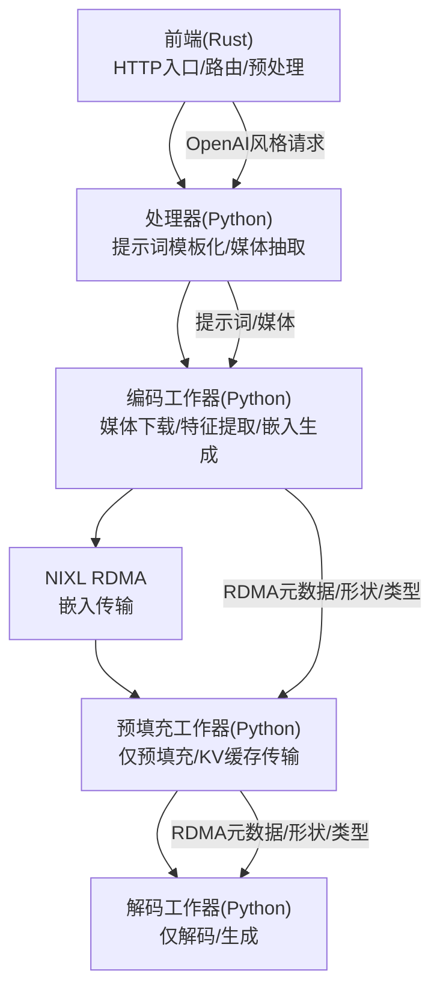
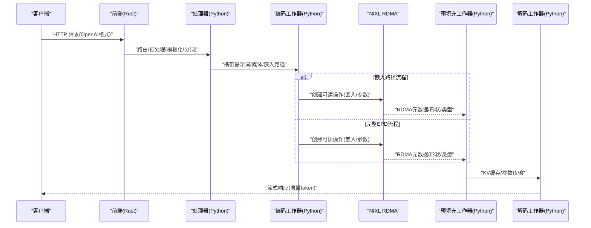
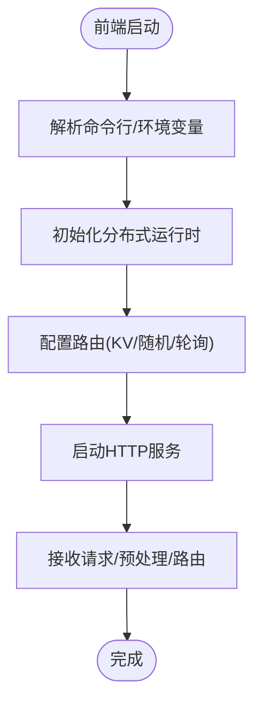
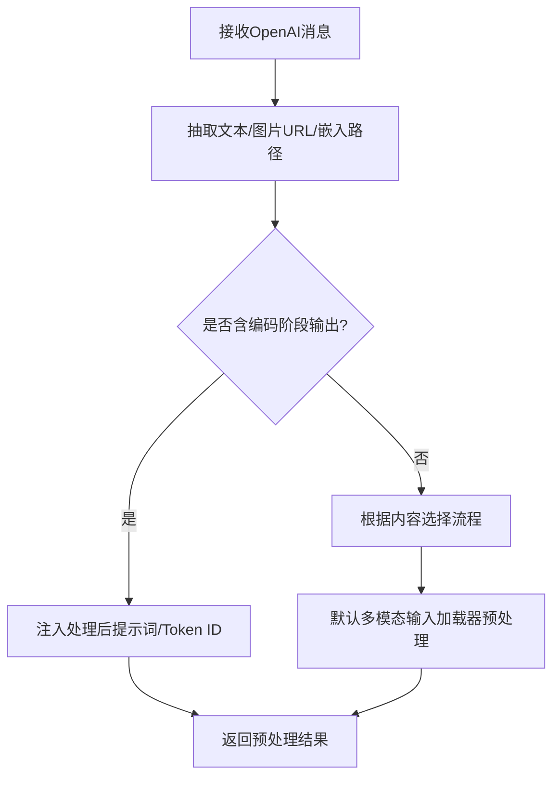
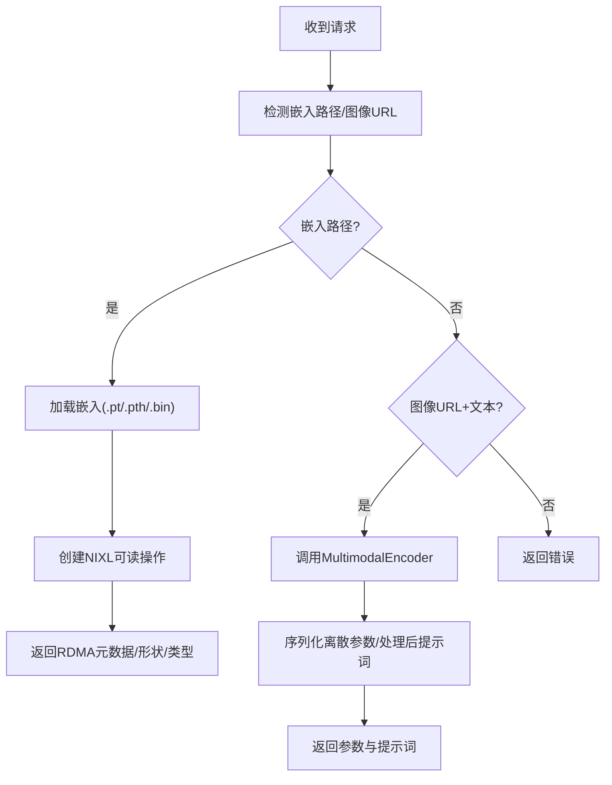
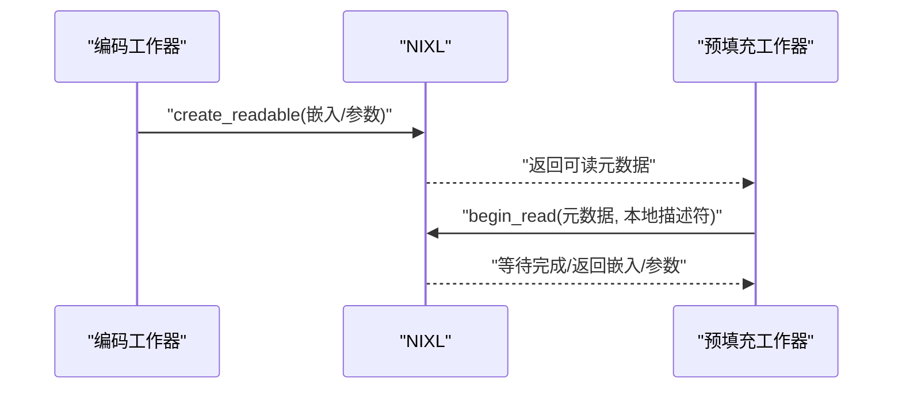
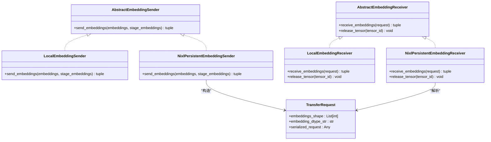
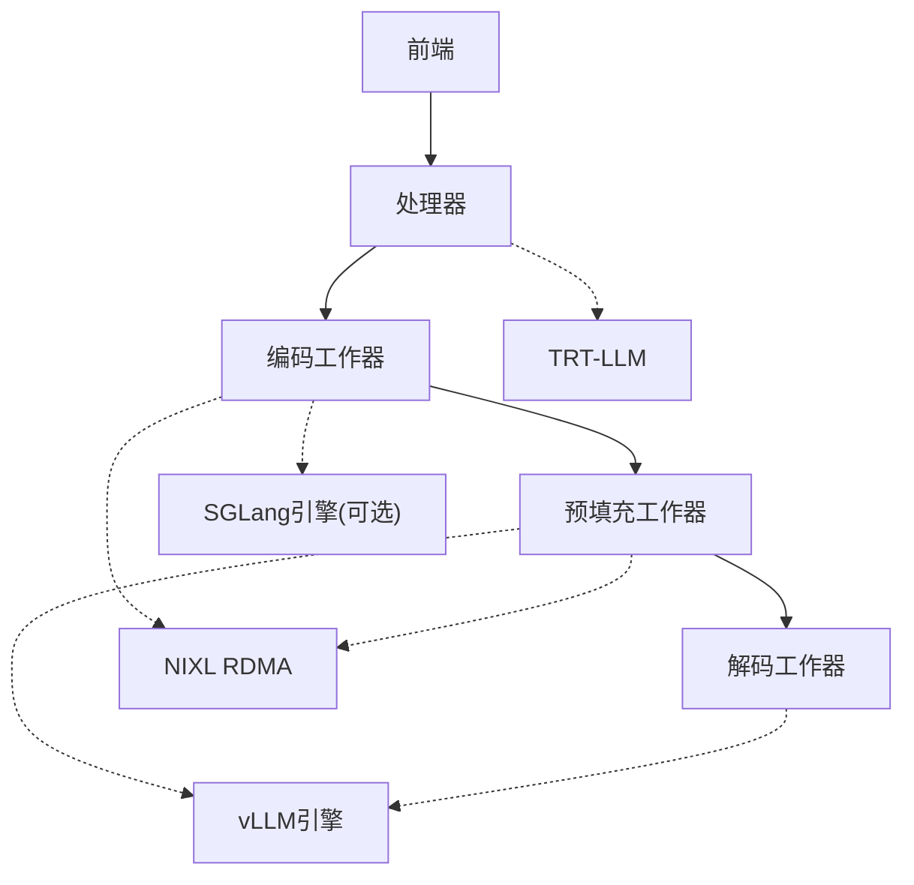

# E/PD - 编码分离模式

<cite>
**本文引用的文件**
- [components/src/dynamo/frontend/main.py](file://components/src/dynamo/frontend/main.py)
- [components/src/dynamo/vllm/main.py](file://components/src/dynamo/vllm/main.py)
- [components/src/dynamo/sglang/main.py](file://components/src/dynamo/sglang/main.py)
- [components/src/dynamo/trtllm/encode_helper.py](file://components/src/dynamo/trtllm/encode_helper.py)
- [components/src/dynamo/trtllm/multimodal_processor.py](file://components/src/dynamo/trtllm/multimodal_processor.py)
- [components/src/dynamo/common/multimodal/embedding_transfer.py](file://components/src/dynamo/common/multimodal/embedding_transfer.py)
- [components/src/dynamo/common/utils/media_nixl.py](file://components/src/dynamo/common/utils/media_nixl.py)
- [examples/backends/vllm/launch/disagg_multimodal_epd.sh](file://examples/backends/vllm/launch/disagg_multimodal_epd.sh)
- [examples/backends/sglang/launch/multimodal_epd.sh](file://examples/backends/sglang/launch/multimodal_epd.sh)
- [docs/pages/features/multimodal/README.md](file://docs/pages/features/multimodal/README.md)
</cite>

## 目录
1. [简介](#简介)
2. [项目结构](#项目结构)
3. [核心组件](#核心组件)
4. [架构总览](#架构总览)
5. [详细组件分析](#详细组件分析)
6. [依赖关系分析](#依赖关系分析)
7. [性能考量](#性能考量)
8. [故障排查指南](#故障排查指南)
9. [结论](#结论)
10. [附录](#附录)

## 简介
本文件系统性阐述 Dynamo 的 E/PD（编码-预填充/解码）多模态“编码分离”模式：将“编码”阶段从“预填充/解码”阶段中独立出来，形成三个可独立扩展的子系统。该模式的核心理念是：
- 前端（Rust）负责 HTTP 入口、路由与预处理；
- 处理器（Python）负责提示词模板化与媒体信息抽取；
- 编码工作器（Python）负责媒体下载、特征提取与嵌入生成，并通过 NIXL RDMA 将嵌入高效传输给下游；
- 预填充/解码工作器（Python）接收嵌入并通过 RDMA 进行 KV 缓存传输，实现解码阶段的纯生成。

该模式的优势在于将视觉编码卸载到专用 GPU，实现独立扩展；同时通过 RDMA 实现跨节点零拷贝传输，显著降低延迟并提升吞吐。

## 项目结构
围绕 E/PD 模式的关键目录与文件如下：
- 前端（Rust）入口与配置：components/src/dynamo/frontend/main.py
- 后端（vLLM）多模态 E/PD 启动与路由：components/src/dynamo/vllm/main.py
- 后端（SGLang）多模态 E/PD 启动与路由：components/src/dynamo/sglang/main.py
- TRT-LLM 编码辅助工具与流程：components/src/dynamo/trtllm/encode_helper.py
- TRT-LLM 多模态处理器：components/src/dynamo/trtllm/multimodal_processor.py
- 嵌入传输抽象与 NIXL 实现：components/src/dynamo/common/multimodal/embedding_transfer.py
- 媒体加载与 NIXL RDMA 示例：components/src/dynamo/common/utils/media_nixl.py
- 示例启动脚本（vLLM/SGLang）：examples/backends/vllm/launch/disagg_multimodal_epd.sh、examples/backends/sglang/launch/multimodal_epd.sh
- 文档说明：docs/pages/features/multimodal/README.md

图表来源
- [components/src/dynamo/frontend/main.py](file://components/src/dynamo/frontend/main.py#L368-L518)
- [components/src/dynamo/vllm/main.py](file://components/src/dynamo/vllm/main.py#L1103-L1142)
- [components/src/dynamo/sglang/main.py](file://components/src/dynamo/sglang/main.py#L655-L672)
- [components/src/dynamo/trtllm/encode_helper.py](file://components/src/dynamo/trtllm/encode_helper.py#L374-L443)
- [components/src/dynamo/common/multimodal/embedding_transfer.py](file://components/src/dynamo/common/multimodal/embedding_transfer.py#L242-L464)

章节来源
- [components/src/dynamo/frontend/main.py](file://components/src/dynamo/frontend/main.py#L368-L518)
- [components/src/dynamo/vllm/main.py](file://components/src/dynamo/vllm/main.py#L1103-L1142)
- [components/src/dynamo/sglang/main.py](file://components/src/dynamo/sglang/main.py#L655-L672)
- [components/src/dynamo/trtllm/encode_helper.py](file://components/src/dynamo/trtllm/encode_helper.py#L374-L443)
- [components/src/dynamo/common/multimodal/embedding_transfer.py](file://components/src/dynamo/common/multimodal/embedding_transfer.py#L242-L464)

## 核心组件
- 前端（Rust）
  - 提供 HTTP 入口、自动发现注册、预处理（提示词模板化与分词）、路由（轮询/随机/KV 路由）。
  - 支持迁移限制、事件平面（NATS/ZMQ）、请求平面（NATS/TCP/HTTP）等运行时参数。
- 处理器（Python）
  - 从 OpenAI 风格消息中抽取文本提示与媒体 URL/嵌入路径；
  - 通过 TRT-LLM 默认多模态输入加载器进行同步预处理（异步线程池包装以提升并发）；
  - 在 E/PD 流程中，将编码后的提示词与 token ID 注入请求，交由下游预填充/解码阶段使用。
- 编码工作器（Python）
  - 支持两种编码流程：
    - 嵌入路径流程：直接加载 .pt/.pth/.bin 嵌入并通过 NIXL 创建可读操作，返回 RDMA 元数据、形状与 dtype；
    - 完整 EPD 流程：调用 TRT-LLM MultimodalEncoder 生成离散参数与处理后提示词，经编码器序列化后返回。
  - 通过 NIXL RDMA 将嵌入或参数零拷贝传输至下游。
- 预填充/解码工作器（Python）
  - 通过 NIXL 接收编码阶段提供的 RDMA 元数据，读取嵌入或参数；
  - 仅执行预填充（KV 缓存构建）或解码（token 生成），实现纯计算阶段。
- 嵌入传输抽象（NIXL）
  - 提供发送/接收抽象类与本地文件回退实现；
  - 提供持久连接版发送/接收器，复用描述符与连接，减少 RDMA 初始化开销；
  - 提供预热描述符队列，按需滑窗视图复用，避免频繁分配。

章节来源
- [components/src/dynamo/frontend/main.py](file://components/src/dynamo/frontend/main.py#L368-L518)
- [components/src/dynamo/trtllm/multimodal_processor.py](file://components/src/dynamo/trtllm/multimodal_processor.py#L168-L235)
- [components/src/dynamo/trtllm/encode_helper.py](file://components/src/dynamo/trtllm/encode_helper.py#L211-L443)
- [components/src/dynamo/common/multimodal/embedding_transfer.py](file://components/src/dynamo/common/multimodal/embedding_transfer.py#L108-L464)

## 架构总览
E/PD 模式下，请求在不同阶段被拆分为独立工作器，通过 NIXL RDMA 实现零拷贝传输，从而最大化资源利用与扩展性。

图表来源
- [components/src/dynamo/frontend/main.py](file://components/src/dynamo/frontend/main.py#L368-L518)
- [components/src/dynamo/vllm/main.py](file://components/src/dynamo/vllm/main.py#L1103-L1142)
- [components/src/dynamo/sglang/main.py](file://components/src/dynamo/sglang/main.py#L655-L672)
- [components/src/dynamo/trtllm/encode_helper.py](file://components/src/dynamo/trtllm/encode_helper.py#L374-L443)
- [components/src/dynamo/common/multimodal/embedding_transfer.py](file://components/src/dynamo/common/multimodal/embedding_transfer.py#L242-L464)

## 详细组件分析

### 前端（Rust）职责与控制流
- 负责 HTTP 服务、路由策略（轮询/随机/KV）、事件平面与请求平面选择；
- 与分布式运行时协作，支持迁移限制、TLS、指标前缀等；
- 作为统一入口，将请求交给处理器或直接进入引擎。

图表来源
- [components/src/dynamo/frontend/main.py](file://components/src/dynamo/frontend/main.py#L368-L518)

章节来源
- [components/src/dynamo/frontend/main.py](file://components/src/dynamo/frontend/main.py#L368-L518)

### 处理器（Python）职责与数据流
- 从 OpenAI 风格消息中提取文本提示、图像 URL 或嵌入路径；
- 使用 TRT-LLM 默认多模态输入加载器进行预处理，支持同步下载与 CPU 预处理；
- 在 E/PD 流程中，若已存在编码阶段输出，则注入处理后的提示词与 token ID，避免重复分词。

图表来源
- [components/src/dynamo/trtllm/multimodal_processor.py](file://components/src/dynamo/trtllm/multimodal_processor.py#L168-L235)

章节来源
- [components/src/dynamo/trtllm/multimodal_processor.py](file://components/src/dynamo/trtllm/multimodal_processor.py#L168-L235)

### 编码工作器（Python）职责与双流程
- 嵌入路径流程：加载 .pt/.pth/.bin 嵌入，创建 NIXL 可读操作，返回 RDMA 元数据、形状与 dtype；
- 完整 EPD 流程：调用 TRT-LLM MultimodalEncoder 生成离散参数与处理后提示词，序列化后返回；
- 两种流程均通过 NIXL RDMA 零拷贝传输，降低内存复制与网络开销。

图表来源
- [components/src/dynamo/trtllm/encode_helper.py](file://components/src/dynamo/trtllm/encode_helper.py#L415-L443)
- [components/src/dynamo/trtllm/encode_helper.py](file://components/src/dynamo/trtllm/encode_helper.py#L211-L373)

章节来源
- [components/src/dynamo/trtllm/encode_helper.py](file://components/src/dynamo/trtllm/encode_helper.py#L211-L443)

### 预填充/解码工作器（Python）职责与 RDMA 接收
- 通过 NIXL 接收编码阶段提供的 RDMA 元数据，读取嵌入或参数；
- 仅执行预填充（构建 KV 缓存）或解码（token 生成），实现纯计算阶段；
- 支持持久连接与描述符复用，降低 RDMA 初始化开销。

图表来源
- [components/src/dynamo/common/multimodal/embedding_transfer.py](file://components/src/dynamo/common/multimodal/embedding_transfer.py#L242-L464)
- [components/src/dynamo/trtllm/encode_helper.py](file://components/src/dynamo/trtllm/encode_helper.py#L130-L190)

章节来源
- [components/src/dynamo/common/multimodal/embedding_transfer.py](file://components/src/dynamo/common/multimodal/embedding_transfer.py#L242-L464)
- [components/src/dynamo/trtllm/encode_helper.py](file://components/src/dynamo/trtllm/encode_helper.py#L130-L190)

### 嵌入传输机制（NIXL RDMA）实现与优化
- 抽象层：定义发送/接收接口，支持本地文件回退与 NIXL 实现；
- 持久连接：复用 Connector 与 Agent 注册，避免反复建立/销毁连接；
- 描述符复用：预热固定大小的描述符队列，按需滑窗视图复用，减少分配与释放；
- 类型与形状：通过 TransferRequest 明确嵌入形状、dtype 与序列化元数据，确保接收端正确重建张量。

图表来源
- [components/src/dynamo/common/multimodal/embedding_transfer.py](file://components/src/dynamo/common/multimodal/embedding_transfer.py#L45-L106)
- [components/src/dynamo/common/multimodal/embedding_transfer.py](file://components/src/dynamo/common/multimodal/embedding_transfer.py#L108-L293)
- [components/src/dynamo/common/multimodal/embedding_transfer.py](file://components/src/dynamo/common/multimodal/embedding_transfer.py#L295-L464)

章节来源
- [components/src/dynamo/common/multimodal/embedding_transfer.py](file://components/src/dynamo/common/multimodal/embedding_transfer.py#L45-L106)
- [components/src/dynamo/common/multimodal/embedding_transfer.py](file://components/src/dynamo/common/multimodal/embedding_transfer.py#L108-L293)
- [components/src/dynamo/common/multimodal/embedding_transfer.py](file://components/src/dynamo/common/multimodal/embedding_transfer.py#L295-L464)

### 媒体加载与 NIXL RDMA 示例
- 媒体加载示例展示了如何通过 NIXL RDMA 直接将远程设备内存映射到本地，实现零拷贝读取；
- 记录分配与读取耗时，便于性能分析与优化。

章节来源
- [components/src/dynamo/common/utils/media_nixl.py](file://components/src/dynamo/common/utils/media_nixl.py#L42-L79)

### 后端启动与路由（vLLM/SGLang）
- vLLM：启动前端、处理器、编码/预填充/解码工作器，分别占用不同 GPU，通过 NIXL 侧通道端口通信；
- SGLang：启动前端、处理器、编码工作器与推理工作器，推理工作器启用 NIXL 传输后端。

章节来源
- [examples/backends/vllm/launch/disagg_multimodal_epd.sh](file://examples/backends/vllm/launch/disagg_multimodal_epd.sh#L50-L82)
- [examples/backends/sglang/launch/multimodal_epd.sh](file://examples/backends/sglang/launch/multimodal_epd.sh#L62-L89)
- [components/src/dynamo/vllm/main.py](file://components/src/dynamo/vllm/main.py#L1103-L1142)
- [components/src/dynamo/sglang/main.py](file://components/src/dynamo/sglang/main.py#L655-L672)

## 依赖关系分析
- 组件耦合
  - 前端与处理器：通过 HTTP 与分布式运行时耦合，处理器对编码阶段透明；
  - 处理器与编码工作器：通过消息字段传递处理后提示词与 token ID；
  - 编码工作器与预填充/解码工作器：通过 NIXL RDMA 元数据耦合，无共享状态；
- 外部依赖
  - NIXL：提供 RDMA 元数据、描述符与连接管理；
  - TRT-LLM：提供多模态输入加载器与编码器；
  - vLLM/SGLang：提供推理引擎与工作器形态。

图表来源
- [components/src/dynamo/frontend/main.py](file://components/src/dynamo/frontend/main.py#L368-L518)
- [components/src/dynamo/vllm/main.py](file://components/src/dynamo/vllm/main.py#L1103-L1142)
- [components/src/dynamo/sglang/main.py](file://components/src/dynamo/sglang/main.py#L655-L672)
- [components/src/dynamo/trtllm/encode_helper.py](file://components/src/dynamo/trtllm/encode_helper.py#L374-L443)

章节来源
- [components/src/dynamo/frontend/main.py](file://components/src/dynamo/frontend/main.py#L368-L518)
- [components/src/dynamo/vllm/main.py](file://components/src/dynamo/vllm/main.py#L1103-L1142)
- [components/src/dynamo/sglang/main.py](file://components/src/dynamo/sglang/main.py#L655-L672)
- [components/src/dynamo/trtllm/encode_helper.py](file://components/src/dynamo/trtllm/encode_helper.py#L374-L443)

## 性能考量
- RDMA 零拷贝
  - 通过 NIXL RDMA 将嵌入从编码工作器直接传输到预填充/解码工作器，避免主机内存往返与 CPU 复制；
  - 持久连接与描述符复用减少握手与注册开销。
- 并发与异步
  - 处理器与编码器对同步 I/O（如图像下载）采用异步线程池包装，提升高并发下的吞吐；
  - 嵌入接收端支持预热描述符队列，按需复用，降低分配成本。
- 独立扩展
  - 编码阶段可独立扩展到专用 GPU，缓解主推理节点的显存压力；
  - 预填充/解码阶段可按需扩展，实现更精细的资源利用率。

[本节为通用性能讨论，不直接分析具体文件]

## 故障排查指南
- 嵌入路径流程错误
  - 现象：返回“未找到嵌入路径或图像 URL”；
  - 排查：确认请求中包含 .pt/.pth/.bin 嵌入路径或有效图像 URL。
- 编码器未配置
  - 现象：返回“未在编码工作器上配置引擎”；
  - 排查：完整 EPD 流程需要模型目录、模型类型与引擎实例。
- NIXL 连接问题
  - 现象：RDMA 元数据校验失败或读取超时；
  - 排查：检查编码阶段是否成功创建可读操作，接收端是否正确解析元数据与形状。
- GPU RDMA 禁用
  - 现象：传输策略要求 GPU RDMA 但被禁用；
  - 排查：确认运行环境允许 GPU RDMA，或调整传输策略。

章节来源
- [components/src/dynamo/trtllm/encode_helper.py](file://components/src/dynamo/trtllm/encode_helper.py#L415-L443)
- [components/src/dynamo/common/multimodal/embedding_transfer.py](file://components/src/dynamo/common/multimodal/embedding_transfer.py#L242-L464)

## 结论
E/PD 编码分离模式通过将“编码”从“预填充/解码”中剥离，实现了多模态推理的极致解耦与扩展性。借助 NIXL RDMA 的零拷贝传输，系统在跨节点场景下具备更低的延迟与更高的吞吐。结合独立 GPU 扩展与按阶段弹性伸缩，该模式适用于大规模多模态部署与高并发场景。

[本节为总结性内容，不直接分析具体文件]

## 附录
- 适用场景
  - 视觉编码卸载到独立 GPU，缓解主推理节点显存压力；
  - 独立扩展编码器，满足高并发图像/视频处理需求；
  - 多节点部署，通过 RDMA 实现跨节点零拷贝传输。
- 参考文档
  - 多模态特性文档中对 E/PD 模式的说明与流程图。

章节来源
- [docs/pages/features/multimodal/README.md](file://docs/pages/features/multimodal/README.md#L103-L156)