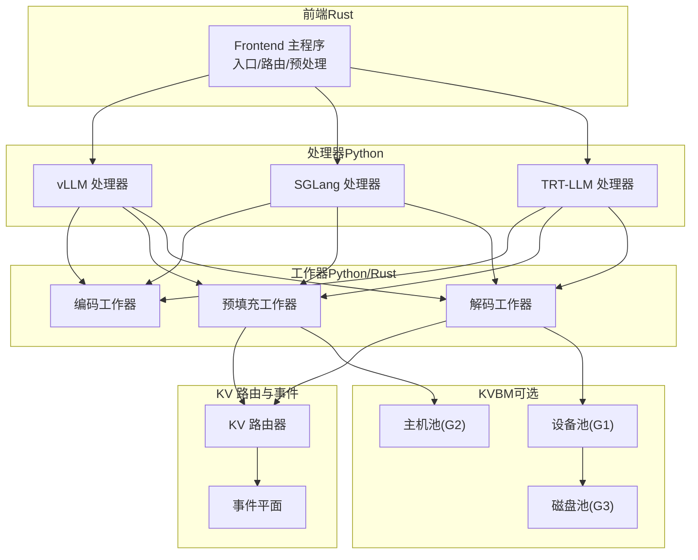
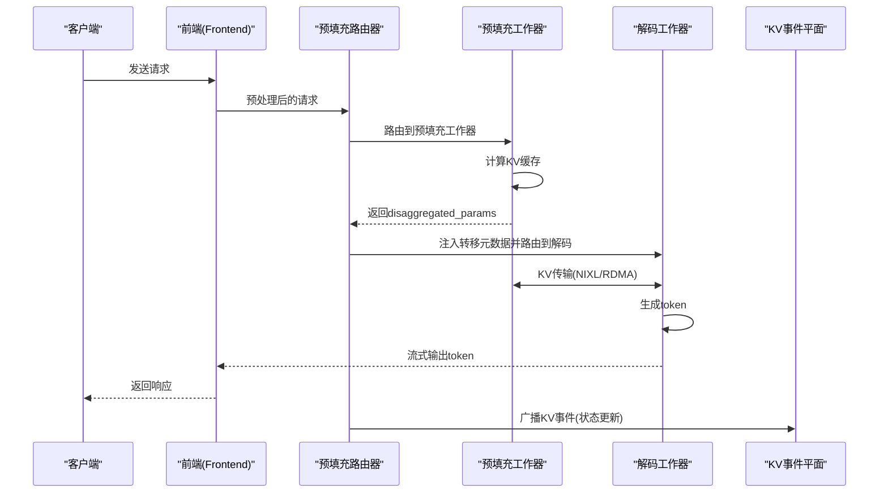
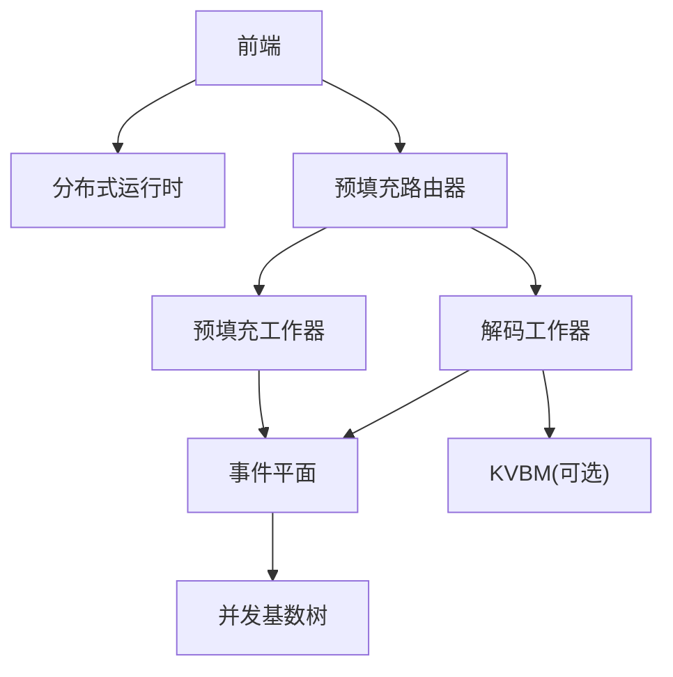
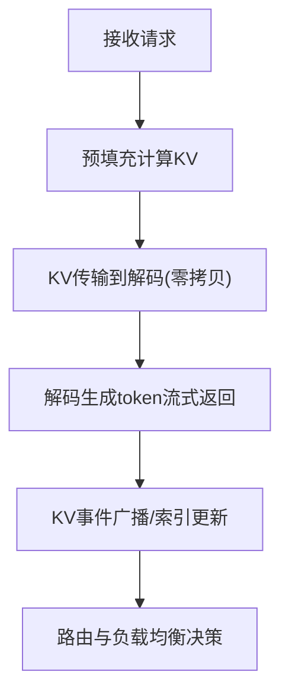

# E/P/D - 完全分离模式

<cite>
**本文引用的文件**
- [components/src/dynamo/frontend/main.py](file://components/src/dynamo/frontend/main.py)
- [components/src/dynamo/vllm/main.py](file://components/src/dynamo/vllm/main.py)
- [components/src/dynamo/vllm/handlers.py](file://components/src/dynamo/vllm/handlers.py)
- [components/src/dynamo/sglang/main.py](file://components/src/dynamo/sglang/main.py)
- [components/src/dynamo/trtllm/main.py](file://components/src/dynamo/trtllm/main.py)
- [components/src/dynamo/vllm/multimodal_handlers/__init__.py](file://components/src/dynamo/vllm/multimodal_handlers/__init__.py)
- [components/src/dynamo/vllm/multimodal_handlers/encode_worker_handler.py](file://components/src/dynamo/vllm/multimodal_handlers/encode_worker_handler.py)
- [components/src/dynamo/vllm/multimodal_handlers/preprocessed_handler.py](file://components/src/dynamo/vllm/multimodal_handlers/preprocessed_handler.py)
- [components/src/dynamo/vllm/multimodal_handlers/worker_handler.py](file://components/src/dynamo/vllm/multimodal_handlers/worker_handler.py)
- [examples/multimodal/components/worker.py](file://examples/multimodal/components/worker.py)
- [docs/pages/design-docs/disagg-serving.md](file://docs/pages/design-docs/disagg-serving.md)
- [docs/pages/backends/sglang/sglang-disaggregation.md](file://docs/pages/backends/sglang/sglang-disaggregation.md)
- [docs/pages/performance/tuning.md](file://docs/pages/performance/tuning.md)
- [lib/llm/src/kv_router/prefill_router.rs](file://lib/llm/src/kv_router/prefill_router.rs)
- [lib/llm/src/kv_router/worker_query.rs](file://lib/llm/src/kv_router/worker_query.rs)
- [lib/llm/src/kv_router/publisher.rs](file://lib/llm/src/kv_router/publisher.rs)
- [lib/kv-router/src/concurrent_radix_tree.rs](file://lib/kv-router/src/concurrent_radix_tree.rs)
- [lib/bindings/kvbm/src/block_manager/cache_stats.rs](file://lib/bindings/kvbm/src/block_manager/cache_stats.rs)
- [lib/llm/src/block_manager/distributed/leader.rs](file://lib/llm/src/block_manager/distributed/leader.rs)
- [lib/llm/src/block_manager/distributed.rs](file://lib/llm/src/block_manager/distributed.rs)
- [docs/pages/design-docs/kvbm-design.md](file://docs/pages/design-docs/kvbm-design.md)
- [lib/mocker/src/bootstrap.rs](file://lib/mocker/src/bootstrap.rs)
- [lib/mocker/src/kv_manager.rs](file://lib/mocker/src/kv_manager.rs)
- [lib/mocker/src/perf_model.rs](file://lib/mocker/src/perf_model.rs)
</cite>

## 目录
1. [简介](#简介)
2. [项目结构](#项目结构)
3. [核心组件](#核心组件)
4. [架构总览](#架构总览)
5. [详细组件分析](#详细组件分析)
6. [依赖关系分析](#依赖关系分析)
7. [性能考量](#性能考量)
8. [故障排查指南](#故障排查指南)
9. [结论](#结论)
10. [附录](#附录)

## 简介
本文件系统性阐述 Dynamo 的 E/P/D（编码/预填充/解码）完全分离多模态架构模式。该模式将请求处理拆分为三个独立工作器：编码（Encode）、预填充（Prefill）与解码（Decode），通过统一的前端与路由层进行编排，结合 KV 缓存的高效传输与状态管理，实现跨阶段的解耦与可扩展性。文档同时对比 vLLM 预填充优先与 SGLang 解码优先两类变体的工作流差异，并给出适用场景、性能优化策略与运维建议。

## 项目结构
围绕 E/P/D 模式，代码主要分布在以下层次：
- 前端（Rust）：负责 HTTP/GRPC 入口、预处理、路由选择与发现注册
- 处理器（Python）：封装 vLLM/SGLang/TRT-LLM 后端，暴露统一的生成接口
- 工作器（Python/Rust）：编码、预填充、解码三类工作器，分别承担不同阶段计算与数据准备
- KV 路由与事件平面：负责 KV 块状态传播、树索引与跨节点一致性
- KVBM（可选）：设备/主机/磁盘三级缓存池与块管理，支撑跨节点 RDMA/NIXL 传输

图表来源
- [components/src/dynamo/frontend/main.py](file://components/src/dynamo/frontend/main.py#L368-L518)
- [components/src/dynamo/vllm/main.py](file://components/src/dynamo/vllm/main.py#L1-L200)
- [components/src/dynamo/sglang/main.py](file://components/src/dynamo/sglang/main.py#L191-L234)
- [components/src/dynamo/trtllm/main.py](file://components/src/dynamo/trtllm/main.py#L29-L51)

章节来源
- [components/src/dynamo/frontend/main.py](file://components/src/dynamo/frontend/main.py#L368-L518)
- [components/src/dynamo/vllm/main.py](file://components/src/dynamo/vllm/main.py#L1-L200)
- [components/src/dynamo/sglang/main.py](file://components/src/dynamo/sglang/main.py#L191-L234)
- [components/src/dynamo/trtllm/main.py](file://components/src/dynamo/trtllm/main.py#L29-L51)

## 核心组件
- 前端（Rust）
  - 提供 HTTP/GRPC 接口与交互模式
  - 集成自动发现、预处理与路由（轮询/随机/KV 路由）
  - 支持 vLLM 前后处理集成
- vLLM 处理器（Python）
  - 统一注册与服务化预填充/解码工作器
  - 支持多模态编码/预处理/工作器组合
  - 提供 KV 事件发布与指标采集
- SGLang 处理器（Python）
  - 以调度器为核心，支持解码/预填充/扩散/嵌入等多类工作器
  - 提供优雅停机与度量发布
- TRT-LLM 处理器（Python）
  - 通过命令行参数驱动工作器初始化
- KV 路由与事件（Rust）
  - 预填充路由器负责选择预填充与解码工作器，并协调阶段切换
  - 事件平面用于 KV 块状态广播与一致性维护
- KVBM（可选）
  - 设备/主机/磁盘三层缓存池，支持跨节点 RDMA/NIXL 传输

章节来源
- [components/src/dynamo/frontend/main.py](file://components/src/dynamo/frontend/main.py#L368-L518)
- [components/src/dynamo/vllm/main.py](file://components/src/dynamo/vllm/main.py#L535-L800)
- [components/src/dynamo/sglang/main.py](file://components/src/dynamo/sglang/main.py#L235-L407)
- [components/src/dynamo/trtllm/main.py](file://components/src/dynamo/trtllm/main.py#L29-L51)
- [lib/llm/src/kv_router/prefill_router.rs](file://lib/llm/src/kv_router/prefill_router.rs#L345-L591)
- [lib/llm/src/kv_router/publisher.rs](file://lib/llm/src/kv_router/publisher.rs#L1649-L1809)

## 架构总览
E/P/D 完全分离的核心在于“阶段解耦 + 数据直传”。前端接收请求后，经预处理与路由，将请求分发至预填充与解码工作器；预填充完成后，通过 KV 传输通道将 KV 缓存直接写入解码工作器的显存，随后解码工作器开始逐 token 生成并流式返回结果。KV 状态通过事件平面在工作器之间传播，确保路由与负载均衡的准确性。

图表来源
- [docs/pages/design-docs/disagg-serving.md](file://docs/pages/design-docs/disagg-serving.md#L25-L45)
- [lib/llm/src/kv_router/prefill_router.rs](file://lib/llm/src/kv_router/prefill_router.rs#L345-L591)
- [lib/llm/src/kv_router/publisher.rs](file://lib/llm/src/kv_router/publisher.rs#L1649-L1809)

章节来源
- [docs/pages/design-docs/disagg-serving.md](file://docs/pages/design-docs/disagg-serving.md#L10-L75)
- [lib/llm/src/kv_router/prefill_router.rs](file://lib/llm/src/kv_router/prefill_router.rs#L345-L591)

## 详细组件分析

### 前端（Rust）职责与配置
- 负责 HTTP/GRPC 入口、TLS、交互模式与日志
- 集成自动发现与路由（轮询/随机/KV 路由），支持 KV 事件与持久化
- 可选择 vLLM 前后处理以提升预处理效率
- 支持请求迁移限制、命名空间隔离与多平面（NATS/TCP/ZMQ）

章节来源
- [components/src/dynamo/frontend/main.py](file://components/src/dynamo/frontend/main.py#L82-L366)
- [components/src/dynamo/frontend/main.py](file://components/src/dynamo/frontend/main.py#L368-L518)

### vLLM 处理器（Python）
- 初始化与服务化：根据配置选择编码/预填充/解码工作器或组合
- 多模态支持：编码/预处理/工作器 Handler 统一接入
- KV 事件发布：按 dp_rank 分别订阅/发布，支持本地索引器与合并器
- 指标采集：多进程 Prometheus 收集与标签注入

章节来源
- [components/src/dynamo/vllm/main.py](file://components/src/dynamo/vllm/main.py#L1-L200)
- [components/src/dynamo/vllm/main.py](file://components/src/dynamo/vllm/main.py#L535-L800)
- [components/src/dynamo/vllm/multimodal_handlers/__init__.py](file://components/src/dynamo/vllm/multimodal_handlers/__init__.py#L1-L25)

### SGLang 处理器（Python）
- 以引擎为核心，支持解码/预填充/扩散/嵌入等多类工作器
- 提供优雅停机与信号链式处理，确保度量与事件清理
- 多节点非领导节点仅运行调度器与事件发布，不直接处理请求

章节来源
- [components/src/dynamo/sglang/main.py](file://components/src/dynamo/sglang/main.py#L191-L407)

### TRT-LLM 处理器（Python）
- 通过命令行参数解析与运行时创建，统一初始化工作器
- 作为后端之一参与 E/P/D 协同

章节来源
- [components/src/dynamo/trtllm/main.py](file://components/src/dynamo/trtllm/main.py#L29-L51)

### 预填充路由器（Rust）
- 执行预填充阶段，支持目标直连与阶段许可控制
- 在引导优化路径中，先完成记录再切换阶段，避免竞态
- 提供同步与异步两种预填充路径

章节来源
- [lib/llm/src/kv_router/prefill_router.rs](file://lib/llm/src/kv_router/prefill_router.rs#L345-L591)

### KV 事件与树索引（Rust）
- 事件平面：通过 NATS/JetStream 或 ZMQ 广播 KV 存储/移除事件
- 并发基数树：线程安全地应用事件，维护每个工作器的块映射
- 查询接口：按 dp_rank 查询特定工作器的本地索引器

章节来源
- [lib/llm/src/kv_router/publisher.rs](file://lib/llm/src/kv_router/publisher.rs#L1649-L1809)
- [lib/kv-router/src/concurrent_radix_tree.rs](file://lib/kv-router/src/concurrent_radix_tree.rs#L297-L337)
- [lib/llm/src/kv_router/worker_query.rs](file://lib/llm/src/kv_router/worker_query.rs#L196-L236)

### KVBM（可选）与存储层级
- 设备池（G1）：GPU 显存块池，作为直传目标
- 主机池（G2）：CPU 固定内存池，支持 D2H/自定义内核复制与 NIXL I/O
- 磁盘池（G3）：本地 SSD NVMe，支持远程对象存储，提供零拷贝与可选 GDS
- 领导者配置：按世界规模与块数配置主机/磁盘池容量，协调分布式传输

章节来源
- [docs/pages/design-docs/kvbm-design.md](file://docs/pages/design-docs/kvbm-design.md#L34-L266)
- [lib/llm/src/block_manager/distributed/leader.rs](file://lib/llm/src/block_manager/distributed/leader.rs#L18-L52)
- [lib/llm/src/block_manager/distributed.rs](file://lib/llm/src/block_manager/distributed.rs#L135-L179)
- [lib/bindings/kvbm/src/block_manager/cache_stats.rs](file://lib/bindings/kvbm/src/block_manager/cache_stats.rs#L1-L31)

### vLLM 预填充优先工作流（预填充同步）
- 预填充同步完成后再进入解码阶段
- 解码等待预填充返回转移参数（如 kv_transfer_params）
- 适用于需要严格顺序与一致性的场景

章节来源
- [docs/pages/design-docs/disagg-serving.md](file://docs/pages/design-docs/disagg-serving.md#L55-L64)
- [examples/multimodal/components/worker.py](file://examples/multimodal/components/worker.py#L348-L372)

### SGLang 解码优先工作流（引导握手）
- 解码先启动，通过引导服务器（bootstrap）与预填充协调
- 预填充完成后发送 ACK，解码方可开始
- 适合需要最小化首 token 延迟的场景

章节来源
- [docs/pages/backends/sglang/sglang-disaggregation.md](file://docs/pages/backends/sglang/sglang-disaggregation.md#L33-L89)
- [lib/mocker/src/bootstrap.rs](file://lib/mocker/src/bootstrap.rs#L1-L223)

### 多模态组件与编排
- 编码工作器：处理图像/视频等多模态输入，生成模板化提示
- 预处理/工作器：对编码结果进行进一步处理与路由
- 示例：在多模态示例中，预填充阶段更新解码请求中的提示 token id 与 KV 转移参数

章节来源
- [components/src/dynamo/vllm/multimodal_handlers/encode_worker_handler.py](file://components/src/dynamo/vllm/multimodal_handlers/encode_worker_handler.py)
- [components/src/dynamo/vllm/multimodal_handlers/preprocessed_handler.py](file://components/src/dynamo/vllm/multimodal_handlers/preprocessed_handler.py)
- [components/src/dynamo/vllm/multimodal_handlers/worker_handler.py](file://components/src/dynamo/vllm/multimodal_handlers/worker_handler.py)
- [examples/multimodal/components/worker.py](file://examples/multimodal/components/worker.py#L348-L372)

## 依赖关系分析
- 前端依赖分布式运行时与 KV 路由配置，支持多种请求/事件平面
- vLLM/SGLang/TRT-LLM 处理器各自初始化对应工作器，注册模型与健康检查
- 预填充路由器在执行前选择工作器并协调阶段切换
- KV 事件平面与并发基数树保证跨节点 KV 状态一致性
- KVBM 为可选增强，提供跨层级缓存与 RDMA/NIXL 传输能力

图表来源
- [components/src/dynamo/frontend/main.py](file://components/src/dynamo/frontend/main.py#L420-L461)
- [lib/llm/src/kv_router/prefill_router.rs](file://lib/llm/src/kv_router/prefill_router.rs#L345-L591)
- [lib/llm/src/kv_router/publisher.rs](file://lib/llm/src/kv_router/publisher.rs#L1649-L1809)
- [lib/kv-router/src/concurrent_radix_tree.rs](file://lib/kv-router/src/concurrent_radix_tree.rs#L297-L337)

章节来源
- [components/src/dynamo/frontend/main.py](file://components/src/dynamo/frontend/main.py#L420-L461)
- [lib/llm/src/kv_router/prefill_router.rs](file://lib/llm/src/kv_router/prefill_router.rs#L345-L591)

## 性能考量
- 最大化可用 KV 缓存：减少预填充工作器数量，避免队列积压，让解码工作器拥有更多 KV 块
- 并行与零拷贝：利用 NIXL/ RDMA 进行 GPU→GPU 直传，降低 CPU 开销
- 路由与事件：启用 KV 事件与副本同步，提高状态一致性与负载均衡效果
- 多模态与前端解码：在前端启用媒体解码可减少传输开销
- KVBM：合理配置设备/主机/磁盘池容量，优化命中率与传输延迟

章节来源
- [docs/pages/performance/tuning.md](file://docs/pages/performance/tuning.md#L134-L137)
- [docs/pages/design-docs/disagg-serving.md](file://docs/pages/design-docs/disagg-serving.md#L17-L20)
- [docs/pages/design-docs/kvbm-design.md](file://docs/pages/design-docs/kvbm-design.md#L34-L66)

## 故障排查指南
- 健康检查与就绪门：各工作器提供健康检查载荷，前端/路由器可据此判断可用性
- 优雅停机：统一安装信号处理器，确保运行时与指标任务有序关闭
- KV 事件异常：检查事件平面配置（NATS/JetStream/ZMQ），确认事件发布/订阅是否正常
- KV 状态恢复：通过查询工作器本地索引器，在网络中断后恢复一致性
- 模拟器引导握手：在测试环境中使用引导服务器模拟 SGLang 握手，定位 KV 传输时机问题

章节来源
- [components/src/dynamo/vllm/main.py](file://components/src/dynamo/vllm/main.py#L632-L670)
- [components/src/dynamo/sglang/main.py](file://components/src/dynamo/sglang/main.py#L92-L188)
- [lib/llm/src/kv_router/worker_query.rs](file://lib/llm/src/kv_router/worker_query.rs#L212-L236)
- [lib/mocker/src/bootstrap.rs](file://lib/mocker/src/bootstrap.rs#L187-L219)

## 结论
E/P/D 完全分离模式通过“阶段解耦 + 数据直传 + 事件一致性”的设计，实现了在多模态与大规模部署下的高吞吐与低延迟。vLLM 的预填充优先与 SGLang 的解码优先代表了两种工程取舍：前者强调顺序与一致性，后者强调首 token 延迟与并行性。结合 KV 事件平面与 KVBM，可在多节点环境下实现灵活的资源分配与扩展。

## 附录
- 适用场景
  - 最大化优化：减少预填充排队，最大化解码 KV 缓存可用性
  - 多节点部署：通过 KVBM 与事件平面实现跨节点一致性与传输
  - 各阶段独立扩展：预填充/解码/编码可按计算/内存特性独立扩缩容
- 关键流程图（概念示意）
