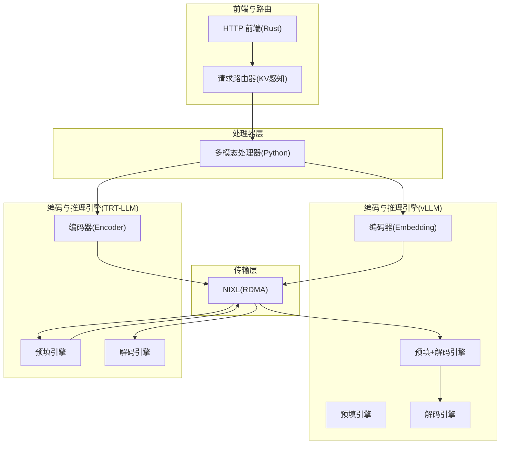
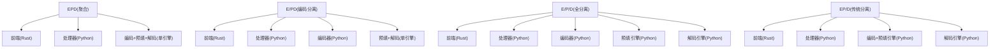
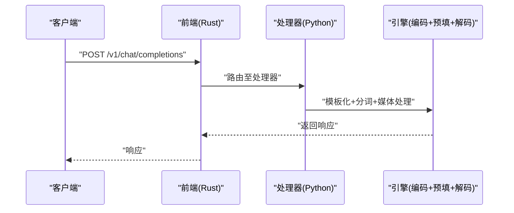
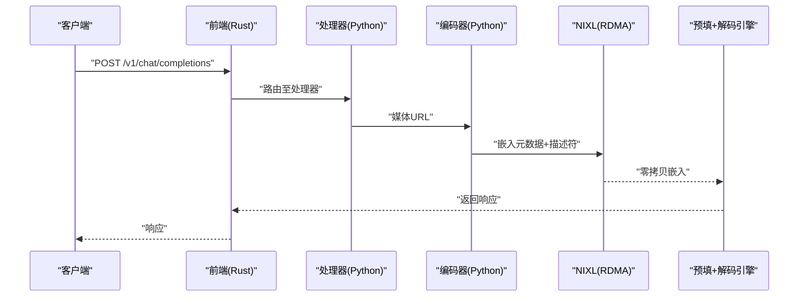
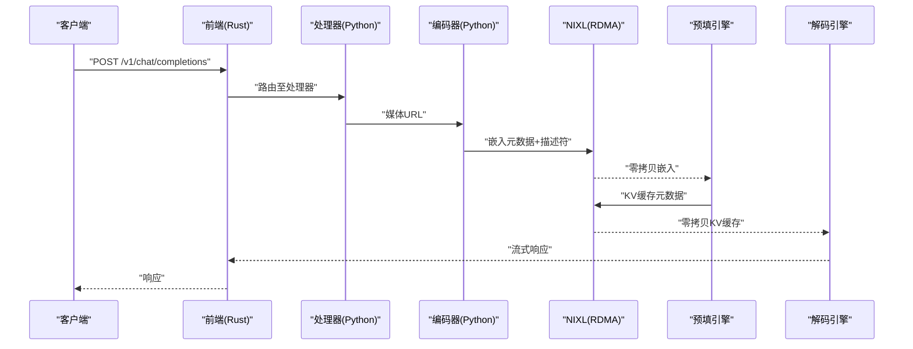
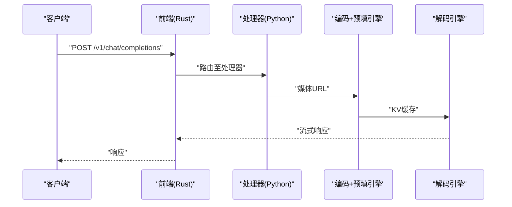
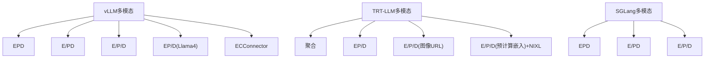

# 多模态架构模式

<cite>
**本文引用的文件**
- [docs/pages/features/multimodal/README.md](file://docs/pages/features/multimodal/README.md)
- [docs/pages/features/multimodal/multimodal-vllm.md](file://docs/pages/features/multimodal/multimodal-vllm.md)
- [docs/pages/features/multimodal/multimodal-trtllm.md](file://docs/pages/features/multimodal/multimodal-trtllm.md)
- [docs/pages/features/multimodal/multimodal-sglang.md](file://docs/pages/features/multimodal/multimodal-sglang.md)
- [docs/pages/design-docs/architecture.md](file://docs/pages/design-docs/architecture.md)
- [examples/backends/vllm/launch/agg_multimodal_epd.sh](file://examples/backends/vllm/launch/agg_multimodal_epd.sh)
- [examples/backends/vllm/launch/disagg_multimodal_epd.sh](file://examples/backends/vllm/launch/disagg_multimodal_epd.sh)
- [examples/backends/vllm/launch/disagg_multimodal_llama.sh](file://examples/backends/vllm/launch/disagg_multimodal_llama.sh)
- [components/src/dynamo/frontend/main.py](file://components/src/dynamo/frontend/main.py)
- [components/src/dynamo/vllm/main.py](file://components/src/dynamo/vllm/main.py)
- [components/src/dynamo/vllm/multimodal_utils/__init__.py](file://components/src/dynamo/vllm/multimodal_utils/__init__.py)
- [components/src/dynamo/common/utils/media_nixl.py](file://components/src/dynamo/common/utils/media_nixl.py)
- [components/src/dynamo/common/multimodal/embedding_transfer.py](file://components/src/dynamo/common/multimodal/embedding_transfer.py)
- [components/src/dynamo/trtllm/request_handlers/handler_base.py](file://components/src/dynamo/trtllm/request_handlers/handler_base.py)
- [components/src/dynamo/trtllm/request_handlers/handlers.py](file://components/src/dynamo/trtllm/request_handlers/handlers.py)
- [components/src/dynamo/sglang/request_handlers/multimodal/__init__.py](file://components/src/dynamo/sglang/request_handlers/multimodal/__init__.py)
- [lib/llm/src/preprocessor/media/rdma.rs](file://lib/llm/src/preprocessor/media/rdma.rs)
</cite>

## 目录
1. [引言](#引言)
2. [项目结构](#项目结构)
3. [核心组件](#核心组件)
4. [架构总览](#架构总览)
5. [详细组件分析](#详细组件分析)
6. [依赖关系分析](#依赖关系分析)
7. [性能考量](#性能考量)
8. [故障排查指南](#故障排查指南)
9. [结论](#结论)
10. [附录](#附录)

## 引言
本文件系统化阐述Dynamo在多模态推理中的四种部署模式：EPD（聚合编码-预填-解码）、E/PD（编码分离）、E/P/D（全分离）与EP/D（传统分离）。围绕架构设计原理、技术实现、数据流与组件交互进行深入解析，并结合NIXL零拷贝传输、编码器分离与预填充/解码分离等关键设计思想，给出模式选择指南与性能对比分析，帮助读者在不同业务场景下做出最优部署决策。

## 项目结构
Dynamo多模态能力横跨前端、处理器、后端引擎与传输层，文档与示例脚本覆盖vLLM、TRT-LLM与SGLang三大后端，形成统一的多模态推理框架。

图表来源
- [docs/pages/features/multimodal/README.md](file://docs/pages/features/multimodal/README.md#L47-L185)
- [docs/pages/features/multimodal/multimodal-vllm.md](file://docs/pages/features/multimodal/multimodal-vllm.md#L30-L52)
- [docs/pages/features/multimodal/multimodal-trtllm.md](file://docs/pages/features/multimodal/multimodal-trtllm.md#L32-L51)
- [docs/pages/features/multimodal/multimodal-sglang.md](file://docs/pages/features/multimodal/multimodal-sglang.md#L25-L33)

章节来源
- [docs/pages/features/multimodal/README.md](file://docs/pages/features/multimodal/README.md#L1-L194)
- [docs/pages/design-docs/architecture.md](file://docs/pages/design-docs/architecture.md#L1-L101)

## 核心组件
- HTTP前端（Rust）：负责OpenAI兼容接口、自动发现、预处理与路由。
- 多模态处理器（Python）：对提示词进行模板化与分词，提取媒体URL并转发给编码器或直接进入推理引擎。
- 编码器（Python）：从远端URL下载媒体，生成嵌入或帧序列，通过NIXL零拷贝传给后续阶段。
- 预填/解码引擎：按模式拆分或合并，完成上下文处理与逐token生成。
- 传输层（NIXL/RDMA）：在多节点/多GPU场景中实现低延迟、高吞吐的张量与KV缓存传输。

章节来源
- [components/src/dynamo/frontend/main.py](file://components/src/dynamo/frontend/main.py#L1-L518)
- [components/src/dynamo/vllm/main.py](file://components/src/dynamo/vllm/main.py#L985-L1026)
- [components/src/dynamo/common/utils/media_nixl.py](file://components/src/dynamo/common/utils/media_nixl.py#L1-L79)
- [components/src/dynamo/common/multimodal/embedding_transfer.py](file://components/src/dynamo/common/multimodal/embedding_transfer.py#L242-L436)

## 架构总览
Dynamo通过“编码分离 + 预填/解码分离”的双维度拆分，支持四种多模态部署模式，满足从单机快速验证到大规模多节点优化的不同需求。

图表来源
- [docs/pages/features/multimodal/README.md](file://docs/pages/features/multimodal/README.md#L61-L185)

章节来源
- [docs/pages/features/multimodal/README.md](file://docs/pages/features/multimodal/README.md#L47-L185)

## 详细组件分析

### 模式一：EPD（聚合）
- 架构要点
  - 所有阶段在一个引擎内完成，启动最简单。
  - 适合小模型、开发测试与低并发场景。
- 数据流
  - 前端接收请求，处理器进行提示词模板化与分词，随后直接进入编码+预填+解码流水线。
- 组件交互
  - 前端与处理器：HTTP入口与预处理。
  - 单引擎：内部完成编码、预填与解码。
- 性能特点
  - 启动快、部署简单；但无法独立扩展编码与推理阶段，资源利用受限。

图表来源
- [docs/pages/features/multimodal/README.md](file://docs/pages/features/multimodal/README.md#L61-L71)
- [docs/pages/features/multimodal/multimodal-vllm.md](file://docs/pages/features/multimodal/multimodal-vllm.md#L66-L100)

章节来源
- [docs/pages/features/multimodal/README.md](file://docs/pages/features/multimodal/README.md#L61-L79)
- [docs/pages/features/multimodal/multimodal-vllm.md](file://docs/pages/features/multimodal/multimodal-vllm.md#L66-L100)

### 模式二：E/PD（编码分离）
- 架构要点
  - 编码阶段独立于推理阶段，编码器通过NIXL将嵌入零拷贝传输给预填+解码引擎。
  - 可独立扩展编码器与推理引擎，提升资源利用率。
- 数据流
  - 处理器提取媒体URL并转发给编码器；编码器生成嵌入并通过NIXL发送给预填+解码引擎；引擎完成预填与解码。
- 组件交互
  - 前端与处理器：HTTP入口与预处理。
  - 编码器：下载媒体、生成嵌入、NIXL传输。
  - 预填+解码引擎：接收嵌入、执行预填与解码。
- 性能特点
  - 编码与推理可并行扩展；适合视觉密集型工作负载。

图表来源
- [docs/pages/features/multimodal/README.md](file://docs/pages/features/multimodal/README.md#L80-L94)
- [docs/pages/features/multimodal/multimodal-vllm.md](file://docs/pages/features/multimodal/multimodal-vllm.md#L68-L88)

章节来源
- [docs/pages/features/multimodal/README.md](file://docs/pages/features/multimodal/README.md#L80-L104)
- [docs/pages/features/multimodal/multimodal-vllm.md](file://docs/pages/features/multimodal/multimodal-vllm.md#L68-L100)

### 模式三：E/P/D（全分离）
- 架构要点
  - 编码、预填、解码三个阶段完全分离，支持多节点部署与独立扩展。
  - vLLM采用“预填优先”路径，SGLang采用“解码优先”路径。
- 数据流
  - vLLM（预填优先）：编码器将嵌入经NIXL传给预填引擎，预填完成后将KV缓存传给解码引擎。
  - SGLang（解码优先）：解码引擎引导预填引擎，再由预填引擎将KV缓存回传给解码引擎。
- 组件交互
  - 前端与处理器：HTTP入口与预处理。
  - 编码器：生成嵌入并通过NIXL传输。
  - 预填引擎：接收嵌入，生成KV缓存。
  - 解码引擎：接收KV缓存，流式生成token。
- 性能特点
  - 最大化并行度与资源利用率，适合大规模与高并发场景。

图表来源
- [docs/pages/features/multimodal/README.md](file://docs/pages/features/multimodal/README.md#L105-L146)
- [docs/pages/features/multimodal/multimodal-vllm.md](file://docs/pages/features/multimodal/multimodal-vllm.md#L132-L163)
- [docs/pages/features/multimodal/multimodal-sglang.md](file://docs/pages/features/multimodal/multimodal-sglang.md#L25-L33)

章节来源
- [docs/pages/features/multimodal/README.md](file://docs/pages/features/multimodal/README.md#L105-L156)
- [docs/pages/features/multimodal/multimodal-vllm.md](file://docs/pages/features/multimodal/multimodal-vllm.md#L132-L163)
- [docs/pages/features/multimodal/multimodal-sglang.md](file://docs/pages/features/multimodal/multimodal-sglang.md#L25-L33)

### 模式四：EP/D（传统分离）
- 架构要点
  - 编码与预填合并，解码单独；适用于无预计算嵌入支持的模型（如Llama 4）。
- 数据流
  - 处理器将媒体URL传递给编码+预填引擎；引擎完成编码与预填后，将KV缓存传给解码引擎。
- 组件交互
  - 前端与处理器：HTTP入口与预处理。
  - 编码+预填引擎：内含编码与预填逻辑。
  - 解码引擎：接收KV缓存，流式生成token。
- 性能特点
  - 简化了编码阶段，适合特定模型族与部署环境。

图表来源
- [docs/pages/features/multimodal/README.md](file://docs/pages/features/multimodal/README.md#L158-L172)
- [docs/pages/features/multimodal/multimodal-vllm.md](file://docs/pages/features/multimodal/multimodal-vllm.md#L193-L216)

章节来源
- [docs/pages/features/multimodal/README.md](file://docs/pages/features/multimodal/README.md#L158-L185)
- [docs/pages/features/multimodal/multimodal-vllm.md](file://docs/pages/features/multimodal/multimodal-vllm.md#L193-L216)

## 依赖关系分析
- vLLM多模态
  - 支持EPD、E/PD、E/P/D与EP/D（Llama 4），并提供ECConnector（本地嵌入缓存）模式。
  - 示例脚本涵盖聚合与全分离部署，强调NIXL在E/PD/E/P/D中的使用。
- TRT-LLM多模态
  - 支持聚合与EP/D；E/P/D在图像URL与预计算嵌入两种输入格式下均可用，后者通过NIXL实现零拷贝传输。
  - 提供多节点部署示例与KV缓存传输配置。
- SGLang多模态
  - 支持EPD、E/PD与E/P/D，采用NIXL进行零拷贝传输；不支持EP/D。

图表来源
- [docs/pages/features/multimodal/multimodal-vllm.md](file://docs/pages/features/multimodal/multimodal-vllm.md#L30-L52)
- [docs/pages/features/multimodal/multimodal-trtllm.md](file://docs/pages/features/multimodal/multimodal-trtllm.md#L32-L51)
- [docs/pages/features/multimodal/multimodal-sglang.md](file://docs/pages/features/multimodal/multimodal-sglang.md#L25-L33)

章节来源
- [docs/pages/features/multimodal/multimodal-vllm.md](file://docs/pages/features/multimodal/multimodal-vllm.md#L14-L52)
- [docs/pages/features/multimodal/multimodal-trtllm.md](file://docs/pages/features/multimodal/multimodal-trtllm.md#L14-L51)
- [docs/pages/features/multimodal/multimodal-sglang.md](file://docs/pages/features/multimodal/multimodal-sglang.md#L8-L33)

## 性能考量
- 零拷贝传输（NIXL/RDMA）
  - 在E/PD、E/P/D与EP/D（TRT-LLM预计算嵌入）中显著降低CPU拷贝开销，提升吞吐与TTFT表现。
  - vLLM与TRT-LLM均提供NIXL使用矩阵与示例脚本。
- 编码器分离
  - 将计算密集的视觉编码与推理解耦，可在不同GPU上独立扩展，提高整体资源利用率。
- 预填/解码分离
  - 允许根据流量特征动态分配预填与解码资源，平衡TTFT与ITL，提升多节点部署弹性。
- 后端差异
  - vLLM：支持多种模式与ECConnector；E/PD/E/P/D广泛用于图像与视频/音频实验。
  - TRT-LLM：EP/D与E/P/D在图像URL与预计算嵌入场景下具备良好性能；多节点部署需注意拓扑与传输配置。
  - SGLang：E/PD/E/P/D路径明确，NIXL用于零拷贝传输。

章节来源
- [docs/pages/features/multimodal/multimodal-vllm.md](file://docs/pages/features/multimodal/multimodal-vllm.md#L444-L452)
- [docs/pages/features/multimodal/multimodal-trtllm.md](file://docs/pages/features/multimodal/multimodal-trtllm.md#L390-L401)
- [docs/pages/features/multimodal/multimodal-sglang.md](file://docs/pages/features/multimodal/multimodal-sglang.md#L8-L33)

## 故障排查指南
- 启动参数与安全
  - vLLM多模态需要显式启用多模态标志，否则会拒绝处理多模态内容。
- 组件等待与实例发现
  - 编码器与预填/解码引擎客户端需等待目标实例上线后再开始服务，避免连接失败。
- NIXL传输异常
  - 检查NIXL元数据与描述符是否正确生成与传递；确认远程设备类型与内存层级匹配。
- 模型与输入格式
  - 不同后端对输入格式支持不同，需按后端文档准备URL或预计算嵌入文件。
- 路由与事件平面
  - KV感知路由与事件平面（NATS/ZMQ）配置影响缓存命中率与全局一致性，必要时开启持久化事件以保证多副本一致性。

章节来源
- [docs/pages/features/multimodal/multimodal-vllm.md](file://docs/pages/features/multimodal/multimodal-vllm.md#L10-L13)
- [components/src/dynamo/frontend/main.py](file://components/src/dynamo/frontend/main.py#L409-L418)
- [components/src/dynamo/common/utils/media_nixl.py](file://components/src/dynamo/common/utils/media_nixl.py#L18-L79)
- [components/src/dynamo/common/multimodal/embedding_transfer.py](file://components/src/dynamo/common/multimodal/embedding_transfer.py#L242-L436)

## 结论
Dynamo通过“编码分离 + 预填/解码分离”的双维度拆分，为多模态推理提供了灵活且高性能的部署范式。EPD适合快速验证，E/PD与E/P/D适合规模化与多节点部署，EP/D则针对特定模型族提供简化路径。结合NIXL零拷贝传输与KV感知路由，Dynamo在TTFT、ITL与吞吐方面均具备显著优势，建议依据业务规模、模型特性与硬件条件选择合适模式。

## 附录
- 模式选择指南
  - 快速验证/小模型：EPD
  - 视觉密集型/需独立扩展编码：E/PD
  - 大规模/多节点/极致弹性：E/P/D
  - 特定模型族（如Llama 4）：EP/D
- 示例脚本与参考
  - vLLM：聚合与全分离部署脚本与ECConnector示例。
  - TRT-LLM：聚合、EP/D与E/P/D（图像URL/预计算嵌入）脚本与多节点示例。
  - SGLang：EPD、E/PD与E/P/D脚本与NIXL配置。

章节来源
- [examples/backends/vllm/launch/agg_multimodal_epd.sh](file://examples/backends/vllm/launch/agg_multimodal_epd.sh#L1-L93)
- [examples/backends/vllm/launch/disagg_multimodal_epd.sh](file://examples/backends/vllm/launch/disagg_multimodal_epd.sh#L1-L82)
- [examples/backends/vllm/launch/disagg_multimodal_llama.sh](file://examples/backends/vllm/launch/disagg_multimodal_llama.sh#L1-L94)
- [docs/pages/features/multimodal/multimodal-vllm.md](file://docs/pages/features/multimodal/multimodal-vllm.md#L30-L52)
- [docs/pages/features/multimodal/multimodal-trtllm.md](file://docs/pages/features/multimodal/multimodal-trtllm.md#L32-L51)
- [docs/pages/features/multimodal/multimodal-sglang.md](file://docs/pages/features/multimodal/multimodal-sglang.md#L25-L33)