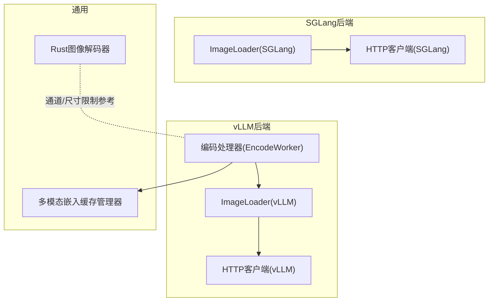
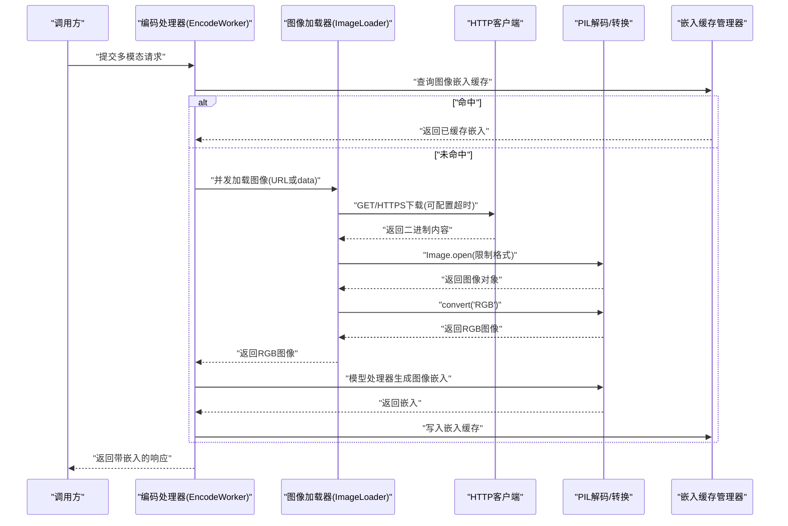
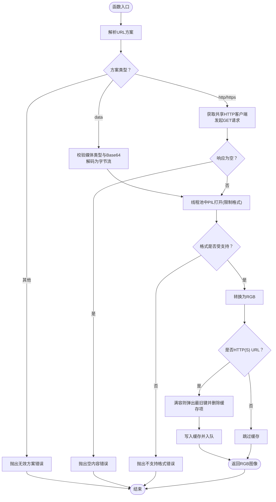
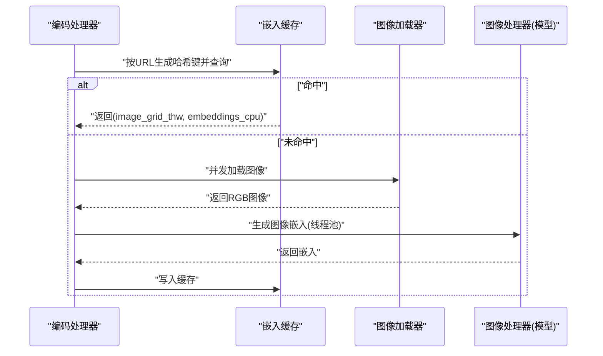
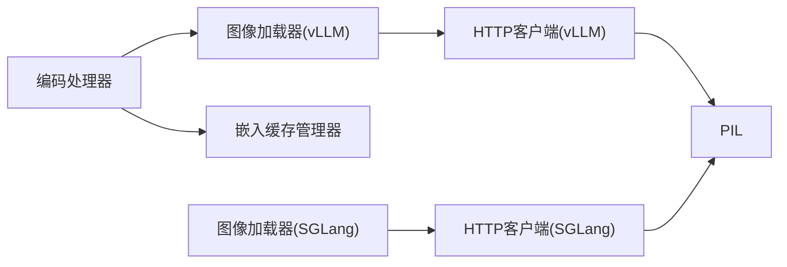

# 图像处理

<cite>
**本文引用的文件**
- [components/src/dynamo/vllm/multimodal_utils/image_loader.py](file://components/src/dynamo/vllm/multimodal_utils/image_loader.py)
- [components/src/dynamo/sglang/multimodal_utils/multimodal_image_loader.py](file://components/src/dynamo/sglang/multimodal_utils/multimodal_image_loader.py)
- [examples/multimodal/utils/image_loader.py](file://examples/multimodal/utils/image_loader.py)
- [components/src/dynamo/vllm/multimodal_utils/http_client.py](file://components/src/dynamo/vllm/multimodal_utils/http_client.py)
- [examples/multimodal/utils/http_client.py](file://examples/multimodal/utils/http_client.py)
- [components/src/dynamo/common/memory/multimodal_embedding_cache_manager.py](file://components/src/dynamo/common/memory/multimodal_embedding_cache_manager.py)
- [components/src/dynamo/vllm/multimodal_handlers/encode_worker_handler.py](file://components/src/dynamo/vllm/multimodal_handlers/encode_worker_handler.py)
- [lib/llm/src/preprocessor/media/decoders/image.rs](file://lib/llm/src/preprocessor/media/decoders/image.rs)
</cite>

## 目录
1. [简介](#简介)
2. [项目结构](#项目结构)
3. [核心组件](#核心组件)
4. [架构总览](#架构总览)
5. [详细组件分析](#详细组件分析)
6. [依赖关系分析](#依赖关系分析)
7. [性能考量](#性能考量)
8. [故障排查指南](#故障排查指南)
9. [结论](#结论)
10. [附录](#附录)

## 简介
本技术文档聚焦Dynamo在多模态场景下的图像处理能力，系统性阐述图像加载机制（HTTP/HTTPS URL、data URL、Base64）、图像缓存策略、格式验证与转换、PIL图像处理与RGB格式转换、错误处理与超时配置、安全注意事项，并给出各后端（vLLM、SGLang）的集成方式与最佳实践。

## 项目结构
与图像处理直接相关的核心模块分布于以下位置：
- vLLM后端图像加载与处理器：components/src/dynamo/vllm/multimodal_utils/image_loader.py、components/src/dynamo/vllm/multimodal_utils/http_client.py、components/src/dynamo/vllm/multimodal_handlers/encode_worker_handler.py
- SGLang后端图像加载：components/src/dynamo/sglang/multimodal_utils/multimodal_image_loader.py
- 示例与复用工具：examples/multimodal/utils/image_loader.py、examples/multimodal/utils/http_client.py
- 多模态嵌入缓存管理：components/src/dynamo/common/memory/multimodal_embedding_cache_manager.py
- Rust侧通用图像解码器（通道数与尺寸限制等）：lib/llm/src/preprocessor/media/decoders/image.rs

图表来源
- [components/src/dynamo/vllm/multimodal_utils/image_loader.py](file://components/src/dynamo/vllm/multimodal_utils/image_loader.py#L31-L111)
- [components/src/dynamo/vllm/multimodal_utils/http_client.py](file://components/src/dynamo/vllm/multimodal_utils/http_client.py#L27-L47)
- [components/src/dynamo/vllm/multimodal_handlers/encode_worker_handler.py](file://components/src/dynamo/vllm/multimodal_handlers/encode_worker_handler.py#L130-L282)
- [components/src/dynamo/sglang/multimodal_utils/multimodal_image_loader.py](file://components/src/dynamo/sglang/multimodal_utils/multimodal_image_loader.py#L44-L124)
- [components/src/dynamo/common/memory/multimodal_embedding_cache_manager.py](file://components/src/dynamo/common/memory/multimodal_embedding_cache_manager.py#L29-L174)
- [lib/llm/src/preprocessor/media/decoders/image.rs](file://lib/llm/src/preprocessor/media/decoders/image.rs#L73-L106)

章节来源
- [components/src/dynamo/vllm/multimodal_utils/image_loader.py](file://components/src/dynamo/vllm/multimodal_utils/image_loader.py#L1-L111)
- [components/src/dynamo/sglang/multimodal_utils/multimodal_image_loader.py](file://components/src/dynamo/sglang/multimodal_utils/multimodal_image_loader.py#L1-L124)
- [examples/multimodal/utils/image_loader.py](file://examples/multimodal/utils/image_loader.py#L1-L111)
- [components/src/dynamo/vllm/multimodal_utils/http_client.py](file://components/src/dynamo/vllm/multimodal_utils/http_client.py#L1-L48)
- [examples/multimodal/utils/http_client.py](file://examples/multimodal/utils/http_client.py#L1-L48)
- [components/src/dynamo/common/memory/multimodal_embedding_cache_manager.py](file://components/src/dynamo/common/memory/multimodal_embedding_cache_manager.py#L1-L174)
- [components/src/dynamo/vllm/multimodal_handlers/encode_worker_handler.py](file://components/src/dynamo/vllm/multimodal_handlers/encode_worker_handler.py#L130-L282)
- [lib/llm/src/preprocessor/media/decoders/image.rs](file://lib/llm/src/preprocessor/media/decoders/image.rs#L48-L106)

## 核心组件
- 图像加载器（ImageLoader）
  - 支持三种输入源：HTTP/HTTPS URL、data URL（含Base64）、本地字节流
  - 使用线程池异步执行PIL同步操作，避免阻塞事件循环
  - 严格限定支持的图像格式以提升安全性
  - 对加载结果进行格式校验并统一转为RGB
  - 针对HTTP(S) URL提供LRU式内存缓存（按URL键，固定容量）
- 共享HTTP客户端
  - 提供全局共享的异步HTTP客户端实例，带连接池与重定向跟随
  - 可配置超时参数
- 编码处理器（EncodeWorker）
  - 在批量请求中先查本地嵌入缓存，未命中则并发加载图像并生成嵌入
  - 将嵌入写回缓存，便于后续请求复用
- 嵌入缓存管理器（MultimodalEmbeddingCacheManager）
  - 基于字节容量的LRU缓存，记录命中/未命中统计
- Rust图像解码器（可选参考）
  - 通过通道数与尺寸限制保障解码稳定性

章节来源
- [components/src/dynamo/vllm/multimodal_utils/image_loader.py](file://components/src/dynamo/vllm/multimodal_utils/image_loader.py#L31-L111)
- [components/src/dynamo/sglang/multimodal_utils/multimodal_image_loader.py](file://components/src/dynamo/sglang/multimodal_utils/multimodal_image_loader.py#L44-L124)
- [examples/multimodal/utils/image_loader.py](file://examples/multimodal/utils/image_loader.py#L31-L111)
- [components/src/dynamo/vllm/multimodal_utils/http_client.py](file://components/src/dynamo/vllm/multimodal_utils/http_client.py#L27-L47)
- [examples/multimodal/utils/http_client.py](file://examples/multimodal/utils/http_client.py#L27-L47)
- [components/src/dynamo/common/memory/multimodal_embedding_cache_manager.py](file://components/src/dynamo/common/memory/multimodal_embedding_cache_manager.py#L29-L174)
- [components/src/dynamo/vllm/multimodal_handlers/encode_worker_handler.py](file://components/src/dynamo/vllm/multimodal_handlers/encode_worker_handler.py#L130-L282)
- [lib/llm/src/preprocessor/media/decoders/image.rs](file://lib/llm/src/preprocessor/media/decoders/image.rs#L73-L106)

## 架构总览
下图展示了从请求到图像加载、格式转换、嵌入生成与缓存的整体流程，以及vLLM/SGLang两个后端的差异点。

图表来源
- [components/src/dynamo/vllm/multimodal_handlers/encode_worker_handler.py](file://components/src/dynamo/vllm/multimodal_handlers/encode_worker_handler.py#L130-L282)
- [components/src/dynamo/vllm/multimodal_utils/image_loader.py](file://components/src/dynamo/vllm/multimodal_utils/image_loader.py#L41-L111)
- [components/src/dynamo/vllm/multimodal_utils/http_client.py](file://components/src/dynamo/vllm/multimodal_utils/http_client.py#L27-L47)
- [components/src/dynamo/common/memory/multimodal_embedding_cache_manager.py](file://components/src/dynamo/common/memory/multimodal_embedding_cache_manager.py#L80-L149)

## 详细组件分析

### 组件A：图像加载器（ImageLoader）
- 输入源解析
  - data URL：要求媒体类型以“image/”开头且必须为Base64编码；解析失败抛出异常
  - HTTP/HTTPS URL：通过共享HTTP客户端下载，空内容会触发异常
  - 其他协议：直接报错
- 安全与格式控制
  - 使用线程池执行PIL同步操作，避免阻塞事件循环
  - 仅允许JPEG、PNG、WEBP三种格式，防止潜在高危格式解析风险
  - 加载后强制转换为RGB，确保下游模型输入一致性
- 缓存策略
  - 仅对HTTP(S) URL生效，采用字典+队列的LRU缓存，容量固定
  - 满容时优先淘汰最旧条目
- 错误处理
  - 捕获HTTP错误与通用异常，记录日志并向上抛出

图表来源
- [components/src/dynamo/vllm/multimodal_utils/image_loader.py](file://components/src/dynamo/vllm/multimodal_utils/image_loader.py#L41-L111)
- [components/src/dynamo/sglang/multimodal_utils/multimodal_image_loader.py](file://components/src/dynamo/sglang/multimodal_utils/multimodal_image_loader.py#L54-L124)
- [examples/multimodal/utils/image_loader.py](file://examples/multimodal/utils/image_loader.py#L41-L111)

章节来源
- [components/src/dynamo/vllm/multimodal_utils/image_loader.py](file://components/src/dynamo/vllm/multimodal_utils/image_loader.py#L31-L111)
- [components/src/dynamo/sglang/multimodal_utils/multimodal_image_loader.py](file://components/src/dynamo/sglang/multimodal_utils/multimodal_image_loader.py#L44-L124)
- [examples/multimodal/utils/image_loader.py](file://examples/multimodal/utils/image_loader.py#L31-L111)

### 组件B：共享HTTP客户端
- 单例化管理，自动复用连接与保持长连接
- 可配置超时、最大连接数、keepalive连接数
- 支持重定向跟随，减少外部服务变更带来的兼容问题

章节来源
- [components/src/dynamo/vllm/multimodal_utils/http_client.py](file://components/src/dynamo/vllm/multimodal_utils/http_client.py#L27-L47)
- [examples/multimodal/utils/http_client.py](file://examples/multimodal/utils/http_client.py#L27-L47)
- [components/src/dynamo/sglang/multimodal_utils/multimodal_image_loader.py](file://components/src/dynamo/sglang/multimodal_utils/multimodal_image_loader.py#L21-L41)

### 组件C：编码处理器（EncodeWorker）
- 请求预处理：逐条检查image_url是否存在
- 缓存命中：优先从本地嵌入缓存返回
- 并发加载：对未命中的图像URL并发调用ImageLoader
- 异常聚合：收集所有加载异常并统一抛出
- 嵌入生成：在线程池中调用模型特定编码器生成图像嵌入
- 写回缓存：将新生成的嵌入写入缓存，供后续请求复用

图表来源
- [components/src/dynamo/vllm/multimodal_handlers/encode_worker_handler.py](file://components/src/dynamo/vllm/multimodal_handlers/encode_worker_handler.py#L130-L282)
- [components/src/dynamo/common/memory/multimodal_embedding_cache_manager.py](file://components/src/dynamo/common/memory/multimodal_embedding_cache_manager.py#L80-L149)

章节来源
- [components/src/dynamo/vllm/multimodal_handlers/encode_worker_handler.py](file://components/src/dynamo/vllm/multimodal_handlers/encode_worker_handler.py#L130-L282)

### 组件D：嵌入缓存管理器（MultimodalEmbeddingCacheManager）
- LRU策略：基于访问顺序的有序字典
- 字节容量控制：按张量元素大小与数量计算占用，超过阈值逐出最久未使用项
- 统计指标：命中/未命中次数、命中率、当前占用/容量利用率

章节来源
- [components/src/dynamo/common/memory/multimodal_embedding_cache_manager.py](file://components/src/dynamo/common/memory/multimodal_embedding_cache_manager.py#L29-L174)

### 组件E：Rust图像解码器（通道/尺寸限制参考）
- 通过limits控制最大宽度、高度与分配上限，避免异常大图导致内存溢出
- 自动识别灰度/灰度+Alpha/RGB/RGBA并转换为标准布局

章节来源
- [lib/llm/src/preprocessor/media/decoders/image.rs](file://lib/llm/src/preprocessor/media/decoders/image.rs#L73-L106)

## 依赖关系分析
- vLLM后端
  - 编码处理器依赖图像加载器与嵌入缓存管理器
  - 图像加载器依赖共享HTTP客户端与PIL
- SGLang后端
  - 图像加载器同样依赖共享HTTP客户端与PIL
- 共享HTTP客户端
  - 作为全局单例被多个模块复用，降低连接开销

图表来源
- [components/src/dynamo/vllm/multimodal_handlers/encode_worker_handler.py](file://components/src/dynamo/vllm/multimodal_handlers/encode_worker_handler.py#L130-L282)
- [components/src/dynamo/vllm/multimodal_utils/image_loader.py](file://components/src/dynamo/vllm/multimodal_utils/image_loader.py#L31-L111)
- [components/src/dynamo/sglang/multimodal_utils/multimodal_image_loader.py](file://components/src/dynamo/sglang/multimodal_utils/multimodal_image_loader.py#L44-L124)
- [components/src/dynamo/vllm/multimodal_utils/http_client.py](file://components/src/dynamo/vllm/multimodal_utils/http_client.py#L27-L47)

章节来源
- [components/src/dynamo/vllm/multimodal_handlers/encode_worker_handler.py](file://components/src/dynamo/vllm/multimodal_handlers/encode_worker_handler.py#L130-L282)
- [components/src/dynamo/vllm/multimodal_utils/image_loader.py](file://components/src/dynamo/vllm/multimodal_utils/image_loader.py#L31-L111)
- [components/src/dynamo/sglang/multimodal_utils/multimodal_image_loader.py](file://components/src/dynamo/sglang/multimodal_utils/multimodal_image_loader.py#L44-L124)
- [components/src/dynamo/vllm/multimodal_utils/http_client.py](file://components/src/dynamo/vllm/multimodal_utils/http_client.py#L27-L47)

## 性能考量
- 并发加载与缓存
  - 编码处理器对未命中图像URL进行并发加载，显著降低批处理延迟
  - 图像加载器对HTTP(S) URL提供内存LRU缓存，减少重复下载与解码成本
- 连接池与超时
  - 共享HTTP客户端启用连接池与重定向跟随，降低握手与DNS开销
  - 可通过构造参数或环境变量调整超时与连接上限
- CPU密集型任务离线程
  - PIL解码与格式转换在独立线程执行，避免阻塞事件循环
- 嵌入缓存
  - 基于字节容量的LRU缓存，结合命中统计，平衡内存占用与命中率

[本节为通用性能讨论，无需列出具体文件来源]

## 故障排查指南
- 常见错误与定位
  - data URL格式错误：媒体类型非image/或未标记为Base64
  - Base64解码失败：输入数据损坏或非标准编码
  - HTTP响应为空：目标服务器返回空体或网络异常
  - 不支持的图像格式：仅允许JPEG、PNG、WEBP
  - 超时/连接异常：检查HTTP客户端超时设置与网络连通性
- 日志与异常
  - 图像加载器捕获HTTP错误与通用异常并记录日志，随后抛出
  - 编码处理器聚合所有图像加载异常，便于一次性定位问题
- 安全建议
  - 严格限制PIL支持格式，避免高危格式解析
  - 控制图像尺寸与内存占用，必要时参考Rust解码器的尺寸/分配限制

章节来源
- [components/src/dynamo/vllm/multimodal_utils/image_loader.py](file://components/src/dynamo/vllm/multimodal_utils/image_loader.py#L105-L111)
- [components/src/dynamo/sglang/multimodal_utils/multimodal_image_loader.py](file://components/src/dynamo/sglang/multimodal_utils/multimodal_image_loader.py#L118-L123)
- [components/src/dynamo/vllm/multimodal_handlers/encode_worker_handler.py](file://components/src/dynamo/vllm/multimodal_handlers/encode_worker_handler.py#L161-L174)

## 结论
Dynamo的图像处理链路在多后端（vLLM/SGLang）中保持一致的加载与转换策略：严格的格式白名单、统一的RGB输出、并发加载与两级缓存（URL级内存缓存+嵌入级字节容量缓存），并在关键路径上通过线程池规避阻塞。配合共享HTTP客户端与错误聚合机制，整体具备良好的吞吐与稳定性。建议在生产环境中结合业务特征调优缓存容量与超时参数，并持续监控命中率与内存占用。

[本节为总结性内容，无需列出具体文件来源]

## 附录

### 支持的图像格式
- vLLM/SGLang图像加载器明确限定支持格式：JPEG、PNG、WEBP
- Rust图像解码器支持灰度、灰度+Alpha、RGB、RGBA通道组合，并对通道数进行校验

章节来源
- [components/src/dynamo/vllm/multimodal_utils/image_loader.py](file://components/src/dynamo/vllm/multimodal_utils/image_loader.py#L82-L88)
- [components/src/dynamo/sglang/multimodal_utils/multimodal_image_loader.py](file://components/src/dynamo/sglang/multimodal_utils/multimodal_image_loader.py#L95-L101)
- [lib/llm/src/preprocessor/media/decoders/image.rs](file://lib/llm/src/preprocessor/media/decoders/image.rs#L88-L94)

### 超时与连接配置
- HTTP客户端超时可通过构造参数传入；SGLang版本在模块内定义默认超时
- 连接池参数（最大连接数、keepalive连接数）可在客户端初始化时配置

章节来源
- [components/src/dynamo/vllm/multimodal_utils/http_client.py](file://components/src/dynamo/vllm/multimodal_utils/http_client.py#L27-L47)
- [examples/multimodal/utils/http_client.py](file://examples/multimodal/utils/http_client.py#L27-L47)
- [components/src/dynamo/sglang/multimodal_utils/multimodal_image_loader.py](file://components/src/dynamo/sglang/multimodal_utils/multimodal_image_loader.py#L21-L41)

### 最佳实践
- 优先使用HTTP(S) URL并开启缓存，减少重复下载
- data URL仅用于小体积、内联的图像数据
- 控制图像尺寸与分辨率，避免超大图导致内存压力
- 合理设置嵌入缓存容量，结合命中率统计动态调优
- 在高并发场景下，优先使用编码处理器的并发加载能力
- 对外网图片建议增加超时与重试策略，提升鲁棒性

[本节为通用最佳实践，无需列出具体文件来源]