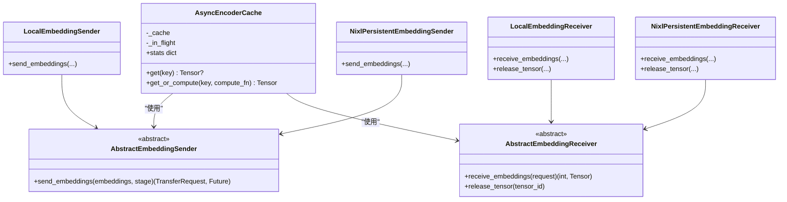

# 媒体类型处理

<cite>
**本文引用的文件**
- [examples/multimodal/utils/image_loader.py](file://examples/multimodal/utils/image_loader.py)
- [examples/multimodal/utils/audio_loader.py](file://examples/multimodal/utils/audio_loader.py)
- [examples/multimodal/utils/video_utils.py](file://examples/multimodal/utils/video_utils.py)
- [examples/multimodal/utils/encode_utils.py](file://examples/multimodal/utils/encode_utils.py)
- [examples/multimodal/components/encode_worker.py](file://examples/multimodal/components/encode_worker.py)
- [examples/multimodal/components/audio_encode_worker.py](file://examples/multimodal/components/audio_encode_worker.py)
- [examples/multimodal/components/video_encode_worker.py](file://examples/multimodal/components/video_encode_worker.py)
- [components/src/dynamo/common/multimodal/async_encoder_cache.py](file://components/src/dynamo/common/multimodal/async_encoder_cache.py)
- [components/src/dynamo/common/multimodal/embedding_transfer.py](file://components/src/dynamo/common/multimodal/embedding_transfer.py)
- [components/src/dynamo/common/memory/__init__.py](file://components/src/dynamo/common/memory/__init__.py)
- [components/src/dynamo/common/tests/memory/test_multimodal_embedding_cache_manager.py](file://components/src/dynamo/common/tests/memory/test_multimodal_embedding_cache_manager.py)
- [lib/llm/src/preprocessor/media/README.md](file://lib/llm/src/preprocessor/media/README.md)
- [lib/llm/src/preprocessor/media/decoders/video.rs](file://lib/llm/src/preprocessor/media/decoders/video.rs)
- [examples/multimodal/launch/audio_agg.sh](file://examples/multimodal/launch/audio_agg.sh)
</cite>

## 目录
1. [简介](#简介)
2. [项目结构](#项目结构)
3. [核心组件](#核心组件)
4. [架构总览](#架构总览)
5. [详细组件分析](#详细组件分析)
6. [依赖关系分析](#依赖关系分析)
7. [性能考虑](#性能考虑)
8. [故障排查指南](#故障排查指南)
9. [结论](#结论)
10. [附录](#附录)

## 简介
本技术文档聚焦Dynamo多模态媒体类型处理，系统性阐述图像、视频、音频三类媒体的加载、解码与处理机制，覆盖媒体文件解析、格式转换、尺寸调整、质量控制、嵌入向量生成、特征提取与存储优化、预处理流水线、错误处理与性能优化策略，并给出各媒体格式支持清单与最佳实践。

## 项目结构
围绕多模态媒体处理的关键代码分布在以下模块：
- 示例工具与组件：图像/音频/视频加载器、编码器工作进程、协议与参数解析等
- 公共缓存与传输：异步编码缓存、嵌入向量传输（本地/远程RDMA）
- 内存管理：多模态嵌入缓存管理器（LRU、容量跟踪、命中统计）
- 预处理与解码：Rust侧视频解码器与测试说明


**图表来源**
- [examples/multimodal/utils/image_loader.py](file://examples/multimodal/utils/image_loader.py#L31-L111)
- [examples/multimodal/utils/audio_loader.py](file://examples/multimodal/utils/audio_loader.py#L30-L81)
- [examples/multimodal/utils/video_utils.py](file://examples/multimodal/utils/video_utils.py#L37-L415)
- [examples/multimodal/utils/encode_utils.py](file://examples/multimodal/utils/encode_utils.py#L58-L133)
- [examples/multimodal/components/encode_worker.py](file://examples/multimodal/components/encode_worker.py#L47-L265)
- [examples/multimodal/components/audio_encode_worker.py](file://examples/multimodal/components/audio_encode_worker.py#L58-L308)
- [examples/multimodal/components/video_encode_worker.py](file://examples/multimodal/components/video_encode_worker.py#L57-L312)
- [components/src/dynamo/common/multimodal/async_encoder_cache.py](file://components/src/dynamo/common/multimodal/async_encoder_cache.py#L46-L138)
- [components/src/dynamo/common/multimodal/embedding_transfer.py](file://components/src/dynamo/common/multimodal/embedding_transfer.py#L43-L464)
- [lib/llm/src/preprocessor/media/decoders/video.rs](file://lib/llm/src/preprocessor/media/decoders/video.rs#L290-L366)
- [lib/llm/src/preprocessor/media/README.md](file://lib/llm/src/preprocessor/media/README.md#L97-L120)
- [examples/multimodal/launch/audio_agg.sh](file://examples/multimodal/launch/audio_agg.sh#L77-L97)

**章节来源**
- [examples/multimodal/utils/image_loader.py](file://examples/multimodal/utils/image_loader.py#L31-L111)
- [examples/multimodal/utils/audio_loader.py](file://examples/multimodal/utils/audio_loader.py#L30-L81)
- [examples/multimodal/utils/video_utils.py](file://examples/multimodal/utils/video_utils.py#L37-L415)
- [examples/multimodal/utils/encode_utils.py](file://examples/multimodal/utils/encode_utils.py#L58-L133)
- [examples/multimodal/components/encode_worker.py](file://examples/multimodal/components/encode_worker.py#L47-L265)
- [examples/multimodal/components/audio_encode_worker.py](file://examples/multimodal/components/audio_encode_worker.py#L58-L308)
- [examples/multimodal/components/video_encode_worker.py](file://examples/multimodal/components/video_encode_worker.py#L57-L312)
- [components/src/dynamo/common/multimodal/async_encoder_cache.py](file://components/src/dynamo/common/multimodal/async_encoder_cache.py#L46-L138)
- [components/src/dynamo/common/multimodal/embedding_transfer.py](file://components/src/dynamo/common/multimodal/embedding_transfer.py#L43-L464)
- [lib/llm/src/preprocessor/media/decoders/video.rs](file://lib/llm/src/preprocessor/media/decoders/video.rs#L290-L366)
- [lib/llm/src/preprocessor/media/README.md](file://lib/llm/src/preprocessor/media/README.md#L97-L120)
- [examples/multimodal/launch/audio_agg.sh](file://examples/multimodal/launch/audio_agg.sh#L77-L97)

## 核心组件
- 图像加载与编码
  - 图像加载器：支持HTTP(S)/data URL，限制格式（JPEG/PNG/WEBP），线程池解码避免事件循环阻塞，带LRU缓存
  - 编码工具：按模型路由到不同视觉编码器与投影器，输出规范化形状
  - 编码器工作进程：拉取图像URL，调用处理器与模型，生成嵌入并通过描述符传输
- 音频加载与编码
  - 音频加载器：基于Librosa加载并重采样，同步函数加LRU缓存，异步线程执行
  - 音频编码器工作进程：使用AutoProcessor与Qwen2Audio模型提取音频特征，经多模态投影器生成嵌入
- 视频加载与编码
  - 视频工具集：支持HTTP(S)/data URL/file路径；使用PyAV打开容器，计算采样索引，解码帧，尺寸调整，RDMA准备
  - 视频编码器工作进程：从URL加载视频内容，提取元数据，按需采样帧，resize，准备RDMA张量，通过描述符传输
- 嵌入传输与缓存
  - 异步编码缓存：请求合并去重，单Key并发计算，避免重复编码
  - 嵌入传输：本地文件与NIXL RDMA两种实现，支持持久连接以降低开销
  - 多模态嵌入缓存管理器：容量限制、LRU淘汰、命中统计、连续性约束

**章节来源**
- [examples/multimodal/utils/image_loader.py](file://examples/multimodal/utils/image_loader.py#L31-L111)
- [examples/multimodal/utils/encode_utils.py](file://examples/multimodal/utils/encode_utils.py#L58-L133)
- [examples/multimodal/components/encode_worker.py](file://examples/multimodal/components/encode_worker.py#L47-L265)
- [examples/multimodal/utils/audio_loader.py](file://examples/multimodal/utils/audio_loader.py#L30-L81)
- [examples/multimodal/components/audio_encode_worker.py](file://examples/multimodal/components/audio_encode_worker.py#L58-L308)
- [examples/multimodal/utils/video_utils.py](file://examples/multimodal/utils/video_utils.py#L37-L415)
- [examples/multimodal/components/video_encode_worker.py](file://examples/multimodal/components/video_encode_worker.py#L57-L312)
- [components/src/dynamo/common/multimodal/async_encoder_cache.py](file://components/src/dynamo/common/multimodal/async_encoder_cache.py#L46-L138)
- [components/src/dynamo/common/multimodal/embedding_transfer.py](file://components/src/dynamo/common/multimodal/embedding_transfer.py#L43-L464)
- [components/src/dynamo/common/tests/memory/test_multimodal_embedding_cache_manager.py](file://components/src/dynamo/common/tests/memory/test_multimodal_embedding_cache_manager.py#L14-L224)

## 架构总览
Dynamo多模态处理采用“前端/编码器/下游推理”三层协作：
- 前端接收请求，将媒体URL放入请求中
- 编码器工作进程根据媒体类型选择对应加载器与模型，生成嵌入或帧张量
- 通过描述符（Descriptor）进行高效传输（本地文件或NIXL RDMA），下游推理引擎消费


**图表来源**
- [examples/multimodal/components/encode_worker.py](file://examples/multimodal/components/encode_worker.py#L73-L155)
- [examples/multimodal/components/audio_encode_worker.py](file://examples/multimodal/components/audio_encode_worker.py#L137-L197)
- [examples/multimodal/components/video_encode_worker.py](file://examples/multimodal/components/video_encode_worker.py#L82-L196)
- [components/src/dynamo/common/multimodal/embedding_transfer.py](file://components/src/dynamo/common/multimodal/embedding_transfer.py#L108-L293)

## 详细组件分析

### 图像处理流水线
- 加载阶段：校验URL方案，data URL需为图片且base64；HTTP(S)走缓存与下载；PIL在独立线程中解码，限制格式
- 处理阶段：转RGB，记录像素统计信息，构建网格维度（如适用）
- 编码阶段：按模型选择编码器与投影器，生成规范化嵌入
- 传输阶段：封装为描述符，等待传输完成，回传下游响应

```mermaid
flowchart TD
A["接收图像URL"] --> B{"URL方案？"}
B --> |data:| C["解析base64数据"]
B --> |http(s):| D["HTTP客户端获取内容"]
C --> E["PIL解码线程池"]
D --> E
E --> F["格式校验与RGB转换"]
F --> G["构建处理器输入"]
G --> H["模型编码/投影"]
H --> I["封装描述符并传输"]
I --> J["下游推理消费"]
```

**图表来源**
- [examples/multimodal/utils/image_loader.py](file://examples/multimodal/utils/image_loader.py#L41-L103)
- [examples/multimodal/utils/encode_utils.py](file://examples/multimodal/utils/encode_utils.py#L58-L102)
- [examples/multimodal/components/encode_worker.py](file://examples/multimodal/components/encode_worker.py#L96-L150)

**章节来源**
- [examples/multimodal/utils/image_loader.py](file://examples/multimodal/utils/image_loader.py#L31-L111)
- [examples/multimodal/utils/encode_utils.py](file://examples/multimodal/utils/encode_utils.py#L58-L133)
- [examples/multimodal/components/encode_worker.py](file://examples/multimodal/components/encode_worker.py#L73-L155)

### 音频处理流水线
- 加载阶段：仅支持http(s)，使用Librosa加载并按指定采样率重采样，LRU缓存避免重复下载
- 处理阶段：AutoProcessor构造输入，模型音频塔提取特征，多模态投影器映射到嵌入空间
- 传输阶段：封装描述符，等待传输完成，回传下游响应


**图表来源**
- [examples/multimodal/utils/audio_loader.py](file://examples/multimodal/utils/audio_loader.py#L61-L80)
- [examples/multimodal/components/audio_encode_worker.py](file://examples/multimodal/components/audio_encode_worker.py#L160-L197)
- [components/src/dynamo/common/multimodal/embedding_transfer.py](file://components/src/dynamo/common/multimodal/embedding_transfer.py#L200-L293)

**章节来源**
- [examples/multimodal/utils/audio_loader.py](file://examples/multimodal/utils/audio_loader.py#L30-L81)
- [examples/multimodal/components/audio_encode_worker.py](file://examples/multimodal/components/audio_encode_worker.py#L58-L197)

### 视频处理流水线
- 内容加载：支持data URL（octet-stream或video/*）、HTTP(S)下载、本地file路径；data URL要求base64
- 容器打开：使用PyAV打开BytesIO流，异常捕获格式/损坏错误
- 元数据与采样：读取总帧数与时长，按目标帧数均匀采样，处理边界与空索引
- 解码与处理：逐帧解码为RGB24，堆叠为(T,H,W,C)张量，resize到目标分辨率，准备RDMA张量
- 传输：封装描述符，等待传输完成，回传下游响应

```mermaid
flowchart TD
A["输入视频URL"] --> B{"scheme判断"}
B --> |data:| C["base64解码为BytesIO"]
B --> |http(s):| D["HTTP下载为BytesIO"]
B --> |file/path| E["读取本地文件为BytesIO"]
C --> F["PyAV打开容器"]
D --> F
E --> F
F --> G["读取元数据(帧数/时长)"]
G --> H["计算采样索引"]
H --> I["seek+解码帧"]
I --> J["堆叠为张量(T,H,W,C)"]
J --> K["resize到目标尺寸"]
K --> L["准备RDMA张量(CPU/uint8/连续)"]
L --> M["封装描述符并传输"]
```

**图表来源**
- [examples/multimodal/utils/video_utils.py](file://examples/multimodal/utils/video_utils.py#L37-L153)
- [examples/multimodal/utils/video_utils.py](file://examples/multimodal/utils/video_utils.py#L155-L186)
- [examples/multimodal/utils/video_utils.py](file://examples/multimodal/utils/video_utils.py#L189-L211)
- [examples/multimodal/utils/video_utils.py](file://examples/multimodal/utils/video_utils.py#L214-L286)
- [examples/multimodal/utils/video_utils.py](file://examples/multimodal/utils/video_utils.py#L289-L355)
- [examples/multimodal/utils/video_utils.py](file://examples/multimodal/utils/video_utils.py#L358-L387)
- [examples/multimodal/utils/video_utils.py](file://examples/multimodal/utils/video_utils.py#L390-L415)
- [examples/multimodal/components/video_encode_worker.py](file://examples/multimodal/components/video_encode_worker.py#L82-L196)

**章节来源**
- [examples/multimodal/utils/video_utils.py](file://examples/multimodal/utils/video_utils.py#L37-L415)
- [examples/multimodal/components/video_encode_worker.py](file://examples/multimodal/components/video_encode_worker.py#L57-L196)

### 嵌入向量生成与存储优化
- 异步编码缓存：对同一键值的并发请求进行合并，仅一次计算，其余等待；统计在飞请求数量
- 传输抽象：本地发送器保存safetensors文件，接收器读取并释放；NIXL发送/接收器支持RDMA元数据与持久连接
- 缓存管理器：容量限制、LRU淘汰、命中/未命中计数、命中率、利用率统计；张量必须连续



**图表来源**
- [components/src/dynamo/common/multimodal/async_encoder_cache.py](file://components/src/dynamo/common/multimodal/async_encoder_cache.py#L46-L138)
- [components/src/dynamo/common/multimodal/embedding_transfer.py](file://components/src/dynamo/common/multimodal/embedding_transfer.py#L86-L293)

**章节来源**
- [components/src/dynamo/common/multimodal/async_encoder_cache.py](file://components/src/dynamo/common/multimodal/async_encoder_cache.py#L46-L138)
- [components/src/dynamo/common/multimodal/embedding_transfer.py](file://components/src/dynamo/common/multimodal/embedding_transfer.py#L43-L464)
- [components/src/dynamo/common/tests/memory/test_multimodal_embedding_cache_manager.py](file://components/src/dynamo/common/tests/memory/test_multimodal_embedding_cache_manager.py#L14-L224)

### Rust侧视频解码（参考）
- 支持从编码字节流解码为4D张量，严格/非严格模式下统计实际解码帧数，填充元数据（FPS/时长/采样时间戳）
- 提供测试用例验证帧数与形状一致性

**章节来源**
- [lib/llm/src/preprocessor/media/decoders/video.rs](file://lib/llm/src/preprocessor/media/decoders/video.rs#L290-L366)
- [lib/llm/src/preprocessor/media/README.md](file://lib/llm/src/preprocessor/media/README.md#L97-L120)

## 依赖关系分析
- 组件耦合
  - 编码器工作进程依赖对应加载器与模型组件
  - 嵌入传输抽象被编码器工作进程与异步缓存共同使用
  - 视频工具集被视频编码器工作进程直接调用
- 外部依赖
  - 图像：Pillow、HTTPX
  - 音频：Librosa、NumPy、PyTorch
  - 视频：PyAV、FFmpeg、NumPy、PyTorch
  - 传输：NIXL Connector/RDMA


**图表来源**
- [examples/multimodal/components/encode_worker.py](file://examples/multimodal/components/encode_worker.py#L47-L70)
- [examples/multimodal/components/audio_encode_worker.py](file://examples/multimodal/components/audio_encode_worker.py#L58-L76)
- [examples/multimodal/components/video_encode_worker.py](file://examples/multimodal/components/video_encode_worker.py#L57-L76)
- [components/src/dynamo/common/multimodal/async_encoder_cache.py](file://components/src/dynamo/common/multimodal/async_encoder_cache.py#L24-L26)
- [components/src/dynamo/common/multimodal/embedding_transfer.py](file://components/src/dynamo/common/multimodal/embedding_transfer.py#L18-L18)

**章节来源**
- [examples/multimodal/components/encode_worker.py](file://examples/multimodal/components/encode_worker.py#L47-L70)
- [examples/multimodal/components/audio_encode_worker.py](file://examples/multimodal/components/audio_encode_worker.py#L58-L76)
- [examples/multimodal/components/video_encode_worker.py](file://examples/multimodal/components/video_encode_worker.py#L57-L76)
- [components/src/dynamo/common/multimodal/async_encoder_cache.py](file://components/src/dynamo/common/multimodal/async_encoder_cache.py#L24-L26)
- [components/src/dynamo/common/multimodal/embedding_transfer.py](file://components/src/dynamo/common/multimodal/embedding_transfer.py#L18-L18)

## 性能考虑
- I/O与解码
  - 使用线程池解码图像/视频，避免阻塞事件循环
  - 视频采用稀疏采样（均匀索引）减少解码成本
  - HTTP客户端复用与超时配置，避免长时间阻塞
- 计算与内存
  - 张量连续性与CPU+uint8准备RDMA，降低拷贝与类型转换开销
  - 异步编码缓存合并并发请求，避免重复计算
  - 嵌入缓存管理器容量限制与LRU淘汰，控制内存占用
- 传输
  - NIXL持久连接减少反复建立/销毁的开销
  - 本地safetensors序列化便于跨进程/跨节点传输
- 可观测性
  - 日志记录关键步骤与形状信息，便于定位问题
  - 缓存统计（命中/未命中/命中率/利用率）辅助容量规划

[本节为通用性能建议，不直接分析具体文件]

## 故障排查指南
- 图像加载
  - data URL格式错误、base64无效、格式不受支持会抛出异常
  - HTTP错误与空内容检查，确保网络可用
- 音频加载
  - 仅支持http(s)；Librosa加载失败或空内容会报错
- 视频加载
  - data URL需为octet-stream或video/*且base64；file路径不存在会报错
  - PyAV打开失败或容器无视频流会报错
  - 解码索引越界或为空时，日志提示并返回错误
- 传输
  - 描述符等待完成前的异常需检查远端连接状态
  - 本地文件传输需确认safetensors文件存在与权限
- 缓存
  - 非连续张量无法写入缓存；容量不足时触发LRU淘汰

**章节来源**
- [examples/multimodal/utils/image_loader.py](file://examples/multimodal/utils/image_loader.py#L51-L111)
- [examples/multimodal/utils/audio_loader.py](file://examples/multimodal/utils/audio_loader.py#L61-L81)
- [examples/multimodal/utils/video_utils.py](file://examples/multimodal/utils/video_utils.py#L135-L152)
- [examples/multimodal/components/video_encode_worker.py](file://examples/multimodal/components/video_encode_worker.py#L179-L196)
- [components/src/dynamo/common/multimodal/embedding_transfer.py](file://components/src/dynamo/common/multimodal/embedding_transfer.py#L130-L153)
- [components/src/dynamo/common/tests/memory/test_multimodal_embedding_cache_manager.py](file://components/src/dynamo/common/tests/memory/test_multimodal_embedding_cache_manager.py#L215-L224)

## 结论
Dynamo多模态媒体处理通过清晰的职责分离与高效的传输机制，实现了图像、视频、音频的统一接入与低延迟处理。结合异步缓存与内存管理策略，系统在高并发场景下具备良好的吞吐与稳定性。未来可在硬件加速解码、更丰富的格式支持与可观测性方面持续优化。

[本节为总结性内容，不直接分析具体文件]

## 附录

### 媒体格式支持与最佳实践
- 图像
  - 支持格式：JPEG、PNG、WEBP
  - 最佳实践：优先使用HTTP(S)并启用缓存；避免过大分辨率导致内存压力
- 音频
  - 支持来源：http(s)
  - 最佳实践：统一采样率；对重复音频利用LRU缓存
- 视频
  - 支持来源：data URL（octet-stream或video/*，base64）、HTTP(S)、file路径
  - 最佳实践：合理设置采样帧数；提前resize至模型期望分辨率；使用RDMA传输大张量

**章节来源**
- [examples/multimodal/utils/image_loader.py](file://examples/multimodal/utils/image_loader.py#L82-L88)
- [examples/multimodal/utils/audio_loader.py](file://examples/multimodal/utils/audio_loader.py#L66-L67)
- [examples/multimodal/utils/video_utils.py](file://examples/multimodal/utils/video_utils.py#L72-L118)

### 启动与部署要点
- 音频聚合示例脚本安装依赖并启动前端、处理器与编码器/工作进程
- 确保CUDA可见设备正确分配给编码器与工作进程

**章节来源**
- [examples/multimodal/launch/audio_agg.sh](file://examples/multimodal/launch/audio_agg.sh#L77-L97)