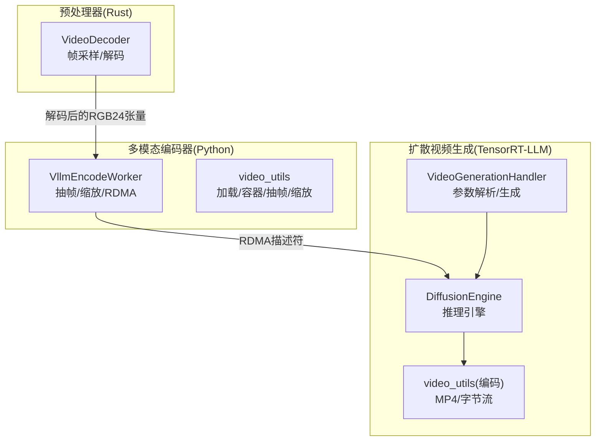
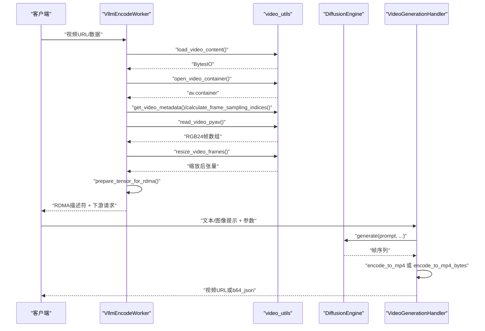
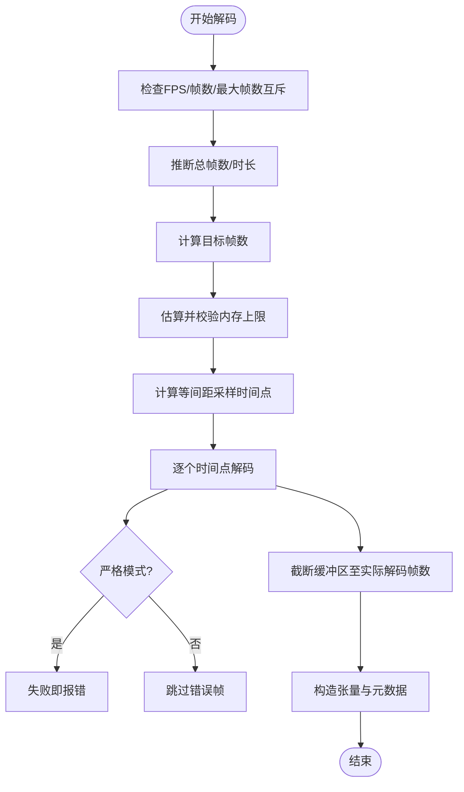
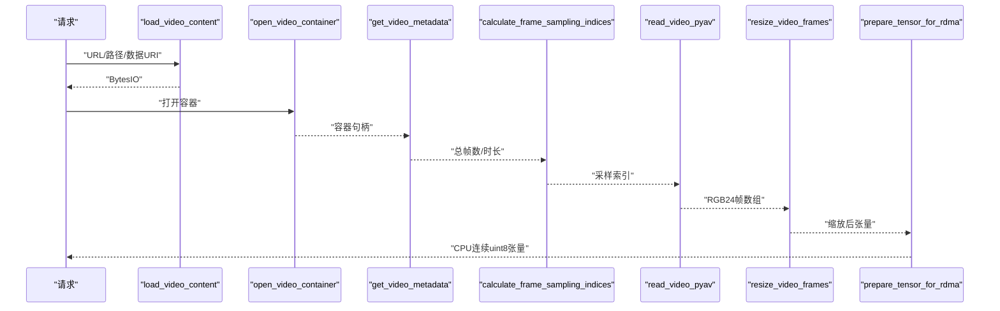
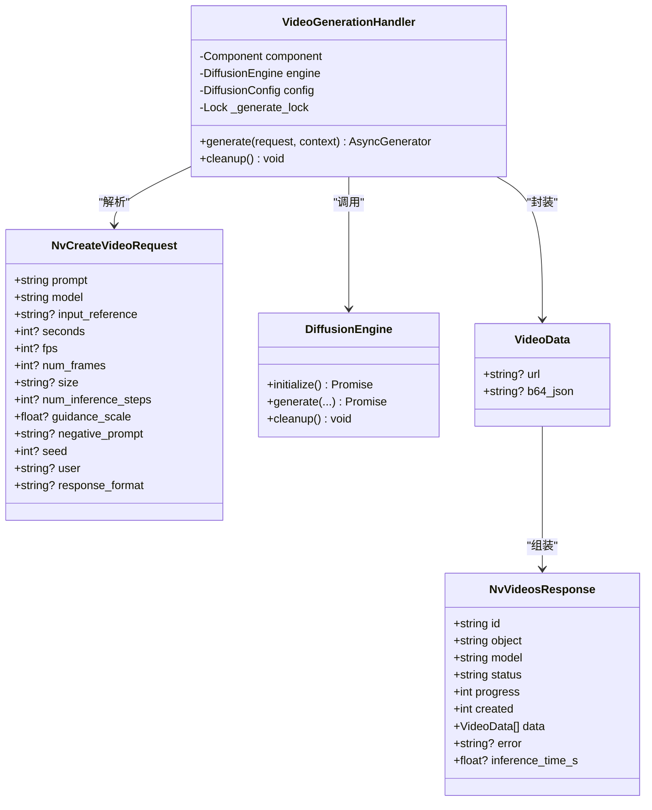
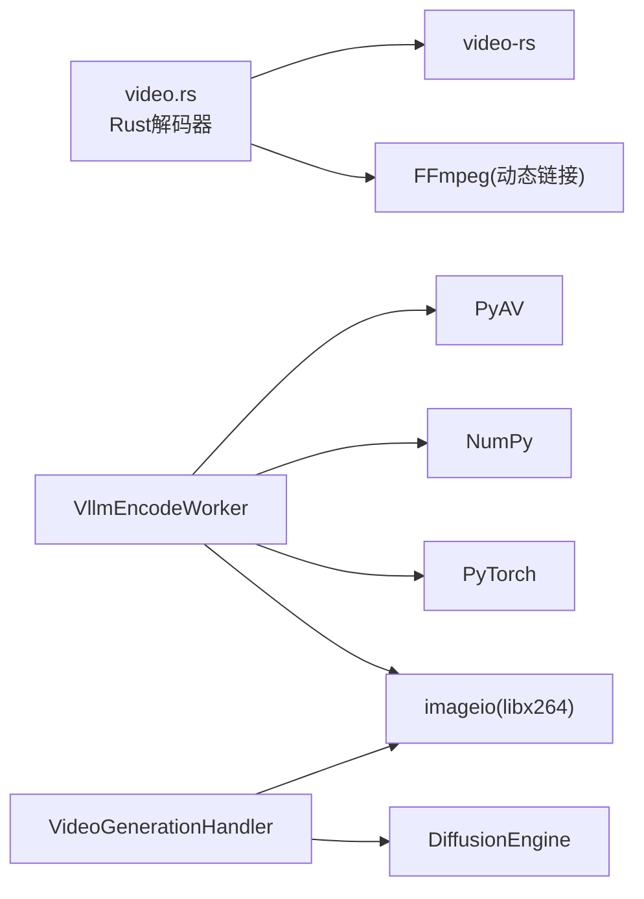

# 视频处理

<cite>
**本文引用的文件**
- [lib/llm/src/preprocessor/media/decoders/video.rs](file://lib/llm/src/preprocessor/media/decoders/video.rs)
- [examples/multimodal/components/video_encode_worker.py](file://examples/multimodal/components/video_encode_worker.py)
- [examples/multimodal/utils/video_utils.py](file://examples/multimodal/utils/video_utils.py)
- [components/src/dynamo/trtllm/protocols/video_protocol.py](file://components/src/dynamo/trtllm/protocols/video_protocol.py)
- [components/src/dynamo/trtllm/request_handlers/video_diffusion/video_handler.py](file://components/src/dynamo/trtllm/request_handlers/video_diffusion/video_handler.py)
- [components/src/dynamo/trtllm/request_handlers/video_diffusion/video_utils.py](file://components/src/dynamo/trtllm/request_handlers/video_diffusion/video_utils.py)
- [Cargo.lock](file://Cargo.lock)
- [container/templates/wheel_builder.Dockerfile](file://container/templates/wheel_builder.Dockerfile)
</cite>

## 目录
1. [简介](#简介)
2. [项目结构](#项目结构)
3. [核心组件](#核心组件)
4. [架构总览](#架构总览)
5. [详细组件分析](#详细组件分析)
6. [依赖关系分析](#依赖关系分析)
7. [性能考量](#性能考量)
8. [故障排查指南](#故障排查指南)
9. [结论](#结论)
10. [附录](#附录)

## 简介
本技术文档系统性阐述Dynamo在视频处理方面的实现与设计，覆盖以下关键能力：
- 视频帧提取：基于时间戳采样与帧索引计算，支持按帧数或按FPS采样，并具备严格解码模式与内存上限保护。
- 格式解析与预处理：通过FFmpeg生态（Rust侧video-rs与Python侧PyAV）解析容器与编解码元数据，统一输出RGB24张量。
- 编码器工作流：多模态编码器将视频转为可RDMA传输的张量；扩散模型视频生成端到端流水线。
- 关键帧选择与时序处理：等间距采样与边界安全处理，避免边缘时间点越界。
- 分辨率转换、帧率调整与压缩优化：使用PyTorch插值进行尺寸归一化，MP4编码采用libx264。
- 数据流管理、并发与内存优化：异步I/O、缓存与队列、线程池隔离、锁串行化扩散管线。
- 格式支持与编码参数配置：FFmpeg/Libav/图像库依赖与容器/编码器构建选项。

## 项目结构
Dynamo视频处理由三层组成：
- 预处理器（Rust）：负责视频解码、帧采样与元数据封装，面向高性能与内存安全。
- 多模态编码器（Python）：负责从URL/本地/数据URI加载视频、抽帧、缩放、RDMA准备与下游转发。
- 扩散视频生成（Python/TensorRT-LLM）：接收文本/图像提示，生成视频帧，再编码为MP4或返回字节流。

图表来源
- [lib/llm/src/preprocessor/media/decoders/video.rs](file://lib/llm/src/preprocessor/media/decoders/video.rs#L202-L307)
- [examples/multimodal/components/video_encode_worker.py](file://examples/multimodal/components/video_encode_worker.py#L82-L196)
- [examples/multimodal/utils/video_utils.py](file://examples/multimodal/utils/video_utils.py#L37-L153)
- [components/src/dynamo/trtllm/request_handlers/video_diffusion/video_handler.py](file://components/src/dynamo/trtllm/request_handlers/video_diffusion/video_handler.py#L156-L273)
- [components/src/dynamo/trtllm/request_handlers/video_diffusion/video_utils.py](file://components/src/dynamo/trtllm/request_handlers/video_diffusion/video_utils.py#L18-L77)

章节来源
- [lib/llm/src/preprocessor/media/decoders/video.rs](file://lib/llm/src/preprocessor/media/decoders/video.rs#L1-L60)
- [examples/multimodal/components/video_encode_worker.py](file://examples/multimodal/components/video_encode_worker.py#L57-L80)
- [components/src/dynamo/trtllm/request_handlers/video_diffusion/video_handler.py](file://components/src/dynamo/trtllm/request_handlers/video_diffusion/video_handler.py#L33-L64)

## 核心组件
- Rust视频解码器（VideoDecoder）
  - 支持按帧数或按FPS采样，自动推断总帧数与时长，限制最大分配内存，严格模式下失败即报错。
  - 基于video-rs与FFmpeg，通过内存文件句柄解码，按目标时间戳顺序抽取帧，输出RGB24张量与采样时间戳。
- Python多模态编码器（VllmEncodeWorker + video_utils）
  - 支持HTTP/HTTPS/本地/数据URI视频源，带缓存与队列淘汰；使用PyAV解码指定索引帧；PyTorch双线性插值缩放；准备CPU连续uint8张量用于RDMA。
- 扩散视频生成（VideoGenerationHandler + DiffusionEngine + 编码工具）
  - 解析请求参数（尺寸、帧数、步数、CFG），串行化访问扩散引擎，生成帧后以MP4文件或base64字节流返回。

章节来源
- [lib/llm/src/preprocessor/media/decoders/video.rs](file://lib/llm/src/preprocessor/media/decoders/video.rs#L42-L104)
- [examples/multimodal/utils/video_utils.py](file://examples/multimodal/utils/video_utils.py#L289-L355)
- [components/src/dynamo/trtllm/request_handlers/video_diffusion/video_handler.py](file://components/src/dynamo/trtllm/request_handlers/video_diffusion/video_handler.py#L121-L154)

## 架构总览
Dynamo视频处理的关键流程包括：
- 输入视频加载与容器打开（HTTP/本地/数据URI → BytesIO → PyAV）
- 元数据解析（总帧数、时长）
- 帧采样策略（等间距索引）
- 抽帧与缩放（PyAV解码 + PyTorch插值）
- 张量准备与RDMA传输
- 扩散视频生成（文本/图像提示 → 推理 → MP4编码）

图表来源
- [examples/multimodal/components/video_encode_worker.py](file://examples/multimodal/components/video_encode_worker.py#L82-L196)
- [examples/multimodal/utils/video_utils.py](file://examples/multimodal/utils/video_utils.py#L37-L153)
- [components/src/dynamo/trtllm/request_handlers/video_diffusion/video_handler.py](file://components/src/dynamo/trtllm/request_handlers/video_diffusion/video_handler.py#L156-L273)
- [components/src/dynamo/trtllm/request_handlers/video_diffusion/video_utils.py](file://components/src/dynamo/trtllm/request_handlers/video_diffusion/video_utils.py#L18-L77)

## 详细组件分析

### Rust视频解码器（VideoDecoder）
- 关键特性
  - 采样策略：优先按FPS采样（帧数=时长×目标FPS），否则按指定帧数；支持最大帧数上限；严格模式失败即报错。
  - 时间戳采样：等间距计算目标时间点，避免边界误差；支持顺序解码与随机seek回退。
  - 内存保护：根据目标帧数与分辨率估算总字节数，超过上限则拒绝解码。
  - 输出：4维RGB24张量与采样时间戳列表，封装为统一媒体数据结构。
- 错误处理
  - 不支持同时设置FPS与帧数；无法确定总帧数或时长时报错；解码失败在非严格模式下跳过但不中断。
- 性能要点
  - 使用内存文件句柄减少磁盘IO；按需seek与顺序解码结合，降低重复扫描成本。

图表来源
- [lib/llm/src/preprocessor/media/decoders/video.rs](file://lib/llm/src/preprocessor/media/decoders/video.rs#L69-L133)
- [lib/llm/src/preprocessor/media/decoders/video.rs](file://lib/llm/src/preprocessor/media/decoders/video.rs#L214-L307)

章节来源
- [lib/llm/src/preprocessor/media/decoders/video.rs](file://lib/llm/src/preprocessor/media/decoders/video.rs#L42-L104)
- [lib/llm/src/preprocessor/media/decoders/video.rs](file://lib/llm/src/preprocessor/media/decoders/video.rs#L214-L307)

### Python多模态编码器（VllmEncodeWorker + video_utils）
- 输入支持
  - HTTP/HTTPS/本地文件/数据URI（要求video/或octet-stream且base64）。
- 容器与元数据
  - 使用PyAV打开容器；提取总帧数与时长；对空帧计数场景给出警告与降级策略。
- 帧采样
  - 若总帧数不足，按请求帧数等间距采样；确保索引唯一并做边界保护。
- 抽帧与缩放
  - PyAV解码指定索引帧为RGB24；PyTorch双线性插值缩放到固定尺寸。
- RDMA准备
  - 转换为CPU连续uint8张量，供NIXL/RDMA传输。
- 并发与缓存
  - 异步下载与解码；HTTP内容缓存与队列淘汰；容器关闭在finally中保证释放。

图表来源
- [examples/multimodal/utils/video_utils.py](file://examples/multimodal/utils/video_utils.py#L37-L153)
- [examples/multimodal/utils/video_utils.py](file://examples/multimodal/utils/video_utils.py#L289-L355)
- [examples/multimodal/utils/video_utils.py](file://examples/multimodal/utils/video_utils.py#L358-L387)
- [examples/multimodal/utils/video_utils.py](file://examples/multimodal/utils/video_utils.py#L390-L415)
- [examples/multimodal/components/video_encode_worker.py](file://examples/multimodal/components/video_encode_worker.py#L82-L196)

章节来源
- [examples/multimodal/components/video_encode_worker.py](file://examples/multimodal/components/video_encode_worker.py#L57-L80)
- [examples/multimodal/utils/video_utils.py](file://examples/multimodal/utils/video_utils.py#L37-L153)
- [examples/multimodal/utils/video_utils.py](file://examples/multimodal/utils/video_utils.py#L289-L355)

### 扩散视频生成（VideoGenerationHandler + DiffusionEngine + 编码工具）
- 请求协议
  - 支持prompt、模型名、输入参考（图像）、秒数、FPS、帧数、尺寸(WxH)、推理步数、CFG、负向提示、种子、用户标识、响应格式（url/b64_json）。
- 参数解析与验证
  - 尺寸解析与最大宽高校验；帧数优先级：显式num_frames > 秒数×FPS > 默认值；步数与CFG采用默认配置。
- 生成与编码
  - 串行化访问扩散引擎，避免全局状态竞争；根据响应格式输出MP4文件路径或base64字节流。
- 编码工具
  - 使用imageio写入MP4（libx264），支持v3/v2 API；也可写入内存字节流。

图表来源
- [components/src/dynamo/trtllm/protocols/video_protocol.py](file://components/src/dynamo/trtllm/protocols/video_protocol.py#L15-L107)
- [components/src/dynamo/trtllm/request_handlers/video_diffusion/video_handler.py](file://components/src/dynamo/trtllm/request_handlers/video_diffusion/video_handler.py#L33-L64)
- [components/src/dynamo/trtllm/request_handlers/video_diffusion/video_handler.py](file://components/src/dynamo/trtllm/request_handlers/video_diffusion/video_handler.py#L156-L273)
- [components/src/dynamo/trtllm/request_handlers/video_diffusion/video_utils.py](file://components/src/dynamo/trtllm/request_handlers/video_diffusion/video_utils.py#L18-L77)

章节来源
- [components/src/dynamo/trtllm/protocols/video_protocol.py](file://components/src/dynamo/trtllm/protocols/video_protocol.py#L15-L107)
- [components/src/dynamo/trtllm/request_handlers/video_diffusion/video_handler.py](file://components/src/dynamo/trtllm/request_handlers/video_diffusion/video_handler.py#L121-L154)
- [components/src/dynamo/trtllm/request_handlers/video_diffusion/video_utils.py](file://components/src/dynamo/trtllm/request_handlers/video_diffusion/video_utils.py#L79-L136)

## 依赖关系分析
- Rust解码依赖
  - video-rs（基于ffmpeg-next）负责容器打开、解码迭代与时间戳解析。
  - 内存文件句柄用于将字节流暴露给FFmpeg。
- Python编码依赖
  - PyAV：容器打开与帧解码。
  - NumPy/PyTorch：张量操作与插值。
  - imageio：MP4编码（libx264）。
- 构建与运行
  - FFmpeg可通过Docker模板从源码构建，启用共享库与必要编解码器/复用器。
  - Cargo.lock显示video-rs版本与上游依赖。

图表来源
- [Cargo.lock](file://Cargo.lock#L10538-L10546)
- [container/templates/wheel_builder.Dockerfile](file://container/templates/wheel_builder.Dockerfile#L146-L186)
- [examples/multimodal/utils/video_utils.py](file://examples/multimodal/utils/video_utils.py#L26-L32)
- [components/src/dynamo/trtllm/request_handlers/video_diffusion/video_utils.py](file://components/src/dynamo/trtllm/request_handlers/video_diffusion/video_utils.py#L40-L49)

章节来源
- [Cargo.lock](file://Cargo.lock#L10538-L10546)
- [container/templates/wheel_builder.Dockerfile](file://container/templates/wheel_builder.Dockerfile#L146-L186)

## 性能考量
- 解码与采样
  - 等间距采样减少随机seek次数；严格模式避免部分帧损坏导致的不一致。
  - 内存上限保护防止超大视频导致OOM。
- 抽帧与缩放
  - PyAV仅解码所需索引帧，避免全量解码；PyTorch插值批量处理提升吞吐。
- 编码与传输
  - MP4编码使用libx264；RDMA前强制CPU连续uint8，降低跨设备拷贝成本。
- 并发与串行化
  - 扩散引擎通过锁串行化，避免CUDA图缓存与全局状态竞争；其他阶段保持异步I/O与线程池隔离。

## 故障排查指南
- 解码失败
  - 检查是否同时设置了FPS与帧数；确认视频时长/帧数元数据可用；在严格模式下逐帧定位问题帧。
- 抽帧为空
  - 确认采样索引未越界；若容器为空或索引无效，尝试重置容器并重新统计可解码帧数。
- 缩放异常
  - 确保输入张量通道在最后维度；检查目标尺寸与原尺寸一致性。
- 编码失败
  - 确认imageio安装与FFmpeg可用；检查输出目录权限；查看日志中的具体错误信息。
- 扩散生成卡顿
  - 检查尺寸是否超过最大宽高限制；确认串行锁未被长时间占用；关注推理耗时指标。

章节来源
- [lib/llm/src/preprocessor/media/decoders/video.rs](file://lib/llm/src/preprocessor/media/decoders/video.rs#L214-L307)
- [examples/multimodal/utils/video_utils.py](file://examples/multimodal/utils/video_utils.py#L214-L286)
- [components/src/dynamo/trtllm/request_handlers/video_diffusion/video_handler.py](file://components/src/dynamo/trtllm/request_handlers/video_diffusion/video_handler.py#L96-L120)
- [components/src/dynamo/trtllm/request_handlers/video_diffusion/video_utils.py](file://components/src/dynamo/trtllm/request_handlers/video_diffusion/video_utils.py#L40-L76)

## 结论
Dynamo的视频处理体系在不同层实现了职责分离：Rust层专注高效解码与内存保护，Python层负责多源加载、抽帧与张量准备，TensorRT-LLM层完成扩散生成与编码输出。整体方案兼顾了灵活性、可扩展性与性能，适合在多模态与视频生成场景中部署。

## 附录
- 视频格式支持
  - 通过FFmpeg生态（video-rs/PyAV）支持常见容器与编解码器；建议使用标准MP4/H.264。
- 编码参数配置
  - 尺寸：WxH字符串，受最大宽高限制；
  - 帧数：显式num_frames优先；否则由秒数×FPS计算；均值时采用默认配置；
  - 响应格式：url（保存文件）或b64_json（内存字节流）。
- 运行环境
  - FFmpeg需启用libx264与必要复用器；imageio需安装ffmpeg支持；PyAV需正确链接FFmpeg。