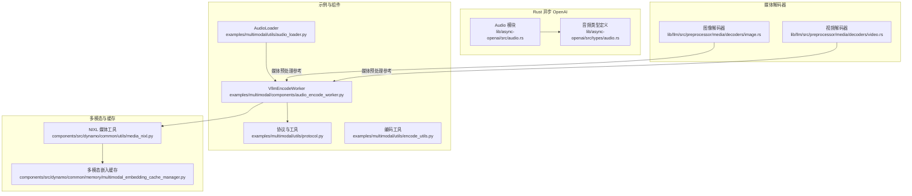
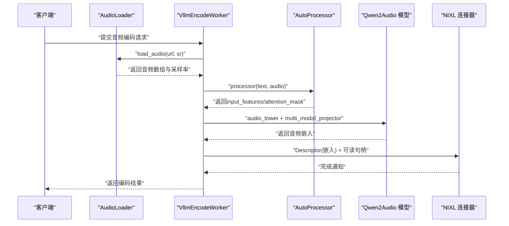
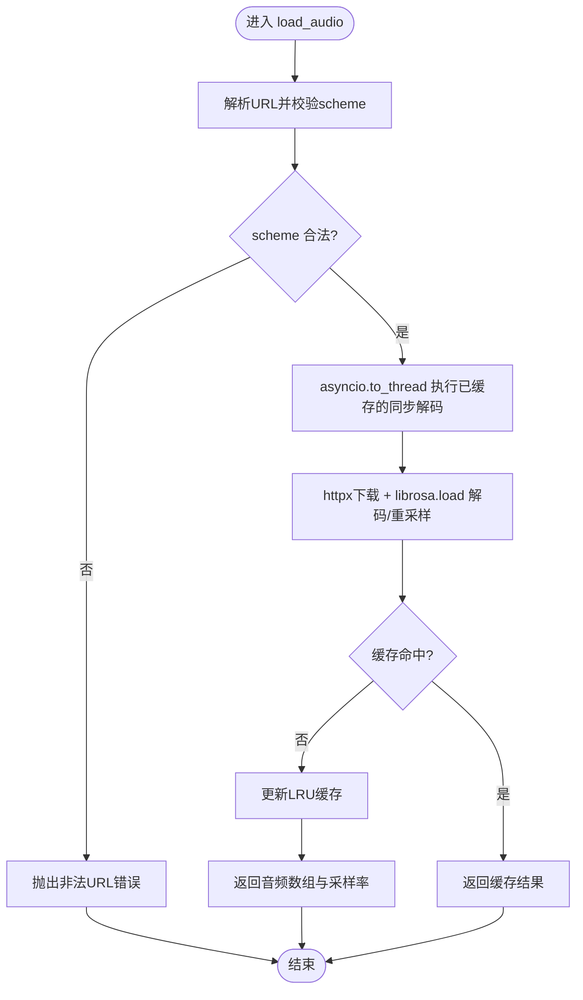
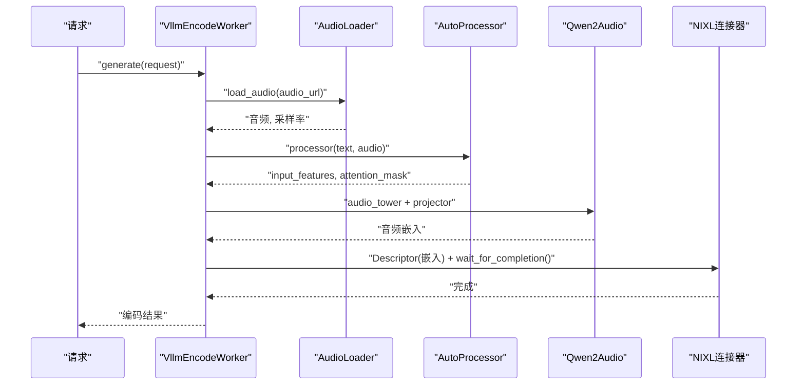
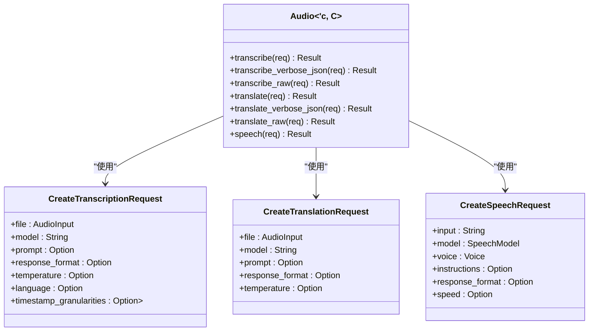
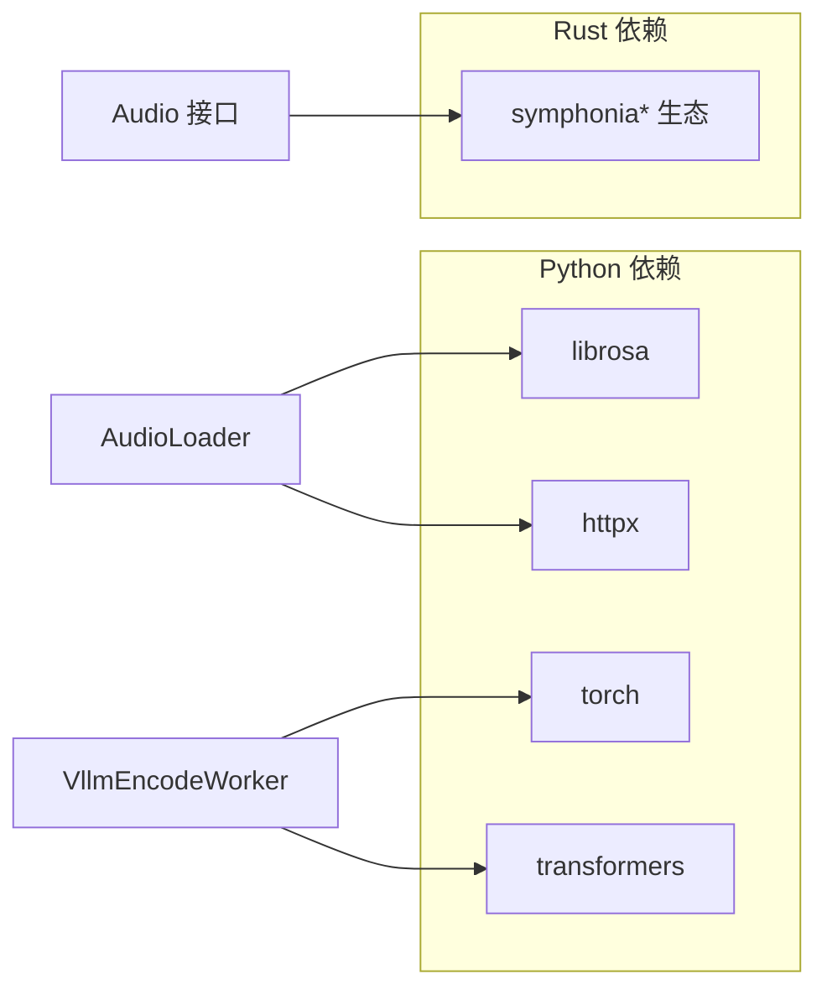

# 音频处理

<cite>
**本文引用的文件**   
- [examples/multimodal/utils/audio_loader.py](file://examples/multimodal/utils/audio_loader.py)
- [examples/multimodal/components/audio_encode_worker.py](file://examples/multimodal/components/audio_encode_worker.py)
- [lib/async-openai/src/audio.rs](file://lib/async-openai/src/audio.rs)
- [lib/async-openai/src/types/audio.rs](file://lib/async-openai/src/types/audio.rs)
- [Cargo.lock](file://Cargo.lock)
- [lib/llm/src/preprocessor/media/decoders/image.rs](file://lib/llm/src/preprocessor/media/decoders/image.rs)
- [lib/llm/src/preprocessor/media/decoders/video.rs](file://lib/llm/src/preprocessor/media/decoders/video.rs)
- [examples/multimodal/utils/encode_utils.py](file://examples/multimodal/utils/encode_utils.py)
- [examples/multimodal/utils/protocol.py](file://examples/multimodal/utils/protocol.py)
- [examples/multimodal/utils/chat_processor.py](file://examples/multimodal/utils/chat_processor.py)
- [components/src/dynamo/common/utils/media_nixl.py](file://components/src/dynamo/common/utils/media_nixl.py)
- [components/src/dynamo/common/memory/multimodal_embedding_cache_manager.py](file://components/src/dynamo/common/memory/multimodal_embedding_cache_manager.py)
</cite>

## 目录
1. [简介](#简介)
2. [项目结构](#项目结构)
3. [核心组件](#核心组件)
4. [架构总览](#架构总览)
5. [详细组件分析](#详细组件分析)
6. [依赖关系分析](#依赖关系分析)
7. [性能考量](#性能考量)
8. [故障排查指南](#故障排查指南)
9. [结论](#结论)
10. [附录](#附录)

## 简介
本技术文档聚焦Dynamo中的音频处理能力，覆盖从音频文件加载、格式解析与预处理，到编码器工作流程、特征提取与向量化，再到采样率转换、声道处理与质量控制。同时，文档阐述音频数据流处理、缓冲区管理与实时处理优化策略，并提供多格式支持与编码器配置指南，帮助读者在不同后端（Python Transformers与Rust OpenAI接口）下高效集成与调优音频处理链路。

## 项目结构
围绕音频处理的关键代码分布在以下区域：
- 示例与组件：音频加载器、编码器工作器、协议与工具
- Rust异步OpenAI接口：音频转写、翻译、语音合成等类型与请求定义
- 媒体解码器（图像/视频）：作为媒体预处理与解码的参考实现
- 多模态嵌入缓存与NIXL连接：跨进程/跨节点的数据传输与缓存

**图表来源**
- [examples/multimodal/utils/audio_loader.py](file://examples/multimodal/utils/audio_loader.py#L30-L81)
- [examples/multimodal/components/audio_encode_worker.py](file://examples/multimodal/components/audio_encode_worker.py#L58-L198)
- [lib/async-openai/src/audio.rs](file://lib/async-openai/src/audio.rs#L27-L121)
- [lib/async-openai/src/types/audio.rs](file://lib/async-openai/src/types/audio.rs#L18-L267)
- [lib/llm/src/preprocessor/media/decoders/image.rs](file://lib/llm/src/preprocessor/media/decoders/image.rs#L73-L106)
- [lib/llm/src/preprocessor/media/decoders/video.rs](file://lib/llm/src/preprocessor/media/decoders/video.rs#L346-L366)
- [components/src/dynamo/common/utils/media_nixl.py](file://components/src/dynamo/common/utils/media_nixl.py)
- [components/src/dynamo/common/memory/multimodal_embedding_cache_manager.py](file://components/src/dynamo/common/memory/multimodal_embedding_cache_manager.py)

**章节来源**
- [examples/multimodal/utils/audio_loader.py](file://examples/multimodal/utils/audio_loader.py#L30-L81)
- [examples/multimodal/components/audio_encode_worker.py](file://examples/multimodal/components/audio_encode_worker.py#L58-L198)
- [lib/async-openai/src/audio.rs](file://lib/async-openai/src/audio.rs#L27-L121)
- [lib/async-openai/src/types/audio.rs](file://lib/async-openai/src/types/audio.rs#L18-L267)
- [lib/llm/src/preprocessor/media/decoders/image.rs](file://lib/llm/src/preprocessor/media/decoders/image.rs#L73-L106)
- [lib/llm/src/preprocessor/media/decoders/video.rs](file://lib/llm/src/preprocessor/media/decoders/video.rs#L346-L366)
- [components/src/dynamo/common/utils/media_nixl.py](file://components/src/dynamo/common/utils/media_nixl.py)
- [components/src/dynamo/common/memory/multimodal_embedding_cache_manager.py](file://components/src/dynamo/common/memory/multimodal_embedding_cache_manager.py)

## 核心组件
- 音频加载器（AudioLoader）
  - 支持HTTP/HTTPS远程音频URL加载，基于librosa进行解码与重采样，默认采样率可配置
  - 使用LRU缓存避免重复下载与解码，配合线程池避免阻塞事件循环
- 编码器工作器（VllmEncodeWorker）
  - 负责接收音频请求，调用AudioLoader获取音频与采样率，使用AutoProcessor与Qwen2Audio模型提取音频特征并生成嵌入
  - 通过NIXL连接器将嵌入以Descriptor形式传输至下游组件，随后回传响应
- Rust异步OpenAI音频接口
  - 提供转写、翻译、语音合成功能的请求/响应类型与API封装
  - 定义音频输入源、响应格式、模型与语音选项等参数
- 媒体解码器（图像/视频）
  - 展示了通用的媒体解码与形状元数据输出方式，可作为音频预处理的参考实现模式

**章节来源**
- [examples/multimodal/utils/audio_loader.py](file://examples/multimodal/utils/audio_loader.py#L30-L81)
- [examples/multimodal/components/audio_encode_worker.py](file://examples/multimodal/components/audio_encode_worker.py#L58-L198)
- [lib/async-openai/src/audio.rs](file://lib/async-openai/src/audio.rs#L27-L121)
- [lib/async-openai/src/types/audio.rs](file://lib/async-openai/src/types/audio.rs#L18-L267)
- [lib/llm/src/preprocessor/media/decoders/image.rs](file://lib/llm/src/preprocessor/media/decoders/image.rs#L73-L106)
- [lib/llm/src/preprocessor/media/decoders/video.rs](file://lib/llm/src/preprocessor/media/decoders/video.rs#L346-L366)

## 架构总览
Dynamo音频处理链路由“请求接入 → 音频加载 → 特征提取 → 嵌入生成 → 数据传输 → 下游推理”构成。Python侧负责加载与编码，Rust侧提供OpenAI兼容的音频能力；媒体解码器展示了统一的预处理范式。

**图表来源**
- [examples/multimodal/components/audio_encode_worker.py](file://examples/multimodal/components/audio_encode_worker.py#L137-L198)
- [examples/multimodal/utils/audio_loader.py](file://examples/multimodal/utils/audio_loader.py#L61-L81)

## 详细组件分析

### 组件A：音频加载器（AudioLoader）
- 功能要点
  - URL校验：仅接受http/https协议
  - 异步加载：通过httpx同步下载，再由asyncio.to_thread在线程池中执行，避免阻塞
  - 解码与重采样：使用librosa.load按指定采样率解码
  - 缓存策略：functools.lru_cache对同步解码函数进行缓存，减少重复I/O与CPU开销
- 关键行为
  - 错误处理：捕获HTTP错误与通用异常，记录日志并抛出明确错误
  - 超时控制：内置HTTP超时参数
- 性能与可靠性
  - 线程隔离：避免阻塞事件循环
  - LRU缓存：命中高且稳定的音频URL场景显著降低延迟

**图表来源**
- [examples/multimodal/utils/audio_loader.py](file://examples/multimodal/utils/audio_loader.py#L30-L81)

**章节来源**
- [examples/multimodal/utils/audio_loader.py](file://examples/multimodal/utils/audio_loader.py#L30-L81)

### 组件B：编码器工作器（VllmEncodeWorker）
- 功能要点
  - 初始化：构建AudioLoader、AutoProcessor与Qwen2Audio模型
  - 特征提取：调用audio_tower与multi_modal_projector生成嵌入
  - 注意力掩码：根据特征长度构造padding mask，确保序列对齐
  - 嵌入掩码：按有效长度裁剪嵌入序列
  - 数据传输：通过NIXL Descriptor与可读句柄将嵌入传递给下游
- 关键流程
  - 请求校验与反序列化
  - 调用AudioLoader获取音频
  - AutoProcessor处理文本与音频
  - 模型前向计算与嵌入生成
  - NIXL传输与下游轮询

**图表来源**
- [examples/multimodal/components/audio_encode_worker.py](file://examples/multimodal/components/audio_encode_worker.py#L137-L198)

**章节来源**
- [examples/multimodal/components/audio_encode_worker.py](file://examples/multimodal/components/audio_encode_worker.py#L58-L198)

### 组件C：Rust异步OpenAI音频接口
- 能力范围
  - 转写：支持多种响应格式（json/text/srt/verbose_json/vtt）
  - 翻译：将非英语音频翻译为英语
  - 语音合成：支持多种音频格式（mp3/opus/aac/flac/wav/pcm）
- 类型与参数
  - 输入源：支持字节流、路径、内存向量
  - 响应格式：枚举化，便于严格约束
  - 语音模型与声音：可配置
  - 时间戳粒度：支持word与segment级别
- 实现要点
  - 通过multipart表单上传音频文件
  - 返回原始字节或结构化JSON/文本

**图表来源**
- [lib/async-openai/src/audio.rs](file://lib/async-openai/src/audio.rs#L27-L121)
- [lib/async-openai/src/types/audio.rs](file://lib/async-openai/src/types/audio.rs#L82-L267)

**章节来源**
- [lib/async-openai/src/audio.rs](file://lib/async-openai/src/audio.rs#L27-L121)
- [lib/async-openai/src/types/audio.rs](file://lib/async-openai/src/types/audio.rs#L18-L267)

### 组件D：媒体解码器（图像/视频）与音频预处理参考
- 图像解码器
  - 通过image库猜测格式并解码，输出HWC布局张量与颜色类型元数据
- 视频解码器
  - 支持帧数选择与限制，输出形状与数据类型约定
- 对音频的启示
  - 解码器模式可借鉴：统一输入编码数据 → 解码 → 形状/元数据规范化 → 输出张量
  - 为音频预处理提供一致的抽象与边界检查思路

**章节来源**
- [lib/llm/src/preprocessor/media/decoders/image.rs](file://lib/llm/src/preprocessor/media/decoders/image.rs#L73-L106)
- [lib/llm/src/preprocessor/media/decoders/video.rs](file://lib/llm/src/preprocessor/media/decoders/video.rs#L346-L366)

## 依赖关系分析
- Python侧
  - librosa用于音频解码与重采样
  - httpx用于HTTP下载
  - transformers（AutoProcessor/Qwen2Audio）用于特征提取与嵌入
  - torch用于模型推理与掩码构造
- Rust侧
  - symphonia生态用于音频格式解析（FLAC/MP3/Vorbis/PCM/OGG/RIFF/iSAP4等）
  - async-openai类型与API封装用于转写/翻译/语音合成

**图表来源**
- [Cargo.lock](file://Cargo.lock#L8863-L8974)
- [examples/multimodal/utils/audio_loader.py](file://examples/multimodal/utils/audio_loader.py#L24-L25)
- [examples/multimodal/components/audio_encode_worker.py](file://examples/multimodal/components/audio_encode_worker.py#L26-L27)

**章节来源**
- [Cargo.lock](file://Cargo.lock#L8863-L8974)
- [examples/multimodal/utils/audio_loader.py](file://examples/multimodal/utils/audio_loader.py#L24-L25)
- [examples/multimodal/components/audio_encode_worker.py](file://examples/multimodal/components/audio_encode_worker.py#L26-L27)

## 性能考量
- I/O与解码
  - 使用线程池执行librosa解码，避免阻塞事件循环
  - LRU缓存减少重复下载与解码，适合重复请求场景
- 推理与掩码
  - 注意力掩码与嵌入掩码需与设备/精度匹配，避免额外拷贝与类型转换
  - 在GPU可用时优先使用CUDA后端（如cupy），否则回退numpy
- 数据传输
  - 通过NIXL Descriptor与可读句柄进行零拷贝/低拷贝传输，减少内存占用
- 实时性
  - 控制批大小与帧数，结合下游组件的并发能力进行吞吐调优
  - 对于长音频，考虑分段处理与滑动窗口策略

[本节为通用指导，不直接分析具体文件]

## 故障排查指南
- URL与网络
  - 确认URL scheme为http/https；检查网络连通性与超时设置
- 解码失败
  - 检查音频格式是否受librosa支持；确认采样率参数合法
- 推理异常
  - 核对AutoProcessor与模型版本一致性；检查dtype与设备映射
- 数据传输
  - 确认NIXL连接器初始化与实例等待完成；关注Descriptor元数据与形状
- 日志与错误
  - 关注加载器与工作器的日志输出，定位HTTP错误与通用异常

**章节来源**
- [examples/multimodal/utils/audio_loader.py](file://examples/multimodal/utils/audio_loader.py#L65-L81)
- [examples/multimodal/components/audio_encode_worker.py](file://examples/multimodal/components/audio_encode_worker.py#L195-L198)

## 结论
Dynamo的音频处理以“异步加载 + 特征提取 + 嵌入传输”为核心路径，结合Rust侧的OpenAI兼容接口与symphonia生态，形成跨语言、跨格式的音频处理能力。通过线程池、LRU缓存、注意力掩码与NIXL传输等手段，系统在保证实时性的同时兼顾稳定性与扩展性。建议在生产环境中结合缓存策略、批处理与分段处理进一步优化吞吐与延迟。

[本节为总结性内容，不直接分析具体文件]

## 附录

### 音频格式支持与编码器配置指南
- Python侧（librosa）
  - 支持常见音频格式（如wav、mp3、flac、webm等），通过librosa.load自动识别与解码
  - 采样率默认值可在AudioLoader中调整；建议与下游模型期望一致
- Rust侧（symphonia）
  - 内置对FLAC/MP3/Vorbis/PCM/OGG/RIFF/iSAP4等格式的支持
  - 可用于离线转写/翻译与语音合成的前置解码
- 编码器配置
  - Processor：确保文本与音频输入对齐，正确设置padding与attention_mask
  - 模型：选择合适的Qwen2Audio模型，注意dtype与设备映射
  - 响应格式：根据下游需求选择json/text/srt/verbose_json/vtt或语音合成格式

**章节来源**
- [examples/multimodal/utils/audio_loader.py](file://examples/multimodal/utils/audio_loader.py#L43-L59)
- [lib/async-openai/src/types/audio.rs](file://lib/async-openai/src/types/audio.rs#L88-L109)
- [Cargo.lock](file://Cargo.lock#L8863-L8974)