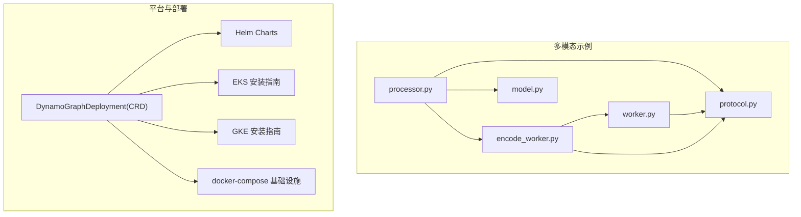
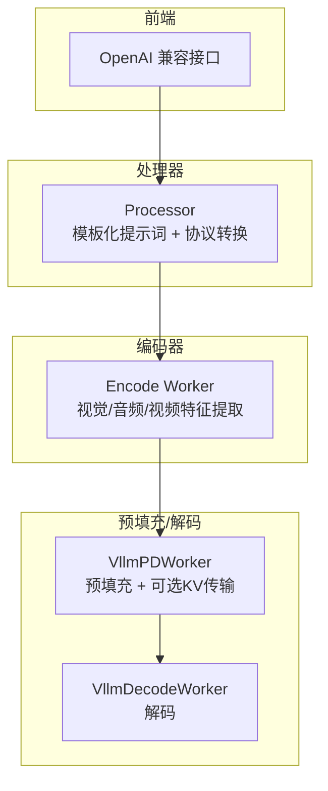
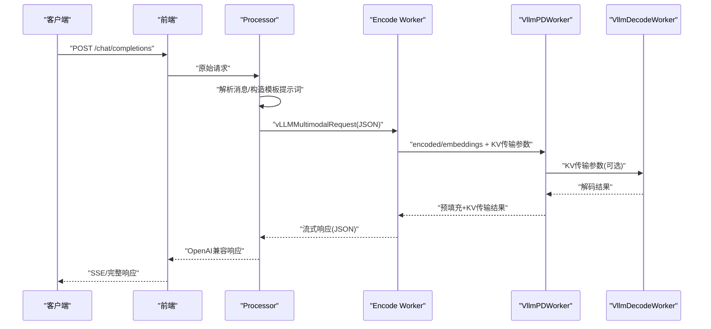
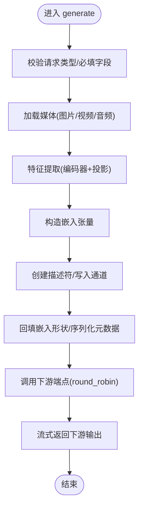
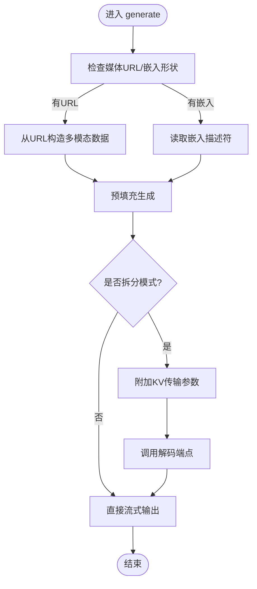
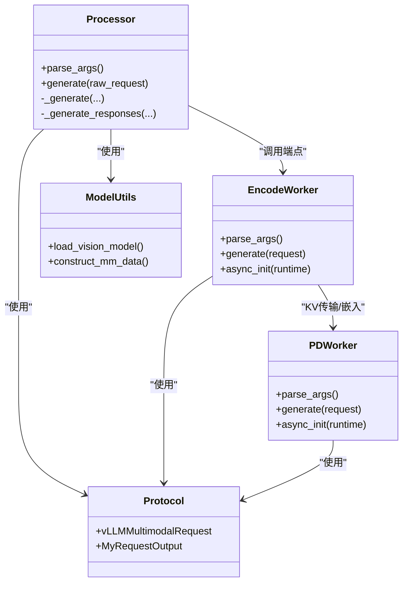

# 部署示例与最佳实践

<cite>
**本文引用的文件**
- [README.md](file://README.md)
- [examples/multimodal/deploy/agg_llava.yaml](file://examples/multimodal/deploy/agg_llava.yaml)
- [examples/multimodal/deploy/agg_qwen.yaml](file://examples/multimodal/deploy/agg_qwen.yaml)
- [examples/multimodal/components/encode_worker.py](file://examples/multimodal/components/encode_worker.py)
- [examples/multimodal/components/worker.py](file://examples/multimodal/components/worker.py)
- [examples/multimodal/components/processor.py](file://examples/multimodal/components/processor.py)
- [examples/multimodal/utils/model.py](file://examples/multimodal/utils/model.py)
- [examples/multimodal/utils/protocol.py](file://examples/multimodal/utils/protocol.py)
- [deploy/operator/api/v1alpha1/dynamographdeployment_types.go](file://deploy/operator/api/v1alpha1/dynamographdeployment_types.go)
- [deploy/helm/README.md](file://deploy/helm/README.md)
- [examples/deployments/EKS/Deploy_Dynamo_Kubernetes_Platform.md](file://examples/deployments/EKS/Deploy_Dynamo_Kubernetes_Platform.md)
- [examples/deployments/GKE/README.md](file://examples/deployments/GKE/README.md)
- [deploy/docker-compose.yml](file://deploy/docker-compose.yml)
</cite>

## 目录
1. [简介](#简介)
2. [项目结构](#项目结构)
3. [核心组件](#核心组件)
4. [架构总览](#架构总览)
5. [详细组件分析](#详细组件分析)
6. [依赖关系分析](#依赖关系分析)
7. [性能考量](#性能考量)
8. [故障排查指南](#故障排查指南)
9. [结论](#结论)
10. [附录](#附录)

## 简介
本指南面向在生产环境中使用Dynamo进行多模态（图像/视频/音频）推理部署的工程师与平台团队。文档以仓库中的多模态示例为基础，结合Dynamo的分布式推理能力，提供从本地快速验证到Kubernetes集群部署的完整实践路径，并覆盖资源配置、服务发现与负载均衡、监控与可观测性、以及生产级安全与稳定性建议。

## 项目结构
围绕多模态部署，关键目录与文件如下：
- 多模态示例：examples/multimodal
  - 组件：encode_worker.py、worker.py、processor.py
  - 工具：model.py、protocol.py
  - 部署：deploy/agg_llava.yaml、deploy/agg_qwen.yaml
- 平台与Operator：deploy/operator
  - CRD定义：DynamoGraphDeployment
- 平台安装与示例：deploy/helm、examples/deployments
- 本地基础设施：deploy/docker-compose.yml

图表来源
- [examples/multimodal/components/processor.py](file://examples/multimodal/components/processor.py#L1-L348)
- [examples/multimodal/components/encode_worker.py](file://examples/multimodal/components/encode_worker.py#L1-L265)
- [examples/multimodal/components/worker.py](file://examples/multimodal/components/worker.py#L1-L475)
- [examples/multimodal/utils/model.py](file://examples/multimodal/utils/model.py#L1-L92)
- [examples/multimodal/utils/protocol.py](file://examples/multimodal/utils/protocol.py#L1-L191)
- [deploy/operator/api/v1alpha1/dynamographdeployment_types.go](file://deploy/operator/api/v1alpha1/dynamographdeployment_types.go#L47-L69)
- [deploy/helm/README.md](file://deploy/helm/README.md#L18-L23)
- [examples/deployments/EKS/Deploy_Dynamo_Kubernetes_Platform.md](file://examples/deployments/EKS/Deploy_Dynamo_Kubernetes_Platform.md#L1-L97)
- [examples/deployments/GKE/README.md](file://examples/deployments/GKE/README.md#L1-L189)
- [deploy/docker-compose.yml](file://deploy/docker-compose.yml#L1-L36)

章节来源
- [README.md](file://README.md#L216-L242)
- [examples/multimodal/deploy/agg_llava.yaml](file://examples/multimodal/deploy/agg_llava.yaml#L1-L64)
- [examples/multimodal/deploy/agg_qwen.yaml](file://examples/multimodal/deploy/agg_qwen.yaml#L1-L65)

## 核心组件
- 多模态处理器（Processor）
  - 负责将OpenAI风格请求转换为内部vLLM请求格式，构造模板化提示词，提取媒体输入并转发给编码器。
- 编码器工作节点（Encode Worker）
  - 加载视觉模型，对图片/视频/音频进行特征提取，生成嵌入并通过高性能数据通道传输至后续预填充/解码节点。
- 预填充/解码工作节点（Worker）
  - 支持聚合与拆分两种模式；在拆分模式下，先在预填充节点完成KV缓存构建，再将KV传输参数传递给解码节点，实现跨节点的KV缓存复用与加速。
- 协议与模型工具
  - protocol.py：定义可序列化的请求/响应结构，适配vLLM的TokensPrompt/SamplingParams等类型。
  - model.py：封装支持的多模态模型加载与多模态数据构造逻辑。

章节来源
- [examples/multimodal/components/processor.py](file://examples/multimodal/components/processor.py#L48-L348)
- [examples/multimodal/components/encode_worker.py](file://examples/multimodal/components/encode_worker.py#L47-L265)
- [examples/multimodal/components/worker.py](file://examples/multimodal/components/worker.py#L47-L475)
- [examples/multimodal/utils/protocol.py](file://examples/multimodal/utils/protocol.py#L73-L191)
- [examples/multimodal/utils/model.py](file://examples/multimodal/utils/model.py#L25-L92)

## 架构总览
Dynamo多模态推理图由前端处理器、编码器、预填充/解码工作节点构成。处理器负责协议转换与模板拼接；编码器负责将外部媒体输入转为内部嵌入；预填充/解码节点负责KV缓存构建与生成流式输出。在拆分模式下，KV缓存通过高性能数据通道在节点间传输，减少重复计算。

图表来源
- [examples/multimodal/components/processor.py](file://examples/multimodal/components/processor.py#L196-L263)
- [examples/multimodal/components/encode_worker.py](file://examples/multimodal/components/encode_worker.py#L73-L155)
- [examples/multimodal/components/worker.py](file://examples/multimodal/components/worker.py#L227-L397)

## 详细组件分析

### 多模态处理器（Processor）
- 功能要点
  - 解析OpenAI聊天请求，提取用户文本内容，按模板构造最终提示词。
  - 将消息中的媒体URL抽取为内部MultiModalInput对象。
  - 将构造好的vLLMMultimodalRequest发送给编码器端点，接收编码器返回的流式响应并转换为标准OpenAI格式。
- 关键流程（序列图）

图表来源
- [examples/multimodal/components/processor.py](file://examples/multimodal/components/processor.py#L196-L263)
- [examples/multimodal/components/encode_worker.py](file://examples/multimodal/components/encode_worker.py#L135-L155)
- [examples/multimodal/components/worker.py](file://examples/multimodal/components/worker.py#L327-L397)

章节来源
- [examples/multimodal/components/processor.py](file://examples/multimodal/components/processor.py#L126-L263)

### 编码器工作节点（Encode Worker）
- 功能要点
  - 加载指定模型的视觉/音频/视频编码器与投影模块。
  - 对输入媒体进行特征提取，生成嵌入张量，通过高性能数据通道描述符写入远端，随后将序列化元数据与嵌入形状回填至请求，交由下游处理。
- 关键流程（流程图）

图表来源
- [examples/multimodal/components/encode_worker.py](file://examples/multimodal/components/encode_worker.py#L73-L155)

章节来源
- [examples/multimodal/components/encode_worker.py](file://examples/multimodal/components/encode_worker.py#L47-L155)

### 预填充/解码工作节点（Worker）
- 功能要点
  - 在聚合模式下，直接进行预填充与解码；在拆分模式下，先预填充并生成KV传输参数，再将参数传递给解码节点，实现KV缓存跨节点复用。
  - 支持从嵌入或媒体URL两种输入方式构造多模态数据。
- 关键流程（流程图）

图表来源
- [examples/multimodal/components/worker.py](file://examples/multimodal/components/worker.py#L260-L397)

章节来源
- [examples/multimodal/components/worker.py](file://examples/multimodal/components/worker.py#L194-L397)

### 协议与模型工具
- 协议（protocol.py）
  - 定义vLLMMultimodalRequest、MyRequestOutput等可序列化结构，适配vLLM的TokensPrompt与SamplingParams类型。
- 模型工具（model.py）
  - 提供受支持模型列表与加载函数；根据模型类型构造多模态数据字典，包括图像网格信息、音频/视频嵌入等。

章节来源
- [examples/multimodal/utils/protocol.py](file://examples/multimodal/utils/protocol.py#L73-L191)
- [examples/multimodal/utils/model.py](file://examples/multimodal/utils/model.py#L25-L92)

## 依赖关系分析
- 组件内聚与耦合
  - Processor与Encode Worker之间通过Dynamo命名空间端点通信；Encode Worker与Worker之间通过高性能数据通道共享嵌入。
  - 协议层统一了请求/响应序列化，降低各组件间的耦合度。
- 外部依赖
  - vLLM引擎、NATS（KV事件/前缀缓存协调）、etcd（服务发现，K8s场景可由原生资源替代）。
- Operator与CRD
  - DynamoGraphDeployment作为顶层CRD，定义后端框架、服务集合、重启策略等，驱动平台控制器生成底层Kubernetes资源。

图表来源
- [examples/multimodal/components/processor.py](file://examples/multimodal/components/processor.py#L48-L348)
- [examples/multimodal/components/encode_worker.py](file://examples/multimodal/components/encode_worker.py#L47-L265)
- [examples/multimodal/components/worker.py](file://examples/multimodal/components/worker.py#L47-L475)
- [examples/multimodal/utils/protocol.py](file://examples/multimodal/utils/protocol.py#L157-L191)
- [examples/multimodal/utils/model.py](file://examples/multimodal/utils/model.py#L34-L92)

章节来源
- [deploy/operator/api/v1alpha1/dynamographdeployment_types.go](file://deploy/operator/api/v1alpha1/dynamographdeployment_types.go#L47-L69)

## 性能考量
- 拆分模式与KV缓存复用
  - 预填充与解码分离时，通过KV传输参数将KV块从预填充节点迁移到解码节点，避免重复计算，显著降低TTFT与提升吞吐。
- 嵌入传输优化
  - 使用高性能数据通道描述符传输嵌入，减少网络复制与序列化开销；合理设置NATS最大负载以承载大尺寸嵌入。
- 资源与拓扑
  - GPU显存与批大小需与模型规模匹配；在K8s中为不同组件设置合适的requests/limits与亲和性，避免资源争用。
- 日志与指标
  - 启用统计日志与指标上报，关注KV缓存命中率、前缀命中率、解码延迟分布等关键指标。

章节来源
- [examples/multimodal/components/worker.py](file://examples/multimodal/components/worker.py#L327-L397)
- [deploy/docker-compose.yml](file://deploy/docker-compose.yml#L16-L18)

## 故障排查指南
- 常见问题定位
  - 端点未就绪：确保下游组件已等待实例可用后再发起请求。
  - 媒体输入缺失：检查请求中是否提供了图像/视频/音频URL之一，且模板中包含占位符。
  - 嵌入形状不匹配：确认编码器输出维度与构造多模态数据时的期望一致。
- 运行时信号处理
  - 优雅关闭：通过信号处理触发runtime.shutdown，保证在处理完在途请求后再停止。
- 本地验证
  - 使用docker-compose启动NATS与etcd，验证本地链路连通性与数据通道写入/读取。
- K8s诊断
  - 查看DynamoGraphDeployment状态与条件，确认各服务副本数、就绪状态与重启阶段。

章节来源
- [examples/multimodal/components/processor.py](file://examples/multimodal/components/processor.py#L265-L275)
- [examples/multimodal/components/encode_worker.py](file://examples/multimodal/components/encode_worker.py#L191-L201)
- [examples/multimodal/components/worker.py](file://examples/multimodal/components/worker.py#L399-L409)
- [deploy/docker-compose.yml](file://deploy/docker-compose.yml#L1-L36)
- [deploy/operator/api/v1alpha1/dynamographdeployment_types.go](file://deploy/operator/api/v1alpha1/dynamographdeployment_types.go#L101-L120)

## 结论
通过Dynamo的多模态推理图与拆分模式，可在保持低延迟的同时充分利用多GPU与多节点资源。结合Kubernetes平台与Operator，可以实现声明式的部署与运维；配合完善的监控与告警体系，能够持续保障生产环境的稳定性与性能。

## 附录

### A. 多模态部署清单与步骤
- 聚合模式（示例）
  - 使用聚合YAML定义前端、编码器、VLM工作节点与处理器，设置镜像、资源限制与HuggingFace密钥。
- 拆分模式（示例）
  - 在Worker中启用拆分模式，预填充节点生成KV传输参数，解码节点接收并复用KV块。

章节来源
- [examples/multimodal/deploy/agg_llava.yaml](file://examples/multimodal/deploy/agg_llava.yaml#L1-L64)
- [examples/multimodal/deploy/agg_qwen.yaml](file://examples/multimodal/deploy/agg_qwen.yaml#L1-L65)

### B. Kubernetes部署与平台安装
- Helm图表
  - 平台图表安装Dynamo Operator、NATS、etcd等；CRD图表安装核心CRD。
- EKS安装
  - 构建基础镜像与Operator镜像，创建命名空间与镜像拉取密钥，安装CRDs与平台。
- GKE安装
  - 创建带GPU节点池的集群，设置HuggingFace密钥，安装平台并部署示例推理图。

章节来源
- [deploy/helm/README.md](file://deploy/helm/README.md#L18-L23)
- [examples/deployments/EKS/Deploy_Dynamo_Kubernetes_Platform.md](file://examples/deployments/EKS/Deploy_Dynamo_Kubernetes_Platform.md#L1-L97)
- [examples/deployments/GKE/README.md](file://examples/deployments/GKE/README.md#L1-L189)

### C. 本地开发与验证
- 使用docker-compose快速启动NATS与etcd，验证多模态链路。
- 在本地终端分别启动前端与工作节点，发送OpenAI兼容请求进行端到端测试。

章节来源
- [deploy/docker-compose.yml](file://deploy/docker-compose.yml#L1-L36)
- [README.md](file://README.md#L155-L215)