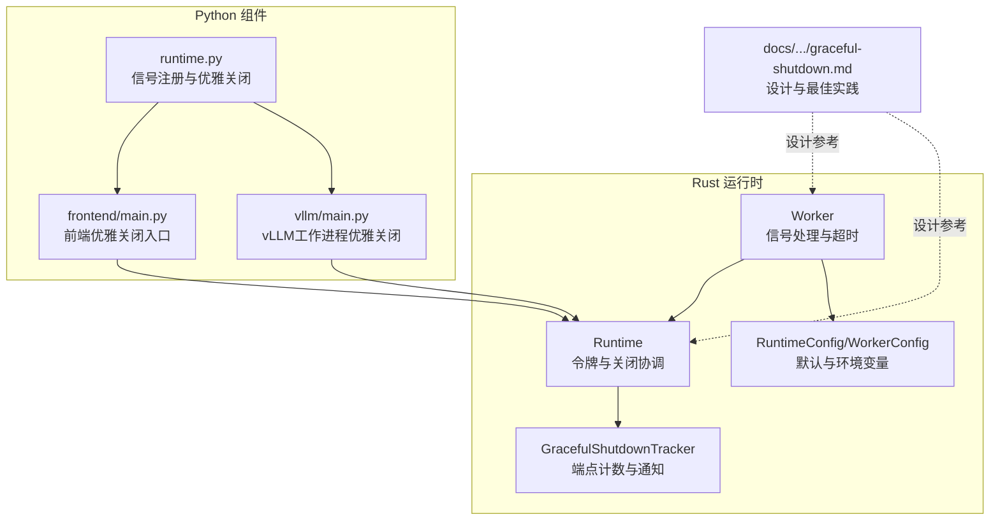
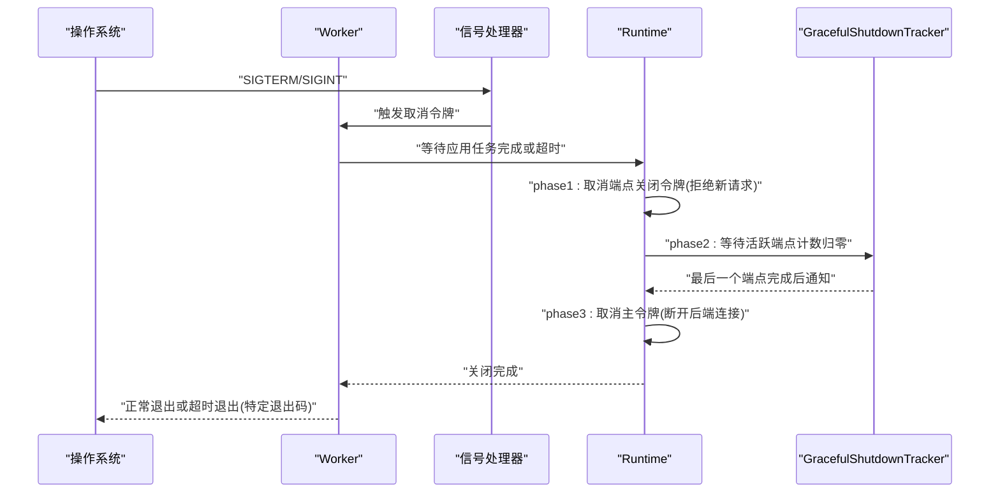
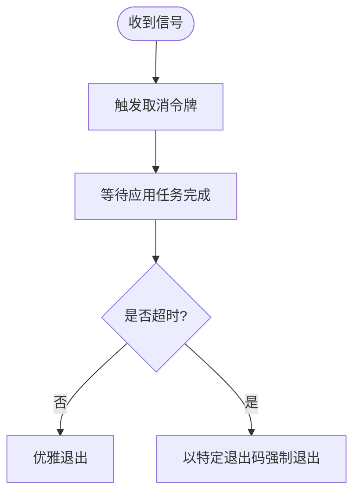
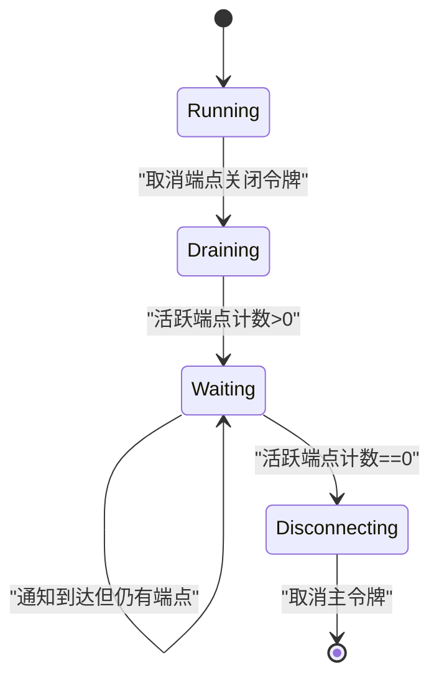
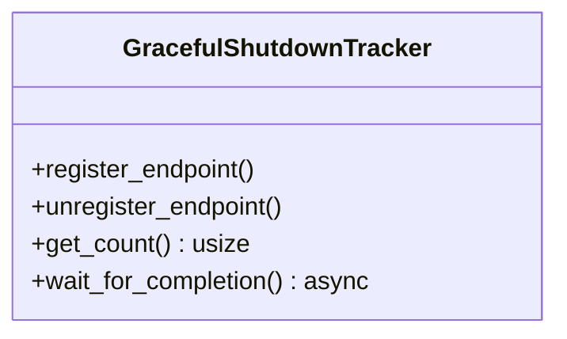
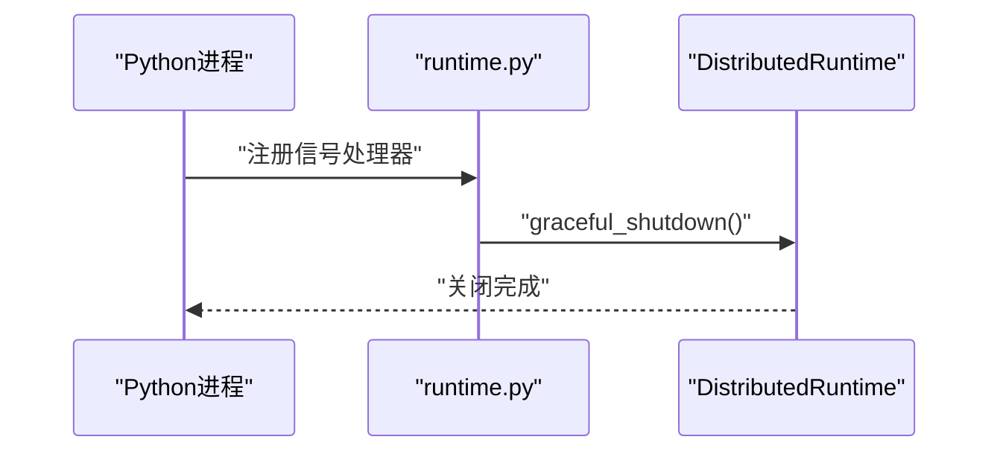
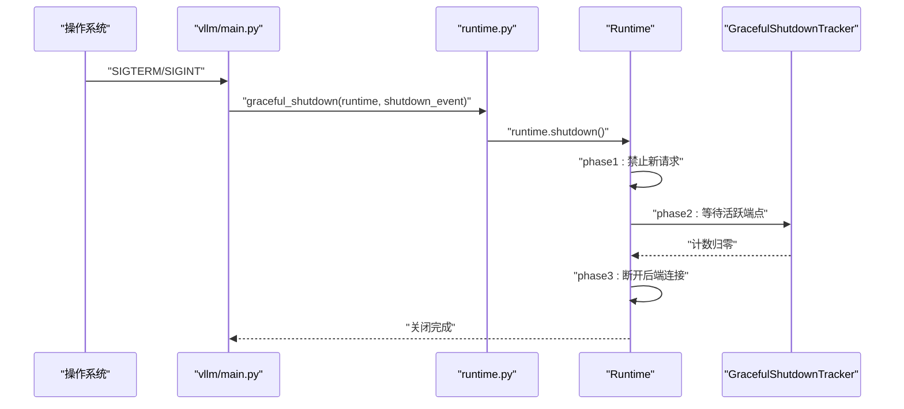
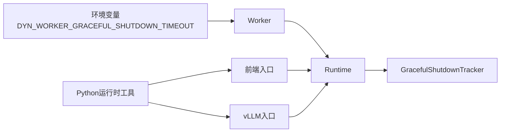

# 优雅关闭

<cite>
**本文引用的文件**
- [lib/runtime/src/worker.rs](file://lib/runtime/src/worker.rs)
- [lib/runtime/src/runtime.rs](file://lib/runtime/src/runtime.rs)
- [lib/runtime/src/utils/graceful_shutdown.rs](file://lib/runtime/src/utils/graceful_shutdown.rs)
- [lib/runtime/src/config.rs](file://lib/runtime/src/config.rs)
- [lib/runtime/src/config/environment_names.rs](file://lib/runtime/src/config/environment_names.rs)
- [components/src/dynamo/common/utils/runtime.py](file://components/src/dynamo/common/utils/runtime.py)
- [components/src/dynamo/frontend/main.py](file://components/src/dynamo/frontend/main.py)
- [components/src/dynamo/vllm/main.py](file://components/src/dynamo/vllm/main.py)
- [docs/pages/fault-tolerance/graceful-shutdown.md](file://docs/pages/fault-tolerance/graceful-shutdown.md)
- [lib/llm/src/http/service/disconnect.rs](file://lib/llm/src/http/service/disconnect.rs)
- [lib/runtime/src/pipeline/network/tcp/client.rs](file://lib/runtime/src/pipeline/network/tcp/client.rs)
- [lib/runtime/src/pipeline/network/ingress/shared_tcp_endpoint.rs](file://lib/runtime/src/pipeline/network/ingress/shared_tcp_endpoint.rs)
</cite>

## 目录
1. [简介](#简介)
2. [项目结构](#项目结构)
3. [核心组件](#核心组件)
4. [架构总览](#架构总览)
5. [详细组件分析](#详细组件分析)
6. [依赖关系分析](#依赖关系分析)
7. [性能考量](#性能考量)
8. [故障排查指南](#故障排查指南)
9. [结论](#结论)
10. [附录](#附录)

## 简介
本文件系统化阐述Dynamo的优雅关闭机制，覆盖以下关键点：
- Worker如何捕获SIGTERM/SIGINT并触发优雅关闭
- 立即停止接收新请求、等待在飞请求完成或可选提前终止的完整流程
- 关闭状态机、超时控制、中断恢复与重启策略
- 关闭相关配置参数、监控指标、日志记录与故障排查方法
- 不同关闭场景的最佳实践与性能考量

## 项目结构
围绕优雅关闭的关键代码分布在运行时库与Python组件中：
- Rust运行时：Worker、Runtime、GracefulShutdownTracker、配置与环境变量
- Python组件：通用运行时工具、前端入口、vLLM工作进程
- 文档：优雅关闭设计与最佳实践

**图表来源**
- [lib/runtime/src/worker.rs](file://lib/runtime/src/worker.rs#L1-L239)
- [lib/runtime/src/runtime.rs](file://lib/runtime/src/runtime.rs#L301-L334)
- [lib/runtime/src/utils/graceful_shutdown.rs](file://lib/runtime/src/utils/graceful_shutdown.rs#L1-L82)
- [lib/runtime/src/config.rs](file://lib/runtime/src/config.rs#L39-L69)
- [components/src/dynamo/common/utils/runtime.py](file://components/src/dynamo/common/utils/runtime.py#L46-L103)
- [components/src/dynamo/frontend/main.py](file://components/src/dynamo/frontend/main.py#L502-L508)
- [components/src/dynamo/vllm/main.py](file://components/src/dynamo/vllm/main.py#L86-L97)
- [docs/pages/fault-tolerance/graceful-shutdown.md](file://docs/pages/fault-tolerance/graceful-shutdown.md#L1-L249)

**章节来源**
- [lib/runtime/src/worker.rs](file://lib/runtime/src/worker.rs#L1-L239)
- [lib/runtime/src/runtime.rs](file://lib/runtime/src/runtime.rs#L301-L334)
- [lib/runtime/src/utils/graceful_shutdown.rs](file://lib/runtime/src/utils/graceful_shutdown.rs#L1-L82)
- [lib/runtime/src/config.rs](file://lib/runtime/src/config.rs#L39-L69)
- [components/src/dynamo/common/utils/runtime.py](file://components/src/dynamo/common/utils/runtime.py#L46-L103)
- [components/src/dynamo/frontend/main.py](file://components/src/dynamo/frontend/main.py#L502-L508)
- [components/src/dynamo/vllm/main.py](file://components/src/dynamo/vllm/main.py#L86-L97)
- [docs/pages/fault-tolerance/graceful-shutdown.md](file://docs/pages/fault-tolerance/graceful-shutdown.md#L1-L249)

## 核心组件
- Worker：负责注册信号处理器、启动应用任务、执行优雅关闭超时控制，并在超时后以特定退出码终止
- Runtime：持有主取消令牌与“端点关闭”子令牌；在关闭时先禁止新请求接入，再等待端点计数归零，最后断开后端连接
- GracefulShutdownTracker：原子计数器与通知器，跟踪活跃端点并在最后一个端点结束时唤醒等待者
- Python运行时工具：统一安装SIGTERM/SIGINT处理器，调用分布式运行时优雅关闭
- 前端与vLLM工作进程：通过统一的优雅关闭入口调用Runtime.shutdown

**章节来源**
- [lib/runtime/src/worker.rs](file://lib/runtime/src/worker.rs#L98-L196)
- [lib/runtime/src/runtime.rs](file://lib/runtime/src/runtime.rs#L301-L334)
- [lib/runtime/src/utils/graceful_shutdown.rs](file://lib/runtime/src/utils/graceful_shutdown.rs#L24-L82)
- [components/src/dynamo/common/utils/runtime.py](file://components/src/dynamo/common/utils/runtime.py#L46-L103)
- [components/src/dynamo/frontend/main.py](file://components/src/dynamo/frontend/main.py#L502-L508)
- [components/src/dynamo/vllm/main.py](file://components/src/dynamo/vllm/main.py#L86-L97)

## 架构总览
优雅关闭由“信号 → 取消令牌 → 端点计数 → 后端断连”的状态机驱动。

**图表来源**
- [lib/runtime/src/worker.rs](file://lib/runtime/src/worker.rs#L143-L196)
- [lib/runtime/src/runtime.rs](file://lib/runtime/src/runtime.rs#L312-L332)
- [lib/runtime/src/utils/graceful_shutdown.rs](file://lib/runtime/src/utils/graceful_shutdown.rs#L60-L78)

## 详细组件分析

### Worker：信号捕获与优雅关闭超时
- 注册信号处理器，响应Ctrl+C与SIGTERM，记录日志并触发取消令牌
- 启动用户应用任务；若在超时时间内未完成，则以特定退出码强制退出
- 超时时间可通过环境变量控制，默认值随构建模式而异

**图表来源**
- [lib/runtime/src/worker.rs](file://lib/runtime/src/worker.rs#L209-L238)
- [lib/runtime/src/worker.rs](file://lib/runtime/src/worker.rs#L132-L196)

**章节来源**
- [lib/runtime/src/worker.rs](file://lib/runtime/src/worker.rs#L132-L196)
- [lib/runtime/src/worker.rs](file://lib/runtime/src/worker.rs#L209-L238)

### Runtime：关闭状态机与令牌链
- 拥有主取消令牌与“端点关闭”子令牌
- 关闭流程分为三阶段：
  1) 取消端点关闭令牌，拒绝新请求
  2) 等待GracefulShutdownTracker中的活跃端点计数归零
  3) 取消主令牌，断开后端连接（如NATS/ETCD）

**图表来源**
- [lib/runtime/src/runtime.rs](file://lib/runtime/src/runtime.rs#L301-L334)
- [lib/runtime/src/utils/graceful_shutdown.rs](file://lib/runtime/src/utils/graceful_shutdown.rs#L60-L78)

**章节来源**
- [lib/runtime/src/runtime.rs](file://lib/runtime/src/runtime.rs#L301-L334)

### GracefulShutdownTracker：端点计数与通知
- 原子计数器维护活跃端点数量
- 端点开始时+1，结束时-1；当计数降至0时通知等待者
- 提供等待接口，循环等待直至计数为0

**图表来源**
- [lib/runtime/src/utils/graceful_shutdown.rs](file://lib/runtime/src/utils/graceful_shutdown.rs#L24-L82)

**章节来源**
- [lib/runtime/src/utils/graceful_shutdown.rs](file://lib/runtime/src/utils/graceful_shutdown.rs#L24-L82)

### Python运行时工具：统一信号处理与优雅关闭
- 安装SIGTERM/SIGINT处理器，触发优雅关闭流程
- 可选设置shutdown_event，用于通知在飞请求尽快完成
- 前端与vLLM工作进程均复用该工具

**图表来源**
- [components/src/dynamo/common/utils/runtime.py](file://components/src/dynamo/common/utils/runtime.py#L46-L103)
- [components/src/dynamo/frontend/main.py](file://components/src/dynamo/frontend/main.py#L502-L508)
- [components/src/dynamo/vllm/main.py](file://components/src/dynamo/vllm/main.py#L86-L97)

**章节来源**
- [components/src/dynamo/common/utils/runtime.py](file://components/src/dynamo/common/utils/runtime.py#L46-L103)
- [components/src/dynamo/frontend/main.py](file://components/src/dynamo/frontend/main.py#L502-L508)
- [components/src/dynamo/vllm/main.py](file://components/src/dynamo/vllm/main.py#L86-L97)

### 端到端关闭序列（以vLLM工作进程为例）

**图表来源**
- [components/src/dynamo/vllm/main.py](file://components/src/dynamo/vllm/main.py#L86-L97)
- [components/src/dynamo/common/utils/runtime.py](file://components/src/dynamo/common/utils/runtime.py#L46-L61)
- [lib/runtime/src/runtime.rs](file://lib/runtime/src/runtime.rs#L301-L334)
- [lib/runtime/src/utils/graceful_shutdown.rs](file://lib/runtime/src/utils/graceful_shutdown.rs#L60-L78)

## 依赖关系分析
- Worker依赖Runtime与配置环境变量，负责超时与退出码控制
- Runtime依赖GracefulShutdownTracker实现端点计数与等待
- Python侧通过统一工具调用Runtime.shutdown，形成跨语言一致性

**图表来源**
- [lib/runtime/src/worker.rs](file://lib/runtime/src/worker.rs#L132-L141)
- [lib/runtime/src/config/environment_names.rs](file://lib/runtime/src/config/environment_names.rs#L111-L111)
- [lib/runtime/src/runtime.rs](file://lib/runtime/src/runtime.rs#L301-L334)
- [lib/runtime/src/utils/graceful_shutdown.rs](file://lib/runtime/src/utils/graceful_shutdown.rs#L24-L82)
- [components/src/dynamo/common/utils/runtime.py](file://components/src/dynamo/common/utils/runtime.py#L46-L103)

**章节来源**
- [lib/runtime/src/worker.rs](file://lib/runtime/src/worker.rs#L132-L141)
- [lib/runtime/src/config/environment_names.rs](file://lib/runtime/src/config/environment_names.rs#L111-L111)
- [lib/runtime/src/runtime.rs](file://lib/runtime/src/runtime.rs#L301-L334)
- [lib/runtime/src/utils/graceful_shutdown.rs](file://lib/runtime/src/utils/graceful_shutdown.rs#L24-L82)
- [components/src/dynamo/common/utils/runtime.py](file://components/src/dynamo/common/utils/runtime.py#L46-L103)

## 性能考量
- 默认超时：开发构建约数秒，发布构建约数十秒，需结合模型推理时长与迁移策略调整
- 端点计数：活跃端点越多，等待时间越长；建议合理拆分工作负载，避免单实例承载过多端点
- 后端断连：断开后端连接发生在所有端点结束后，确保数据一致性与资源回收
- TCP/HTTP连接：客户端断开检测支持优雅/非优雅两种路径，避免在优雅关闭期间产生无效取消

**章节来源**
- [lib/runtime/src/worker.rs](file://lib/runtime/src/worker.rs#L42-L46)
- [lib/runtime/src/worker.rs](file://lib/runtime/src/worker.rs#L132-L141)
- [lib/llm/src/http/service/disconnect.rs](file://lib/llm/src/http/service/disconnect.rs#L126-L145)
- [lib/runtime/src/pipeline/network/tcp/client.rs](file://lib/runtime/src/pipeline/network/tcp/client.rs#L37-L69)

## 故障排查指南
- 日志定位
  - 收到信号与开始优雅关闭的日志
  - 端点计数与等待通知的日志
  - 最后一个端点完成与断开后端连接的日志
- 常见问题
  - 应用未在超时内退出：检查超时配置与端点活跃度；必要时缩短超时或减少端点
  - 端点长时间不结束：确认端点处理逻辑是否阻塞；使用迁移策略缓解影响
  - 后端连接未断开：检查主令牌取消路径与后端服务健康状态
- 验证测试
  - TCP端点在优雅关闭期间等待在飞请求完成的测试用例

**章节来源**
- [lib/runtime/src/worker.rs](file://lib/runtime/src/worker.rs#L156-L187)
- [lib/runtime/src/runtime.rs](file://lib/runtime/src/runtime.rs#L312-L332)
- [lib/runtime/src/utils/graceful_shutdown.rs](file://lib/runtime/src/utils/graceful_shutdown.rs#L60-L78)
- [lib/runtime/src/pipeline/network/ingress/shared_tcp_endpoint.rs](file://lib/runtime/src/pipeline/network/ingress/shared_tcp_endpoint.rs#L673-L710)

## 结论
Dynamo的优雅关闭通过“信号 → 取消令牌 → 端点计数 → 后端断连”的状态机实现，配合可配置超时与跨语言统一入口，确保在飞请求得到妥善处理、资源被正确释放，并为容器重启提供清晰的退出语义。生产部署应结合请求特征与迁移策略合理配置超时与终止宽限期。

## 附录

### 关闭配置参数
- 环境变量
  - DYN_WORKER_GRACEFUL_SHUTDOWN_TIMEOUT：控制Worker优雅关闭超时（秒），默认值随构建模式变化
- 默认行为
  - Worker默认超时：开发构建约数秒，发布构建约数十秒
  - Runtime关闭：先拒绝新请求，再等待端点计数归零，最后断开后端连接

**章节来源**
- [lib/runtime/src/worker.rs](file://lib/runtime/src/worker.rs#L132-L141)
- [lib/runtime/src/worker.rs](file://lib/runtime/src/worker.rs#L42-L46)
- [lib/runtime/src/config.rs](file://lib/runtime/src/config.rs#L52-L61)
- [lib/runtime/src/config/environment_names.rs](file://lib/runtime/src/config/environment_names.rs#L111-L111)

### 监控与日志
- 关键日志
  - 收到信号、开始优雅关闭、活跃端点计数、最后一个端点完成、断开后端连接
- 建议
  - 在生产环境中启用详细追踪，结合日志与指标观察关闭耗时与端点分布

**章节来源**
- [lib/runtime/src/worker.rs](file://lib/runtime/src/worker.rs#L156-L187)
- [lib/runtime/src/runtime.rs](file://lib/runtime/src/runtime.rs#L312-L332)
- [lib/runtime/src/utils/graceful_shutdown.rs](file://lib/runtime/src/utils/graceful_shutdown.rs#L32-L52)

### 最佳实践
- 设置合适的终止宽限期，匹配平均请求完成时间
- 对长推理任务启用请求迁移，降低关闭对用户体验的影响
- 在飞请求处理逻辑中尽早响应取消信号，缩短等待时间
- 使用健康检查与就绪探针，在关闭期间及时停止流量

**章节来源**
- [docs/pages/fault-tolerance/graceful-shutdown.md](file://docs/pages/fault-tolerance/graceful-shutdown.md#L171-L218)