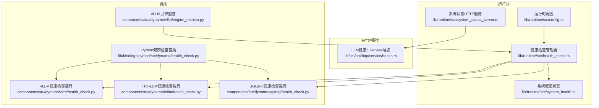
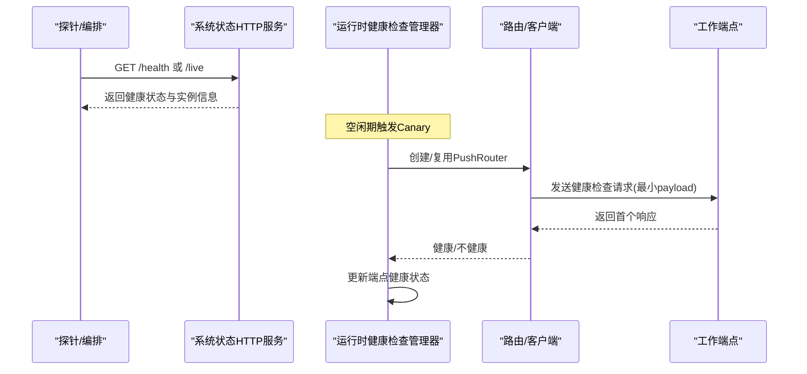
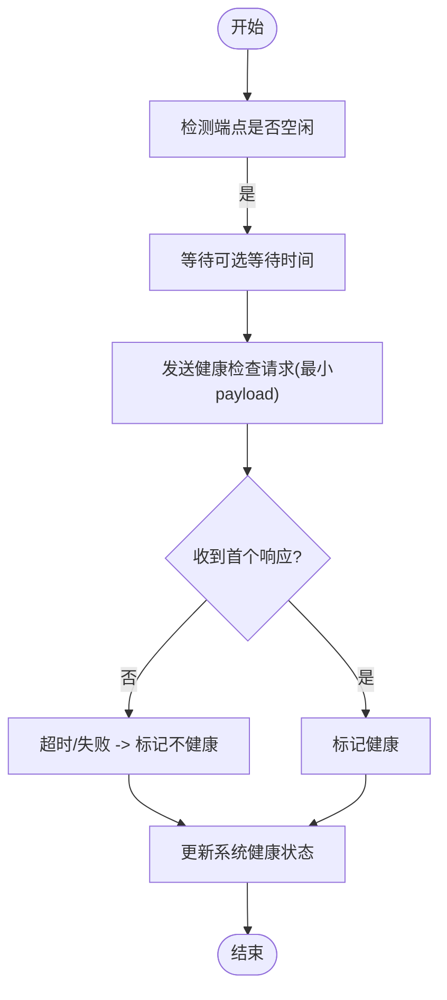
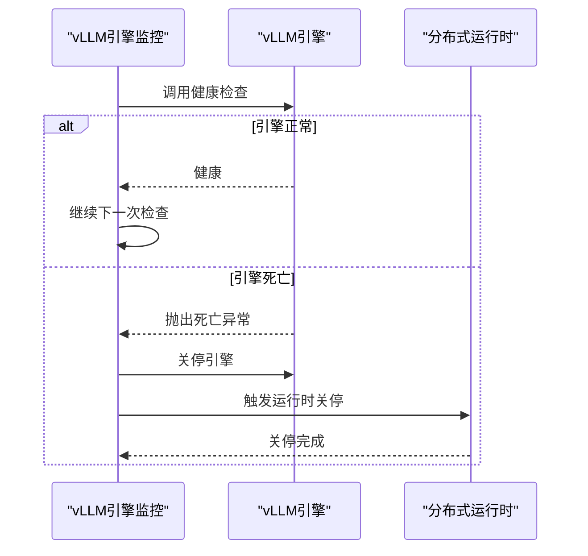
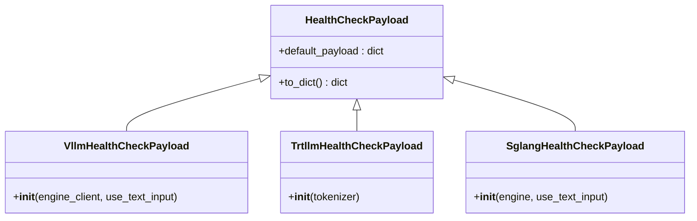
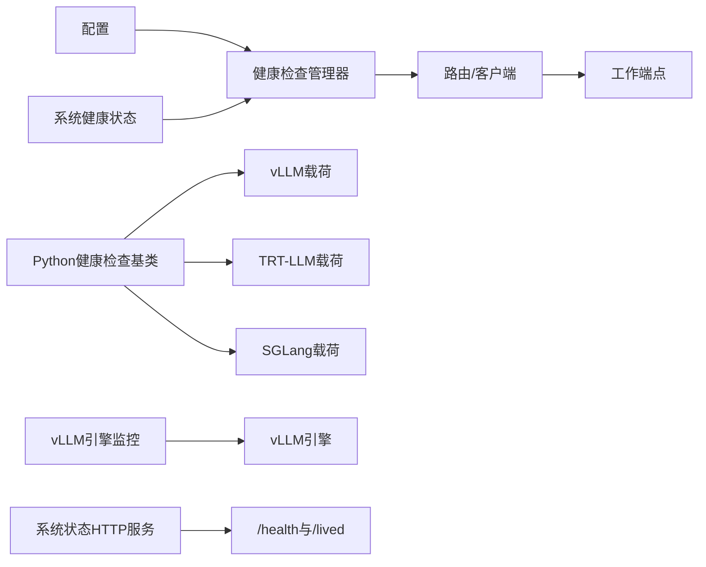

# 健康检查

<cite>
**本文引用的文件**
- [lib/runtime/src/health_check.rs](file://lib/runtime/src/health_check.rs)
- [lib/runtime/src/system_health.rs](file://lib/runtime/src/system_health.rs)
- [lib/runtime/src/system_status_server.rs](file://lib/runtime/src/system_status_server.rs)
- [lib/runtime/src/config.rs](file://lib/runtime/src/config.rs)
- [lib/llm/src/http/service/health.rs](file://lib/llm/src/http/service/health.rs)
- [lib/bindings/python/src/dynamo/health_check.py](file://lib/bindings/python/src/dynamo/health_check.py)
- [components/src/dynamo/vllm/health_check.py](file://components/src/dynamo/vllm/health_check.py)
- [components/src/dynamo/trtllm/health_check.py](file://components/src/dynamo/trtllm/health_check.py)
- [components/src/dynamo/sglang/health_check.py](file://components/src/dynamo/sglang/health_check.py)
- [components/src/dynamo/vllm/engine_monitor.py](file://components/src/dynamo/vllm/engine_monitor.py)
- [docs/pages/observability/health-checks.md](file://docs/pages/observability/health-checks.md)
</cite>

## 目录
1. [简介](#简介)
2. [项目结构](#项目结构)
3. [核心组件](#核心组件)
4. [架构总览](#架构总览)
5. [详细组件分析](#详细组件分析)
6. [依赖关系分析](#依赖关系分析)
7. [性能考量](#性能考量)
8. [故障排查指南](#故障排查指南)
9. [结论](#结论)
10. [附录](#附录)

## 简介
本文件系统化阐述Dynamo的健康检查机制，覆盖以下方面：
- HTTP端点健康检查与存活检查（/health 与 /live）
- 主动监控（Canary）：基于空闲期触发的周期性测试请求
- 引擎监控：对后端引擎（如vLLM）进行故障检测与自动关停
- 健康检查协议、响应格式、检查频率与超时配置
- 结果传播、服务发现更新与故障隔离
- 配置项、监控指标、告警设置与故障诊断
- 不同环境的最佳实践与性能优化建议

## 项目结构
Dynamo的健康检查由“运行时健康检查管理器”“系统状态服务器”“后端健康检查载荷”“引擎监控器”等模块协同完成，并通过统一的配置体系对外暴露。

图示来源
- [lib/runtime/src/health_check.rs](file://lib/runtime/src/health_check.rs#L46-L123)
- [lib/runtime/src/system_health.rs](file://lib/runtime/src/system_health.rs#L41-L88)
- [lib/runtime/src/system_status_server.rs](file://lib/runtime/src/system_status_server.rs#L159-L194)
- [lib/llm/src/http/service/health.rs](file://lib/llm/src/http/service/health.rs#L10-L38)
- [lib/bindings/python/src/dynamo/health_check.py](file://lib/bindings/python/src/dynamo/health_check.py#L63-L105)
- [components/src/dynamo/vllm/health_check.py](file://components/src/dynamo/vllm/health_check.py#L83-L122)
- [components/src/dynamo/trtllm/health_check.py](file://components/src/dynamo/trtllm/health_check.py#L51-L92)
- [components/src/dynamo/sglang/health_check.py](file://components/src/dynamo/sglang/health_check.py#L50-L121)
- [components/src/dynamo/vllm/engine_monitor.py](file://components/src/dynamo/vllm/engine_monitor.py#L23-L51)

章节来源
- [lib/runtime/src/health_check.rs](file://lib/runtime/src/health_check.rs#L1-L123)
- [lib/runtime/src/system_health.rs](file://lib/runtime/src/system_health.rs#L1-L88)
- [lib/runtime/src/system_status_server.rs](file://lib/runtime/src/system_status_server.rs#L159-L194)
- [lib/llm/src/http/service/health.rs](file://lib/llm/src/http/service/health.rs#L10-L38)
- [lib/bindings/python/src/dynamo/health_check.py](file://lib/bindings/python/src/dynamo/health_check.py#L1-L105)
- [components/src/dynamo/vllm/health_check.py](file://components/src/dynamo/vllm/health_check.py#L1-L197)
- [components/src/dynamo/trtllm/health_check.py](file://components/src/dynamo/trtllm/health_check.py#L1-L92)
- [components/src/dynamo/sglang/health_check.py](file://components/src/dynamo/sglang/health_check.py#L1-L147)
- [components/src/dynamo/vllm/engine_monitor.py](file://components/src/dynamo/vllm/engine_monitor.py#L1-L120)
- [docs/pages/observability/health-checks.md](file://docs/pages/observability/health-checks.md#L1-L351)

## 核心组件
- 健康检查管理器（HealthCheckManager）
  - 负责为每个已注册的端点启动独立的健康检查任务；在空闲期触发Canary请求；根据响应更新端点健康状态；支持动态新增端点。
- 系统健康状态（SystemHealth）
  - 维护全局系统健康状态与各端点健康映射；提供注册健康检查目标、查询与更新健康状态的能力；支持通过通道接收新端点注册通知。
- 运行时配置（RuntimeConfig）
  - 提供系统端口、健康路径、初始健康状态、是否使用端点健康状态、健康检查开关、Canary等待时间、请求超时等配置项。
- 系统状态HTTP服务（System Status Server）
  - 暴露/health与/lived端点，返回系统健康状态与实例列表；支持自定义路径。
- 后端健康检查载荷（Backend HealthCheckPayload）
  - Python基类支持从环境变量加载或覆盖默认健康检查载荷；各后端（vLLM、TRT-LLM、SGLang）提供最小化payload以快速验证推理链路。
- vLLM引擎监控（VllmEngineMonitor）
  - 对vLLM引擎进行持续健康检查，若检测到引擎死亡则执行关停并触发运行时关闭。

章节来源
- [lib/runtime/src/health_check.rs](file://lib/runtime/src/health_check.rs#L46-L123)
- [lib/runtime/src/system_health.rs](file://lib/runtime/src/system_health.rs#L41-L148)
- [lib/runtime/src/config.rs](file://lib/runtime/src/config.rs#L163-L180)
- [lib/runtime/src/system_status_server.rs](file://lib/runtime/src/system_status_server.rs#L159-L194)
- [lib/bindings/python/src/dynamo/health_check.py](file://lib/bindings/python/src/dynamo/health_check.py#L21-L105)
- [components/src/dynamo/vllm/health_check.py](file://components/src/dynamo/vllm/health_check.py#L53-L122)
- [components/src/dynamo/trtllm/health_check.py](file://components/src/dynamo/trtllm/health_check.py#L17-L92)
- [components/src/dynamo/sglang/health_check.py](file://components/src/dynamo/sglang/health_check.py#L20-L121)
- [components/src/dynamo/vllm/engine_monitor.py](file://components/src/dynamo/vllm/engine_monitor.py#L23-L51)

## 架构总览
Dynamo的健康检查分为三层：
- HTTP层：/health 与 /live 端点，用于外部探针与编排系统读取健康状态。
- 主动监控层：Canary健康检查，按空闲期定时向端点发送轻量请求，避免对活跃流量造成影响。
- 引擎监控层：针对后端引擎（如vLLM）进行直接健康探测，异常时触发关停与运行时退出。

图示来源
- [lib/llm/src/http/service/health.rs](file://lib/llm/src/http/service/health.rs#L63-L87)
- [lib/runtime/src/system_status_server.rs](file://lib/runtime/src/system_status_server.rs#L159-L194)
- [lib/runtime/src/health_check.rs](file://lib/runtime/src/health_check.rs#L240-L381)

## 详细组件分析

### HTTP端点健康检查与存活检查
- /live端点
  - 表示服务“存活”，不依赖工作端点健康；在服务关闭中会返回不可用状态。
  - 响应包含状态与消息字段。
- /health端点
  - 返回系统整体健康状态；当存在已注册端点时，同时列出端点与实例信息。
  - 在未注册任何端点时返回非健康状态与提示信息。
- 自定义路径
  - 可通过配置项设置自定义的健康与存活路径。

章节来源
- [lib/llm/src/http/service/health.rs](file://lib/llm/src/http/service/health.rs#L10-L38)
- [lib/llm/src/http/service/health.rs](file://lib/llm/src/http/service/health.rs#L40-L87)
- [lib/runtime/src/system_status_server.rs](file://lib/runtime/src/system_status_server.rs#L159-L194)
- [docs/pages/observability/health-checks.md](file://docs/pages/observability/health-checks.md#L49-L104)

### 主动监控（Canary）健康检查
- 触发条件
  - 当某端点在可选等待时间内无活动，触发一次Canary健康检查。
- 请求策略
  - 使用最小化payload向目标端点发送请求；仅等待首个响应即可判定健康与否。
- 超时与重试
  - 单次请求有超时限制；超时或错误均标记为不健康。
- 动态端点
  - 通过通道接收新端点注册通知，动态为新端点启动健康检查任务。
- 结果传播
  - 将端点健康状态写入系统健康状态，供HTTP端点聚合返回。

图示来源
- [lib/runtime/src/health_check.rs](file://lib/runtime/src/health_check.rs#L143-L187)
- [lib/runtime/src/health_check.rs](file://lib/runtime/src/health_check.rs#L240-L381)

章节来源
- [lib/runtime/src/health_check.rs](file://lib/runtime/src/health_check.rs#L46-L123)
- [lib/runtime/src/health_check.rs](file://lib/runtime/src/health_check.rs#L125-L187)
- [lib/runtime/src/health_check.rs](file://lib/runtime/src/health_check.rs#L189-L238)
- [lib/runtime/src/health_check.rs](file://lib/runtime/src/health_check.rs#L240-L381)
- [lib/runtime/src/system_health.rs](file://lib/runtime/src/system_health.rs#L98-L139)

### 引擎监控（自动引擎故障检测）
- vLLM引擎监控
  - 定期调用引擎健康检查接口；若捕获到引擎死亡异常，则执行引擎关停与运行时关停。
  - 支持超时保护，防止关停过程卡死。
- 故障隔离
  - 引擎死亡时立即关停，避免资源泄漏与级联影响。

图示来源
- [components/src/dynamo/vllm/engine_monitor.py](file://components/src/dynamo/vllm/engine_monitor.py#L74-L120)

章节来源
- [components/src/dynamo/vllm/engine_monitor.py](file://components/src/dynamo/vllm/engine_monitor.py#L23-L120)

### 健康检查载荷与协议
- Python基类
  - 支持从环境变量加载JSON或从文件加载健康检查载荷；若未设置则使用子类默认载荷。
- 后端特定载荷
  - vLLM：支持文本输入与token输入两种模式，自动提取模型BOS token以构造最小payload。
  - TRT-LLM：从分词器提取BOS token，构造包含采样与停止条件的最小payload。
  - SGLang：支持解码与预填充场景，构造带采样参数与停止条件的最小payload。
- 协议与最小化设计
  - 所有payload均设计为极短推理（通常生成1个token），确保低开销与快速反馈。

图示来源
- [lib/bindings/python/src/dynamo/health_check.py](file://lib/bindings/python/src/dynamo/health_check.py#L63-L105)
- [components/src/dynamo/vllm/health_check.py](file://components/src/dynamo/vllm/health_check.py#L83-L122)
- [components/src/dynamo/trtllm/health_check.py](file://components/src/dynamo/trtllm/health_check.py#L51-L92)
- [components/src/dynamo/sglang/health_check.py](file://components/src/dynamo/sglang/health_check.py#L50-L121)

章节来源
- [lib/bindings/python/src/dynamo/health_check.py](file://lib/bindings/python/src/dynamo/health_check.py#L21-L105)
- [components/src/dynamo/vllm/health_check.py](file://components/src/dynamo/vllm/health_check.py#L53-L197)
- [components/src/dynamo/trtllm/health_check.py](file://components/src/dynamo/trtllm/health_check.py#L17-L92)
- [components/src/dynamo/sglang/health_check.py](file://components/src/dynamo/sglang/health_check.py#L20-L147)

### 配置与超时
- 系统端口与路径
  - 系统状态服务器端口、健康路径、存活路径可通过配置启用与定制。
- 初始健康状态与端点健康状态
  - 可设置初始系统健康状态；可指定参与“系统健康”判定的端点集合。
- 主动健康检查开关与参数
  - 开关、Canary等待时间、请求超时均可通过环境变量配置。
- 默认值
  - Canary等待时间与请求超时在默认配置中设定。

章节来源
- [lib/runtime/src/config.rs](file://lib/runtime/src/config.rs#L16-L32)
- [lib/runtime/src/config.rs](file://lib/runtime/src/config.rs#L163-L180)
- [lib/runtime/src/config.rs](file://lib/runtime/src/config.rs#L222-L304)
- [docs/pages/observability/health-checks.md](file://docs/pages/observability/health-checks.md#L14-L26)

### 结果传播、服务发现与故障隔离
- 结果传播
  - 健康检查结果写入系统健康状态，HTTP端点聚合返回；端点健康状态决定系统健康状态。
- 服务发现更新
  - HTTP端点在健康时返回实例列表；健康检查管理器在发送请求前等待实例发现完成，避免竞态。
- 故障隔离
  - 引擎监控在检测到引擎死亡时立即关停引擎与运行时，防止故障扩散。

章节来源
- [lib/runtime/src/system_health.rs](file://lib/runtime/src/system_health.rs#L98-L139)
- [lib/runtime/src/health_check.rs](file://lib/runtime/src/health_check.rs#L270-L301)
- [lib/llm/src/http/service/health.rs](file://lib/llm/src/http/service/health.rs#L63-L87)
- [components/src/dynamo/vllm/engine_monitor.py](file://components/src/dynamo/vllm/engine_monitor.py#L55-L120)

## 依赖关系分析
- 健康检查管理器依赖系统健康状态存储与运行时配置；通过路由/客户端向目标端点发送请求；在动态端点注册时通过通道接收通知。
- HTTP端点依赖系统健康状态与服务发现；返回聚合后的健康信息。
- 后端健康检查载荷依赖具体后端API（如vLLM、TRT-LLM、SGLang）以提取必要元数据（如BOS token）。
- vLLM引擎监控直接依赖引擎API进行健康检查与关停。

图示来源
- [lib/runtime/src/health_check.rs](file://lib/runtime/src/health_check.rs#L46-L123)
- [lib/runtime/src/system_health.rs](file://lib/runtime/src/system_health.rs#L41-L88)
- [lib/runtime/src/system_status_server.rs](file://lib/runtime/src/system_status_server.rs#L159-L194)
- [lib/bindings/python/src/dynamo/health_check.py](file://lib/bindings/python/src/dynamo/health_check.py#L63-L105)
- [components/src/dynamo/vllm/health_check.py](file://components/src/dynamo/vllm/health_check.py#L83-L122)
- [components/src/dynamo/trtllm/health_check.py](file://components/src/dynamo/trtllm/health_check.py#L51-L92)
- [components/src/dynamo/sglang/health_check.py](file://components/src/dynamo/sglang/health_check.py#L50-L121)
- [components/src/dynamo/vllm/engine_monitor.py](file://components/src/dynamo/vllm/engine_monitor.py#L23-L51)

章节来源
- [lib/runtime/src/health_check.rs](file://lib/runtime/src/health_check.rs#L46-L123)
- [lib/runtime/src/system_health.rs](file://lib/runtime/src/system_health.rs#L41-L88)
- [lib/runtime/src/system_status_server.rs](file://lib/runtime/src/system_status_server.rs#L159-L194)
- [lib/bindings/python/src/dynamo/health_check.py](file://lib/bindings/python/src/dynamo/health_check.py#L63-L105)
- [components/src/dynamo/vllm/health_check.py](file://components/src/dynamo/vllm/health_check.py#L83-L122)
- [components/src/dynamo/trtllm/health_check.py](file://components/src/dynamo/trtllm/health_check.py#L51-L92)
- [components/src/dynamo/sglang/health_check.py](file://components/src/dynamo/sglang/health_check.py#L50-L121)
- [components/src/dynamo/vllm/engine_monitor.py](file://components/src/dynamo/vllm/engine_monitor.py#L23-L51)

## 性能考量
- Canary频率与超时
  - 在生产（Kubernetes）环境中默认启用，空闲期触发，降低对活跃流量的影响；可通过环境变量调整等待时间与超时。
- 最小化payload
  - 各后端载荷仅生成1个token，显著降低GPU占用与延迟抖动。
- 实例发现等待
  - 发送健康检查前等待实例发现完成，避免首次检查因竞态失败导致误判。
- 日志与可观测性
  - 健康检查日志可用于定位问题；建议在开发环境适当提高等待时间以减少噪声。

章节来源
- [docs/pages/observability/health-checks.md](file://docs/pages/observability/health-checks.md#L225-L345)
- [lib/runtime/src/health_check.rs](file://lib/runtime/src/health_check.rs#L270-L301)
- [components/src/dynamo/vllm/health_check.py](file://components/src/dynamo/vllm/health_check.py#L53-L81)
- [components/src/dynamo/trtllm/health_check.py](file://components/src/dynamo/trtllm/health_check.py#L68-L90)
- [components/src/dynamo/sglang/health_check.py](file://components/src/dynamo/sglang/health_check.py#L66-L84)

## 故障排查指南
- 健康检查超时
  - 增大请求超时；检查工作端点日志与网络连通性。
- 健康检查日志过多
  - 提高空闲等待时间；或在开发环境禁用主动健康检查。
- 健康检查未运行
  - 确认已启用主动健康检查；确认端点已注册且路径正确。
- 引擎异常
  - 检查vLLM引擎监控日志；关注引擎死亡异常并确认关停流程是否成功。

章节来源
- [docs/pages/observability/health-checks.md](file://docs/pages/observability/health-checks.md#L330-L345)
- [components/src/dynamo/vllm/engine_monitor.py](file://components/src/dynamo/vllm/engine_monitor.py#L108-L120)

## 结论
Dynamo的健康检查体系通过HTTP端点、Canary主动监控与引擎监控三重保障，实现了对服务与工作端点的全面健康观测。其最小化payload设计与空闲期触发策略有效降低了对生产流量的影响；通过统一的系统健康状态聚合，为编排与监控系统提供了可靠的健康视图。

## 附录
- 环境变量与默认行为参考
  - 系统端口、健康路径、存活路径、初始健康状态、端点健康状态、健康检查开关、Canary等待时间、请求超时等。
- 文档与示例
  - 健康检查页面提供了详细的环境变量、示例请求与响应、Kubernetes默认启用说明与故障排查建议。

章节来源
- [lib/runtime/src/config.rs](file://lib/runtime/src/config.rs#L16-L32)
- [lib/runtime/src/config.rs](file://lib/runtime/src/config.rs#L163-L180)
- [docs/pages/observability/health-checks.md](file://docs/pages/observability/health-checks.md#L14-L26)
- [docs/pages/observability/health-checks.md](file://docs/pages/observability/health-checks.md#L246-L277)