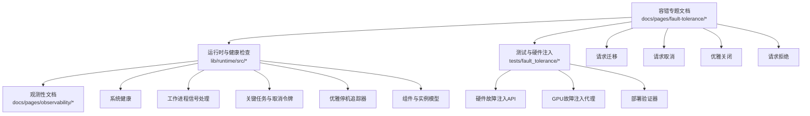
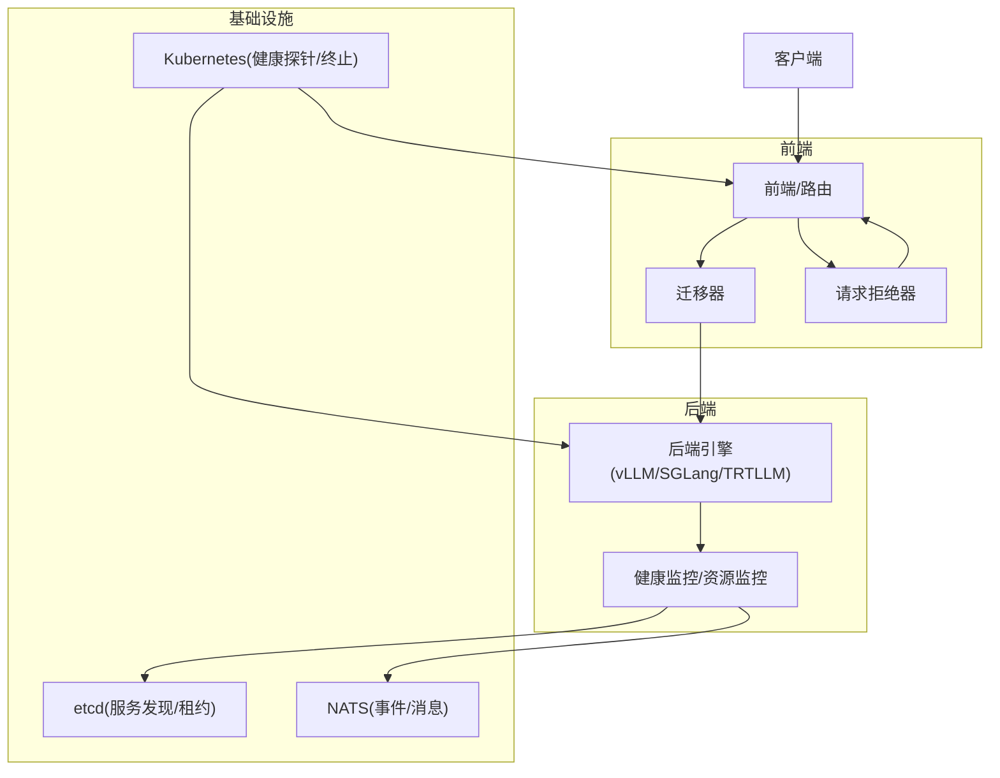
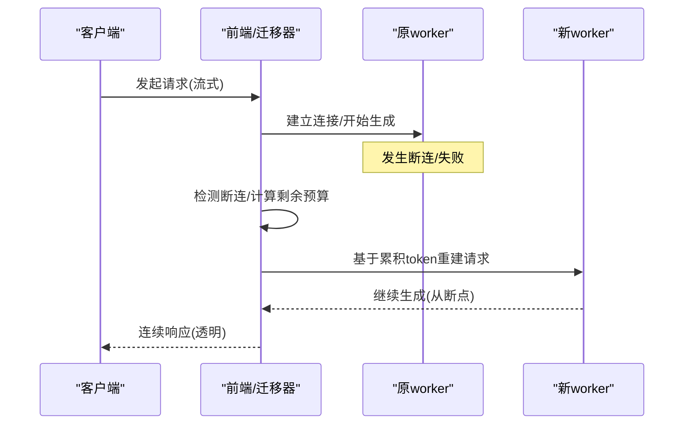
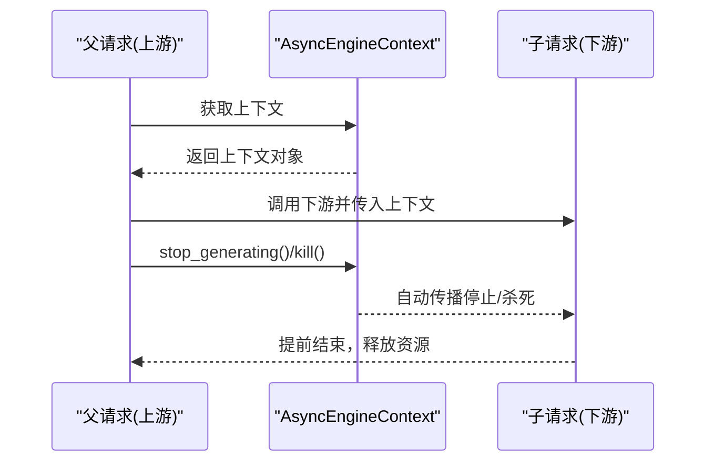
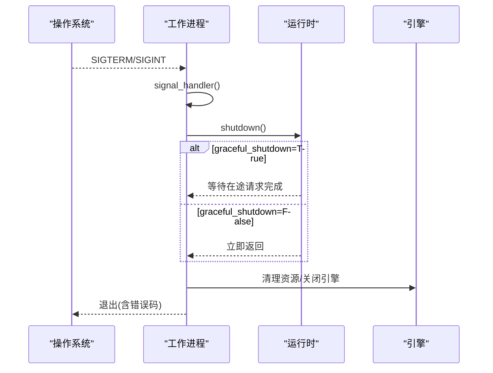
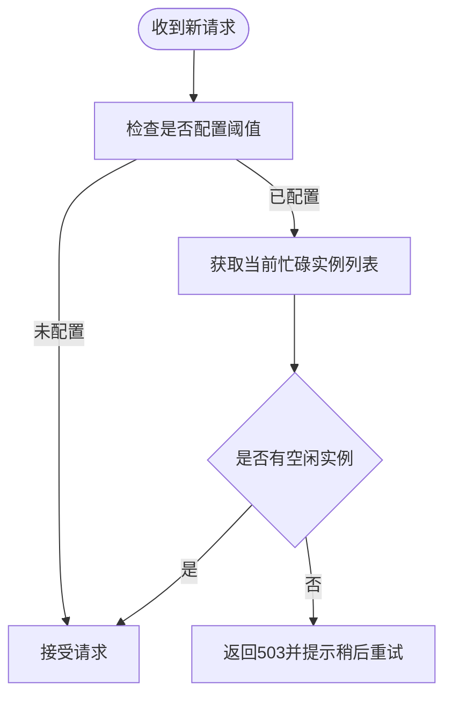
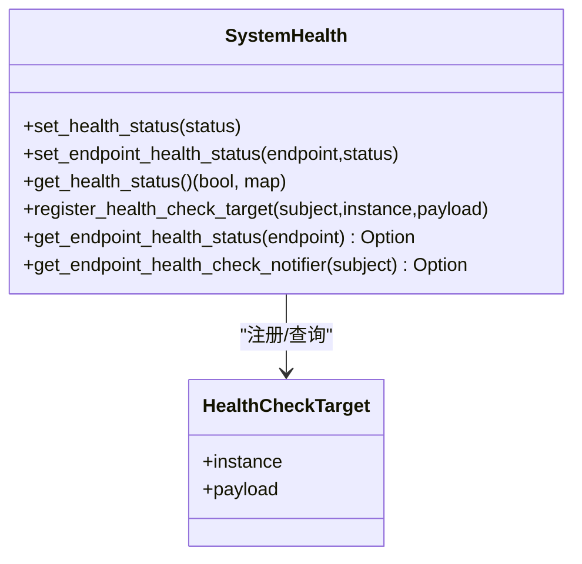
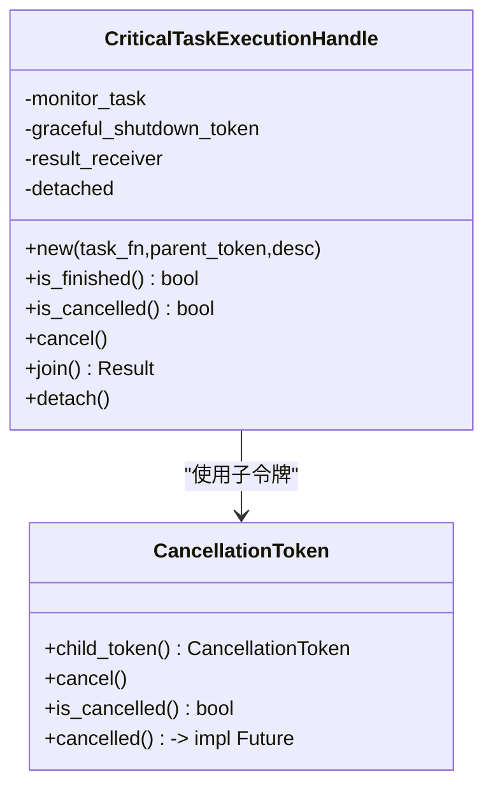
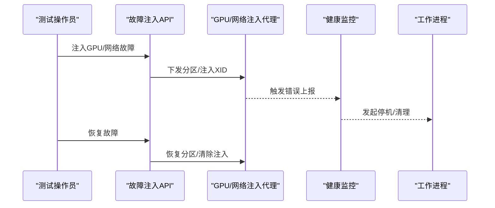
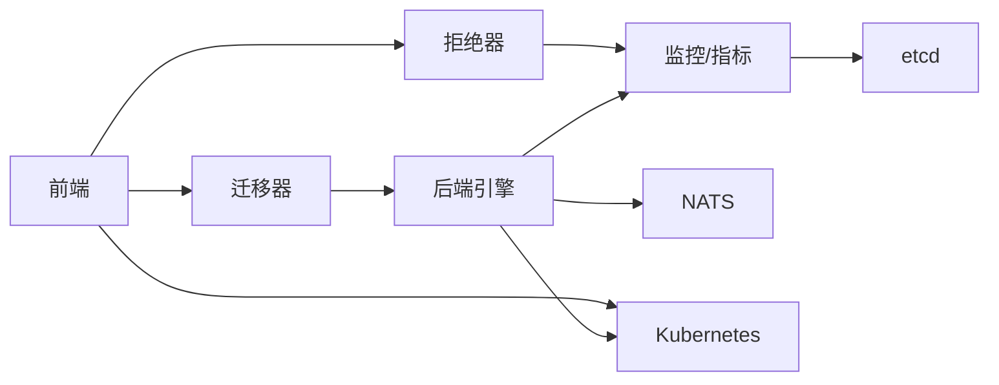

# 容错机制

<cite>
**本文引用的文件**
- [README.md](file://docs/pages/fault-tolerance/README.md)
- [request-migration.md](file://docs/pages/fault-tolerance/request-migration.md)
- [request-cancellation.md](file://docs/pages/fault-tolerance/request-cancellation.md)
- [graceful-shutdown.md](file://docs/pages/fault-tolerance/graceful-shutdown.md)
- [request-rejection.md](file://docs/pages/fault-tolerance/request-rejection.md)
- [testing.md](file://docs/pages/fault-tolerance/testing.md)
- [health-checks.md](file://docs/pages/observability/health-checks.md)
- [system_health.rs](file://lib/runtime/src/system_health.rs)
- [worker.rs](file://lib/runtime/src/worker.rs)
- [critical.rs](file://lib/runtime/src/utils/tasks/critical.rs)
- [graceful_shutdown.rs](file://lib/runtime/src/utils/graceful_shutdown.rs)
- [component.rs](file://lib/runtime/src/component.rs)
- [main.py](file://tests/fault_tolerance/hardware/fault_injection_service/api_service/main.py)
- [gpu_xid_injector.py](file://tests/fault_tolerance/hardware/fault_injection_service/agents/gpu_fault_injector/gpu_xid_injector.py)
- [checkers.py](file://tests/fault_tolerance/deploy/checkers.py)
</cite>

## 目录
1. [简介](#简介)
2. [项目结构](#项目结构)
3. [核心组件](#核心组件)
4. [架构总览](#架构总览)
5. [详细组件分析](#详细组件分析)
6. [依赖关系分析](#依赖关系分析)
7. [性能考量](#性能考量)
8. [故障排查指南](#故障排查指南)
9. [结论](#结论)
10. [附录](#附录)

## 简介
本文件系统化梳理Dynamo在生产环境中的容错机制，覆盖请求迁移、请求取消、优雅关闭与请求拒绝四大核心能力，并深入解释故障检测、恢复策略与状态保持技术。文档同时给出组件级容错设计、网络分区处理与一致性保障思路，提供配置项、监控指标、故障演练与运维最佳实践，帮助读者在真实部署中获得高可用与高可靠。

## 项目结构
围绕容错主题，相关文档与实现主要分布在以下位置：
- 文档：docs/pages/fault-tolerance 下的各专题文档（请求迁移、请求取消、优雅关闭、请求拒绝、测试）
- 运行时与健康检查：lib/runtime/src 下的系统健康、工作进程、关键任务与优雅停机工具
- 测试与硬件注入：tests/fault_tolerance 下的端到端测试框架、硬件故障注入服务与代理
- 观测性：docs/pages/observability 下的健康检查与指标文档

**图表来源**
- [README.md](file://docs/pages/fault-tolerance/README.md#L1-L133)
- [system_health.rs](file://lib/runtime/src/system_health.rs#L1-L279)
- [worker.rs](file://lib/runtime/src/worker.rs#L132-L238)
- [critical.rs](file://lib/runtime/src/utils/tasks/critical.rs#L1-L612)
- [graceful_shutdown.rs](file://lib/runtime/src/utils/graceful_shutdown.rs#L1-L39)
- [component.rs](file://lib/runtime/src/component.rs#L1-L200)
- [main.py](file://tests/fault_tolerance/hardware/fault_injection_service/api_service/main.py#L1395-L1468)
- [gpu_xid_injector.py](file://tests/fault_tolerance/hardware/fault_injection_service/agents/gpu_fault_injector/gpu_xid_injector.py#L78-L115)
- [checkers.py](file://tests/fault_tolerance/deploy/checkers.py#L371-L410)

**章节来源**
- [README.md](file://docs/pages/fault-tolerance/README.md#L1-L133)

## 核心组件
- 请求迁移：在worker失败或断连时，保留部分生成状态并透明迁移到健康worker，确保流式输出连续、无丢失。
- 请求取消：通过AsyncEngineContext与取消令牌，支持优雅停止与硬停止，具备父子链路传播能力。
- 优雅关闭：统一处理SIGTERM/SIGINT，按配置允许在停机前完成在途请求，清理资源并可触发系统级重启。
- 请求拒绝（负载削峰）：基于KV缓存块利用率与预填token数阈值，动态拒绝新请求以避免级联崩溃。

上述能力在组件层、系统层与基础设施层协同工作，形成多层容错闭环。

**章节来源**
- [request-migration.md](file://docs/pages/fault-tolerance/request-migration.md#L1-L137)
- [request-cancellation.md](file://docs/pages/fault-tolerance/request-cancellation.md#L1-L92)
- [graceful-shutdown.md](file://docs/pages/fault-tolerance/graceful-shutdown.md#L1-L249)
- [request-rejection.md](file://docs/pages/fault-tolerance/request-rejection.md#L1-L317)

## 架构总览
下图展示Dynamo容错在请求生命周期中的关键节点与交互：

**图表来源**
- [README.md](file://docs/pages/fault-tolerance/README.md#L85-L133)
- [request-migration.md](file://docs/pages/fault-tolerance/request-migration.md#L12-L31)
- [request-rejection.md](file://docs/pages/fault-tolerance/request-rejection.md#L20-L40)
- [health-checks.md](file://docs/pages/observability/health-checks.md#L54-L104)

## 详细组件分析

### 请求迁移（Request Migration）
- 设计目标：在worker失败或断连时，保留已生成token与剩余预算，无缝迁移到健康worker继续生成，对客户端透明。
- 关键点：
  - 新请求迁移：初始连接失败时，减少重试次数并重建流，不涉及历史状态。
  - 进行中迁移：断流后利用累积token序列与上下文重建请求，确保从断点继续。
  - 前端级迁移上限：通过命令行参数设置全局迁移限制，避免无限重试。
  - 指标：暴露迁移总数指标，按模型与迁移类型分组，便于告警与容量规划。

**图表来源**
- [request-migration.md](file://docs/pages/fault-tolerance/request-migration.md#L46-L91)

**章节来源**
- [request-migration.md](file://docs/pages/fault-tolerance/request-migration.md#L1-L137)

### 请求取消（Request Cancellation）
- 设计目标：在请求仍在进行时，允许优雅停止或立即终止，释放计算资源；支持父子链路传播。
- 关键点：
  - AsyncEngineContext提供唯一标识、停止/杀死状态查询与异步等待接口。
  - Python绑定Context类映射核心方法，便于脚本侧使用。
  - 链接子上下文：父取消自动传播至所有子请求，适合分布式流水线。
  - 线程安全：Send + Sync约束，跨任务安全访问。

**图表来源**
- [request-cancellation.md](file://docs/pages/fault-tolerance/request-cancellation.md#L8-L36)

**章节来源**
- [request-cancellation.md](file://docs/pages/fault-tolerance/request-cancellation.md#L1-L92)

### 优雅关闭（Graceful Shutdown）
- 设计目标：统一接收SIGTERM/SIGINT，立即停止接受新请求，按配置等待在途请求完成，清理资源并退出。
- 关键点：
  - 信号处理：捕获Ctrl+C与SIGTERM，触发取消令牌，进入优雅停机流程。
  - 端点停靠：注册端点时可配置是否等待在途请求完成。
  - 资源清理：各后端引擎提供清理钩子，释放临时目录、适配器与引擎资源。
  - 错误驱动停机：引擎健康监控检测致命错误时主动发起停机并退出。
  - Kubernetes集成：配合就绪探针与终止宽限期，确保平滑滚动更新。

**图表来源**
- [graceful-shutdown.md](file://docs/pages/fault-tolerance/graceful-shutdown.md#L19-L84)
- [worker.rs](file://lib/runtime/src/worker.rs#L208-L238)
- [graceful_shutdown.rs](file://lib/runtime/src/utils/graceful_shutdown.rs#L1-L39)

**章节来源**
- [graceful-shutdown.md](file://docs/pages/fault-tolerance/graceful-shutdown.md#L1-L249)
- [worker.rs](file://lib/runtime/src/worker.rs#L132-L238)
- [graceful_shutdown.rs](file://lib/runtime/src/utils/graceful_shutdown.rs#L1-L39)

### 请求拒绝（负载削峰，Load Shedding）
- 设计目标：当worker过载时主动拒绝新请求，防止级联失败与内存耗尽，维持整体稳定性。
- 关键点：
  - 双阈值判定：KV缓存块利用率阈值与预填token数阈值，任一超过即标记为繁忙。
  - 数据并行聚合：多rank场景需全部rank繁忙才视为整体繁忙，降低误判。
  - 动态阈值：支持运行时通过API调整阈值，便于弹性调节。
  - 指标与告警：暴露拒绝计数与队列长度指标，结合PromQL与Grafana告警。

**图表来源**
- [request-rejection.md](file://docs/pages/fault-tolerance/request-rejection.md#L94-L158)

**章节来源**
- [request-rejection.md](file://docs/pages/fault-tolerance/request-rejection.md#L1-L317)

### 故障检测与健康检查
- 多层次健康检查：
  - HTTP端点：/live与/health，分别反映存活与健康状态。
  - 活跃健康检查：周期性测试请求，提升探测准确性。
  - 引擎监控：自动检测引擎异常（如GPU XID、OOM），触发停机。
- 系统健康模型：维护系统整体健康与各端点健康映射，支持端点级通知与并发安全读写。

**图表来源**
- [system_health.rs](file://lib/runtime/src/system_health.rs#L29-L279)
- [health-checks.md](file://docs/pages/observability/health-checks.md#L54-L104)

**章节来源**
- [system_health.rs](file://lib/runtime/src/system_health.rs#L1-L279)
- [health-checks.md](file://docs/pages/observability/health-checks.md#L54-L104)

### 关键任务与取消令牌（Critical Task & CancellationToken）
- 关键任务执行句柄：封装任务执行、失败/恐慌监控与结果回传；支持优雅取消与系统级失败传播。
- 取消令牌：父子令牌体系，优雅取消不触发父级取消，关键失败立即触发父级取消。
- 典型用法：后台监控任务、健康检查任务、长任务的响应式停机。

**图表来源**
- [critical.rs](file://lib/runtime/src/utils/tasks/critical.rs#L19-L202)

**章节来源**
- [critical.rs](file://lib/runtime/src/utils/tasks/critical.rs#L1-L612)

### 组件与实例模型
- 组件与实例：用于服务发现、命名空间隔离与端点定位，支撑健康检查与迁移路由。
- 实例ID与端点ID：提供稳定标识，便于日志、指标与追踪关联。

**章节来源**
- [component.rs](file://lib/runtime/src/component.rs#L87-L131)

### 硬件故障注入与网络分区
- GPU故障注入：通过代理向内核注入XID消息，模拟GPU错误（如内存页故障、热节流、NVLink错误等），触发引擎健康监控与停机。
- 网络分区注入：通过API触发前端-worker、worker-NATS、worker-worker等分区，验证系统在分区下的收敛与恢复。
- 运行与恢复：支持按故障ID注入与恢复，便于自动化测试与演练。

**图表来源**
- [main.py](file://tests/fault_tolerance/hardware/fault_injection_service/api_service/main.py#L1395-L1468)
- [gpu_xid_injector.py](file://tests/fault_tolerance/hardware/fault_injection_service/agents/gpu_fault_injector/gpu_xid_injector.py#L78-L115)

**章节来源**
- [main.py](file://tests/fault_tolerance/hardware/fault_injection_service/api_service/main.py#L1395-L1468)
- [gpu_xid_injector.py](file://tests/fault_tolerance/hardware/fault_injection_service/agents/gpu_fault_injector/gpu_xid_injector.py#L78-L115)

## 依赖关系分析
- 组件耦合：
  - 前端依赖迁移器与拒绝器；迁移器依赖后端引擎与健康监控；拒绝器依赖KV缓存指标。
  - 运行时提供统一的信号处理、优雅停机追踪与关键任务管理。
  - 健康检查模块为系统健康与端点健康提供统一数据结构与通知机制。
- 外部依赖：
  - etcd用于服务发现与租约保活；NATS用于事件与消息传输；Kubernetes负责健康探针与终止宽限期。

**图表来源**
- [README.md](file://docs/pages/fault-tolerance/README.md#L85-L133)
- [system_health.rs](file://lib/runtime/src/system_health.rs#L1-L279)

**章节来源**
- [README.md](file://docs/pages/fault-tolerance/README.md#L85-L133)
- [system_health.rs](file://lib/runtime/src/system_health.rs#L1-L279)

## 性能考量
- 请求迁移
  - 优势：避免重复计算，提升吞吐与资源利用率；对用户透明。
  - 成本：需要额外的状态保存与重建开销；迁移次数应受控。
- 请求取消
  - 优势：快速释放资源，降低无效计算。
  - 成本：频繁取消可能增加调度抖动；需合理设置超时与重试。
- 优雅关闭
  - 优势：平滑停机，降低中断率。
  - 成本：停机窗口取决于在途请求完成时间；需合理配置终止宽限期。
- 请求拒绝
  - 优势：保护系统免于雪崩。
  - 成本：可能丢弃部分请求；需结合客户端指数退避与限流。

[本节为通用指导，无需“章节来源”]

## 故障排查指南
- 健康检查
  - 使用/lived与/health端点确认服务存活与健康；观察端点健康映射与系统健康状态。
- 日志与指标
  - 关注迁移总数、拒绝计数、队列长度、引擎健康告警与GPU XID事件。
- 硬件故障注入
  - 通过故障注入API验证系统在GPU/XID与网络分区下的行为；恢复后验证自愈与指标回归。
- 部署验证
  - 使用部署测试框架定义场景（如worker失败、溢出、恢复），运行验证器检查成功率、延迟与迁移次数。

**章节来源**
- [health-checks.md](file://docs/pages/observability/health-checks.md#L54-L104)
- [testing.md](file://docs/pages/fault-tolerance/testing.md#L300-L492)
- [checkers.py](file://tests/fault_tolerance/deploy/checkers.py#L371-L410)

## 结论
Dynamo的容错体系以“多层防御、渐进降级、可观测可恢复”为核心理念：前端通过迁移与拒绝保障用户体验与系统稳定，运行时通过健康检查与优雅停机实现可控退出，基础设施通过etcd与NATS提供一致性的协调与事件通道。结合完善的测试与监控，可在生产环境中获得高可用与高可靠的推理服务。

[本节为总结，无需“章节来源”]

## 附录

### 配置与环境变量速查
- 健康检查与系统端口
  - 工作进程健康端口：DYN_SYSTEM_PORT
  - 是否启用活跃健康检查：DYN_HEALTH_CHECK_ENABLED
  - 活跃健康等待时间：DYN_CANARY_WAIT_TIME
  - 健康检查请求超时：DYN_HEALTH_CHECK_REQUEST_TIMEOUT
- 前端迁移限制
  - 前端迁移上限：--migration-limit
- 负载削峰阈值
  - 活跃解码块阈值：--active-decode-blocks-threshold
  - 活跃预填token阈值：--active-prefill-tokens-threshold

**章节来源**
- [README.md](file://docs/pages/fault-tolerance/README.md#L74-L84)
- [request-migration.md](file://docs/pages/fault-tolerance/request-migration.md#L24-L31)
- [request-rejection.md](file://docs/pages/fault-tolerance/request-rejection.md#L42-L93)

### 监控指标清单
- 迁移
  - dynamo_frontend_model_migration_total（按模型与迁移类型分组）
- 负载削峰
  - dynamo_tasks_rejected_total
  - dynamo_queued_requests
- 健康与运行时
  - 系统运行时长（uptime）、端点健康状态映射

**章节来源**
- [request-migration.md](file://docs/pages/fault-tolerance/request-migration.md#L112-L131)
- [request-rejection.md](file://docs/pages/fault-tolerance/request-rejection.md#L195-L232)
- [system_health.rs](file://lib/runtime/src/system_health.rs#L244-L267)

### 故障场景模拟与测试方法
- 场景
  - Worker崩溃/重启：验证迁移与健康检查收敛。
  - 网络分区：验证路由切换与恢复。
  - GPU XID/过热：验证引擎停机与重启。
  - 高负载：验证拒绝策略与客户端退避。
- 方法
  - 使用硬件故障注入API与代理。
  - 使用部署测试框架定义场景并运行验证器。
  - 结合Prometheus/Grafana观测指标与告警。

**章节来源**
- [testing.md](file://docs/pages/fault-tolerance/testing.md#L10-L51)
- [main.py](file://tests/fault_tolerance/hardware/fault_injection_service/api_service/main.py#L1395-L1468)
- [checkers.py](file://tests/fault_tolerance/deploy/checkers.py#L371-L410)

### 运维最佳实践
- 合理设置终止宽限期，匹配最长请求完成时间。
- 开启迁移并在前端配置适度迁移上限，平衡可靠性与资源消耗。
- 启用活跃健康检查与引擎监控，提前发现潜在问题。
- 结合负载削峰阈值与HPA联动，避免过载。
- 在测试环境充分演练各类故障，完善应急预案。

**章节来源**
- [graceful-shutdown.md](file://docs/pages/fault-tolerance/graceful-shutdown.md#L171-L249)
- [request-migration.md](file://docs/pages/fault-tolerance/request-migration.md#L134-L137)
- [request-rejection.md](file://docs/pages/fault-tolerance/request-rejection.md#L273-L317)