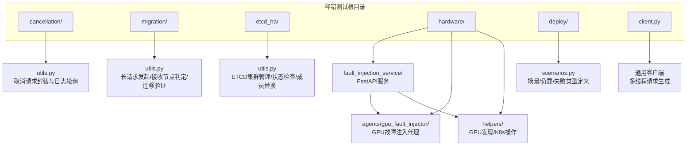
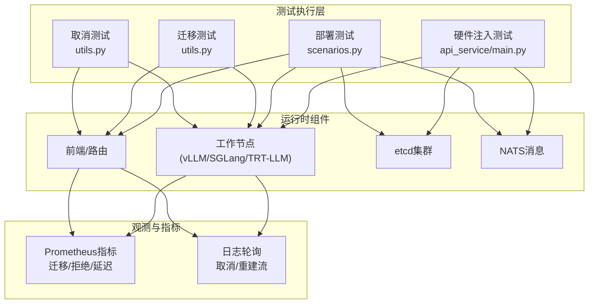
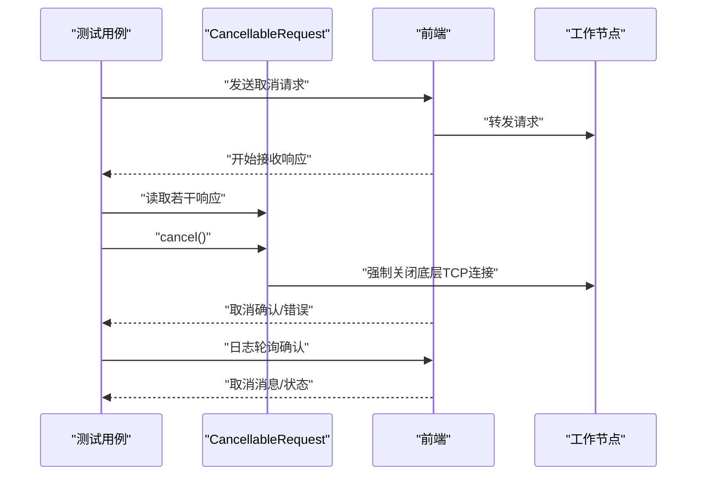
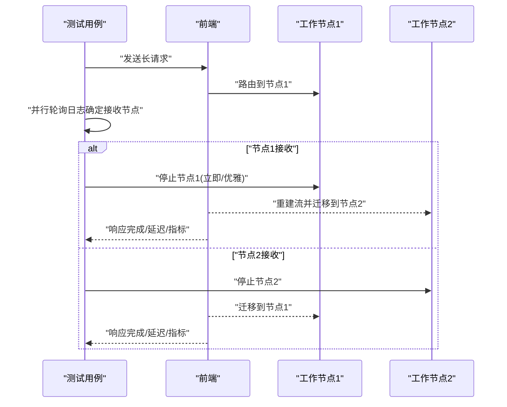
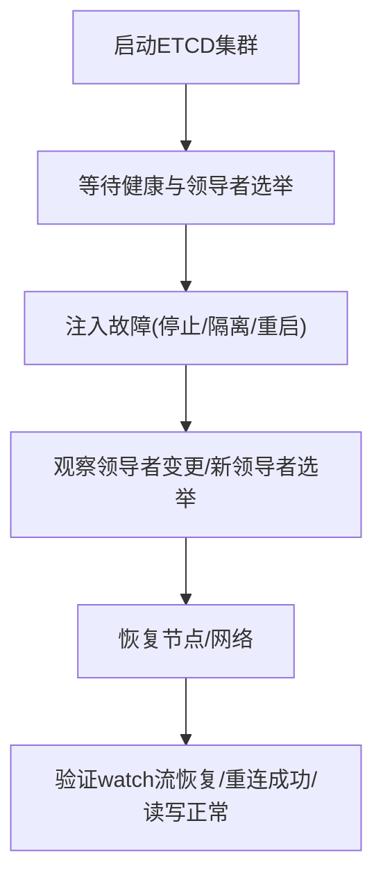
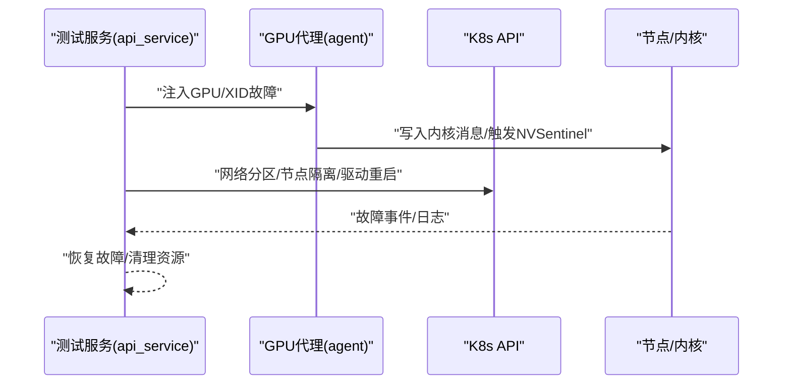
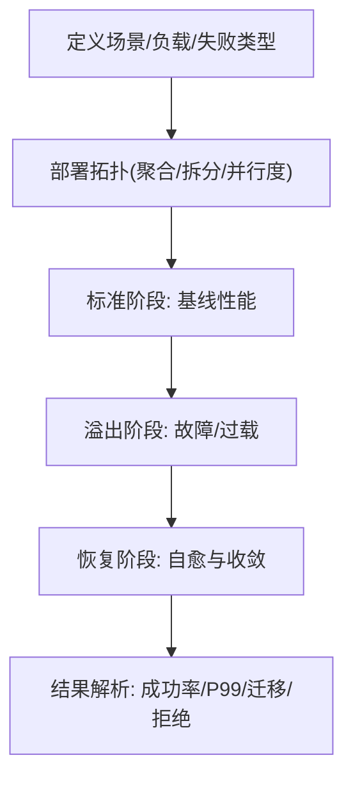
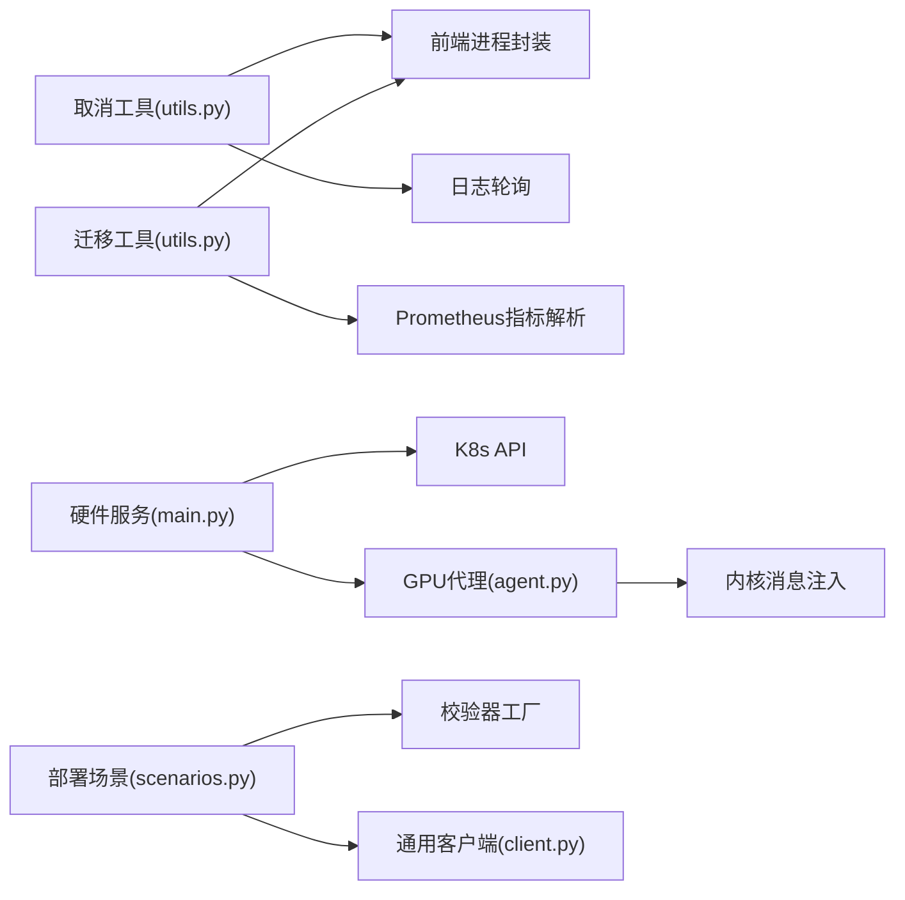

# 容错测试

<cite>
**本文引用的文件**
- [故障容忍测试总览](file://docs/pages/fault-tolerance/testing.md)
- [故障容忍测试目录与运行](file://tests/fault_tolerance/README.md)
- [取消测试工具](file://tests/fault_tolerance/cancellation/utils.py)
- [迁移测试工具](file://tests/fault_tolerance/migration/utils.py)
- [硬件故障注入服务入口](file://tests/fault_tolerance/hardware/fault_injection_service/api_service/main.py)
- [GPU故障注入代理](file://tests/fault_tolerance/hardware/fault_injection_service/agents/gpu_fault_injector/agent.py)
- [GPU发现与操作辅助](file://tests/fault_tolerance/hardware/fault_injection_service/helpers/gpu_discovery.py)
- [K8s操作辅助](file://tests/fault_tolerance/hardware/fault_injection_service/helpers/k8s_operations.py)
- [部署测试场景定义](file://tests/fault_tolerance/deploy/scenarios.py)
- [通用客户端](file://tests/fault_tolerance/client.py)
- [ETCD集群管理器](file://tests/fault_tolerance/etcd_ha/utils.py)
- [ETCD传输层连接器](file://lib/runtime/src/transports/etcd/connector.rs)
- [ETCD传输层监视器](file://lib/runtime/src/transports/etcd.rs)
</cite>

## 目录
1. [简介](#简介)
2. [项目结构](#项目结构)
3. [核心组件](#核心组件)
4. [架构总览](#架构总览)
5. [详细组件分析](#详细组件分析)
6. [依赖关系分析](#依赖关系分析)
7. [性能考量](#性能考量)
8. [故障排查指南](#故障排查指南)
9. [结论](#结论)
10. [附录](#附录)

## 简介
本技术文档系统化阐述Dynamo容错测试框架的设计与实现，覆盖以下四类核心测试方法：
- 请求取消测试：验证在生成过程中对进行中的请求进行取消的能力与一致性。
- 请求迁移测试：验证当工作节点发生故障时，请求可被迁移到健康节点并继续完成。
- etcd高可用故障切换测试：验证在etcd领导者变更、网络分区等场景下的系统稳定性与恢复能力。
- 硬件故障注入测试：通过模拟GPU XID错误、热节流、内存压力、过热、计算饱和以及网络分区等硬件/网络异常，验证系统的容错与自愈能力。

文档从测试环境搭建、测试场景设计、自动化执行与结果验证、故障注入工具使用、测试数据准备、监控指标采集与性能基线对比等方面展开，并给出测试用例编写、CI配置、测试报告分析与缺陷跟踪流程的最佳实践与质量保障方法。

## 项目结构
Dynamo容错测试位于tests/fault_tolerance/目录下，按功能域划分为多个子模块：
- cancellation：请求取消测试与工具
- migration：请求迁移测试与工具
- etcd_ha：etcd高可用测试与集群管理
- hardware：硬件故障注入服务及其代理与辅助工具
- deploy：端到端部署测试场景与校验器
- client：通用多线程负载生成客户端

图示来源
- [故障容忍测试总览](file://docs/pages/fault-tolerance/testing.md#L24-L51)
- [硬件故障注入服务入口](file://tests/fault_tolerance/hardware/fault_injection_service/api_service/main.py#L1-L120)
- [GPU故障注入代理](file://tests/fault_tolerance/hardware/fault_injection_service/agents/gpu_fault_injector/agent.py#L1-L60)
- [GPU发现与操作辅助](file://tests/fault_tolerance/hardware/fault_injection_service/helpers/gpu_discovery.py#L1-L40)
- [K8s操作辅助](file://tests/fault_tolerance/hardware/fault_injection_service/helpers/k8s_operations.py#L1-L40)
- [部署测试场景定义](file://tests/fault_tolerance/deploy/scenarios.py#L1-L60)
- [通用客户端](file://tests/fault_tolerance/client.py#L1-L40)

章节来源
- [故障容忍测试总览](file://docs/pages/fault-tolerance/testing.md#L10-L51)
- [故障容忍测试目录与运行](file://tests/fault_tolerance/README.md#L1-L60)

## 核心组件
- 取消测试工具
  - 提供CancellableRequest封装，通过全局socket追踪机制在取消时强制关闭底层TCP连接，确保请求被及时中止；提供发送补全/聊天补全请求的方法与流式响应读取工具；提供日志轮询以定位取消确认消息。
- 迁移测试工具
  - 提供长请求发起（支持聊天/补全/流式），并行检测请求被哪个工作节点接收；在目标节点停止后验证响应延迟合理性、前端日志中“重建流”提示、迁移指标解析与断言。
- etcd高可用测试
  - 提供本地ETCD集群管理器，支持启动/健康等待/领导者判断/成员替换等；结合运行时传输层的watch与重连逻辑，验证系统在领导者变更与网络波动下的稳定性。
- 硬件故障注入服务
  - 提供FastAPI服务，统一编排GPU/XID与网络分区故障注入；通过DaemonSet代理在节点侧执行特权操作（如写入内核消息触发NVSentinel）；提供K8s节点/容器级运维辅助（隔离、重启驱动、驱逐等）。
- 部署测试场景
  - 定义标准/溢出/恢复三阶段测试，组合不同后端（vLLM/SGLang/TRT-LLM）、聚合/拆分部署模式、不同张量并行度与数据并行副本数，以及多种失败注入（进程终止/Pod删除/滚动升级/令牌溢出等），并提供校验器工厂自动选择合适的验证策略。
- 通用客户端
  - 多线程并发生成请求，支持随机提示构造、重试与超时控制，输出每条请求的耗时与结果，便于后续统计分析。

章节来源
- [取消测试工具](file://tests/fault_tolerance/cancellation/utils.py#L43-L160)
- [迁移测试工具](file://tests/fault_tolerance/migration/utils.py#L21-L621)
- [ETCD集群管理器](file://tests/fault_tolerance/etcd_ha/utils.py#L132-L271)
- [ETCD传输层连接器](file://lib/runtime/src/transports/etcd/connector.rs#L1-L74)
- [ETCD传输层监视器](file://lib/runtime/src/transports/etcd.rs#L453-L492)
- [硬件故障注入服务入口](file://tests/fault_tolerance/hardware/fault_injection_service/api_service/main.py#L1-L120)
- [GPU故障注入代理](file://tests/fault_tolerance/hardware/fault_injection_service/agents/gpu_fault_injector/agent.py#L1-L120)
- [GPU发现与操作辅助](file://tests/fault_tolerance/hardware/fault_injection_service/helpers/gpu_discovery.py#L1-L120)
- [K8s操作辅助](file://tests/fault_tolerance/hardware/fault_injection_service/helpers/k8s_operations.py#L1-L140)
- [部署测试场景定义](file://tests/fault_tolerance/deploy/scenarios.py#L1-L160)
- [通用客户端](file://tests/fault_tolerance/client.py#L1-L120)

## 架构总览
下图展示容错测试框架的整体交互：测试用例通过工具模块发起请求或注入故障，运行时组件（前端/工作节点/etcd/NATS）在异常场景下保持一致性与恢复能力，监控与指标用于验证迁移、拒绝与延迟等关键指标。

图示来源
- [取消测试工具](file://tests/fault_tolerance/cancellation/utils.py#L160-L261)
- [迁移测试工具](file://tests/fault_tolerance/migration/utils.py#L541-L621)
- [部署测试场景定义](file://tests/fault_tolerance/deploy/scenarios.py#L338-L351)
- [硬件故障注入服务入口](file://tests/fault_tolerance/hardware/fault_injection_service/api_service/main.py#L120-L220)

## 详细组件分析

### 请求取消测试
- 设计要点
  - 使用CancellableRequest在独立线程中发起请求，并通过全局socket拦截在取消时强制关闭底层连接，避免请求悬挂。
  - 支持补全/聊天补全/流式聊天补全三种请求类型；流式场景支持读取固定数量响应后再取消，确保验证点覆盖“中途取消”的典型路径。
  - 通过日志轮询定位“请求已取消”等确认消息，确保前端/工作节点均正确处理取消信号。
- 关键流程
  - 启动前端与工作节点 → 发送请求 → 轮询日志确认接收 → 流式场景先读取若干响应 → 执行取消 → 校验取消消息与响应完整性。
- 断言与验证
  - 取消后应无悬挂请求；前端/工作节点日志中出现取消确认；流式场景取消前后延迟合理。

图示来源
- [取消测试工具](file://tests/fault_tolerance/cancellation/utils.py#L43-L160)
- [取消测试工具](file://tests/fault_tolerance/cancellation/utils.py#L161-L261)
- [取消测试工具](file://tests/fault_tolerance/cancellation/utils.py#L263-L392)

章节来源
- [取消测试工具](file://tests/fault_tolerance/cancellation/utils.py#L43-L160)
- [取消测试工具](file://tests/fault_tolerance/cancellation/utils.py#L161-L261)
- [取消测试工具](file://tests/fault_tolerance/cancellation/utils.py#L263-L392)

### 请求迁移测试
- 设计要点
  - 并发检测请求被哪个工作节点接收；在目标节点被立即终止或优雅关闭后，验证剩余节点是否能继续返回响应。
  - 对解码/预填充等不同阶段分别设置等待策略，确保迁移发生在正确的生命周期阶段。
  - 解析前端Prometheus指标中的迁移计数，断言迁移发生次数与类型；同时检查前端日志中“重建流”提示。
- 关键流程
  - 启动前端与双工作节点 → 发送长请求 → 并行轮询日志确定接收节点 → 在特定时刻停止该节点 → 校验响应完整性与延迟、迁移指标与日志。
- 断言与验证
  - 当允许迁移时：请求成功完成，迁移指标≥1，前端日志包含“重建流”提示；当禁止迁移时：请求失败且符合预期错误类型，不应发生迁移。

图示来源
- [迁移测试工具](file://tests/fault_tolerance/migration/utils.py#L286-L354)
- [迁移测试工具](file://tests/fault_tolerance/migration/utils.py#L541-L621)

章节来源
- [迁移测试工具](file://tests/fault_tolerance/migration/utils.py#L286-L354)
- [迁移测试工具](file://tests/fault_tolerance/migration/utils.py#L541-L621)

### etcd高可用测试
- 设计要点
  - 通过本地ETCD集群管理器启动/健康等待/领导者判断/成员替换，模拟领导者变更与网络分区场景。
  - 结合运行时传输层的watch与重连逻辑，验证系统在watch流中断、网络抖动等情况下的自动恢复能力。
- 关键流程
  - 启动多副本ETCD集群 → 等待选举领导者 → 注入故障（停止/隔离/重启某节点）→ 观察领导者变更与新领导者选举 → 恢复后验证数据一致性与服务可用性。
- 断言与验证
  - 集群健康：仅一个领导者；watch流可恢复；重连超时内完成恢复；客户端读写正常。

图示来源
- [ETCD集群管理器](file://tests/fault_tolerance/etcd_ha/utils.py#L132-L231)
- [ETCD传输层连接器](file://lib/runtime/src/transports/etcd/connector.rs#L60-L74)
- [ETCD传输层监视器](file://lib/runtime/src/transports/etcd.rs#L472-L492)

章节来源
- [ETCD集群管理器](file://tests/fault_tolerance/etcd_ha/utils.py#L132-L231)
- [ETCD传输层连接器](file://lib/runtime/src/transports/etcd/connector.rs#L60-L74)
- [ETCD传输层监视器](file://lib/runtime/src/transports/etcd.rs#L472-L492)

### 硬件故障注入测试
- 设计要点
  - 通过FastAPI服务统一编排GPU/XID与网络分区故障注入；GPU侧通过DaemonSet代理在节点上执行特权操作（如写入内核消息触发NVSentinel）。
  - 提供K8s节点/容器级运维辅助：节点隔离、驱动重启、Pod驱逐、Ready等待等，模拟真实硬件故障与平台自愈行为。
- 关键流程
  - 启动故障注入服务 → 选择故障类型与目标（节点/Pod）→ 注入故障 → 观察系统日志/指标/健康状态 → 恢复故障 → 验证自愈与业务连续性。
- 断言与验证
  - GPU XID注入后NVSentinel检测到异常并触发动作；网络分区导致通信阻断但系统具备隔离与恢复能力；恢复后服务恢复正常。

图示来源
- [硬件故障注入服务入口](file://tests/fault_tolerance/hardware/fault_injection_service/api_service/main.py#L377-L510)
- [GPU故障注入代理](file://tests/fault_tolerance/hardware/fault_injection_service/agents/gpu_fault_injector/agent.py#L169-L240)
- [GPU发现与操作辅助](file://tests/fault_tolerance/hardware/fault_injection_service/helpers/gpu_discovery.py#L184-L236)
- [K8s操作辅助](file://tests/fault_tolerance/hardware/fault_injection_service/helpers/k8s_operations.py#L129-L238)

章节来源
- [硬件故障注入服务入口](file://tests/fault_tolerance/hardware/fault_injection_service/api_service/main.py#L377-L510)
- [GPU故障注入代理](file://tests/fault_tolerance/hardware/fault_injection_service/agents/gpu_fault_injector/agent.py#L169-L240)
- [GPU发现与操作辅助](file://tests/fault_tolerance/hardware/fault_injection_service/helpers/gpu_discovery.py#L184-L236)
- [K8s操作辅助](file://tests/fault_tolerance/hardware/fault_injection_service/helpers/k8s_operations.py#L129-L238)

### 部署测试框架
- 设计要点
  - 将标准/溢出/恢复三阶段测试抽象为场景，组合不同后端、部署模式、并行度与失败类型，自动选择校验器进行结果验证。
  - 提供负载生成器与结果解析工具，支持成功率、P99延迟等关键指标的统计分析。
- 关键流程
  - 定义场景与负载 → 部署指定拓扑 → 运行标准阶段 → 注入失败 → 运行溢出/恢复阶段 → 解析结果并生成报告。
- 断言与验证
  - 成功率达标、延迟在SLA范围内、迁移/拒绝指标符合预期。

图示来源
- [部署测试场景定义](file://tests/fault_tolerance/deploy/scenarios.py#L338-L351)
- [部署测试场景定义](file://tests/fault_tolerance/deploy/scenarios.py#L518-L620)
- [通用客户端](file://tests/fault_tolerance/client.py#L111-L149)

章节来源
- [部署测试场景定义](file://tests/fault_tolerance/deploy/scenarios.py#L338-L351)
- [部署测试场景定义](file://tests/fault_tolerance/deploy/scenarios.py#L518-L620)
- [通用客户端](file://tests/fault_tolerance/client.py#L111-L149)

## 依赖关系分析
- 组件耦合
  - 取消/迁移测试依赖于前端与工作节点的进程封装与日志轮询；迁移测试还依赖Prometheus指标解析。
  - 硬件注入服务依赖K8s API与DaemonSet代理；GPU代理依赖内核消息注入能力。
  - 部署测试场景依赖校验器工厂与负载生成器。
- 外部依赖
  - etcd客户端库与Tokio异步运行时用于传输层重连与watch恢复。
  - Prometheus指标暴露与查询接口用于迁移/拒绝等关键指标验证。

图示来源
- [取消测试工具](file://tests/fault_tolerance/cancellation/utils.py#L319-L392)
- [迁移测试工具](file://tests/fault_tolerance/migration/utils.py#L492-L540)
- [硬件故障注入服务入口](file://tests/fault_tolerance/hardware/fault_injection_service/api_service/main.py#L219-L371)
- [GPU故障注入代理](file://tests/fault_tolerance/hardware/fault_injection_service/agents/gpu_fault_injector/agent.py#L75-L133)
- [部署测试场景定义](file://tests/fault_tolerance/deploy/scenarios.py#L32-L40)
- [通用客户端](file://tests/fault_tolerance/client.py#L111-L149)

章节来源
- [取消测试工具](file://tests/fault_tolerance/cancellation/utils.py#L319-L392)
- [迁移测试工具](file://tests/fault_tolerance/migration/utils.py#L492-L540)
- [硬件故障注入服务入口](file://tests/fault_tolerance/hardware/fault_injection_service/api_service/main.py#L219-L371)
- [GPU故障注入代理](file://tests/fault_tolerance/hardware/fault_injection_service/agents/gpu_fault_injector/agent.py#L75-L133)
- [部署测试场景定义](file://tests/fault_tolerance/deploy/scenarios.py#L32-L40)
- [通用客户端](file://tests/fault_tolerance/client.py#L111-L149)

## 性能考量
- 延迟与吞吐
  - 通过Prometheus指标与日志轮询统计TTFT/TPOT/P99延迟，结合成功率阈值评估系统在故障场景下的性能表现。
- 资源占用
  - 在硬件注入场景中，注意GPU热节流/内存压力对吞吐的影响；在迁移场景中，关注重建流的额外开销。
- 基线对比
  - 使用部署测试框架的标准阶段作为基线，比较溢出/恢复阶段的指标变化，量化故障对系统的影响与恢复效率。

## 故障排查指南
- 取消测试
  - 若取消未生效：检查CancellableRequest是否正确注册socket追踪、取消时是否关闭底层连接；通过日志轮询确认取消消息。
- 迁移测试
  - 若迁移失败：检查迁移限制配置、前端日志中的“无法重建流”错误、迁移指标是否为零；验证目标节点停止时机与响应等待策略。
- etcd高可用
  - 若watch流中断：检查重连回退策略与deadline；确认新领导者选举成功；验证客户端读写一致性。
- 硬件注入
  - 若GPU/XID注入无效：检查DaemonSet代理是否就绪、节点权限与内核消息注入是否成功；通过NVSentinel日志确认检测与动作。
  - 若网络分区不生效：检查NetworkPolicy/ChaosMesh配置、目标Pod标签与命名空间匹配情况。

章节来源
- [取消测试工具](file://tests/fault_tolerance/cancellation/utils.py#L117-L151)
- [迁移测试工具](file://tests/fault_tolerance/migration/utils.py#L429-L455)
- [ETCD传输层连接器](file://lib/runtime/src/transports/etcd/connector.rs#L60-L74)
- [ETCD传输层监视器](file://lib/runtime/src/transports/etcd.rs#L472-L492)
- [硬件故障注入服务入口](file://tests/fault_tolerance/hardware/fault_injection_service/api_service/main.py#L512-L800)
- [GPU故障注入代理](file://tests/fault_tolerance/hardware/fault_injection_service/agents/gpu_fault_injector/agent.py#L169-L240)

## 结论
Dynamo容错测试框架通过模块化的工具与场景，覆盖了请求取消、请求迁移、etcd高可用与硬件/网络故障注入等关键容错路径。借助日志轮询、Prometheus指标与K8s运维辅助，测试能够准确验证系统在异常场景下的稳定性与自愈能力。建议在CI中按标记运行（如gpu/k8s/etcd_ha/slow），并结合部署测试框架进行端到端回归，持续提升系统可靠性与可观测性。

## 附录
- 测试环境要求
  - Kubernetes集群（含GPU节点）、Dynamo部署、etcd集群（用于HA测试）、故障注入服务（用于硬件测试）。
- 运行示例
  - 取消测试：pytest tests/fault_tolerance/cancellation/ -v
  - 迁移测试：pytest tests/fault_tolerance/migration/ -v
  - etcd HA测试：pytest tests/fault_tolerance/etcd_ha/ -v
  - 部署测试：pytest tests/fault_tolerance/deploy/test_deployment.py -v
- 最佳实践
  - 专用测试命名空间、故障恢复清单、日志收集与监控观测、按标记过滤慢速/资源密集型测试。

章节来源
- [故障容忍测试总览](file://docs/pages/fault-tolerance/testing.md#L405-L492)
- [故障容忍测试目录与运行](file://tests/fault_tolerance/README.md#L45-L120)