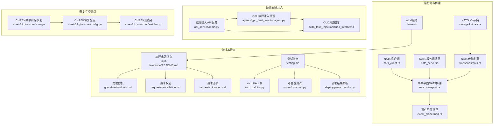
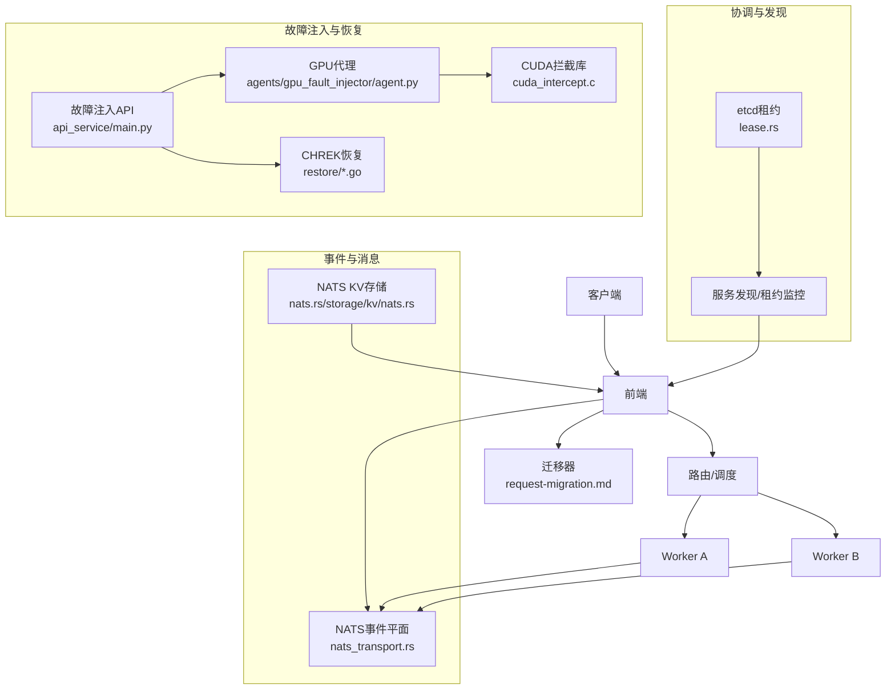
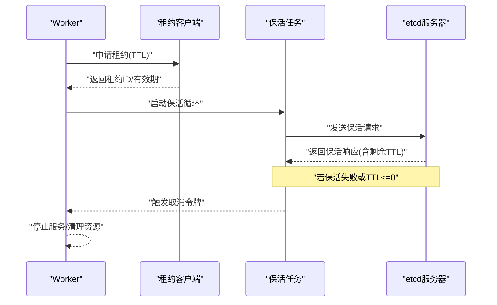
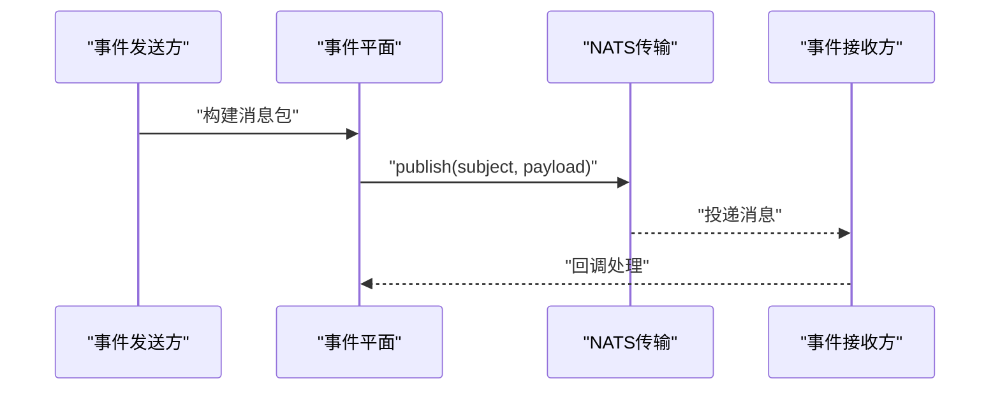
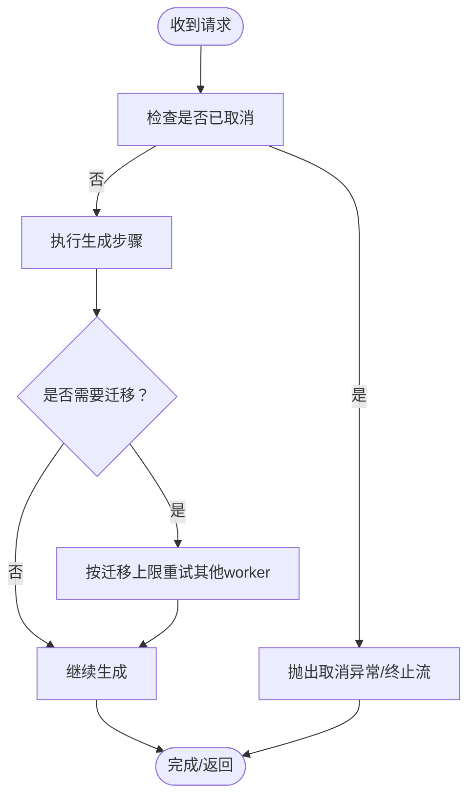
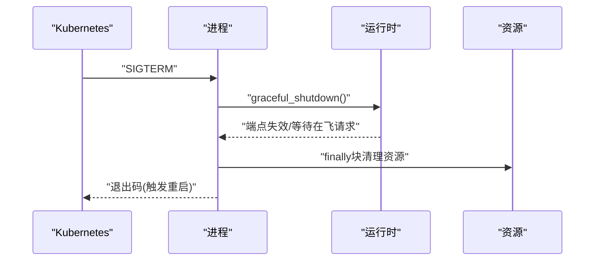
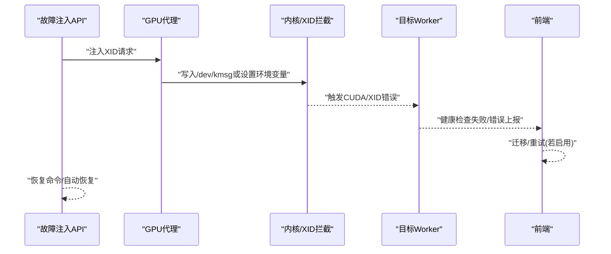
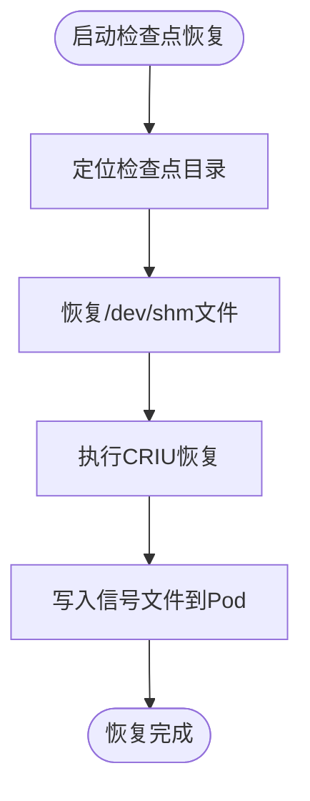
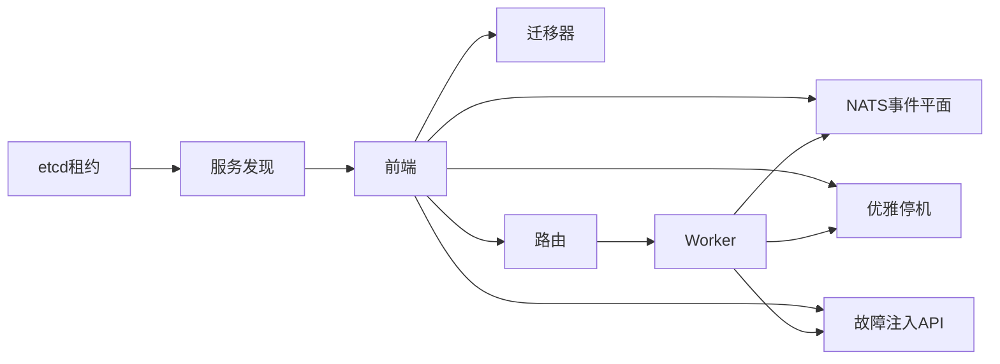

# 故障场景与恢复

<cite>
**本文引用的文件**
- [lease.rs](file://lib/runtime/src/transports/etcd/lease.rs)
- [README.md（故障容忍总览）](file://docs/pages/fault-tolerance/README.md)
- [graceful-shutdown.md](file://docs/pages/fault-tolerance/graceful-shutdown.md)
- [request-cancellation.md](file://docs/pages/fault-tolerance/request-cancellation.md)
- [request-migration.md](file://docs/pages/fault-tolerance/request-migration.md)
- [testing.md](file://docs/pages/fault-tolerance/testing.md)
- [nats_client.rs](file://lib/runtime/src/pipeline/network/egress/nats_client.rs)
- [nats_server.rs](file://lib/runtime/src/pipeline/network/ingress/nats_server.rs)
- [nats_transport.rs](file://lib/runtime/src/transports/event_plane/nats_transport.rs)
- [mod.rs（事件平面）](file://lib/runtime/src/transports/event_plane/mod.rs)
- [nats.rs（NATS传输）](file://lib/runtime/src/transports/nats.rs)
- [nats.rs（KV存储）](file://lib/runtime/src/storage/kv/nats.rs)
- [agent.py（GPU故障注入代理）](file://tests/fault_tolerance/hardware/fault_injection_service/agents/gpu_fault_injector/agent.py)
- [cuda_intercept.c](file://tests/fault_tolerance/hardware/fault_injection_service/cuda_fault_injection/cuda_intercept.c)
- [main.py（故障注入API服务）](file://tests/fault_tolerance/hardware/fault_injection_service/api_service/main.py)
- [utils.py（etcd HA工具）](file://tests/fault_tolerance/etcd_ha/utils.py)
- [common.py（路由器测试）](file://tests/router/common.py)
- [parse_results.py（部署测试结果解析）](file://tests/fault_tolerance/deploy/parse_results.py)
- [legacy_parse_results.py（旧版结果解析）](file://tests/fault_tolerance/deploy/legacy_parse_results.py)
- [shm.go（CHREK共享内存恢复）](file://deploy/chrek/pkg/restore/shm.go)
- [config.go（CHREK恢复配置）](file://deploy/chrek/pkg/restore/config.go)
- [worker.go（CHREK观察者）](file://deploy/chrek/pkg/watcher/watcher.go)
- [worker_setup.py（工作节点设置脚本）](file://examples/backends/sglang/slurm_jobs/scripts/worker_setup.py)
</cite>

## 目录
1. [引言](#引言)
2. [项目结构](#项目结构)
3. [核心组件](#核心组件)
4. [架构总览](#架构总览)
5. [详细组件分析](#详细组件分析)
6. [依赖关系分析](#依赖关系分析)
7. [性能考量](#性能考量)
8. [故障排查指南](#故障排查指南)
9. [结论](#结论)
10. [附录](#附录)

## 引言
本文件面向Dynamo在分布式推理场景下的故障场景与恢复机制，系统化阐述以下内容：
- 完整故障场景与恢复流程：worker pod重启、worker意外崩溃、网络分区、GPU故障
- 故障检测机制：etcd租约、心跳超时、网络连通性
- 恢复策略与状态保持：请求迁移、优雅停机、资源清理、CHREK检查点恢复
- 基础设施高可用：etcd HA、NATS弹性
- 一致性保障与测试验证：故障注入、恢复时间评估、性能影响分析
- 运维最佳实践：预防措施、应急响应、系统韧性增强

## 项目结构
围绕故障容忍的关键目录与文件：
- 运行时与传输层：etcd租约、NATS事件通道、请求取消与迁移
- 测试框架：请求取消、迁移、etcd HA、硬件故障注入、部署端到端测试
- 恢复与检查点：CHREK共享内存恢复、恢复配置与触发

**图表来源**
- [lease.rs](file://lib/runtime/src/transports/etcd/lease.rs#L1-L191)
- [nats_client.rs](file://lib/runtime/src/pipeline/network/egress/nats_client.rs#L47-L87)
- [nats_server.rs](file://lib/runtime/src/pipeline/network/ingress/nats_server.rs#L221-L236)
- [nats_transport.rs](file://lib/runtime/src/transports/event_plane/nats_transport.rs#L1-L54)
- [mod.rs（事件平面）](file://lib/runtime/src/transports/event_plane/mod.rs#L599-L612)
- [nats.rs（NATS传输）](file://lib/runtime/src/transports/nats.rs#L1-L471)
- [nats.rs（KV存储）](file://lib/runtime/src/storage/kv/nats.rs#L241-L275)
- [README.md（故障容忍总览）](file://docs/pages/fault-tolerance/README.md#L85-L133)
- [graceful-shutdown.md](file://docs/pages/fault-tolerance/graceful-shutdown.md#L1-L249)
- [request-cancellation.md](file://docs/pages/fault-tolerance/request-cancellation.md#L1-L92)
- [request-migration.md](file://docs/pages/fault-tolerance/request-migration.md#L1-L137)
- [testing.md](file://docs/pages/fault-tolerance/testing.md#L1-L492)
- [utils.py（etcd HA工具）](file://tests/fault_tolerance/etcd_ha/utils.py#L103-L271)
- [common.py（路由器测试）](file://tests/router/common.py#L1485-L1550)
- [parse_results.py（部署测试结果解析）](file://tests/fault_tolerance/deploy/parse_results.py#L659-L763)
- [agent.py（GPU故障注入代理）](file://tests/fault_tolerance/hardware/fault_injection_service/agents/gpu_fault_injector/agent.py#L1-L200)
- [cuda_intercept.c](file://tests/fault_tolerance/hardware/fault_injection_service/cuda_fault_injection/cuda_intercept.c#L36-L165)
- [main.py（故障注入API服务）](file://tests/fault_tolerance/hardware/fault_injection_service/api_service/main.py#L1-L200)
- [shm.go（CHREK共享内存恢复）](file://deploy/chrek/pkg/restore/shm.go#L1-L52)
- [config.go（CHREK恢复配置）](file://deploy/chrek/pkg/restore/config.go#L140-L224)
- [worker.go（CHREK观察者）](file://deploy/chrek/pkg/watcher/watcher.go#L372-L408)

**章节来源**
- [README.md（故障容忍总览）](file://docs/pages/fault-tolerance/README.md#L85-L133)
- [testing.md](file://docs/pages/fault-tolerance/testing.md#L1-L492)

## 核心组件
- etcd租约与心跳：通过租约保活维持服务发现有效性，租约过期即判定worker失效
- NATS事件通道：事件平面消息发布/订阅，支持KV缓存事件与度量上报
- 请求取消与迁移：前端侧可配置迁移上限，后端侧通过上下文传播取消信号
- 优雅停机：统一信号处理，端点失效、请求完成或迁移、资源清理、退出码控制
- 硬件故障注入：GPU XID模拟、网络分区（NetworkPolicy/ChaosMesh），支持实时恢复
- CHREK检查点：共享内存恢复、恢复触发与等待、信号文件写入

**章节来源**
- [lease.rs](file://lib/runtime/src/transports/etcd/lease.rs#L1-L191)
- [nats_transport.rs](file://lib/runtime/src/transports/event_plane/nats_transport.rs#L1-L54)
- [request-migration.md](file://docs/pages/fault-tolerance/request-migration.md#L1-L137)
- [graceful-shutdown.md](file://docs/pages/fault-tolerance/graceful-shutdown.md#L1-L249)
- [agent.py（GPU故障注入代理）](file://tests/fault_tolerance/hardware/fault_injection_service/agents/gpu_fault_injector/agent.py#L1-L200)
- [main.py（故障注入API服务）](file://tests/fault_tolerance/hardware/fault_injection_service/api_service/main.py#L1-L200)
- [shm.go（CHREK共享内存恢复）](file://deploy/chrek/pkg/restore/shm.go#L1-L52)

## 架构总览
下图展示故障检测与恢复在系统中的交互路径：etcd租约用于存活判定；NATS承载事件与消息；前端负责迁移与优雅停机；后端执行请求取消与清理。

**图表来源**
- [lease.rs](file://lib/runtime/src/transports/etcd/lease.rs#L1-L191)
- [nats_transport.rs](file://lib/runtime/src/transports/event_plane/nats_transport.rs#L1-L54)
- [nats.rs（KV存储）](file://lib/runtime/src/storage/kv/nats.rs#L241-L275)
- [request-migration.md](file://docs/pages/fault-tolerance/request-migration.md#L1-L137)
- [main.py（故障注入API服务）](file://tests/fault_tolerance/hardware/fault_injection_service/api_service/main.py#L1-L200)
- [agent.py（GPU故障注入代理）](file://tests/fault_tolerance/hardware/fault_injection_service/agents/gpu_fault_injector/agent.py#L1-L200)
- [cuda_intercept.c](file://tests/fault_tolerance/hardware/fault_injection_service/cuda_fault_injection/cuda_intercept.c#L36-L165)
- [config.go（CHREK恢复配置）](file://deploy/chrek/pkg/restore/config.go#L140-L224)

## 详细组件分析

### etcd租约与心跳（故障检测）
- 租约发放与保活：创建租约并启动后台任务定期发送保活请求；若保活失败或租约过期，则触发取消令牌，通知上层组件进行清理与重路由
- 超时与过期处理：租约过期或保活异常时记录错误并取消令牌，避免僵尸端点继续被选中
- 与服务发现联动：租约状态变化驱动服务列表更新，新请求不再路由至已失效worker

**图表来源**
- [lease.rs](file://lib/runtime/src/transports/etcd/lease.rs#L15-L41)
- [lease.rs](file://lib/runtime/src/transports/etcd/lease.rs#L140-L191)

**章节来源**
- [lease.rs](file://lib/runtime/src/transports/etcd/lease.rs#L1-L191)

### NATS事件平面与健康检查
- 发布/订阅：事件平面通过NATS传输进行消息发布与订阅，主题前缀结合作用域形成唯一主题
- 健康检查：NATS客户端不暴露连接状态，采用“假设健康”策略；服务端地址与健康状态由上层逻辑维护
- KV一致性：NATS KV在版本冲突时自动重试，确保并发更新的一致性

**图表来源**
- [nats_transport.rs](file://lib/runtime/src/transports/event_plane/nats_transport.rs#L25-L54)
- [mod.rs（事件平面）](file://lib/runtime/src/transports/event_plane/mod.rs#L599-L612)
- [nats_client.rs](file://lib/runtime/src/pipeline/network/egress/nats_client.rs#L47-L87)
- [nats_server.rs](file://lib/runtime/src/pipeline/network/ingress/nats_server.rs#L221-L236)
- [nats.rs（NATS传输）](file://lib/runtime/src/transports/nats.rs#L1-L471)
- [nats.rs（KV存储）](file://lib/runtime/src/storage/kv/nats.rs#L241-L275)

**章节来源**
- [nats_transport.rs](file://lib/runtime/src/transports/event_plane/nats_transport.rs#L1-L54)
- [nats_client.rs](file://lib/runtime/src/pipeline/network/egress/nats_client.rs#L47-L87)
- [nats_server.rs](file://lib/runtime/src/pipeline/network/ingress/nats_server.rs#L221-L236)
- [nats.rs（KV存储）](file://lib/runtime/src/storage/kv/nats.rs#L241-L275)

### 请求取消与迁移（前端侧）
- 取消模型：AsyncEngineContext提供统一的取消接口（停止生成、硬停止、子请求链式取消），Python侧通过Context类映射
- 迁移策略：前端可配置迁移上限，当worker失败时，断流的流在前端自动重试到健康worker；后端仅需完成当前工作或标记未完成流
- 指标监控：迁移计数器暴露于前端指标端点，便于观测可靠性与失败模式

**图表来源**
- [request-cancellation.md](file://docs/pages/fault-tolerance/request-cancellation.md#L8-L92)
- [request-migration.md](file://docs/pages/fault-tolerance/request-migration.md#L24-L137)

**章节来源**
- [request-cancellation.md](file://docs/pages/fault-tolerance/request-cancellation.md#L1-L92)
- [request-migration.md](file://docs/pages/fault-tolerance/request-migration.md#L1-L137)

### 优雅停机（Kubernetes集成）
- 信号处理：统一捕获SIGTERM/SIGINT，调用runtime.shutdown使端点失效，等待在飞请求（可配置）
- 清理流程：finally块内执行引擎/临时资源清理；致命错误时强制退出以触发K8s重启
- 配置建议：根据请求完成时间设置合适的terminationGracePeriodSeconds；启用前端迁移减少中断

**图表来源**
- [graceful-shutdown.md](file://docs/pages/fault-tolerance/graceful-shutdown.md#L19-L249)

**章节来源**
- [graceful-shutdown.md](file://docs/pages/fault-tolerance/graceful-shutdown.md#L1-L249)

### 硬件故障注入（GPU与网络）
- GPU故障：通过DaemonSet代理注入任意XID（如79/74/48等），触发NVSentinel检测；CUDA拦截库可模拟常见XID对应的CUDA错误码
- 网络分区：支持NetworkPolicy与ChaosMesh两种模式，可对前端-Worker、Worker-NATS、Worker-Worker等路径实施分区
- 实时恢复：API服务跟踪故障生命周期，支持查询活动故障与恢复操作

**图表来源**
- [main.py（故障注入API服务）](file://tests/fault_tolerance/hardware/fault_injection_service/api_service/main.py#L613-L1435)
- [agent.py（GPU故障注入代理）](file://tests/fault_tolerance/hardware/fault_injection_service/agents/gpu_fault_injector/agent.py#L1-L200)
- [cuda_intercept.c](file://tests/fault_tolerance/hardware/fault_injection_service/cuda_fault_injection/cuda_intercept.c#L36-L165)

**章节来源**
- [main.py（故障注入API服务）](file://tests/fault_tolerance/hardware/fault_injection_service/api_service/main.py#L1-L200)
- [agent.py（GPU故障注入代理）](file://tests/fault_tolerance/hardware/fault_injection_service/agents/gpu_fault_injector/agent.py#L1-L200)
- [cuda_intercept.c](file://tests/fault_tolerance/hardware/fault_injection_service/cuda_fault_injection/cuda_intercept.c#L36-L165)

### CHREK检查点与恢复
- 共享内存恢复：在CRIU恢复前将检查点中的/dev/shm文件恢复到宿主机/dev/shm，确保文件描述符正确指向
- 恢复触发：支持显式指定检查点位置或通过触发文件等待检查点完成后再恢复
- 观察者机制：向目标Pod写入信号文件，指示检查点完成状态

**图表来源**
- [shm.go（CHREK共享内存恢复）](file://deploy/chrek/pkg/restore/shm.go#L1-L52)
- [config.go（CHREK恢复配置）](file://deploy/chrek/pkg/restore/config.go#L140-L224)
- [worker.go（CHREK观察者）](file://deploy/chrek/pkg/watcher/watcher.go#L372-L408)

**章节来源**
- [shm.go（CHREK共享内存恢复）](file://deploy/chrek/pkg/restore/shm.go#L1-L52)
- [config.go（CHREK恢复配置）](file://deploy/chrek/pkg/restore/config.go#L140-L224)
- [worker.go（CHREK观察者）](file://deploy/chrek/pkg/watcher/watcher.go#L372-L408)

## 依赖关系分析
- 组件耦合
  - etcd租约与服务发现：强耦合，租约状态决定worker可见性
  - NATS事件平面：跨组件通用，前端与后端均依赖
  - 请求迁移：前端策略，后端只需完成当前工作
  - 优雅停机：所有组件统一信号处理
- 外部依赖
  - etcd：租约与状态管理
  - NATS：事件与消息传输
  - Kubernetes：信号与生命周期管理
  - CUDA/内核：GPU故障注入

**图表来源**
- [lease.rs](file://lib/runtime/src/transports/etcd/lease.rs#L1-L191)
- [nats_transport.rs](file://lib/runtime/src/transports/event_plane/nats_transport.rs#L1-L54)
- [graceful-shutdown.md](file://docs/pages/fault-tolerance/graceful-shutdown.md#L1-L249)
- [request-migration.md](file://docs/pages/fault-tolerance/request-migration.md#L1-L137)
- [main.py（故障注入API服务）](file://tests/fault_tolerance/hardware/fault_injection_service/api_service/main.py#L1-L200)

**章节来源**
- [lease.rs](file://lib/runtime/src/transports/etcd/lease.rs#L1-L191)
- [nats_transport.rs](file://lib/runtime/src/transports/event_plane/nats_transport.rs#L1-L54)
- [graceful-shutdown.md](file://docs/pages/fault-tolerance/graceful-shutdown.md#L1-L249)
- [request-migration.md](file://docs/pages/fault-tolerance/request-migration.md#L1-L137)
- [main.py（故障注入API服务）](file://tests/fault_tolerance/hardware/fault_injection_service/api_service/main.py#L1-L200)

## 性能考量
- etcd租约TTL与保活频率：过短导致频繁保活开销，过长增加误判延迟
- NATS吞吐与延迟：消息大小、主题数量、消费者组规模影响性能；建议分主题与限流
- 请求迁移成本：迁移次数与延迟直接影响尾延迟；应结合迁移上限与前端负载均衡策略
- 优雅停机窗口：terminationGracePeriodSeconds需覆盖最长请求完成时间，避免频繁SIGKILL
- 故障注入测试：通过端到端测试评估恢复时间与性能退化，持续优化参数

[本节为通用指导，无需特定文件引用]

## 故障排查指南
- etcd HA测试
  - 使用工具模块启动多副本集群，验证领导者选举与分区恢复
  - 检查各节点状态与leader ID一致性
- NATS恢复验证
  - 在路由器测试中重启NATS并验证请求恢复
  - 检查对象存储中快照阈值触发情况
- 部署测试结果解析
  - 解析overflow/recovery阶段日志，计算成功率、恢复时间、尾延迟
  - 对比不同阶段指标，评估系统韧性

**章节来源**
- [utils.py（etcd HA工具）](file://tests/fault_tolerance/etcd_ha/utils.py#L103-L271)
- [common.py（路由器测试）](file://tests/router/common.py#L1485-L1550)
- [parse_results.py（部署测试结果解析）](file://tests/fault_tolerance/deploy/parse_results.py#L659-L763)
- [legacy_parse_results.py（旧版结果解析）](file://tests/fault_tolerance/deploy/legacy_parse_results.py#L283-L316)

## 结论
Dynamo通过“租约+心跳”的etcd检测、NATS事件平面、前端迁移与后端优雅停机，构建了完整的故障容忍体系。配合硬件故障注入与端到端测试，可量化恢复时间与性能影响，并通过CHREK检查点进一步提升恢复效率。运维层面建议完善告警与演练，持续优化迁移上限与保活参数，确保在真实生产环境中实现高可用与低中断。

[本节为总结，无需特定文件引用]

## 附录
- etcd HA测试要点
  - 启动多副本集群，等待领导者选举
  - 断开网络或停止leader节点，验证新leader选举
  - 恢复后验证数据一致性和服务可用性
- 网络分区测试要点
  - 使用NetworkPolicy或ChaosMesh构造分区
  - 观察租约保活失败与worker移除
  - 分区恢复后验证流量回切与请求恢复
- GPU故障注入要点
  - 选择合适XID类型（如79/74/48）模拟严重故障
  - 通过CUDA拦截库或内核注入，触发健康检查失败
  - 验证迁移与恢复流程

**章节来源**
- [utils.py（etcd HA工具）](file://tests/fault_tolerance/etcd_ha/utils.py#L103-L271)
- [main.py（故障注入API服务）](file://tests/fault_tolerance/hardware/fault_injection_service/api_service/main.py#L1-L200)
- [cuda_intercept.c](file://tests/fault_tolerance/hardware/fault_injection_service/cuda_fault_injection/cuda_intercept.c#L36-L165)
- [README.md（故障容忍总览）](file://docs/pages/fault-tolerance/README.md#L85-L133)