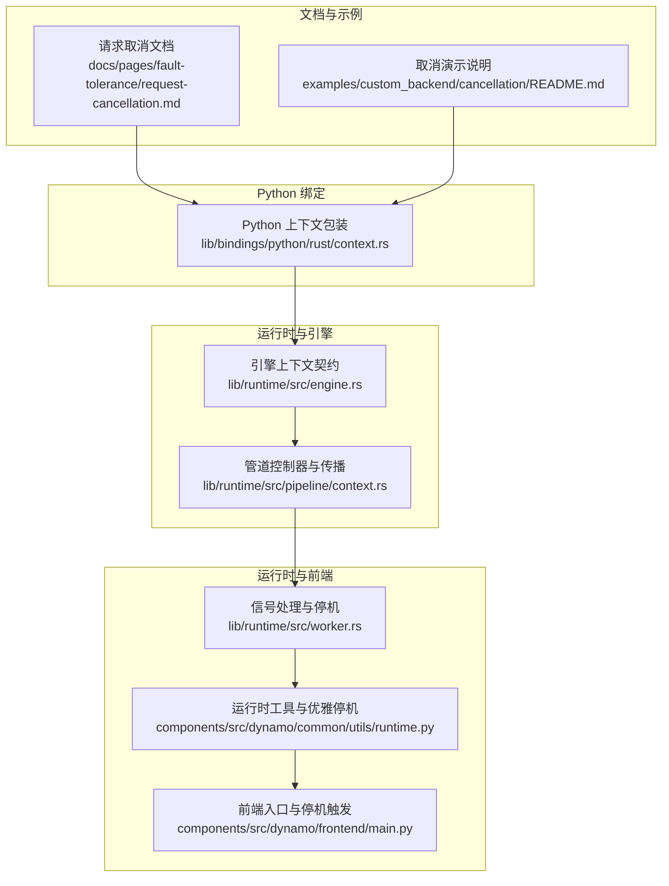
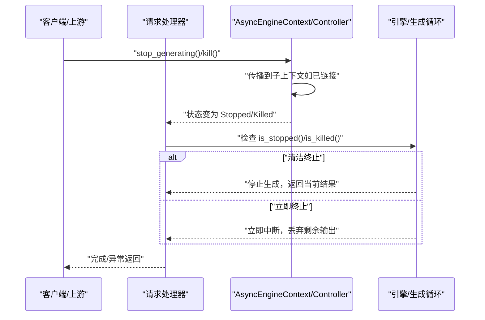
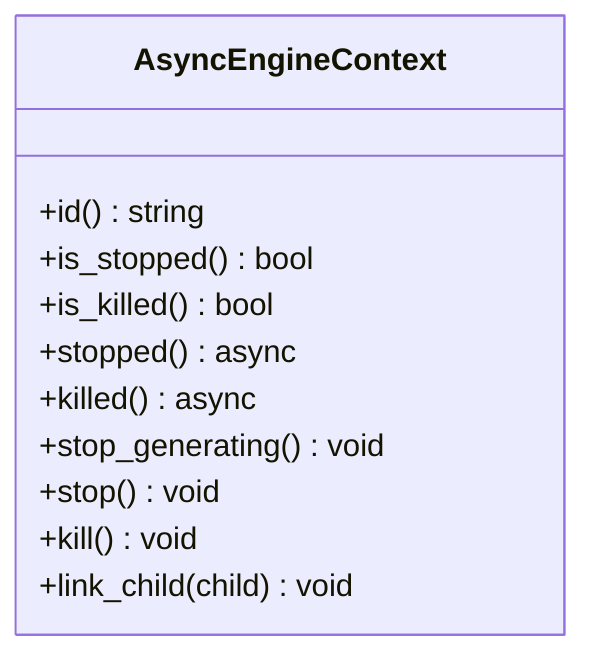
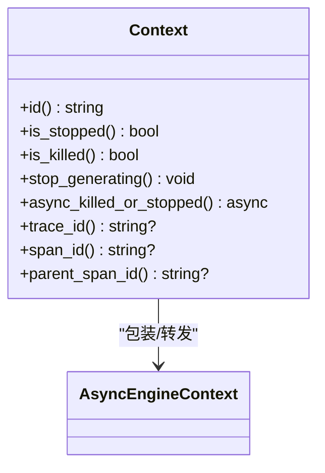
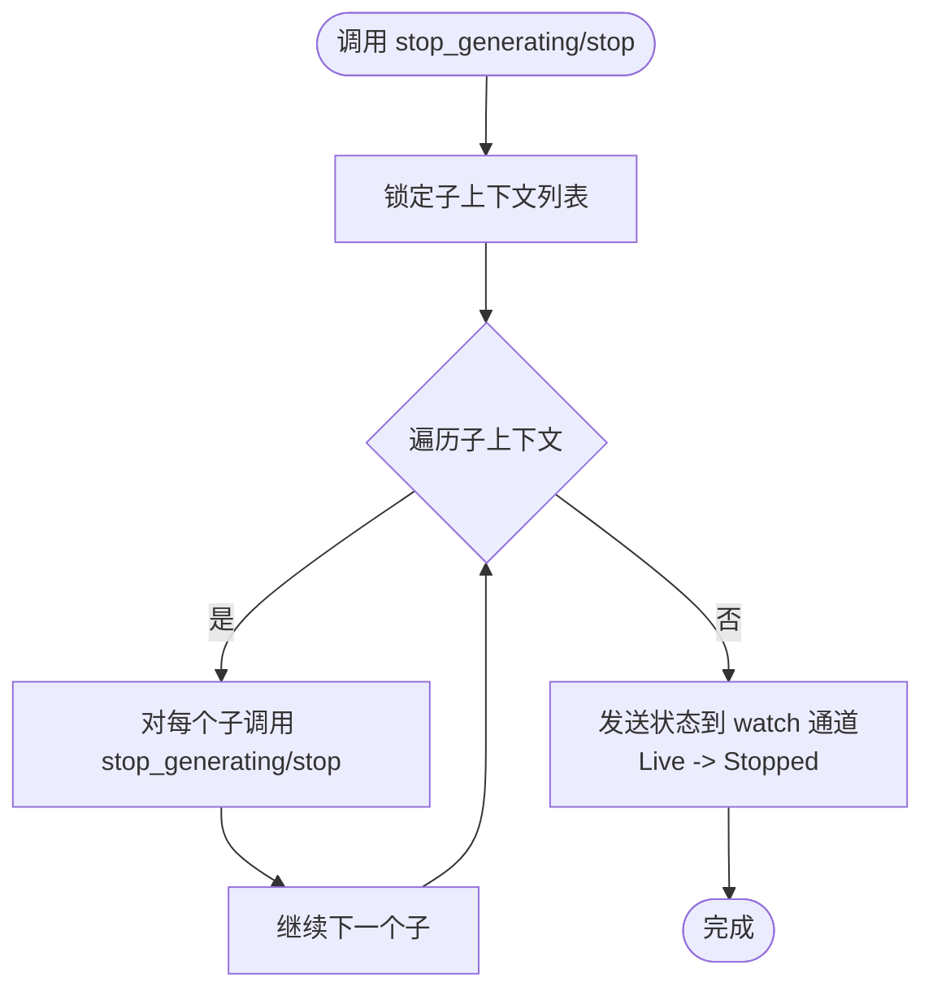
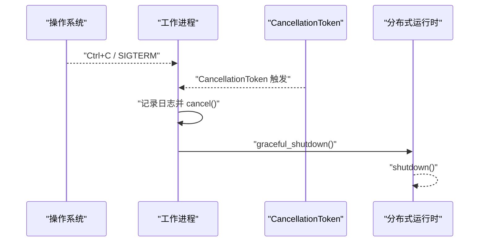
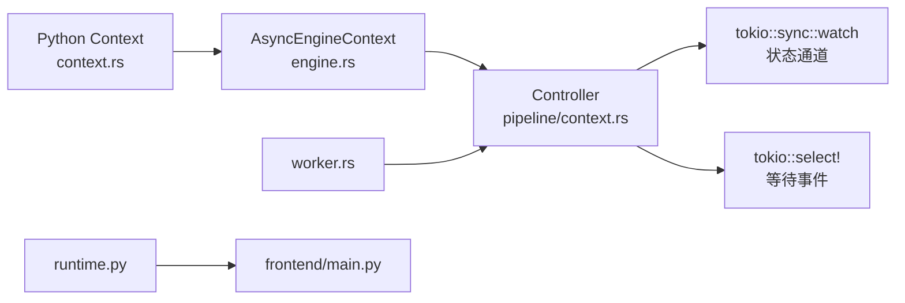

# 请求取消

<cite>
**本文引用的文件**
- [docs/pages/fault-tolerance/request-cancellation.md](file://docs/pages/fault-tolerance/request-cancellation.md)
- [examples/custom_backend/cancellation/README.md](file://examples/custom_backend/cancellation/README.md)
- [lib/bindings/python/tests/cancellation/test_cancellation.py](file://lib/bindings/python/tests/cancellation/test_cancellation.py)
- [lib/bindings/python/rust/context.rs](file://lib/bindings/python/rust/context.rs)
- [lib/runtime/src/engine.rs](file://lib/runtime/src/engine.rs)
- [lib/runtime/src/pipeline/context.rs](file://lib/runtime/src/pipeline/context.rs)
- [lib/runtime/src/worker.rs](file://lib/runtime/src/worker.rs)
- [components/src/dynamo/common/utils/engine_response.py](file://components/src/dynamo/common/utils/engine_response.py)
- [components/src/dynamo/common/utils/runtime.py](file://components/src/dynamo/common/utils/runtime.py)
- [components/src/dynamo/frontend/main.py](file://components/src/dynamo/frontend/main.py)
</cite>

## 目录
1. [简介](#简介)
2. [项目结构](#项目结构)
3. [核心组件](#核心组件)
4. [架构总览](#架构总览)
5. [详细组件分析](#详细组件分析)
6. [依赖关系分析](#依赖关系分析)
7. [性能考量](#性能考量)
8. [故障排查指南](#故障排查指南)
9. [结论](#结论)
10. [附录](#附录)

## 简介
本文件系统性阐述 Dynamo 的请求取消能力：如何优雅地停止进行中的请求以释放计算与带宽资源；如何在“清洁终止”（停止信号）与“立即终止”（kill 信号）之间做出选择；以及在请求链路中如何实现层次化的取消传播。文档还覆盖取消状态管理、资源清理流程、错误处理策略、客户端响应处理、取消时机选择、性能影响评估、配置与监控指标、典型取消场景、测试方法与运维建议。

## 项目结构
围绕请求取消的关键代码分布在以下模块：
- 文档与示例：用于理解接口语义与使用方式
- Python 绑定层：将 Rust 的取消上下文暴露给 Python
- 运行时引擎与管道上下文：定义取消契约、状态机与传播机制
- 工作进程与运行时工具：集成信号与优雅停机
- 前端入口：触发优雅停机流程

图表来源
- [docs/pages/fault-tolerance/request-cancellation.md](file://docs/pages/fault-tolerance/request-cancellation.md#L1-L92)
- [examples/custom_backend/cancellation/README.md](file://examples/custom_backend/cancellation/README.md#L1-L92)
- [lib/bindings/python/rust/context.rs](file://lib/bindings/python/rust/context.rs#L1-L127)
- [lib/runtime/src/engine.rs](file://lib/runtime/src/engine.rs#L97-L156)
- [lib/runtime/src/pipeline/context.rs](file://lib/runtime/src/pipeline/context.rs#L312-L431)
- [lib/runtime/src/worker.rs](file://lib/runtime/src/worker.rs#L208-L238)
- [components/src/dynamo/common/utils/runtime.py](file://components/src/dynamo/common/utils/runtime.py#L45-L99)
- [components/src/dynamo/frontend/main.py](file://components/src/dynamo/frontend/main.py#L501-L507)

章节来源
- [docs/pages/fault-tolerance/request-cancellation.md](file://docs/pages/fault-tolerance/request-cancellation.md#L1-L92)
- [examples/custom_backend/cancellation/README.md](file://examples/custom_backend/cancellation/README.md#L1-L92)

## 核心组件
- 引擎上下文契约（AsyncEngineContext）
  - 提供请求流的生命周期控制：标识、状态查询、异步等待、停止/杀死、子上下文链接
  - 支持“清洁终止”（stop_generating/stop）与“立即终止”（kill），并可组合使用
- Python 上下文包装（Context）
  - 暴露 id、is_stopped、is_killed、stop_generating、async_killed_or_stopped 等方法
  - 通过 tokio::select! 将 killed() 与 stopped() 联动，便于等待任一事件
- 控制器（Controller）
  - 内部以 watch 通道维护状态机（Live/Stopped/Killed）
  - 实现 stop_generating/stop 与 kill 的传播：先对子上下文调用，再更新自身状态
  - 提供 link_child 以建立父子链路，支持多级取消传播
- 信号与优雅停机
  - 工作进程监听 Ctrl+C/SIGTERM/CancellationToken，统一触发 cancel
  - 运行时工具与前端入口负责触发分布式运行时优雅停机

章节来源
- [lib/runtime/src/engine.rs](file://lib/runtime/src/engine.rs#L97-L156)
- [lib/bindings/python/rust/context.rs](file://lib/bindings/python/rust/context.rs#L43-L90)
- [lib/runtime/src/pipeline/context.rs](file://lib/runtime/src/pipeline/context.rs#L312-L431)
- [lib/runtime/src/worker.rs](file://lib/runtime/src/worker.rs#L208-L238)
- [components/src/dynamo/common/utils/runtime.py](file://components/src/dynamo/common/utils/runtime.py#L45-L99)
- [components/src/dynamo/frontend/main.py](file://components/src/dynamo/frontend/main.py#L501-L507)

## 架构总览
Dynamo 的请求取消采用“上下文驱动 + 层次化传播”的设计：
- 客户端或上游组件持有 Context，并在需要时调用 stop_generating 或 kill
- 引擎侧在生成循环中定期检查 is_stopped/is_killed 并适时抛出取消异常
- 控制器在父上下文上执行 stop/kill 时，会遍历已链接的子上下文并同步执行相同操作
- 在前端或工作进程层面，可通过信号或运行时工具触发全局优雅停机，确保所有活跃请求被清理

图表来源
- [lib/runtime/src/engine.rs](file://lib/runtime/src/engine.rs#L100-L156)
- [lib/runtime/src/pipeline/context.rs](file://lib/runtime/src/pipeline/context.rs#L377-L423)
- [lib/bindings/python/rust/context.rs](file://lib/bindings/python/rust/context.rs#L67-L90)

## 详细组件分析

### 引擎上下文契约（AsyncEngineContext）
- 关键职责
  - 流标识：id()
  - 状态查询：is_stopped()/is_killed()
  - 异步等待：stopped()/killed()
  - 控制命令：stop_generating()/stop()/kill()
  - 子上下文管理：link_child(child)
- 设计要点
  - 线程安全：Send + Sync
  - 可组合：支持在多阶段流水线中传递取消意图
  - 兼容性：kill 可能不被所有引擎支持，需按实现行为处理

图表来源
- [lib/runtime/src/engine.rs](file://lib/runtime/src/engine.rs#L100-L156)

章节来源
- [lib/runtime/src/engine.rs](file://lib/runtime/src/engine.rs#L97-L156)

### Python 上下文包装（Context）
- 方法映射
  - 同步：id()/is_stopped()/is_killed()/stop_generating()
  - 异步：async_killed_or_stopped() 使用 tokio::select! 等待 killed 或 stopped
- 用途
  - 在入站/出站请求中作为可选参数传入，便于在多级链路中传递取消意图
  - 与运行时工具配合，实现从客户端到后端的取消传播

图表来源
- [lib/bindings/python/rust/context.rs](file://lib/bindings/python/rust/context.rs#L12-L109)

章节来源
- [lib/bindings/python/rust/context.rs](file://lib/bindings/python/rust/context.rs#L43-L109)

### 控制器与状态传播（Controller）
- 状态机
  - Live → Stopped → Killed
  - 通过 watch 通道广播状态变化，stopped()/killed() 通过等待通道变更实现
- 传播机制
  - stop_generating/stop：先对子上下文调用 stop_generating/stop，再设置自身为 Stopped
  - kill：先对子上下文调用 kill，再设置自身为 Killed
  - link_child：维护子上下文列表，按链接顺序依次传播
- 注意事项
  - 避免父子互链导致死锁：传播前克隆子上下文列表
  - is_killed() 严格区分“立即终止”，适合在下游流末端使用 take_while(!ctx.is_killed())

图表来源
- [lib/runtime/src/pipeline/context.rs](file://lib/runtime/src/pipeline/context.rs#L377-L391)

章节来源
- [lib/runtime/src/pipeline/context.rs](file://lib/runtime/src/pipeline/context.rs#L305-L431)

### 信号与优雅停机
- 信号处理
  - 监听 Ctrl+C 与 SIGTERM，记录日志并触发 cancel
  - 同时监听 CancellationToken，统一进入停机路径
- 运行时工具
  - graceful_shutdown：在收到停机信号时设置可选事件并调用 runtime.shutdown()
  - 前端入口在退出时触发 graceful_shutdown，确保分布式运行时有序关闭

图表来源
- [lib/runtime/src/worker.rs](file://lib/runtime/src/worker.rs#L208-L238)
- [components/src/dynamo/common/utils/runtime.py](file://components/src/dynamo/common/utils/runtime.py#L45-L99)
- [components/src/dynamo/frontend/main.py](file://components/src/dynamo/frontend/main.py#L501-L507)

章节来源
- [lib/runtime/src/worker.rs](file://lib/runtime/src/worker.rs#L208-L238)
- [components/src/dynamo/common/utils/runtime.py](file://components/src/dynamo/common/utils/runtime.py#L45-L99)
- [components/src/dynamo/frontend/main.py](file://components/src/dynamo/frontend/main.py#L423-L507)

### 取消时机与资源清理
- 何时取消
  - 客户端侧：收到足够结果或超时后主动 stop_generating
  - 服务端侧：在每次昂贵操作前检查 is_stopped()/is_killed()，并在检测到后抛出取消异常
  - 立即终止：当网络断开或需要快速回收资源时使用 kill
- 清理流程
  - 停止生成：释放计算但保留已产生的部分结果
  - 立即终止：丢弃剩余输出，尽快回收资源
  - 传播：父上下文 kill/stop 时，自动通知所有子上下文
- 错误处理
  - 服务端应捕获取消异常并返回“已取消”状态
  - 客户端应识别取消异常并进行重试或降级处理
- 客户端响应
  - 取消后应返回“已完成但未完成”的提示或空结果集
  - 对于 kill 场景，可能返回“连接中断”或“请求被终止”

章节来源
- [docs/pages/fault-tolerance/request-cancellation.md](file://docs/pages/fault-tolerance/request-cancellation.md#L6-L92)
- [lib/runtime/src/engine.rs](file://lib/runtime/src/engine.rs#L100-L156)
- [lib/runtime/src/pipeline/context.rs](file://lib/runtime/src/pipeline/context.rs#L377-L423)

### 测试与验证
- 单元测试要点
  - 客户端发起取消：验证服务端上下文在 stop_generating 后变为 Stopped
  - 服务端主动取消：验证服务端在抛出取消异常后，客户端收到预期异常
  - 已取消请求：在请求发出前调用 stop_generating，应直接失败
  - 取消时机：在 await 请求前调用 stop_generating，应立即失败
- 示例参考
  - 取消演示展示了直连与代理两种架构下的取消传播过程

章节来源
- [lib/bindings/python/tests/cancellation/test_cancellation.py](file://lib/bindings/python/tests/cancellation/test_cancellation.py#L166-L334)
- [examples/custom_backend/cancellation/README.md](file://examples/custom_backend/cancellation/README.md#L59-L92)

## 依赖关系分析
- 组件耦合
  - Python Context 依赖 AsyncEngineContext 契约
  - 控制器实现 AsyncEngineContext，并通过 watch 通道与 tokio 异步模型结合
  - 前端与运行时工具通过信号与取消令牌协调全局停机
- 外部依赖
  - tokio::sync::watch 用于状态广播
  - tokio::select! 用于等待 killed/stopped 任一事件
- 循环依赖
  - 通过 Arc 与受控克隆避免父子链路死锁

图表来源
- [lib/bindings/python/rust/context.rs](file://lib/bindings/python/rust/context.rs#L7-L10)
- [lib/runtime/src/engine.rs](file://lib/runtime/src/engine.rs#L100-L156)
- [lib/runtime/src/pipeline/context.rs](file://lib/runtime/src/pipeline/context.rs#L303-L303)
- [lib/runtime/src/worker.rs](file://lib/runtime/src/worker.rs#L222-L232)
- [components/src/dynamo/common/utils/runtime.py](file://components/src/dynamo/common/utils/runtime.py#L45-L99)
- [components/src/dynamo/frontend/main.py](file://components/src/dynamo/frontend/main.py#L501-L507)

章节来源
- [lib/bindings/python/rust/context.rs](file://lib/bindings/python/rust/context.rs#L1-L127)
- [lib/runtime/src/engine.rs](file://lib/runtime/src/engine.rs#L97-L156)
- [lib/runtime/src/pipeline/context.rs](file://lib/runtime/src/pipeline/context.rs#L303-L431)
- [lib/runtime/src/worker.rs](file://lib/runtime/src/worker.rs#L208-L238)
- [components/src/dynamo/common/utils/runtime.py](file://components/src/dynamo/common/utils/runtime.py#L45-L99)
- [components/src/dynamo/frontend/main.py](file://components/src/dynamo/frontend/main.py#L501-L507)

## 性能考量
- 取消开销
  - 状态检查 is_stopped/is_killed 为 O(1)，代价极低
  - 传播 stop/kill 需遍历子上下文列表，复杂度 O(n)，建议控制链路层级
- 资源回收
  - clean stop：释放计算资源，保留已产出结果，适合长尾请求
  - kill：快速丢弃剩余输出，适合网络中断或紧急停机
- I/O 与并发
  - 在高并发场景下，避免在热路径频繁创建/销毁上下文
  - 使用 link_child 建立一次性链路，减少重复传播成本

## 故障排查指南
- 常见问题
  - 取消无效：确认服务端在每次昂贵操作前检查 is_stopped/is_killed
  - 传播未生效：检查是否正确调用 link_child 并保持父子关系一致
  - 立即终止异常：确认引擎是否支持 kill，否则回退到 clean stop
  - 优雅停机未触发：检查信号处理与 CancellationToken 是否正确初始化
- 日志与诊断
  - 记录取消来源（客户端/上游/信号）、取消类型（stop/kill）、传播路径
  - 在前端与工作进程入口处增加停机日志，便于定位停机时机

章节来源
- [lib/runtime/src/worker.rs](file://lib/runtime/src/worker.rs#L208-L238)
- [components/src/dynamo/common/utils/runtime.py](file://components/src/dynamo/common/utils/runtime.py#L45-L99)
- [components/src/dynamo/frontend/main.py](file://components/src/dynamo/frontend/main.py#L501-L507)

## 结论
Dynamo 的请求取消体系以 AsyncEngineContext 为核心，通过 Python 上下文包装与控制器实现，提供了清晰的“清洁终止”与“立即终止”路径，并在请求链路中实现了层次化传播。结合信号与运行时工具，系统能够在多种场景下优雅停机并回收资源。实践中应重视取消时机、状态检查与错误处理，以获得稳定且高性能的取消体验。

## 附录

### 取消类型与语义
- 清洁终止（stop_generating/stop）
  - 语义：停止继续生成，保留已产出结果
  - 适用：客户端收到足够结果或超时后的常规停止
- 立即终止（kill）
  - 语义：优先丢弃剩余输出，快速回收资源
  - 适用：网络中断、紧急停机或引擎明确支持的硬停

章节来源
- [docs/pages/fault-tolerance/request-cancellation.md](file://docs/pages/fault-tolerance/request-cancellation.md#L12-L31)
- [lib/runtime/src/engine.rs](file://lib/runtime/src/engine.rs#L137-L149)

### 配置与监控建议
- 配置项（示例方向）
  - 取消超时：在客户端侧设置取消等待上限，避免无限阻塞
  - 传播深度限制：限制 link_child 链路层级，防止过深传播导致延迟
  - kill 支持开关：按引擎能力启用/禁用 kill
- 监控指标（示例方向）
  - 取消请求数量与成功率
  - clean stop vs kill 的分布
  - 传播延迟与链路长度
  - 优雅停机耗时与资源回收情况

### 实际取消场景
- 场景一：客户端在收到前 N 条结果后主动取消
  - 客户端：调用 stop_generating
  - 服务端：检查 is_stopped，停止生成并返回
- 场景二：上游代理转发请求并在取消时传播
  - 代理：接收客户端取消，调用 link_child 并向下游传播
  - 下游：检测到取消后快速返回
- 场景三：网络中断导致的立即终止
  - 客户端：检测到连接断开，调用 kill
  - 服务端：检测到 is_killed，丢弃剩余输出并回收

章节来源
- [examples/custom_backend/cancellation/README.md](file://examples/custom_backend/cancellation/README.md#L59-L92)
- [lib/runtime/src/pipeline/context.rs](file://lib/runtime/src/pipeline/context.rs#L409-L423)

### 测试方法
- 单元测试
  - 客户端发起取消：验证服务端上下文变为 Stopped
  - 服务端主动取消：验证客户端收到取消异常
  - 已取消请求：在请求发出前调用 stop_generating，应立即失败
  - 取消时机：在 await 请求前调用 stop_generating，应立即失败
- 端到端测试
  - 直连与代理两种架构下的取消传播
  - 多级链路（父→子→孙）的取消一致性

章节来源
- [lib/bindings/python/tests/cancellation/test_cancellation.py](file://lib/bindings/python/tests/cancellation/test_cancellation.py#L166-L334)
- [examples/custom_backend/cancellation/README.md](file://examples/custom_backend/cancellation/README.md#L59-L92)

### 运维建议
- 在前端与工作进程入口统一注册信号处理与优雅停机逻辑
- 对引擎实现进行 kill 支持评估，必要时提供降级策略
- 在高并发场景下，优化链路层级与状态检查频率
- 建立完善的日志与监控，追踪取消来源、类型与传播路径

章节来源
- [components/src/dynamo/common/utils/runtime.py](file://components/src/dynamo/common/utils/runtime.py#L45-L99)
- [components/src/dynamo/frontend/main.py](file://components/src/dynamo/frontend/main.py#L423-L507)
- [lib/runtime/src/worker.rs](file://lib/runtime/src/worker.rs#L208-L238)