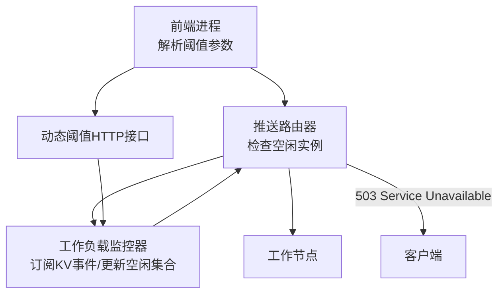
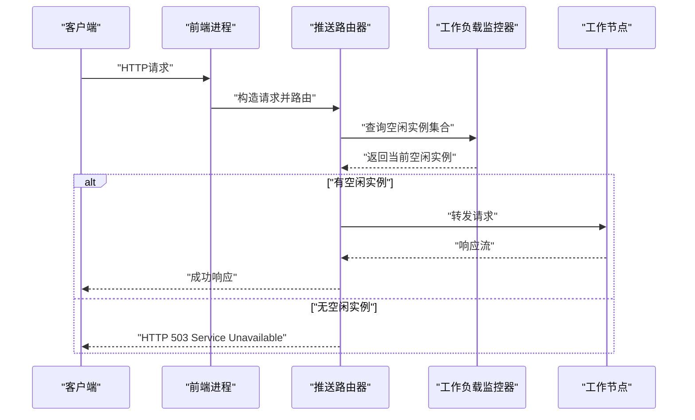
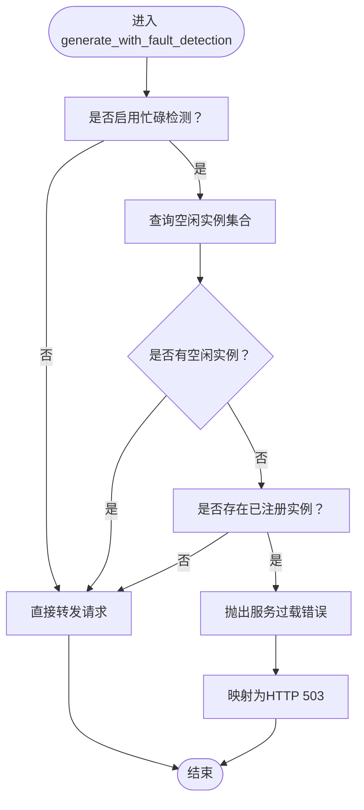
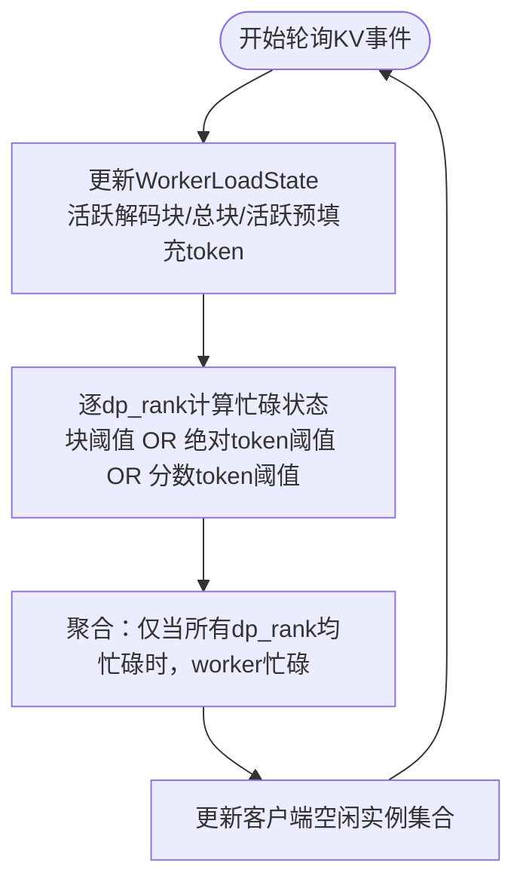
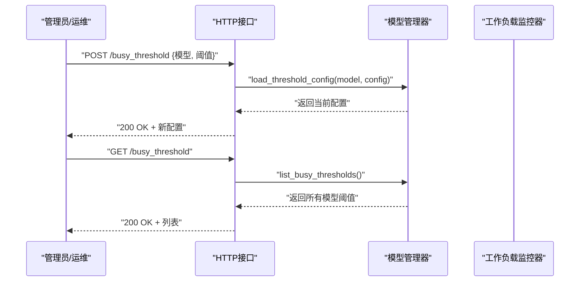
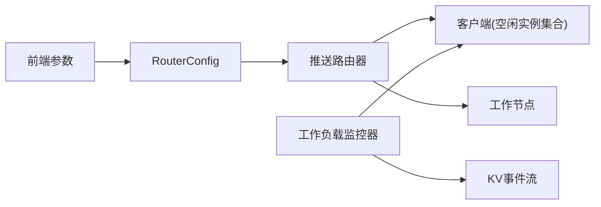

# 请求拒绝（负载削峰）

<cite>
**本文引用的文件**
- [components/src/dynamo/frontend/main.py](file://components/src/dynamo/frontend/main.py)
- [lib/runtime/src/pipeline/network/egress/push_router.rs](file://lib/runtime/src/pipeline/network/egress/push_router.rs)
- [lib/llm/src/discovery/worker_monitor.rs](file://lib/llm/src/discovery/worker_monitor.rs)
- [lib/llm/src/http/service/busy_threshold.rs](file://lib/llm/src/http/service/busy_threshold.rs)
- [lib/llm/src/http/service/openai.rs](file://lib/llm/src/http/service/openai.rs)
- [lib/runtime/src/pipeline/error.rs](file://lib/runtime/src/pipeline/error.rs)
- [docs/pages/fault-tolerance/request-rejection.md](file://docs/pages/fault-tolerance/request-rejection.md)
- [tests/router/common.py](file://tests/router/common.py)
- [lib/llm/src/kv_router/metrics.rs](file://lib/llm/src/kv_router/metrics.rs)
- [lib/llm/src/kv_router/sequence.rs](file://lib/llm/src/kv_router/sequence.rs)
</cite>

## 目录
1. [简介](#简介)
2. [项目结构](#项目结构)
3. [核心组件](#核心组件)
4. [架构总览](#架构总览)
5. [详细组件分析](#详细组件分析)
6. [依赖关系分析](#依赖关系分析)
7. [性能考量](#性能考量)
8. [故障排查指南](#故障排查指南)
9. [结论](#结论)
10. [附录](#附录)

## 简介
本文件面向Dynamo的“请求拒绝（负载削峰）”能力，系统性阐述在worker过载时如何主动拒绝新请求以避免级联故障、资源耗尽与尾延迟恶化。该能力通过“基于KV缓存利用率的可配置繁忙阈值 + 实时worker负载监控 + HTTP 503响应与重试指导”的闭环机制，实现稳定的服务质量与弹性保护。

## 项目结构
围绕请求拒绝的关键代码分布在以下模块：
- 前端启动与参数解析：负责接收并传递“活跃解码块阈值”“活跃预填充token阈值”等参数到路由层
- 推送路由器：在路由阶段检查空闲实例列表，若无可用实例则直接拒绝并返回服务不可用
- 工作负载监控器：后台订阅KV事件，维护每个worker的负载状态，并动态更新“空闲实例集合”
- 动态阈值HTTP接口：支持运行时查询/设置模型级别的繁忙阈值
- 错误映射：将内部“服务过载”错误转换为标准HTTP 503响应
- 指标与测试：暴露worker负载指标，提供拒绝行为的端到端测试

图表来源
- [components/src/dynamo/frontend/main.py](file://components/src/dynamo/frontend/main.py#L454-L461)
- [lib/runtime/src/pipeline/network/egress/push_router.rs](file://lib/runtime/src/pipeline/network/egress/push_router.rs#L310-L328)
- [lib/llm/src/discovery/worker_monitor.rs](file://lib/llm/src/discovery/worker_monitor.rs#L524-L544)
- [lib/llm/src/http/service/busy_threshold.rs](file://lib/llm/src/http/service/busy_threshold.rs#L122-L140)

章节来源
- [components/src/dynamo/frontend/main.py](file://components/src/dynamo/frontend/main.py#L272-L288)
- [lib/runtime/src/pipeline/network/egress/push_router.rs](file://lib/runtime/src/pipeline/network/egress/push_router.rs#L143-L168)
- [lib/llm/src/discovery/worker_monitor.rs](file://lib/llm/src/discovery/worker_monitor.rs#L326-L391)

## 核心组件
- 前端参数与路由配置
  - 前端支持通过命令行参数设置“活跃解码块阈值”“活跃预填充token绝对阈值”“活跃预填充token占max_num_batched_tokens的分数阈值”，并将其注入到RouterConfig中，供推送路由器使用。
- 推送路由器与拒绝逻辑
  - 路由器在生成请求前，若启用忙碌检测，则从客户端查询“空闲实例集合”。若为空且存在已注册实例，则抛出“服务过载”错误，最终映射为HTTP 503。
- 工作负载监控器
  - 后台任务订阅KV事件，维护每个worker的活跃解码块数、总块数、活跃预填充token数；根据阈值计算每个dp_rank的忙碌状态，并聚合为“worker整体忙碌”；仅当所有dp_rank均忙碌时才视为忙碌；最终更新客户端的“空闲实例集合”。
- 动态阈值HTTP接口
  - 提供POST/GET /busy_threshold，支持按模型设置或查询阈值，范围校验与错误处理完善。
- 错误映射与指标
  - 将内部“服务过载”错误映射为HTTP 503；同时暴露worker负载指标，便于观测与告警。

章节来源
- [components/src/dynamo/frontend/main.py](file://components/src/dynamo/frontend/main.py#L272-L288)
- [lib/runtime/src/pipeline/network/egress/push_router.rs](file://lib/runtime/src/pipeline/network/egress/push_router.rs#L310-L328)
- [lib/llm/src/discovery/worker_monitor.rs](file://lib/llm/src/discovery/worker_monitor.rs#L111-L166)
- [lib/llm/src/http/service/busy_threshold.rs](file://lib/llm/src/http/service/busy_threshold.rs#L142-L223)
- [lib/llm/src/http/service/openai.rs](file://lib/llm/src/http/service/openai.rs#L164-L181)

## 架构总览
下图展示从请求到达前端，经由推送路由器与工作负载监控器，到最终可能被拒绝的整体流程。

图表来源
- [lib/runtime/src/pipeline/network/egress/push_router.rs](file://lib/runtime/src/pipeline/network/egress/push_router.rs#L310-L328)
- [lib/llm/src/discovery/worker_monitor.rs](file://lib/llm/src/discovery/worker_monitor.rs#L524-L544)

章节来源
- [lib/runtime/src/pipeline/network/egress/push_router.rs](file://lib/runtime/src/pipeline/network/egress/push_router.rs#L305-L408)
- [lib/llm/src/discovery/worker_monitor.rs](file://lib/llm/src/discovery/worker_monitor.rs#L326-L391)

## 详细组件分析

### 组件A：推送路由器与拒绝策略
- 关键职责
  - 在路由阶段检查是否启用“忙碌检测”（即是否配置了阈值）
  - 若启用：从客户端查询“空闲实例集合”，若为空且存在已注册实例，则拒绝请求并返回“服务过载”错误
  - 将内部错误映射为HTTP 503，消息体包含统一错误格式
- 拒绝触发条件
  - 所有已注册实例均被标记为忙碌（由监控器维护的“空闲实例集合”为空）
  - 此时返回HTTP 503，提示客户端稍后重试
- 与数据并行rank的关系
  - 对于多数据并行rank的worker，只有当“所有rank均忙碌”时，该worker才被视为忙碌，避免部分rank繁忙导致的误判

图表来源
- [lib/runtime/src/pipeline/network/egress/push_router.rs](file://lib/runtime/src/pipeline/network/egress/push_router.rs#L305-L408)
- [lib/runtime/src/pipeline/error.rs](file://lib/runtime/src/pipeline/error.rs#L123-L125)
- [lib/llm/src/http/service/openai.rs](file://lib/llm/src/http/service/openai.rs#L164-L181)

章节来源
- [lib/runtime/src/pipeline/network/egress/push_router.rs](file://lib/runtime/src/pipeline/network/egress/push_router.rs#L305-L408)
- [lib/runtime/src/pipeline/error.rs](file://lib/runtime/src/pipeline/error.rs#L123-L125)
- [lib/llm/src/http/service/openai.rs](file://lib/llm/src/http/service/openai.rs#L164-L181)

### 组件B：工作负载监控器与阈值检测算法
- 监控职责
  - 订阅KV事件，收集每个worker的活跃解码块数、总块数、活跃预填充token数
  - 基于阈值计算每个dp_rank的忙碌状态，并聚合为worker整体忙碌状态
  - 当任一dp_rank不满足阈值时，该worker仍视为非忙碌（OR逻辑）
  - 更新客户端的“空闲实例集合”，供路由器查询
- 阈值类型与计算
  - 解码块阈值：活跃解码块数 / 总块数 > 阈值
  - 预填充token绝对阈值：活跃预填充token数 > 绝对阈值
  - 预填充token分数阈值：活跃预填充token数 > 分数 × max_num_batched_tokens
- 默认与动态配置
  - 默认情况下阈值被设置为“几乎不触发”的高值，确保默认关闭
  - 支持通过HTTP接口动态设置/查询模型级别的阈值

图表来源
- [lib/llm/src/discovery/worker_monitor.rs](file://lib/llm/src/discovery/worker_monitor.rs#L484-L544)
- [lib/llm/src/discovery/worker_monitor.rs](file://lib/llm/src/discovery/worker_monitor.rs#L111-L166)

章节来源
- [lib/llm/src/discovery/worker_monitor.rs](file://lib/llm/src/discovery/worker_monitor.rs#L111-L166)
- [lib/llm/src/discovery/worker_monitor.rs](file://lib/llm/src/discovery/worker_monitor.rs#L524-L544)

### 组件C：动态阈值HTTP接口
- 能力概述
  - 提供POST /busy_threshold用于设置模型的阈值（块阈值、绝对token阈值、分数token阈值）
  - 提供GET /busy_threshold用于查询当前配置
  - 包含输入校验与错误响应（如范围错误、未发现模型等）
- 使用场景
  - 运行时根据负载曲线调整阈值，提前或延后触发拒绝
  - 与监控告警联动，实现自动化节流

图表来源
- [lib/llm/src/http/service/busy_threshold.rs](file://lib/llm/src/http/service/busy_threshold.rs#L122-L140)
- [lib/llm/src/http/service/busy_threshold.rs](file://lib/llm/src/http/service/busy_threshold.rs#L142-L223)

章节来源
- [lib/llm/src/http/service/busy_threshold.rs](file://lib/llm/src/http/service/busy_threshold.rs#L142-L223)

### 组件D：前端参数解析与阈值注入
- 前端支持如下参数：
  - --active-decode-blocks-threshold：解码块利用率阈值（0.0-1.0）
  - --active-prefill-tokens-threshold：活跃预填充token绝对阈值
  - --active-prefill-tokens-threshold-frac：活跃预填充token占max_num_batched_tokens的分数阈值
- 参数被封装进RouterConfig并传入引擎，供推送路由器使用

章节来源
- [components/src/dynamo/frontend/main.py](file://components/src/dynamo/frontend/main.py#L272-L288)
- [components/src/dynamo/frontend/main.py](file://components/src/dynamo/frontend/main.py#L454-L461)

### 组件E：指标与可观测性
- 暴露worker负载指标（活跃解码块、活跃预填充token），便于在Grafana中可视化
- 文档提供了Prometheus指标与告警示例，包括拒绝总量、队列长度等

章节来源
- [lib/llm/src/kv_router/metrics.rs](file://lib/llm/src/kv_router/metrics.rs#L28-L89)
- [docs/pages/fault-tolerance/request-rejection.md](file://docs/pages/fault-tolerance/request-rejection.md#L195-L232)

## 依赖关系分析
- 组件耦合
  - 推送路由器依赖客户端提供的“空闲实例集合”，该集合由工作负载监控器维护
  - 工作负载监控器依赖KV事件流与模型部署卡（runtime config）来填充worker状态
  - 前端参数通过RouterConfig注入到路由器，形成“阈值—监控—路由—拒绝”的闭环
- 外部依赖
  - 事件平面（NATS/ZMQ）用于发布/订阅KV事件
  - Prometheus注册表用于暴露worker负载指标

图表来源
- [components/src/dynamo/frontend/main.py](file://components/src/dynamo/frontend/main.py#L454-L461)
- [lib/runtime/src/pipeline/network/egress/push_router.rs](file://lib/runtime/src/pipeline/network/egress/push_router.rs#L310-L328)
- [lib/llm/src/discovery/worker_monitor.rs](file://lib/llm/src/discovery/worker_monitor.rs#L358-L361)

章节来源
- [components/src/dynamo/frontend/main.py](file://components/src/dynamo/frontend/main.py#L454-L461)
- [lib/runtime/src/pipeline/network/egress/push_router.rs](file://lib/runtime/src/pipeline/network/egress/push_router.rs#L310-L328)
- [lib/llm/src/discovery/worker_monitor.rs](file://lib/llm/src/discovery/worker_monitor.rs#L358-L361)

## 性能考量
- 拒绝时机
  - 在路由阶段尽早拒绝，避免将请求放入下游队列，降低尾延迟与内存占用
- 阈值设计
  - 块阈值与token阈值采用“任一触发”的OR逻辑，兼顾不同工作负载特征
  - 分数阈值与绝对阈值可并行使用，提升灵活性
- 数据并行rank聚合
  - 仅当所有rank均忙碌时才标记worker忙碌，减少误判，提高稳定性
- 指标与观测
  - 通过活跃解码块与活跃预填充token指标，结合Prometheus/Grafana进行容量规划与异常预警

## 故障排查指南
- 现象：客户端收到HTTP 503
  - 可能原因：所有worker均被标记为忙碌
  - 排查步骤：
    - 查询/busy_threshold确认阈值配置是否合理
    - 查看worker负载指标，确认活跃解码块/活跃预填充token是否接近阈值
    - 检查是否存在大量长会话或慢请求导致token堆积
- 现象：动态阈值设置无效
  - 可能原因：模型未被发现或监控器未启动
  - 排查步骤：
    - 确认模型已在发现服务中注册
    - 检查监控器日志，确认KV事件订阅正常
- 端到端验证
  - 参考集成测试，发送额外请求应得到503响应，且错误信息包含“全部worker忙碌”的提示

章节来源
- [tests/router/common.py](file://tests/router/common.py#L1261-L1289)
- [lib/llm/src/http/service/busy_threshold.rs](file://lib/llm/src/http/service/busy_threshold.rs#L181-L192)
- [lib/llm/src/http/service/openai.rs](file://lib/llm/src/http/service/openai.rs#L1800-L1813)

## 结论
Dynamo的请求拒绝（负载削峰）通过“阈值驱动的忙碌检测 + 实时监控 + 路由阶段拒绝 + HTTP 503响应”的组合，有效避免了worker过载引发的级联故障与尾延迟恶化。配合动态阈值接口与完善的指标体系，可在高负载场景下实现稳定的服务质量与快速恢复能力。

## 附录

### 配置项与参数
- 前端参数
  - --active-decode-blocks-threshold：解码块利用率阈值（0.0-1.0）
  - --active-prefill-tokens-threshold：活跃预填充token绝对阈值
  - --active-prefill-tokens-threshold-frac：活跃预填充token占max_num_batched_tokens的分数阈值
- 动态阈值接口
  - POST /busy_threshold：设置模型的块/绝对token/分数token阈值
  - GET /busy_threshold：列出当前配置

章节来源
- [components/src/dynamo/frontend/main.py](file://components/src/dynamo/frontend/main.py#L272-L288)
- [lib/llm/src/http/service/busy_threshold.rs](file://lib/llm/src/http/service/busy_threshold.rs#L122-L140)

### 客户端重试策略
- 建议采用指数退避+抖动的重试策略，避免雪崩效应
- 参考文档中的示例，限制最大重试次数与最大等待时间

章节来源
- [docs/pages/fault-tolerance/request-rejection.md](file://docs/pages/fault-tolerance/request-rejection.md#L174-L193)

### 监控与告警建议
- 指标
  - dynamo_tasks_rejected_total：拒绝总量
  - dynamo_queued_requests：HTTP队列长度
- 告警
  - 拒绝率超过阈值（例如5分钟内超过10%）持续一段时间触发告警

章节来源
- [docs/pages/fault-tolerance/request-rejection.md](file://docs/pages/fault-tolerance/request-rejection.md#L195-L232)