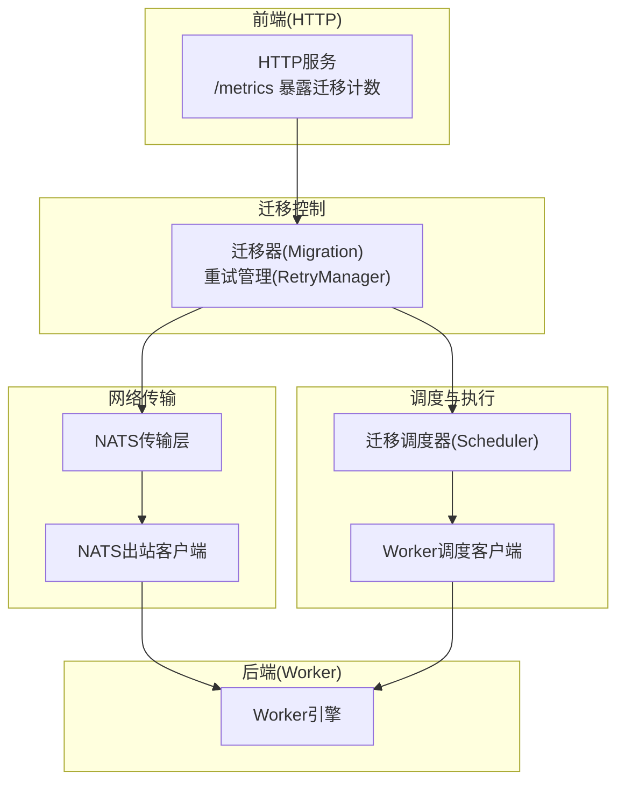
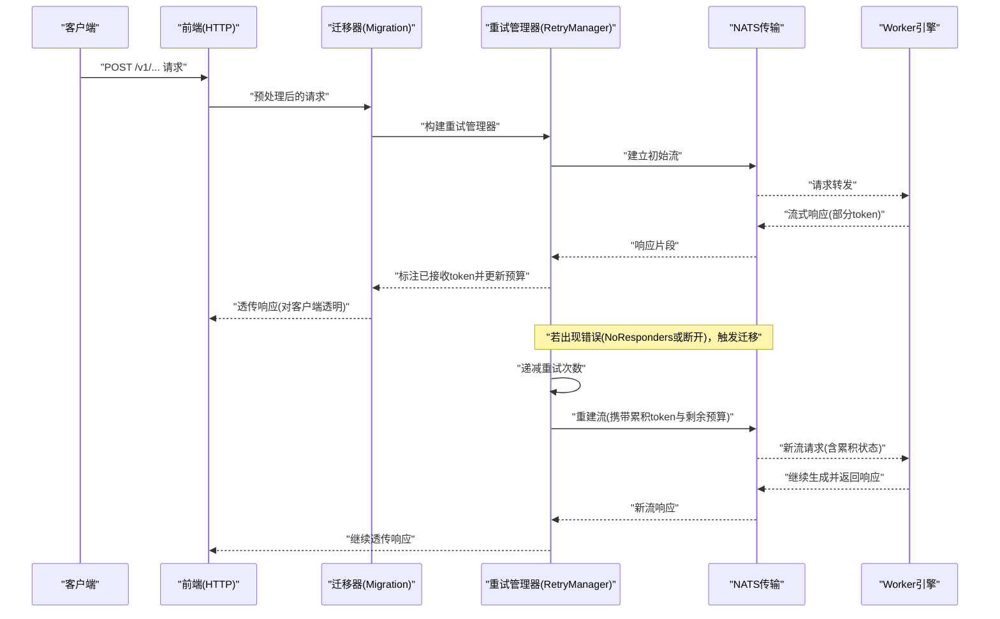
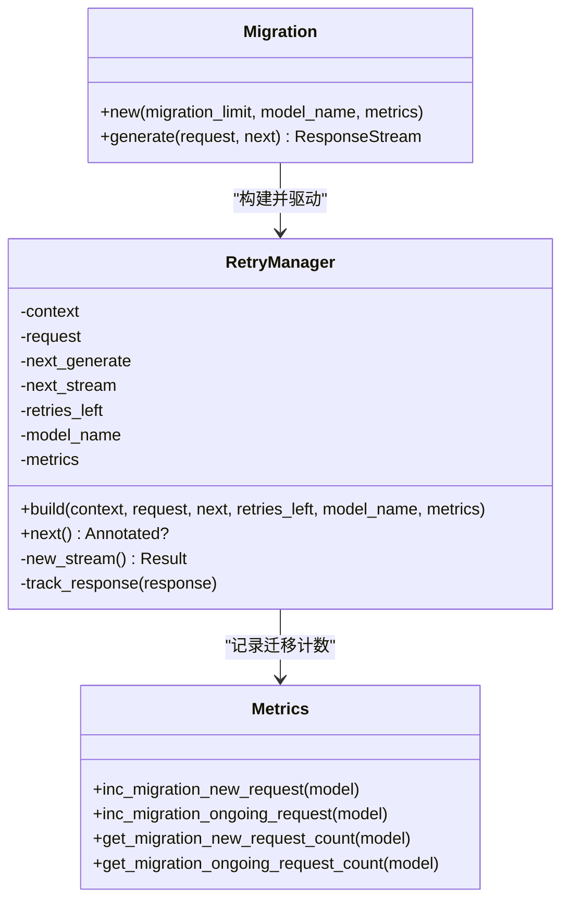
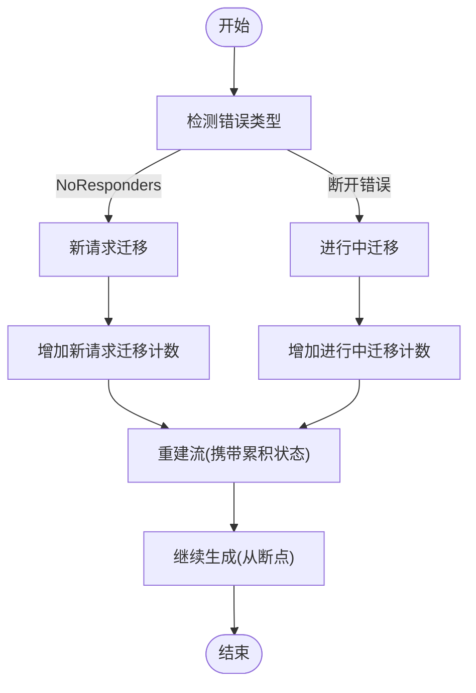
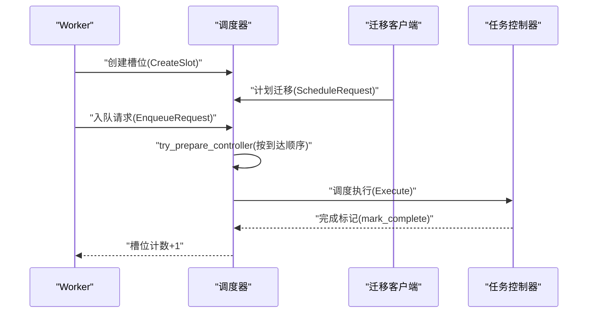
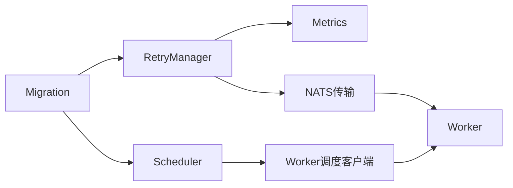

# 请求迁移

<cite>
**本文引用的文件**
- [lib/llm/src/migration.rs](file://lib/llm/src/migration.rs)
- [lib/llm/src/http/service/metrics.rs](file://lib/llm/src/http/service/metrics.rs)
- [lib/llm/src/block_manager/connector/scheduler.rs](file://lib/llm/src/block_manager/connector/scheduler.rs)
- [lib/runtime/src/transports/nats.rs](file://lib/runtime/src/transports/nats.rs)
- [lib/runtime/src/pipeline/network/egress/nats_client.rs](file://lib/runtime/src/pipeline/network/egress/nats_client.rs)
- [docs/pages/fault-tolerance/request-migration.md](file://docs/pages/fault-tolerance/request-migration.md)
- [tests/fault_tolerance/migration/utils.py](file://tests/fault_tolerance/migration/utils.py)
- [lib/tokens/src/lib.rs](file://lib/tokens/src/lib.rs)
- [lib/llm/src/tokens.rs](file://lib/llm/src/tokens.rs)
</cite>

## 目录
1. [简介](#简介)
2. [项目结构](#项目结构)
3. [核心组件](#核心组件)
4. [架构总览](#架构总览)
5. [详细组件分析](#详细组件分析)
6. [依赖关系分析](#依赖关系分析)
7. [性能考量](#性能考量)
8. [故障排查指南](#故障排查指南)
9. [结论](#结论)
10. [附录](#附录)

## 简介
本文件系统性阐述Dynamo的请求迁移能力：当worker在处理进行中的请求过程中发生失败时，如何通过“部分生成状态保存（累积token）+ 透明继续生成 + 无缝token流到客户端”的机制，将请求从故障worker平滑迁移到健康worker，从而实现高可用与无感体验。文档覆盖迁移触发条件、状态序列化/反序列化过程、网络传输协议与数据完整性保障、性能开销分析、最佳实践配置、故障场景模拟、监控指标与调试方法。

## 项目结构
围绕请求迁移的关键代码分布在以下模块：
- 迁移与重试控制：lib/llm/src/migration.rs
- 前端指标与迁移计数：lib/llm/src/http/service/metrics.rs
- 调度器与迁移协调：lib/llm/src/block_manager/connector/scheduler.rs
- 网络传输层（NATS）：lib/runtime/src/transports/nats.rs、lib/runtime/src/pipeline/network/egress/nats_client.rs
- 文档与测试工具：docs/pages/fault-tolerance/request-migration.md、tests/fault_tolerance/migration/utils.py
- Token序列管理：lib/tokens/src/lib.rs、lib/llm/src/tokens.rs

图示来源
- [lib/llm/src/migration.rs](file://lib/llm/src/migration.rs#L24-L84)
- [lib/llm/src/http/service/metrics.rs](file://lib/llm/src/http/service/metrics.rs#L228-L252)
- [lib/runtime/src/transports/nats.rs](file://lib/runtime/src/transports/nats.rs#L1-L38)
- [lib/runtime/src/pipeline/network/egress/nats_client.rs](file://lib/runtime/src/pipeline/network/egress/nats_client.rs#L47-L87)
- [lib/llm/src/block_manager/connector/scheduler.rs](file://lib/llm/src/block_manager/connector/scheduler.rs#L292-L343)

章节来源
- [lib/llm/src/migration.rs](file://lib/llm/src/migration.rs#L1-L800)
- [lib/llm/src/http/service/metrics.rs](file://lib/llm/src/http/service/metrics.rs#L1-L1200)
- [lib/llm/src/block_manager/connector/scheduler.rs](file://lib/llm/src/block_manager/connector/scheduler.rs#L1-L800)
- [lib/runtime/src/transports/nats.rs](file://lib/runtime/src/transports/nats.rs#L1-L38)
- [lib/runtime/src/pipeline/network/egress/nats_client.rs](file://lib/runtime/src/pipeline/network/egress/nats_client.rs#L47-L87)
- [docs/pages/fault-tolerance/request-migration.md](file://docs/pages/fault-tolerance/request-migration.md#L1-L137)
- [tests/fault_tolerance/migration/utils.py](file://tests/fault_tolerance/migration/utils.py#L1-L621)

## 核心组件
- 迁移器（Migration）
  - 作为LLM处理管线中的Operator，拦截请求/响应流，检测worker失败并触发重试/迁移。
  - 关键职责：错误模式匹配、迁移限制、部分响应状态跟踪、新流创建与继续生成。
- 重试管理器（RetryManager）
  - 维护当前请求上下文与剩余重试次数；在连接失败或流断开时重建流。
  - 对“初始连接失败”（NoResponders）与“中途断开”（特定错误前缀）分别处理。
- 指标与监控（Metrics）
  - 提供迁移计数器：新请求迁移、进行中请求迁移；支持通过/frontend/metrics查询。
- 迁移调度器（Scheduler）
  - 协调“立即迁移”和“计划迁移”，确保worker与迁移发起方的到达顺序不影响调度结果。
- 网络传输（NATS）
  - 提供请求-响应通道、JetStream KV存储抽象、认证与连接管理，支撑跨进程/跨节点通信。

章节来源
- [lib/llm/src/migration.rs](file://lib/llm/src/migration.rs#L24-L202)
- [lib/llm/src/http/service/metrics.rs](file://lib/llm/src/http/service/metrics.rs#L228-L252)
- [lib/llm/src/block_manager/connector/scheduler.rs](file://lib/llm/src/block_manager/connector/scheduler.rs#L292-L647)
- [lib/runtime/src/transports/nats.rs](file://lib/runtime/src/transports/nats.rs#L1-L38)
- [lib/runtime/src/pipeline/network/egress/nats_client.rs](file://lib/runtime/src/pipeline/network/egress/nats_client.rs#L47-L87)

## 架构总览
下图展示从HTTP入口到worker再到迁移与调度的整体流程，以及迁移触发点与状态传递路径。

图示来源
- [lib/llm/src/migration.rs](file://lib/llm/src/migration.rs#L58-L84)
- [lib/llm/src/migration.rs](file://lib/llm/src/migration.rs#L96-L184)
- [lib/llm/src/http/service/metrics.rs](file://lib/llm/src/http/service/metrics.rs#L795-L821)
- [lib/runtime/src/transports/nats.rs](file://lib/runtime/src/transports/nats.rs#L1-L38)
- [lib/runtime/src/pipeline/network/egress/nats_client.rs](file://lib/runtime/src/pipeline/network/egress/nats_client.rs#L47-L87)

## 详细组件分析

### 组件A：迁移器与重试管理器
- 角色定位
  - Migration作为Operator插入到预处理与后端引擎之间，负责拦截所有请求/响应，统一处理失败与重试。
  - RetryManager封装重试逻辑：维护请求上下文、累积token、剩余预算、重试次数，并在错误发生时重建流。
- 关键行为
  - 初始连接失败（NoResponders）：增加新请求迁移计数，重试直到成功或耗尽。
  - 中途断开（特定错误前缀）：增加进行中请求迁移计数，重建流并从累积状态继续生成。
  - 状态追踪：每收到响应片段，更新token_ids与max_tokens预算，确保后续生成不越界。
- 错误处理
  - 对NATS NoResponders与自定义流断开错误进行区分处理，避免无限重试。
  - 上下文停止/终止时提前退出，避免无效尝试。

图示来源
- [lib/llm/src/migration.rs](file://lib/llm/src/migration.rs#L24-L202)
- [lib/llm/src/http/service/metrics.rs](file://lib/llm/src/http/service/metrics.rs#L228-L252)
- [lib/llm/src/http/service/metrics.rs](file://lib/llm/src/http/service/metrics.rs#L795-L821)

章节来源
- [lib/llm/src/migration.rs](file://lib/llm/src/migration.rs#L24-L202)
- [lib/llm/src/http/service/metrics.rs](file://lib/llm/src/http/service/metrics.rs#L795-L821)

### 组件B：迁移触发与状态序列化/反序列化
- 触发条件
  - 新请求迁移：初始连接阶段NATS无响应者（NoResponders），表示worker不可达。
  - 进行中迁移：流中断错误（特定前缀），表示已开始生成但连接丢失。
- 状态序列化/反序列化
  - 序列化：将累积token列表与剩余max_tokens预算打包为新的请求上下文。
  - 反序列化：新worker接收请求后，基于累积token重建生成状态，继续从断点处生成。
  - 数据完整性：通过严格的状态字段更新与预算扣减，避免重复计算或越界。
- 透明继续生成
  - 客户端感知不到迁移：响应流无缝延续，token序列表现为连续增长。

图示来源
- [lib/llm/src/migration.rs](file://lib/llm/src/migration.rs#L118-L184)
- [lib/llm/src/http/service/metrics.rs](file://lib/llm/src/http/service/metrics.rs#L795-L821)

章节来源
- [lib/llm/src/migration.rs](file://lib/llm/src/migration.rs#L118-L184)
- [lib/llm/src/http/service/metrics.rs](file://lib/llm/src/http/service/metrics.rs#L795-L821)

### 组件C：迁移调度器与执行协调
- 调度器职责
  - 协调“立即迁移”和“计划迁移”，确保worker与迁移发起方的到达顺序不影响最终调度。
  - 维护槽位（slot）与完成计数，缓冲“立即迁移结果”以适配多worker场景。
- 执行流程
  - worker侧enqueue请求或立即迁移结果到达后，调度器根据到达顺序准备控制器并执行。
  - 支持迭代开始/结束与层完成标记，便于分布式/TP>1场景下的同步。

图示来源
- [lib/llm/src/block_manager/connector/scheduler.rs](file://lib/llm/src/block_manager/connector/scheduler.rs#L402-L647)

章节来源
- [lib/llm/src/block_manager/connector/scheduler.rs](file://lib/llm/src/block_manager/connector/scheduler.rs#L292-L647)

### 组件D：网络传输协议与数据完整性
- 传输层
  - 使用NATS作为请求-响应通道，支持JetStream KV与认证配置。
  - 出站客户端封装请求发送、健康检查与统计信息。
- 数据完整性
  - 通过严格的错误类型识别（NoResponders vs 断开错误）与重试策略，避免重复生成与丢失。
  - 在上下文停止/终止时及时退出，防止资源浪费。

章节来源
- [lib/runtime/src/transports/nats.rs](file://lib/runtime/src/transports/nats.rs#L1-L38)
- [lib/runtime/src/pipeline/network/egress/nats_client.rs](file://lib/runtime/src/pipeline/network/egress/nats_client.rs#L47-L87)

### 组件E：Token状态管理与累积
- Token序列管理
  - 通过扩展现有Token序列结构，支持追加token并可能提交完整块，返回完成块索引范围。
  - 在迁移场景中，每次收到响应片段即追加token并更新剩余预算，确保后续生成不超限。
- 复杂度与优化
  - 追加与提交操作按块进行，时间复杂度与新增token数量线性相关；块大小固定可降低碎片化。

章节来源
- [lib/tokens/src/lib.rs](file://lib/tokens/src/lib.rs#L837-L866)
- [lib/llm/src/tokens.rs](file://lib/llm/src/tokens.rs#L504-L533)

## 依赖关系分析
- 组件耦合
  - Migration依赖RetryManager与Metrics；RetryManager依赖NATS传输与上下文；Scheduler独立于迁移器但与worker协作。
- 外部依赖
  - NATS提供可靠的消息传递与JetStream能力；Prometheus提供迁移计数指标。
- 潜在环路
  - 当前设计为单向依赖（迁移器→重试管理器→NATS→Worker），未见循环依赖。

图示来源
- [lib/llm/src/migration.rs](file://lib/llm/src/migration.rs#L24-L202)
- [lib/llm/src/http/service/metrics.rs](file://lib/llm/src/http/service/metrics.rs#L228-L252)
- [lib/llm/src/block_manager/connector/scheduler.rs](file://lib/llm/src/block_manager/connector/scheduler.rs#L292-L343)
- [lib/runtime/src/transports/nats.rs](file://lib/runtime/src/transports/nats.rs#L1-L38)

章节来源
- [lib/llm/src/migration.rs](file://lib/llm/src/migration.rs#L1-L800)
- [lib/llm/src/http/service/metrics.rs](file://lib/llm/src/http/service/metrics.rs#L1-L1200)
- [lib/llm/src/block_manager/connector/scheduler.rs](file://lib/llm/src/block_manager/connector/scheduler.rs#L1-L800)
- [lib/runtime/src/transports/nats.rs](file://lib/runtime/src/transports/nats.rs#L1-L38)

## 性能考量
- 迁移成本
  - 额外的NATS往返与新流建立开销；在频繁断开场景下，迁移次数越多，总延迟越高。
  - 重试次数与等待时间直接影响吞吐与尾延迟。
- 优化建议
  - 合理设置迁移上限，避免无限重试导致资源耗尽。
  - 通过监控指标识别高频迁移，定位基础设施问题（如网络抖动、worker不稳定）。
  - 在高负载场景下，适当增大NATS连接池与缓冲区，减少阻塞。

## 故障排查指南
- 常见现象与定位
  - “无法重建流”日志：检查NATS连通性与认证配置。
  - “迁移计数异常升高”：核查worker健康状况与网络稳定性。
- 调试步骤
  - 查看前端日志中的“流断开/无法重建流”提示。
  - 通过/frontend/metrics确认迁移计数标签（ongoing_request/new_request）。
  - 使用测试工具模拟worker停止，验证迁移是否生效与响应是否连续。
- 相关配置与环境变量
  - 前端迁移上限：通过命令行标志设置（参见文档）。
  - NATS服务器地址与认证：通过环境变量配置。

章节来源
- [tests/fault_tolerance/migration/utils.py](file://tests/fault_tolerance/migration/utils.py#L429-L621)
- [lib/llm/src/http/service/metrics.rs](file://lib/llm/src/http/service/metrics.rs#L795-L821)
- [docs/pages/fault-tolerance/request-migration.md](file://docs/pages/fault-tolerance/request-migration.md#L24-L31)

## 结论
Dynamo的请求迁移通过“累积token状态 + 透明继续生成 + 无缝token流”实现了在worker失败场景下的高可用与无感体验。迁移器与重试管理器负责错误检测与重建流，调度器保障迁移执行的有序性，NATS提供可靠的传输通道。结合Prometheus指标与测试工具，可有效监控与验证迁移效果，指导运维优化。

## 附录

### A. 迁移触发条件与场景
- 新请求迁移（初始连接失败）
  - 触发：NATS无响应者（NoResponders）。
  - 行为：增加新请求迁移计数，重试直至成功或耗尽。
- 进行中迁移（中途断开）
  - 触发：流断开错误（特定前缀）。
  - 行为：增加进行中迁移计数，重建流并从累积状态继续生成。

章节来源
- [lib/llm/src/migration.rs](file://lib/llm/src/migration.rs#L118-L184)
- [lib/llm/src/http/service/metrics.rs](file://lib/llm/src/http/service/metrics.rs#L795-L821)

### B. 配置参数与环境变量
- 前端迁移上限
  - 通过命令行标志设置，应用于该前端上的所有模型。
- NATS配置
  - 服务器地址、认证方式（用户名/密码、token、nkey、凭据文件）等。
- 端口与服务发现
  - 前端HTTP端口可通过配置解析工具提取。

章节来源
- [docs/pages/fault-tolerance/request-migration.md](file://docs/pages/fault-tolerance/request-migration.md#L24-L31)
- [lib/runtime/src/transports/nats.rs](file://lib/runtime/src/transports/nats.rs#L6-L18)
- [benchmarks/profiler/utils/config_modifiers/vllm.py](file://benchmarks/profiler/utils/config_modifiers/vllm.py#L286-L315)

### C. 监控指标与调试方法
- 指标
  - dynamo_frontend_model_migration_total：按模型与迁移类型（new_request/ongoing_request）计数。
- 调试
  - 通过/frontend/metrics查看迁移计数。
  - 使用测试工具启动迁移场景，验证响应连续性与日志提示。

章节来源
- [lib/llm/src/http/service/metrics.rs](file://lib/llm/src/http/service/metrics.rs#L611-L618)
- [lib/llm/src/http/service/metrics.rs](file://lib/llm/src/http/service/metrics.rs#L795-L821)
- [tests/fault_tolerance/migration/utils.py](file://tests/fault_tolerance/migration/utils.py#L492-L540)