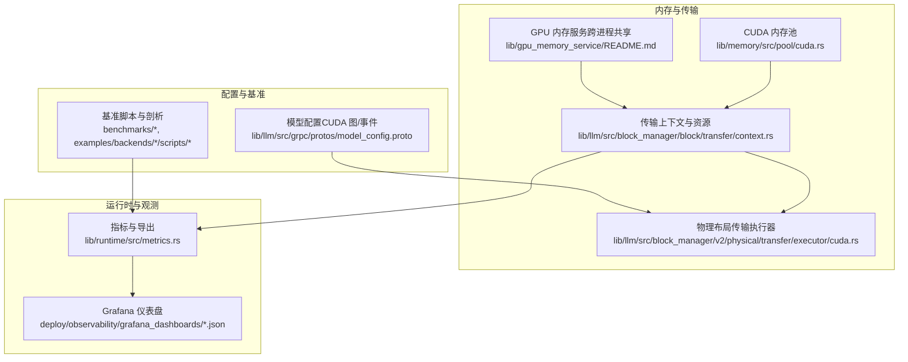
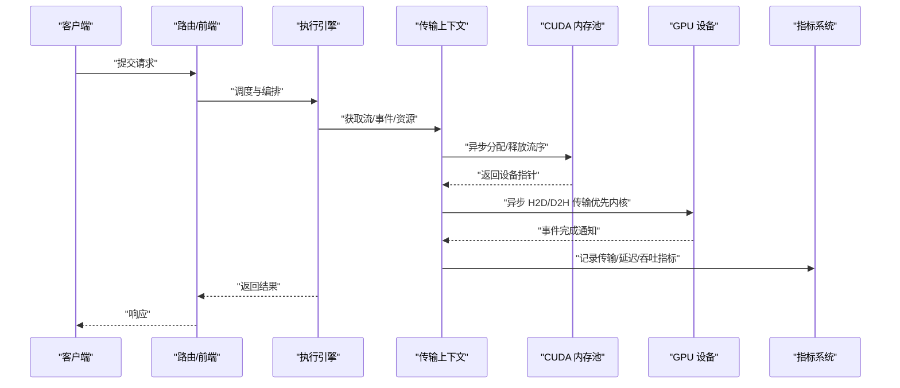
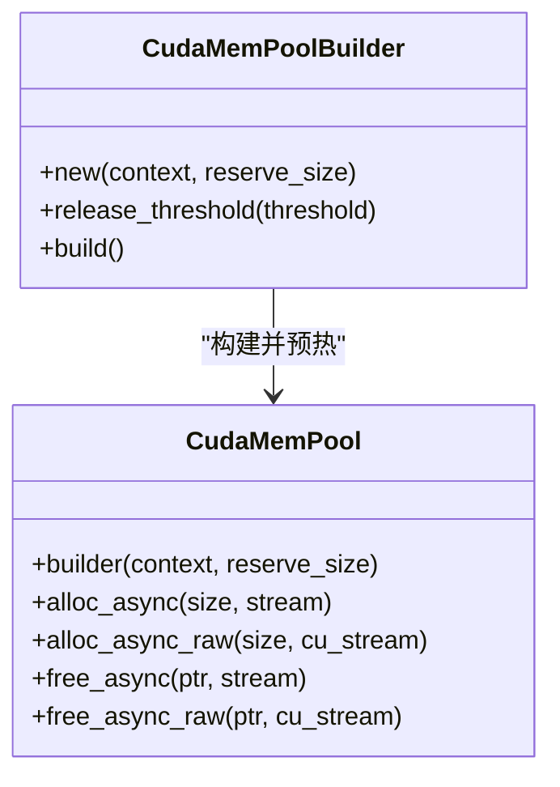
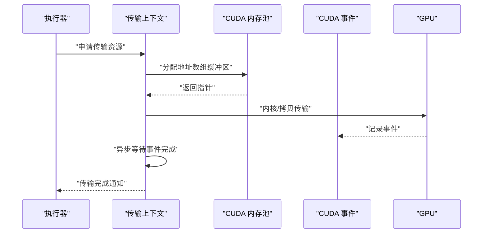
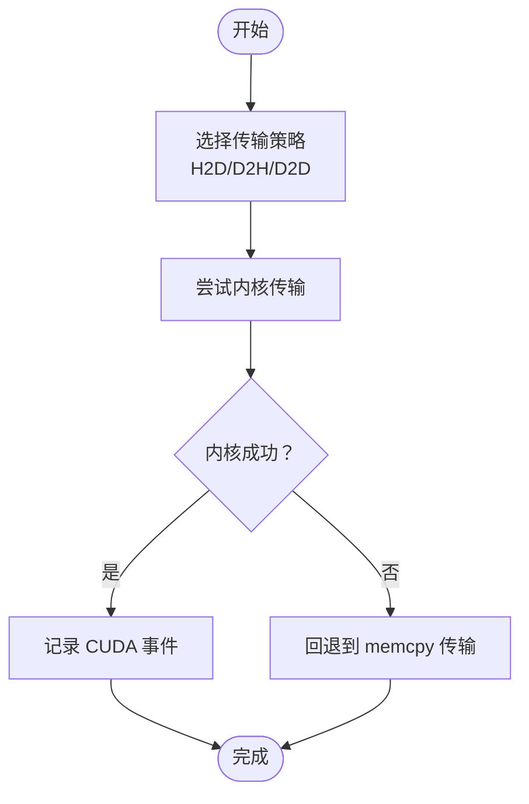
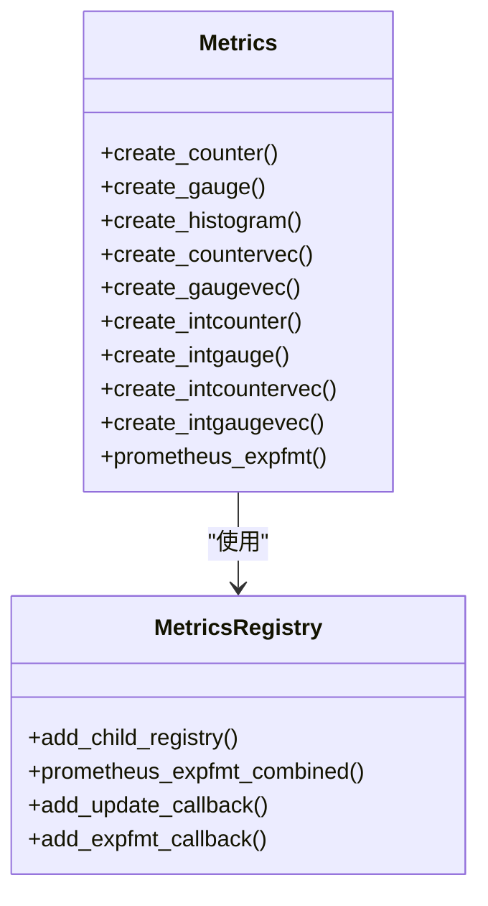
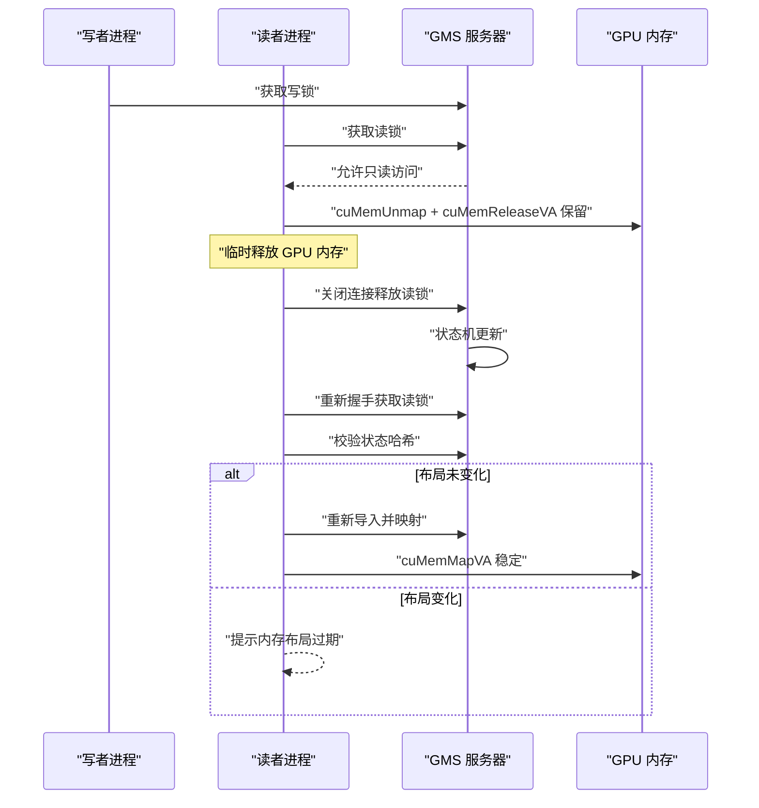
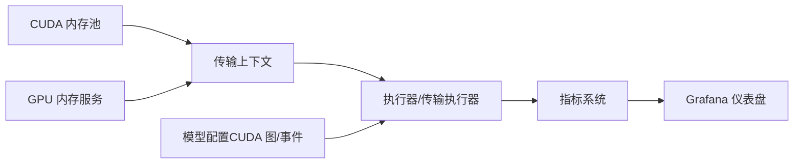

# 性能优化策略

<cite>
**本文引用的文件**
- [cuda.rs](file://lib/memory/src/pool/cuda.rs)
- [context.rs](file://lib/llm/src/block_manager/block/transfer/context.rs)
- [cuda.rs（物理布局传输）](file://lib/llm/src/block_manager/v2/physical/transfer/executor/cuda.rs)
- [metrics.rs](file://lib/runtime/src/metrics.rs)
- [model_config.proto](file://lib/llm/src/grpc/protos/model_config.proto)
- [README.md（GPU内存服务）](file://lib/gpu_memory_service/README.md)
- [kv_manager.rs](file://lib/mocker/src/kv_manager.rs)
- [cache_stats.rs](file://lib/bindings/kvbm/src/block_manager/cache_stats.rs)
- [benchmark_serving.py](file://examples/backends/sglang/slurm_jobs/scripts/vllm/benchmark_serving.py)
- [grafana_operator_dashboard-configmap.yaml](file://deploy/observability/k8s/grafana-operator-dashboard-configmap.yaml)
- [dynamo-operator.json](file://deploy/observability/grafana_dashboards/dynamo-operator.json)
- [plot_performance_comparison.py](file://examples/backends/trtllm/performance_sweeps/plot_performance_comparison.py)
- [benchmark.py](file://benchmarks/utils/benchmark.py)
- [profile_sla.py](file://benchmarks/profiler/profile_sla.py)
- [router_benchmark.py](file://benchmarks/router/real_data_benchmark.py)
</cite>

## 目录
1. [引言](#引言)
2. [项目结构](#项目结构)
3. [核心组件](#核心组件)
4. [架构总览](#架构总览)
5. [详细组件分析](#详细组件分析)
6. [依赖关系分析](#依赖关系分析)
7. [性能考量](#性能考量)
8. [故障排查指南](#故障排查指南)
9. [结论](#结论)
10. [附录](#附录)

## 引言
本技术文档系统化阐述 Dynamo 在动态 GPU 调度、内存优化与计算图优化方面的实现原理与工程实践，覆盖 CUDA 图优化、内存池管理、缓存策略、性能瓶颈识别、调优工具与基准测试方法，并提供跨硬件平台的优化建议、资源利用率提升技巧与成本效益分析，以及扩展性、热力图分析与长期维护策略。

## 项目结构
Dynamo 的性能优化相关能力分布在以下模块：
- 内存子系统：CUDA 设备内存池、主机固定缓冲池、GPU 内存服务（跨进程共享）
- LLM 布局与传输：块布局、物理布局、异步 H2D/D2H 传输、事件同步
- 运行时指标：Prometheus 指标注册与导出、自动标签注入
- 配置协议：模型配置中的 CUDA 图与事件等待等参数
- 观测性：Grafana 仪表盘、日志与事件
- 基准与剖析：端到端吞吐/延迟、SLA 分析、性能对比可视化

**图表来源**
- [cuda.rs](file://lib/memory/src/pool/cuda.rs#L1-L352)
- [context.rs](file://lib/llm/src/block_manager/block/transfer/context.rs#L1-L587)
- [cuda.rs（物理布局传输）](file://lib/llm/src/block_manager/v2/physical/transfer/executor/cuda.rs#L68-L197)
- [metrics.rs](file://lib/runtime/src/metrics.rs#L1-L1664)
- [model_config.proto](file://lib/llm/src/grpc/protos/model_config.proto#L790-L989)
- [README.md（GPU内存服务）](file://lib/gpu_memory_service/README.md#L25-L284)

**章节来源**
- [cuda.rs](file://lib/memory/src/pool/cuda.rs#L1-L352)
- [context.rs](file://lib/llm/src/block_manager/block/transfer/context.rs#L1-L587)
- [cuda.rs（物理布局传输）](file://lib/llm/src/block_manager/v2/physical/transfer/executor/cuda.rs#L68-L197)
- [metrics.rs](file://lib/runtime/src/metrics.rs#L1-L1664)
- [model_config.proto](file://lib/llm/src/grpc/protos/model_config.proto#L790-L989)
- [README.md（GPU内存服务）](file://lib/gpu_memory_service/README.md#L25-L284)

## 核心组件
- CUDA 内存池：通过设备内存池减少频繁分配/释放开销，支持预热与阈值回收，保证流序一致性。
- 传输上下文与资源：统一管理 CUDA 流、事件、内存池与主机固定缓冲池，支持内核地址数组的异步传输。
- 物理布局传输执行器：优先尝试内核驱动的高效传输，失败时回退到 memcpy；记录 CUDA 事件并异步同步。
- 指标与导出：分层命名与自动标签注入，统一 Prometheus 导出，支持组合输出与回调扩展。
- 配置协议：CUDA 图捕获开关、事件忙等、输出拷贝流等参数，面向后端（如 TensorRT）的优化开关。
- GPU 内存服务：跨进程共享 GPU 内存，支持 VA 稳定映射与临时 unmap/remap，缓解内存压力。
- 缓存统计与事件：KV 缓存命中率滑动窗口统计与事件发布，辅助定位热点与冷数据。

**章节来源**
- [cuda.rs](file://lib/memory/src/pool/cuda.rs#L1-L352)
- [context.rs](file://lib/llm/src/block_manager/block/transfer/context.rs#L164-L356)
- [cuda.rs（物理布局传输）](file://lib/llm/src/block_manager/v2/physical/transfer/executor/cuda.rs#L68-L197)
- [metrics.rs](file://lib/runtime/src/metrics.rs#L410-L539)
- [model_config.proto](file://lib/llm/src/grpc/protos/model_config.proto#L790-L989)
- [README.md（GPU内存服务）](file://lib/gpu_memory_service/README.md#L25-L284)
- [kv_manager.rs](file://lib/mocker/src/kv_manager.rs#L84-L124)
- [cache_stats.rs](file://lib/bindings/kvbm/src/block_manager/cache_stats.rs#L1-L31)

## 架构总览
下图展示从“请求进入”到“推理完成”的关键路径，强调内存池、传输与指标在热路径上的作用。

**图表来源**
- [context.rs](file://lib/llm/src/block_manager/block/transfer/context.rs#L190-L356)
- [cuda.rs](file://lib/memory/src/pool/cuda.rs#L170-L283)
- [cuda.rs（物理布局传输）](file://lib/llm/src/block_manager/v2/physical/transfer/executor/cuda.rs#L68-L197)
- [metrics.rs](file://lib/runtime/src/metrics.rs#L410-L539)

## 详细组件分析

### CUDA 内存池（设备内存池）
- 设计目标：以设备内存池替代频繁的 cudaMalloc/cudaFree，降低分配开销并保持流序一致性。
- 关键点：
  - 属性设置：分配类型为设备内存，位置绑定到具体设备。
  - 预热：创建后立即分配并释放指定大小，确保池已预热。
  - 释放阈值：超过阈值的内存可返回系统，避免长期占用。
  - 主线程序列化：内部互斥保护池句柄，cuMemAllocFromPoolAsync 不是线程安全重入。
  - 异步接口：alloc_async/free_async 均支持流序，free_async_raw 允许直接传入原始流句柄。
- 复杂度与性能：
  - 分配/释放均摊常数时间，避免反复系统调用。
  - 适合高并发热路径的短生命周期分配。

**图表来源**
- [cuda.rs](file://lib/memory/src/pool/cuda.rs#L27-L126)
- [cuda.rs](file://lib/memory/src/pool/cuda.rs#L160-L283)

**章节来源**
- [cuda.rs](file://lib/memory/src/pool/cuda.rs#L1-L352)

### 传输上下文与资源（CUDA 流、事件、内存池）
- 设计目标：在热路径上统一管理 CUDA 流、事件与内存池，支持地址数组的内核传输与回退 memcpy。
- 关键点：
  - CUDA 内存池：按配置计算总保留大小并创建池，支持释放阈值。
  - CUDA 事件：记录事件并通过独立线程/任务进行同步，避免阻塞主执行流。
  - 地址数组：使用主机固定缓冲池存放内核所需地址数组，减少多次小分配。
  - 回退机制：内核传输失败时回退到 memcpy 路径，保证正确性。
- 性能影响：
  - 事件同步采用阻塞同步标志，确保最小延迟。
  - 通过池化与预热显著降低分配抖动。

**图表来源**
- [context.rs](file://lib/llm/src/block_manager/block/transfer/context.rs#L190-L356)
- [cuda.rs（物理布局传输）](file://lib/llm/src/block_manager/v2/physical/transfer/executor/cuda.rs#L68-L197)

**章节来源**
- [context.rs](file://lib/llm/src/block_manager/block/transfer/context.rs#L164-L356)
- [cuda.rs（物理布局传输）](file://lib/llm/src/block_manager/v2/physical/transfer/executor/cuda.rs#L68-L197)

### 物理布局传输执行器（内核优先、回退 memcpy）
- 设计目标：在 H2D/D2H/D2D 传输中优先使用内核驱动的高效路径，失败时回退到 memcpy。
- 关键点：
  - 内核路径：尝试操作内核执行，失败则记录调试信息并回退。
  - 事件记录：异步传输完成后记录事件，便于后续同步与统计。
  - 区域遍历：按块、层、外维度逐区域执行传输。
- 性能收益：
  - 减少主机侧拷贝次数，降低 PCIe 带宽占用。
  - 事件驱动的完成通知避免轮询，降低 CPU 占用。

**图表来源**
- [cuda.rs（物理布局传输）](file://lib/llm/src/block_manager/v2/physical/transfer/executor/cuda.rs#L68-L197)

**章节来源**
- [cuda.rs（物理布局传输）](file://lib/llm/src/block_manager/v2/physical/transfer/executor/cuda.rs#L68-L197)

### 指标与导出（Prometheus 分层命名与自动标签）
- 设计目标：为组件、命名空间、端点提供统一的指标命名与自动标签注入，支持组合导出与扩展回调。
- 关键点：
  - 自动标签：自动注入命名空间、组件、端点等标签，避免重复与冲突。
  - 类型支持：Counter/Gauge/Histogram 及其 Vec 形式，支持自定义桶与常量标签。
  - 组合导出：递归合并子注册表，去重相同系列，允许同名指标不同标签集合。
  - 回调扩展：更新回调与文本导出回调，便于动态补充指标。
- 性能影响：
  - 合理的标签设计避免指标爆炸，提升抓取效率。
  - 组合导出减少多注册表扫描次数。

**图表来源**
- [metrics.rs](file://lib/runtime/src/metrics.rs#L610-L906)
- [metrics.rs](file://lib/runtime/src/metrics.rs#L410-L539)

**章节来源**
- [metrics.rs](file://lib/runtime/src/metrics.rs#L1-L1664)

### 配置协议（CUDA 图与事件等待）
- 设计目标：通过模型配置启用/限制 CUDA 图捕获范围与事件等待策略，平衡性能与稳定性。
- 关键点：
  - graphs：是否启用 CUDA 图捕获（当前仅 TensorRT 后端识别）。
  - graph_lower_bound：限定捕获形状/批大小的下界，避免对未捕获形状引入未初始化数据。
  - busy_wait_events：事件完成时采用忙等以降低延迟但增加 CPU 开销。
  - output_copy_stream：使用独立流拷贝输出到主机，提高并发但增加显存占用。
- 实践建议：
  - 对静态输入形状开启 CUDA 图，动态形状配合 lower_bound。
  - 在低延迟场景评估 busy_wait_events 的 CPU 成本。

**章节来源**
- [model_config.proto](file://lib/llm/src/grpc/protos/model_config.proto#L790-L989)

### GPU 内存服务（跨进程共享与 VA 稳定映射）
- 设计目标：服务器不映射自身地址空间，客户端负责导入与映射，支持单写多读与 VA 稳定释放/重映射。
- 关键点：
  - 客户端内存管理器：导入文件描述符、保留虚拟地址空间、设置访问权限、支持 unmap/remap。
  - 状态机：全局锁状态与访问规则，确保一致性。
  - unmap/remap：在内存压力下释放 GPU 内存但保留 VA，需要重新导入或校验布局哈希。
- 性能影响：
  - 通过 VA 稳定映射减少频繁解除/重新映射带来的抖动。
  - 支持“影子引擎”模式，活跃工作负载与非活跃工作负载间共享权重。

**图表来源**
- [README.md（GPU内存服务）](file://lib/gpu_memory_service/README.md#L25-L284)

**章节来源**
- [README.md（GPU内存服务）](file://lib/gpu_memory_service/README.md#L25-L284)

### 缓存统计与事件（KVBM）
- 设计目标：基于滑动窗口跟踪主机与磁盘缓存命中，定期打印统计，辅助定位热点与冷数据。
- 关键点：
  - 滑动窗口：默认窗口大小与日志间隔可配置。
  - 统计聚合：累计查询块数、命中块数，计算命中率。
  - 事件发布：将存储/移除块转换为事件并发布（可选 Sink）。
- 实践建议：
  - 结合 Grafana 仪表盘观察命中率趋势，动态调整缓存容量与淘汰策略。

**章节来源**
- [cache_stats.rs](file://lib/bindings/kvbm/src/block_manager/cache_stats.rs#L1-L31)
- [kv_manager.rs](file://lib/mocker/src/kv_manager.rs#L84-L124)

## 依赖关系分析
- 内存池依赖 CUDA 驱动 API，通过 cudarc 提供的安全封装与互斥保护实现线程安全。
- 传输上下文依赖内存池与 CUDA 流/事件，向上游执行器提供稳定的异步传输能力。
- 指标系统作为横切关注点，被多个组件复用，统一导出格式与标签体系。
- 配置协议为后端提供优化开关，影响执行路径（如 CUDA 图）。
- 观测性通过 Grafana 仪表盘与 Prometheus 指标联动，形成闭环。

**图表来源**
- [cuda.rs](file://lib/memory/src/pool/cuda.rs#L1-L352)
- [context.rs](file://lib/llm/src/block_manager/block/transfer/context.rs#L1-L587)
- [cuda.rs（物理布局传输）](file://lib/llm/src/block_manager/v2/physical/transfer/executor/cuda.rs#L68-L197)
- [metrics.rs](file://lib/runtime/src/metrics.rs#L1-L1664)
- [model_config.proto](file://lib/llm/src/grpc/protos/model_config.proto#L790-L989)
- [README.md（GPU内存服务）](file://lib/gpu_memory_service/README.md#L25-L284)

**章节来源**
- [cuda.rs](file://lib/memory/src/pool/cuda.rs#L1-L352)
- [context.rs](file://lib/llm/src/block_manager/block/transfer/context.rs#L1-L587)
- [cuda.rs（物理布局传输）](file://lib/llm/src/block_manager/v2/physical/transfer/executor/cuda.rs#L68-L197)
- [metrics.rs](file://lib/runtime/src/metrics.rs#L1-L1664)
- [model_config.proto](file://lib/llm/src/grpc/protos/model_config.proto#L790-L989)
- [README.md（GPU内存服务）](file://lib/gpu_memory_service/README.md#L25-L284)

## 性能考量
- 动态 GPU 调度
  - 利用 CUDA 图捕获静态计算图，结合 lower_bound 适配动态形状，减少首帧开销与重复编译。
  - 在低延迟场景评估 busy_wait_events 的 CPU 成本，权衡事件完成延迟与 CPU 占用。
- 内存优化
  - 使用 CUDA 内存池预热与释放阈值，避免碎片化与系统回收抖动。
  - 通过 GPU 内存服务实现跨进程共享与 VA 稳定映射，支持临时释放与重映射。
  - 传输路径优先内核，失败回退 memcpy，确保正确性与性能折中。
- 计算图优化
  - TensorRT 后端可启用 graphs，结合 output_copy_stream 提升并发但需评估显存占用。
  - 对于动态形状模型，合理设置 graph_lower_bound，避免未捕获形状导致未初始化数据风险。
- 指标与可观测性
  - 采用分层命名与自动标签，避免指标爆炸；利用组合导出统一抓取。
  - 结合 Grafana 仪表盘与 Prometheus 指标，持续监控吞吐、延迟、缓存命中率与内存使用。

[本节为通用指导，无需特定文件分析]

## 故障排查指南
- CUDA 内存池问题
  - 症状：分配失败或同步错误。
  - 排查：检查池属性、释放阈值、预热流程与互斥保护；确认流句柄有效性。
- 传输路径异常
  - 症状：内核传输失败、memcpy 回退频繁。
  - 排查：查看内核编译与设备属性，确认流序与事件同步；检查地址数组大小与对齐。
- 指标缺失或重复
  - 症状：抓取不到指标或重复系列。
  - 排查：检查自动标签注入、层级命名与组合导出逻辑；确保无重复标签键。
- 观测性异常
  - 症状：Grafana 仪表盘无数据或数据异常。
  - 排查：确认 Prometheus 抓取端点、指标命名规范与回调注册；检查仪表盘配置。

**章节来源**
- [cuda.rs](file://lib/memory/src/pool/cuda.rs#L170-L283)
- [context.rs](file://lib/llm/src/block_manager/block/transfer/context.rs#L190-L356)
- [metrics.rs](file://lib/runtime/src/metrics.rs#L724-L830)
- [grafana_operator_dashboard-configmap.yaml](file://deploy/observability/k8s/grafana-operator-dashboard-configmap.yaml#L254-L303)
- [dynamo-operator.json](file://deploy/observability/grafana_dashboards/dynamo-operator.json#L240-L297)

## 结论
Dynamo 的性能优化围绕“内存池化、事件驱动传输、指标可观测与配置化优化”展开。通过 CUDA 内存池与 GPU 内存服务降低内存分配与映射开销，通过 CUDA 图与内核优先传输提升吞吐，通过分层指标与 Grafana 实现持续监控与调优闭环。针对不同硬件平台与工作负载，应结合 lower_bound、busy_wait_events、output_copy_stream 等配置项进行精细化调优，并辅以基准测试与热力图分析，实现资源利用率与成本效益的平衡。

[本节为总结，无需特定文件分析]

## 附录

### 优化配置清单（示例）
- CUDA 图
  - 开关：启用/禁用（TensorRT 后端）
  - 下界：限定捕获形状/批大小区间
  - 输出拷贝流：独立流拷贝输出（提升并发但增加显存）
- 事件等待
  - 忙等：事件完成时忙等以降低延迟（增加 CPU）
- 内存池
  - 预热大小：按并发传输与批次批量估算
  - 释放阈值：超过阈值释放回系统
- 缓存
  - 主机/磁盘缓存容量与日志间隔
  - 命中率阈值与告警

**章节来源**
- [model_config.proto](file://lib/llm/src/grpc/protos/model_config.proto#L790-L989)
- [context.rs](file://lib/llm/src/block_manager/block/transfer/context.rs#L211-L246)
- [cache_stats.rs](file://lib/bindings/kvbm/src/block_manager/cache_stats.rs#L13-L16)

### 性能监控与调优案例
- 指标采集
  - 使用指标系统创建计数器/直方图，自动注入层级标签。
  - 通过组合导出统一抓取，避免重复与冲突。
- 基准测试
  - 吞吐/延迟/TTFT/ITL 等指标计算与统计。
  - SLA 分析与成本效益评估（GPU 小时/请求）。
- 可视化
  - Grafana 仪表盘展示请求速率、延迟分布、缓存命中率与资源利用率。

**章节来源**
- [metrics.rs](file://lib/runtime/src/metrics.rs#L410-L539)
- [benchmark_serving.py](file://examples/backends/sglang/slurm_jobs/scripts/vllm/benchmark_serving.py#L478-L582)
- [profile_sla.py](file://benchmarks/profiler/profile_sla.py#L1-L200)
- [router_benchmark.py](file://benchmarks/router/real_data_benchmark.py#L1-L200)
- [plot_performance_comparison.py](file://examples/backends/trtllm/performance_sweeps/plot_performance_comparison.py#L110-L144)
- [benchmark.py](file://benchmarks/utils/benchmark.py#L1-L200)
- [grafana_operator_dashboard-configmap.yaml](file://deploy/observability/k8s/grafana-operator-dashboard-configmap.yaml#L254-L303)
- [dynamo-operator.json](file://deploy/observability/grafana_dashboards/dynamo-operator.json#L240-L297)