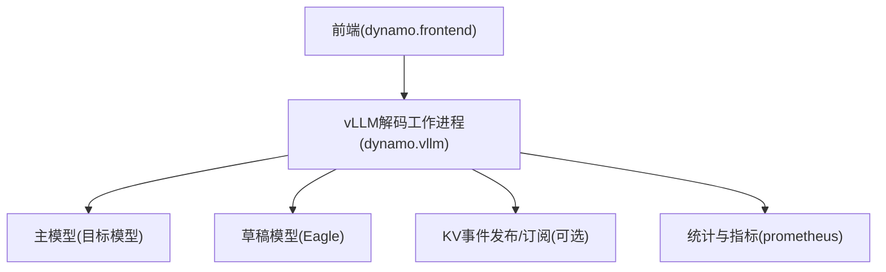
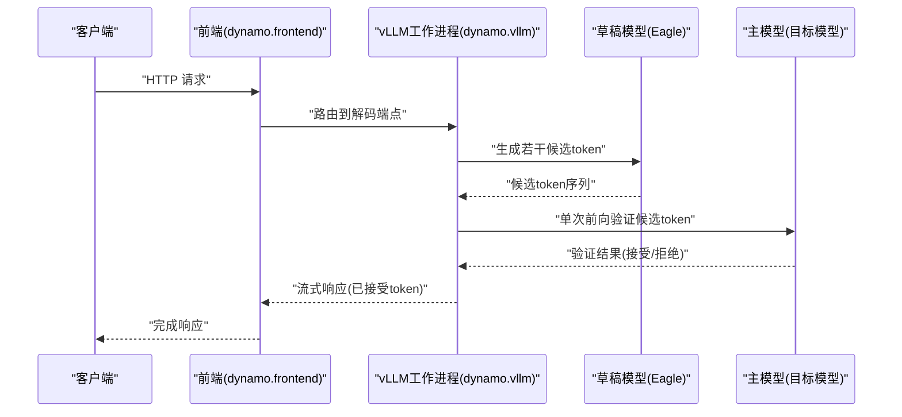
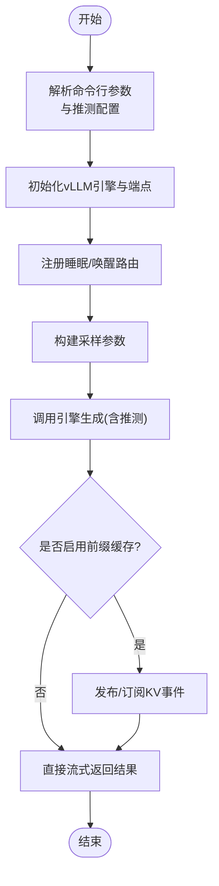
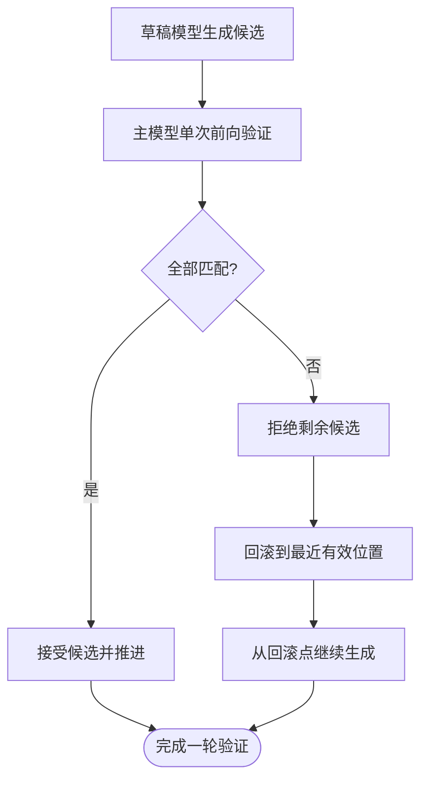
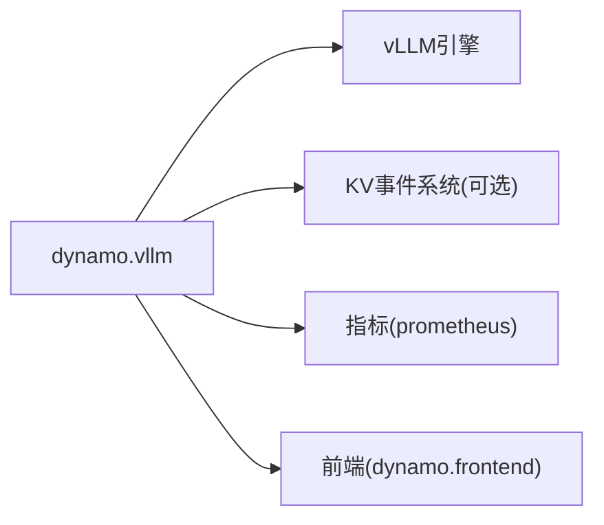

# 推测式解码

<cite>
**本文引用的文件**
- [README.md](file://docs/pages/features/speculative-decoding/README.md)
- [speculative-decoding-vllm.md](file://docs/pages/features/speculative-decoding/speculative-decoding-vllm.md)
- [agg_spec_decoding.sh](file://examples/backends/vllm/launch/agg_spec_decoding.sh)
- [main.py](file://components/src/dynamo/vllm/main.py)
- [args.py](file://components/src/dynamo/vllm/args.py)
- [handlers.py](file://components/src/dynamo/vllm/handlers.py)
- [slot.rs](file://lib/bindings/kvbm/src/block_manager/vllm/slot.rs)
- [vllm.py](file://benchmarks/profiler/utils/config_modifiers/vllm.py)
- [README.md](file://docs/pages/backends/vllm/README.md)
- [README.md](file://docs/pages/backends/trtllm/llama4-plus-eagle.md)
- [eagle_agg.yml](file://examples/backends/trtllm/engine_configs/llama4/eagle/eagle_agg.yml)
- [eagle_decode.yaml](file://examples/backends/trtllm/engine_configs/llama4/eagle/eagle_decode.yaml)
- [eagle_prefill.yaml](file://examples/backends/trtllm/engine_configs/llama4/eagle/eagle_prefill.yaml)
- [gen_yaml.py](file://examples/backends/trtllm/performance_sweeps/scripts/gen_yaml.py)
- [README.md](file://docs/pages/features/speculative-decoding/README.md)
- [README.md](file://docs/pages/features/speculative-decoding/speculative-decoding-vllm.md)
- [README.md](file://docs/pages/backends/vllm/README.md)
- [README.md](file://docs/pages/backends/trtllm/llama4-plus-eagle.md)
</cite>

## 目录
1. [简介](#简介)
2. [项目结构](#项目结构)
3. [核心组件](#核心组件)
4. [架构总览](#架构总览)
5. [详细组件分析](#详细组件分析)
6. [依赖关系分析](#依赖关系分析)
7. [性能考量](#性能考量)
8. [故障排查指南](#故障排查指南)
9. [结论](#结论)
10. [附录](#附录)

## 简介
本技术文档围绕Dynamo在vLLM后端上的推测式解码能力展开，系统阐述其工作原理、算法流程、Eagle解码器与主模型协作机制、推测验证与错误纠正策略、以及在Dynamo整体系统中的集成方式与调优要点。文档同时覆盖TensorRT-LLM侧的Eagle集成示例，帮助读者理解跨后端的推测式解码通用模式与差异。

推测式解码通过一个更小的“草稿”模型（Eagle）并行生成候选token，并由主模型在同一前向计算中进行验证，从而显著降低自回归生成的延迟。该方法以额外的草稿模型计算为代价换取更低的端到端时延，尤其适合高并发、低时延场景。

## 项目结构
与推测式解码直接相关的核心位置包括：
- 文档：features/speculative-decoding 下的概览与vLLM专用指南
- 示例：examples/backends/vllm/launch 提供一键启动脚本
- 后端实现：components/src/dynamo/vllm 下的入口、参数解析与处理逻辑
- KV缓存与块管理：lib/bindings/kvbm 下的块槽位分配与推测解码容量管理
- TRT-LLM示例：examples/backends/trtllm 下的Eagle配置样例

图表来源
- [main.py](file://components/src/dynamo/vllm/main.py#L676-L800)
- [handlers.py](file://components/src/dynamo/vllm/handlers.py#L350-L425)

章节来源
- [README.md](file://docs/pages/features/speculative-decoding/README.md#L1-L86)
- [speculative-decoding-vllm.md](file://docs/pages/features/speculative-decoding/speculative-decoding-vllm.md#L1-L121)
- [agg_spec_decoding.sh](file://examples/backends/vllm/launch/agg_spec_decoding.sh#L1-L29)

## 核心组件
- 前端入口与编排
  - 前端服务负责接收HTTP请求并路由至后端工作进程；示例脚本展示了如何启动前端与vLLM工作进程。
- vLLM工作进程
  - 负责初始化引擎、注册端点、构建采样参数、处理生成与清理等；支持睡眠/唤醒以节省显存。
- 参数与配置
  - 通过命令行参数传递模型路径、推测配置（如Eagle模型、草稿并行度、推测步数等），并进行交叉校验与默认值设置。
- KV事件与前缀缓存
  - 可选启用KV事件发布/订阅，用于前缀缓存与跨组件共享。
- KV块槽位管理
  - 在推测解码过程中，按需预分配超过实际使用量的块槽位，以便快速回滚与重用未使用的空间。

章节来源
- [main.py](file://components/src/dynamo/vllm/main.py#L676-L800)
- [handlers.py](file://components/src/dynamo/vllm/handlers.py#L233-L425)
- [args.py](file://components/src/dynamo/vllm/args.py#L76-L127)
- [slot.rs](file://lib/bindings/kvbm/src/block_manager/vllm/slot.rs#L1506-L1569)

## 架构总览
下图展示推测式解码在Dynamo中的端到端流程：前端接收请求，vLLM工作进程根据推测配置调用主模型与草稿模型，完成候选token生成与验证，并将结果返回给前端。

图表来源
- [main.py](file://components/src/dynamo/vllm/main.py#L676-L800)
- [handlers.py](file://components/src/dynamo/vllm/handlers.py#L350-L425)
- [agg_spec_decoding.sh](file://examples/backends/vllm/launch/agg_spec_decoding.sh#L18-L29)

## 详细组件分析

### vLLM后端的推测式解码集成
- 入口与初始化
  - 解码工作进程在启动时解析参数、下载/加载模型、初始化引擎与端点，并注册睡眠/唤醒路由，便于资源调度。
- 推测配置注入
  - 通过命令行传入的推测配置（如草稿模型名称、草稿张量并行大小、推测步数、方法类型等）被写入vLLM引擎配置，驱动推测式解码执行。
- 采样与生成
  - 生成函数根据请求构建采样参数，调用引擎进行推理；在推测模式下，草稿模型与主模型协同工作，最终输出已接受的token序列。
- KV事件与前缀缓存
  - 若启用前缀缓存，工作进程会为每个数据并行rank创建独立的事件发布器，或订阅合并器输出，以实现KV块状态的跨组件同步。

图表来源
- [main.py](file://components/src/dynamo/vllm/main.py#L676-L800)
- [handlers.py](file://components/src/dynamo/vllm/handlers.py#L78-L175)
- [args.py](file://components/src/dynamo/vllm/args.py#L220-L302)

章节来源
- [main.py](file://components/src/dynamo/vllm/main.py#L676-L800)
- [handlers.py](file://components/src/dynamo/vllm/handlers.py#L78-L175)
- [args.py](file://components/src/dynamo/vllm/args.py#L220-L302)

### Eagle解码器与主模型协作
- 协作模式
  - 草稿模型（Eagle）负责并行生成多个候选token；主模型在同一前向步骤中对这些候选进行验证，仅接受一致的token，其余则被拒绝。
- 配置要点
  - 草稿模型名称、草稿张量并行大小、推测步数（num_speculative_tokens）、方法类型（method）等均通过推测配置传入。
- 性能权衡
  - 增加草稿计算可换取更低的端到端延迟；但需要确保草稿与主模型架构兼容，避免验证失败导致的回退成本。

章节来源
- [speculative-decoding-vllm.md](file://docs/pages/features/speculative-decoding/speculative-decoding-vllm.md#L99-L107)
- [agg_spec_decoding.sh](file://examples/backends/vllm/launch/agg_spec_decoding.sh#L22-L27)

### 推测验证与错误纠正
- 验证流程
  - 主模型在一次前向中对草稿生成的候选token进行验证，若全部匹配则接受，否则逐个回退并重新生成。
- 错误纠正
  - 当验证失败时，系统回滚到最近的有效token位置，继续从该点进行后续生成，保证输出一致性与正确性。
- KV块槽位管理
  - 在推测解码期间，按最大推测容量预分配块槽位，即使部分预测被拒绝，也能保留已接受token对应的不可变块，未使用的部分可作为后续复用的缓冲区。

图表来源
- [slot.rs](file://lib/bindings/kvbm/src/block_manager/vllm/slot.rs#L1506-L1569)

章节来源
- [slot.rs](file://lib/bindings/kvbm/src/block_manager/vllm/slot.rs#L1506-L1569)

### vLLM后端的集成实现与配置
- 启动脚本
  - 示例脚本展示了如何启动前端与vLLM工作进程，并通过--speculative_config指定Eagle草稿模型及关键参数。
- 参数解析与默认值
  - 参数解析器负责将推测配置注入到vLLM引擎参数中，并设置合理的默认值（如前缀缓存开关、块大小等）。
- 运行时行为
  - 工作进程在运行时动态构建采样参数、注册端点、处理请求取消与优雅关闭，确保在高并发下的稳定性。

章节来源
- [agg_spec_decoding.sh](file://examples/backends/vllm/launch/agg_spec_decoding.sh#L1-L29)
- [args.py](file://components/src/dynamo/vllm/args.py#L76-L127)
- [handlers.py](file://components/src/dynamo/vllm/handlers.py#L350-L425)

### TRT-LLM侧的Eagle集成参考
- 配置样例
  - TRT-LLM提供了基于Eagle的推测式解码配置样例，包括聚合模式与解码/预填充阶段的独立配置文件，便于在不同阶段启用推测。
- 性能调优脚本
  - 提供生成YAML配置的脚本，支持在不同拓扑下调整推测参数与层预测数量，辅助性能探索。

章节来源
- [README.md](file://docs/pages/backends/trtllm/llama4-plus-eagle.md#L1-L200)
- [eagle_agg.yml](file://examples/backends/trtllm/engine_configs/llama4/eagle/eagle_agg.yml#L1-L200)
- [eagle_decode.yaml](file://examples/backends/trtllm/engine_configs/llama4/eagle/eagle_decode.yaml#L1-L200)
- [eagle_prefill.yaml](file://examples/backends/trtllm/engine_configs/llama4/eagle/eagle_prefill.yaml#L1-L200)
- [gen_yaml.py](file://examples/backends/trtllm/performance_sweeps/scripts/gen_yaml.py#L253-L290)

## 依赖关系分析
- 组件耦合
  - vLLM工作进程与引擎紧密耦合，负责参数解析、端点注册与生成流程控制；与KV事件系统的耦合取决于是否启用前缀缓存。
- 外部依赖
  - vLLM引擎版本与特性（如多进程收集、前缀缓存、KV事件发布等）影响推测式解码的可用性与性能表现。
- 并行与资源
  - 草稿模型可通过张量并行提升吞吐；主/草稿模型的内存占用与带宽需求需平衡，避免GPU显存不足或带宽瓶颈。

图表来源
- [main.py](file://components/src/dynamo/vllm/main.py#L676-L800)
- [args.py](file://components/src/dynamo/vllm/args.py#L281-L302)

章节来源
- [main.py](file://components/src/dynamo/vllm/main.py#L676-L800)
- [args.py](file://components/src/dynamo/vllm/args.py#L281-L302)

## 性能考量
- 推测步数与草稿并行
  - 增大num_speculative_tokens可提升每轮验证的候选数量，但也会增加草稿模型的计算开销；草稿张量并行可提升吞吐，但需考虑通信与负载均衡。
- 显存与带宽
  - 推测式解码会增加显存占用（预分配块槽位与草稿模型权重），需结合--gpu-memory-utilization合理设置显存上限。
- 前缀缓存与KV事件
  - 启用前缀缓存可减少重复计算，但需要额外的事件发布/订阅开销；在高并发场景下建议开启以提升整体吞吐。
- vLLM配置微调
  - 可通过配置修改张量并行大小、专家并行等参数，配合profiler工具进行性能评估与调参。

章节来源
- [agg_spec_decoding.sh](file://examples/backends/vllm/launch/agg_spec_decoding.sh#L22-L29)
- [vllm.py](file://benchmarks/profiler/utils/config_modifiers/vllm.py#L149-L190)
- [README.md](file://docs/pages/backends/vllm/README.md#L1-L200)

## 故障排查指南
- 启动与环境
  - 确认Docker基础设施已启动，容器镜像构建成功，且Hugging Face访问令牌已正确设置（针对受保护模型）。
- 推测配置问题
  - 检查--speculative_config的字段是否完整（模型名、草稿并行度、推测步数、方法类型），并确保草稿与主模型架构兼容。
- 显存不足
  - 适当降低num_speculative_tokens或调整--gpu-memory-utilization，避免OOM；必要时启用睡眠/唤醒以释放显存。
- 前缀缓存异常
  - 若启用前缀缓存，请确认KV事件发布/订阅端口与合并器配置正确，检查日志中是否存在连接失败或事件丢失。
- 请求取消与中断
  - 工作进程具备请求取消监控与优雅关闭机制，若出现请求提前终止，应检查网络与超时设置。

章节来源
- [README.md](file://docs/pages/features/speculative-decoding/README.md#L28-L73)
- [speculative-decoding-vllm.md](file://docs/pages/features/speculative-decoding/speculative-decoding-vllm.md#L12-L59)
- [handlers.py](file://components/src/dynamo/vllm/handlers.py#L353-L418)

## 结论
Dynamo在vLLM后端上实现了基于Eagle的推测式解码，通过草稿模型与主模型的协同验证，在一次主模型前向中完成多token的候选生成与接受/拒绝判断，从而显著降低端到端延迟。结合KV事件与前缀缓存、合理的并行与显存配置，可在高并发场景下获得稳定的吞吐与更低的ITL。TRT-LLM侧亦提供了Eagle集成示例，便于跨后端对比与迁移。

## 附录
- 快速开始
  - 使用示例脚本启动前端与vLLM工作进程，并通过--speculative_config指定Eagle配置。
- 参考文档
  - vLLM后端指南与TRT-LLM Eagle集成文档，包含更多部署细节与参数说明。

章节来源
- [README.md](file://docs/pages/features/speculative-decoding/README.md#L28-L73)
- [speculative-decoding-vllm.md](file://docs/pages/features/speculative-decoding/speculative-decoding-vllm.md#L12-L59)
- [README.md](file://docs/pages/backends/vllm/README.md#L1-L200)
- [README.md](file://docs/pages/backends/trtllm/llama4-plus-eagle.md#L1-L200)