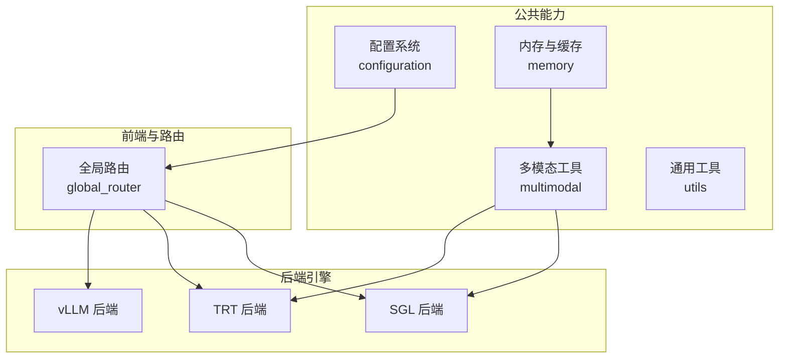
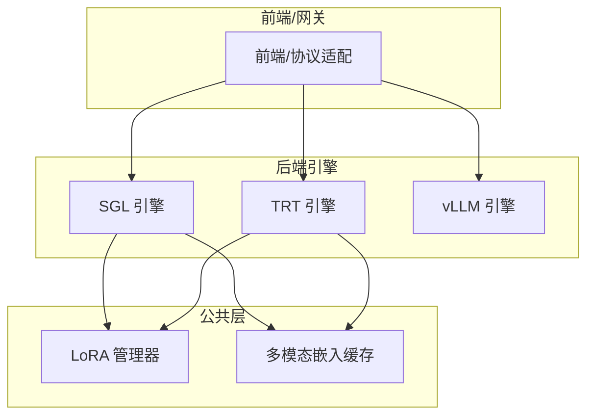
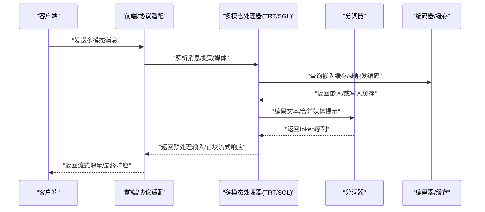
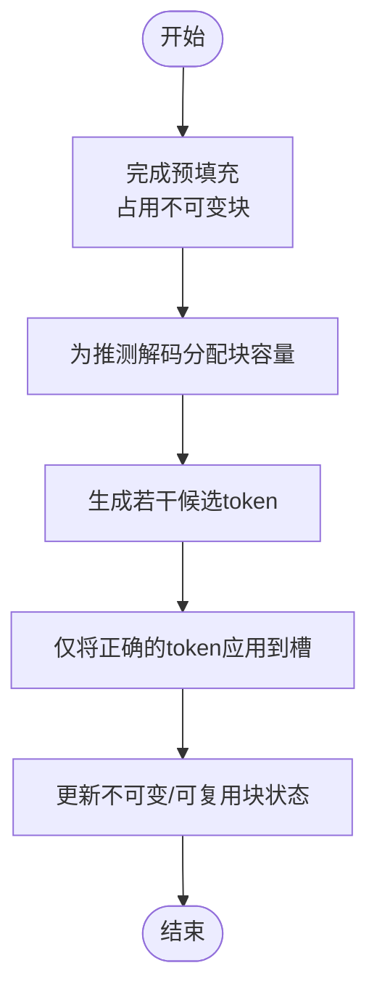
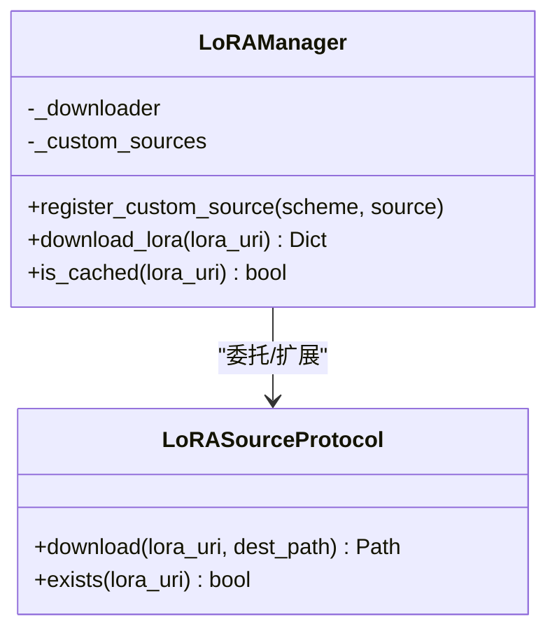
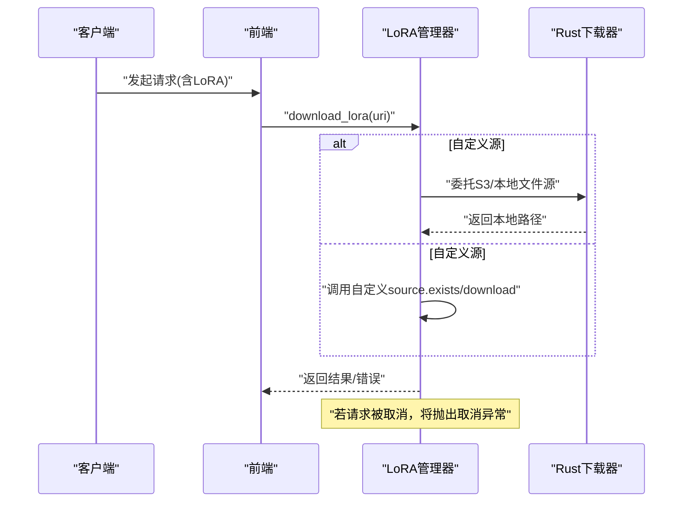
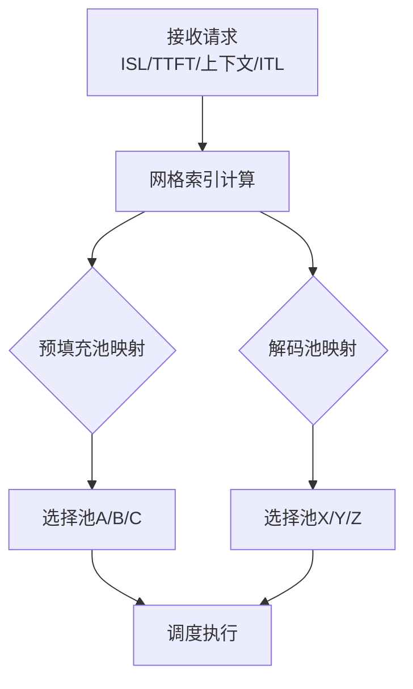
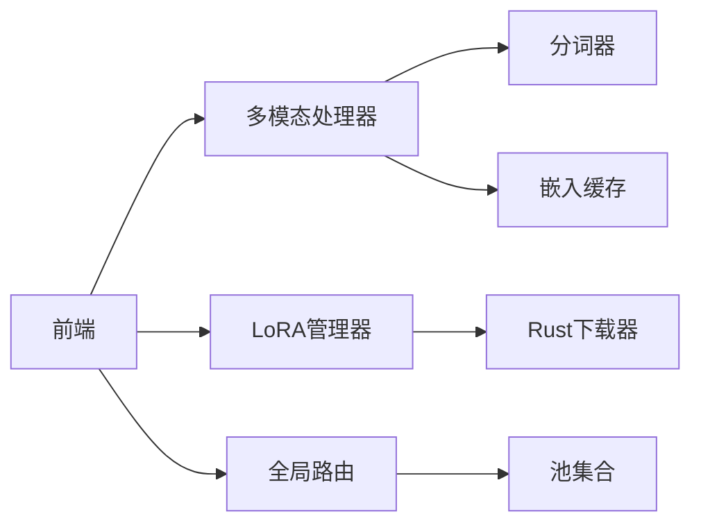

# 高级特性与功能

<cite>
**本文引用的文件**
- [components/src/dynamo/common/multimodal/__init__.py](file://components/src/dynamo/common/multimodal/__init__.py)
- [components/src/dynamo/common/lora/__init__.py](file://components/src/dynamo/common/lora/__init__.py)
- [components/src/dynamo/common/lora/manager.py](file://components/src/dynamo/common/lora/manager.py)
- [components/src/dynamo/common/memory/__init__.py](file://components/src/dynamo/common/memory/__init__.py)
- [components/src/dynamo/common/memory/multimodal_embedding_cache_manager.py](file://components/src/dynamo/common/memory/multimodal_embedding_cache_manager.py)
- [components/src/dynamo/common/utils/__init__.py](file://components/src/dynamo/common/utils/__init__.py)
- [components/src/dynamo/global_router/pool_selection.py](file://components/src/dynamo/global_router/pool_selection.py)
- [components/src/dynamo/sglang/multimodal_utils/multimodal_chat_processor.py](file://components/src/dynamo/sglang/multimodal_utils/multimodal_chat_processor.py)
- [components/src/dynamo/trtllm/multimodal_processor.py](file://components/src/dynamo/trtllm/multimodal_processor.py)
- [lib/bindings/kvbm/src/block_manager/vllm/slot.rs](file://lib/bindings/kvbm/src/block_manager/vllm/slot.rs)
- [lib/mocker/src/scheduler.rs](file://lib/mocker/src/scheduler.rs)
</cite>

## 目录
1. [引言](#引言)
2. [项目结构](#项目结构)
3. [核心组件](#核心组件)
4. [架构总览](#架构总览)
5. [详细组件分析](#详细组件分析)
6. [依赖关系分析](#依赖关系分析)
7. [性能考量](#性能考量)
8. [故障排查指南](#故障排查指南)
9. [结论](#结论)
10. [附录](#附录)

## 引言
本文件面向Dynamo的高级特性，系统化梳理多模态处理（图像、视频、音频）、推测式解码、LoRA微调、请求迁移与优雅关闭、请求取消、KV缓存感知路由与动态GPU调度、性能调优与扩展性等主题。内容以仓库现有实现为依据，结合代码级图示与流程图，帮助读者快速掌握设计思想、实现细节与最佳实践。

## 项目结构
Dynamo在组件层按“后端引擎（vLLM/TrT/SGLang）+ 公共能力（配置、内存、多模态、工具）+ 路由与规划器”的方式组织。高级特性主要分布在以下模块：
- 多模态：公共内存缓存、各后端的多模态处理器
- LoRA：Python侧管理器与Rust侧下载器桥接
- 全局路由：基于网格的池选择策略
- KVBM/Rust绑定：推测式解码与块槽管理
- Mock测试：调度器模拟用于性能评估

**章节来源**
- file://components/src/dynamo/common/configuration/__init__.py#L1-L26
- file://components/src/dynamo/common/memory/__init__.py#L1-L11
- file://components/src/dynamo/common/multimodal/__init__.py#L1-L9
- file://components/src/dynamo/common/utils/__init__.py#L1-L34
- file://components/src/dynamo/global_router/pool_selection.py#L1-L318

## 核心组件
- 多模态嵌入缓存：LRU缓存管理器，按容量驱逐，支持命中率统计
- LoRA管理器：统一下载与缓存入口，支持自定义源扩展
- 全局路由池选择：基于网格的预填充/解码池映射
- 多模态请求处理器：SGL与TRT的OpenAI格式多模态请求转换与流式响应
- 推测式解码：Rust侧块槽与令牌应用逻辑，支持超配与部分利用
- 调度模拟：Mock调度器用于评估不同加速比下的吞吐与时延

**章节来源**
- file://components/src/dynamo/common/memory/multimodal_embedding_cache_manager.py#L1-L174
- file://components/src/dynamo/common/lora/manager.py#L1-L115
- file://components/src/dynamo/global_router/pool_selection.py#L1-L318
- file://components/src/dynamo/sglang/multimodal_utils/multimodal_chat_processor.py#L1-L163
- file://components/src/dynamo/trtllm/multimodal_processor.py#L1-L281
- file://lib/bindings/kvbm/src/block_manager/vllm/slot.rs#L1462-L1569
- file://lib/mocker/src/scheduler.rs#L409-L449

## 架构总览
下图展示多模态与LoRA在整体架构中的位置与交互路径。

**图表来源**
- [components/src/dynamo/sglang/multimodal_utils/multimodal_chat_processor.py](file://components/src/dynamo/sglang/multimodal_utils/multimodal_chat_processor.py#L1-L163)
- [components/src/dynamo/trtllm/multimodal_processor.py](file://components/src/dynamo/trtllm/multimodal_processor.py#L1-L281)
- [components/src/dynamo/common/lora/manager.py](file://components/src/dynamo/common/lora/manager.py#L1-L115)
- [components/src/dynamo/common/memory/multimodal_embedding_cache_manager.py](file://components/src/dynamo/common/memory/multimodal_embedding_cache_manager.py#L1-L174)

## 详细组件分析

### 多模态处理（图像/视频/音频）
- 统一缓存：通过嵌入缓存管理器对编码器输出进行LRU缓存，避免重复计算；支持容量阈值与命中率统计
- 请求转换：SGL与TRT分别提供OpenAI格式的消息到内部输入的转换与流式响应拼装
- 安全加载：TRT处理器支持URL直载与受限本地路径访问，并进行大小限制与路径校验
- 流式增量：TRT处理器在首次与后续流式块中分别返回完整文本与增量差异，减少传输开销

**图表来源**
- [components/src/dynamo/trtllm/multimodal_processor.py](file://components/src/dynamo/trtllm/multimodal_processor.py#L168-L235)
- [components/src/dynamo/sglang/multimodal_utils/multimodal_chat_processor.py](file://components/src/dynamo/sglang/multimodal_utils/multimodal_chat_processor.py#L11-L48)
- [components/src/dynamo/common/memory/multimodal_embedding_cache_manager.py](file://components/src/dynamo/common/memory/multimodal_embedding_cache_manager.py#L80-L149)

**章节来源**
- file://components/src/dynamo/common/memory/multimodal_embedding_cache_manager.py#L1-L174
- file://components/src/dynamo/sglang/multimodal_utils/multimodal_chat_processor.py#L1-L163
- file://components/src/dynamo/trtllm/multimodal_processor.py#L1-L281

### 推测式解码（原理、配置与收益）
- 块槽模型：Rust侧通过块槽管理令牌，支持“已应用”与“可复用”状态分离，便于部分利用与超配
- 预分配与回收：先为推测生成预留块容量，仅在预测正确时固化为不可变块，未使用的可复用块保留供后续请求
- 测试验证：单元测试覆盖“超额分配但部分使用”的场景，确保状态一致性与容量统计正确

**图表来源**
- [lib/bindings/kvbm/src/block_manager/vllm/slot.rs](file://lib/bindings/kvbm/src/block_manager/vllm/slot.rs#L1500-L1569)

**章节来源**
- file://lib/bindings/kvbm/src/block_manager/vllm/slot.rs#L1462-L1569

### LoRA微调（集成、加载与推理优化）
- 下载与缓存：统一由Rust侧下载器负责S3与本地文件源；Python侧管理器提供URI解析与自定义源注册
- 缓存键：通过URI到缓存键的映射保证跨进程/会话复用
- 扩展点：可通过注册自定义scheme的Python源，满足私有协议或特殊存储

**图表来源**
- [components/src/dynamo/common/lora/manager.py](file://components/src/dynamo/common/lora/manager.py#L30-L115)

**章节来源**
- file://components/src/dynamo/common/lora/manager.py#L1-L115
- file://components/src/dynamo/common/lora/__init__.py#L1-L11

### 请求迁移、优雅关闭与请求取消（容错机制）
- 取消传播：LoRA下载流程捕获异步取消异常并向上抛出，确保上层能感知并终止相关任务
- 优雅关闭：建议在服务停止前等待活跃请求完成或显式取消，避免半完成状态
- 迁移策略：结合全局路由与池选择，将长上下文/低时延目标迁移到更合适的池，降低尾延迟

**图表来源**
- [components/src/dynamo/common/lora/manager.py](file://components/src/dynamo/common/lora/manager.py#L62-L106)

**章节来源**
- file://components/src/dynamo/common/lora/manager.py#L102-L106

### KV缓存感知路由与动态GPU调度
- 全局路由池选择：基于网格（如ISL/TTFT、上下文长度/ITL）映射到不同池，实现时延与吞吐的权衡
- 动态调度：Mock调度器模拟不同加速比下的解码阶段耗时，辅助评估资源分配策略

**图表来源**
- [components/src/dynamo/global_router/pool_selection.py](file://components/src/dynamo/global_router/pool_selection.py#L44-L71)
- [components/src/dynamo/global_router/pool_selection.py](file://components/src/dynamo/global_router/pool_selection.py#L103-L133)

**章节来源**
- file://components/src/dynamo/global_router/pool_selection.py#L1-L318
- file://lib/mocker/src/scheduler.rs#L423-L449

## 依赖关系分析
- 多模态链路：前端 → 多模态处理器 → 分词器/编码器缓存 → 引擎
- LoRA链路：前端 → LoRA管理器 → Rust下载器/自定义源 → 引擎
- 路由链路：前端 → 全局路由配置 → 池选择策略 → 后端池

**图表来源**
- [components/src/dynamo/trtllm/multimodal_processor.py](file://components/src/dynamo/trtllm/multimodal_processor.py#L168-L235)
- [components/src/dynamo/sglang/multimodal_utils/multimodal_chat_processor.py](file://components/src/dynamo/sglang/multimodal_utils/multimodal_chat_processor.py#L11-L48)
- [components/src/dynamo/common/lora/manager.py](file://components/src/dynamo/common/lora/manager.py#L62-L106)
- [components/src/dynamo/global_router/pool_selection.py](file://components/src/dynamo/global_router/pool_selection.py#L255-L317)

**章节来源**
- file://components/src/dynamo/trtllm/multimodal_processor.py#L1-L281
- file://components/src/dynamo/sglang/multimodal_utils/multimodal_chat_processor.py#L1-L163
- file://components/src/dynamo/common/lora/manager.py#L1-L115
- file://components/src/dynamo/global_router/pool_selection.py#L1-L318

## 性能考量
- 多模态缓存：合理设置缓存容量，关注命中率与内存占用平衡；对大张量进行容量检查，避免溢出
- 推测式解码：适度超配块槽以提升吞吐，同时监控未使用块的回收效率
- 路由与调度：根据SLA目标选择池映射；在高并发下优先保障首token时延（TTFT），再兼顾ITL
- I/O与安全：TRT多模态加载限制文件大小与路径范围，避免拒绝服务与越权访问

[本节为通用指导，无需列出具体文件来源]

## 故障排查指南
- 多模态加载失败
  - 检查URL可达性与大小限制；确认本地路径是否在允许范围内
  - 关注日志中的错误信息，区分网络/权限/大小限制三类问题
- 嵌入缓存未命中
  - 核查缓存容量与单条张量大小；查看命中率统计，必要时增大容量
- LoRA下载异常
  - 若为自定义源，确认exists与download实现；检查URI scheme与缓存键映射
  - 注意取消场景，确保上层正确处理取消异常
- 推测式解码状态异常
  - 核对块槽状态机：仅将正确token固化为不可变块；未使用块应保留在可复用队列
- 路由池选择不生效
  - 校验配置文件中的网格分辨率与映射维度；确认参数边界与索引钳制逻辑

**章节来源**
- file://components/src/dynamo/trtllm/multimodal_processor.py#L80-L139
- file://components/src/dynamo/common/memory/multimodal_embedding_cache_manager.py#L116-L149
- file://components/src/dynamo/common/lora/manager.py#L80-L106
- file://lib/bindings/kvbm/src/block_manager/vllm/slot.rs#L1530-L1569
- file://components/src/dynamo/global_router/pool_selection.py#L152-L253

## 结论
Dynamo在多模态、LoRA、推测式解码与路由调度方面提供了清晰的模块化实现与可扩展接口。通过嵌入缓存、统一的LoRA下载与池网格映射，系统在性能与可靠性之间取得平衡。建议在生产环境中结合SLA目标与硬件约束，持续优化缓存容量、池映射与调度策略，并完善可观测性与告警体系。

[本节为总结性内容，无需列出具体文件来源]

## 附录
- 使用建议
  - 多模态：优先使用嵌入缓存；严格控制媒体尺寸与来源；在流式场景中使用增量拼装
  - LoRA：统一缓存与下载；为私有源提供自定义实现；在推理前预热缓存
  - 推测式解码：根据历史正确率设定超配比例；定期审计未使用块回收情况
  - 路由与调度：以SLA为目标校准网格参数；在高峰期优先保障TTFT，再优化ITL

[本节为通用建议，无需列出具体文件来源]