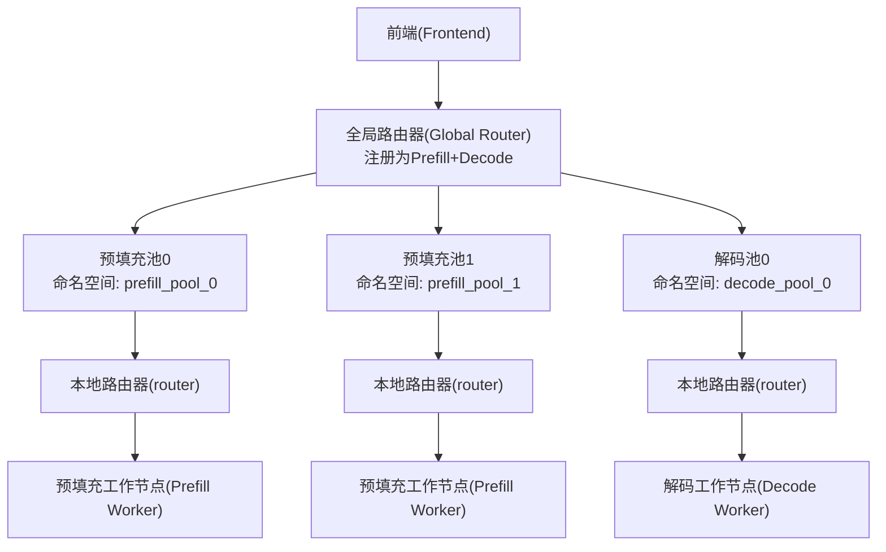
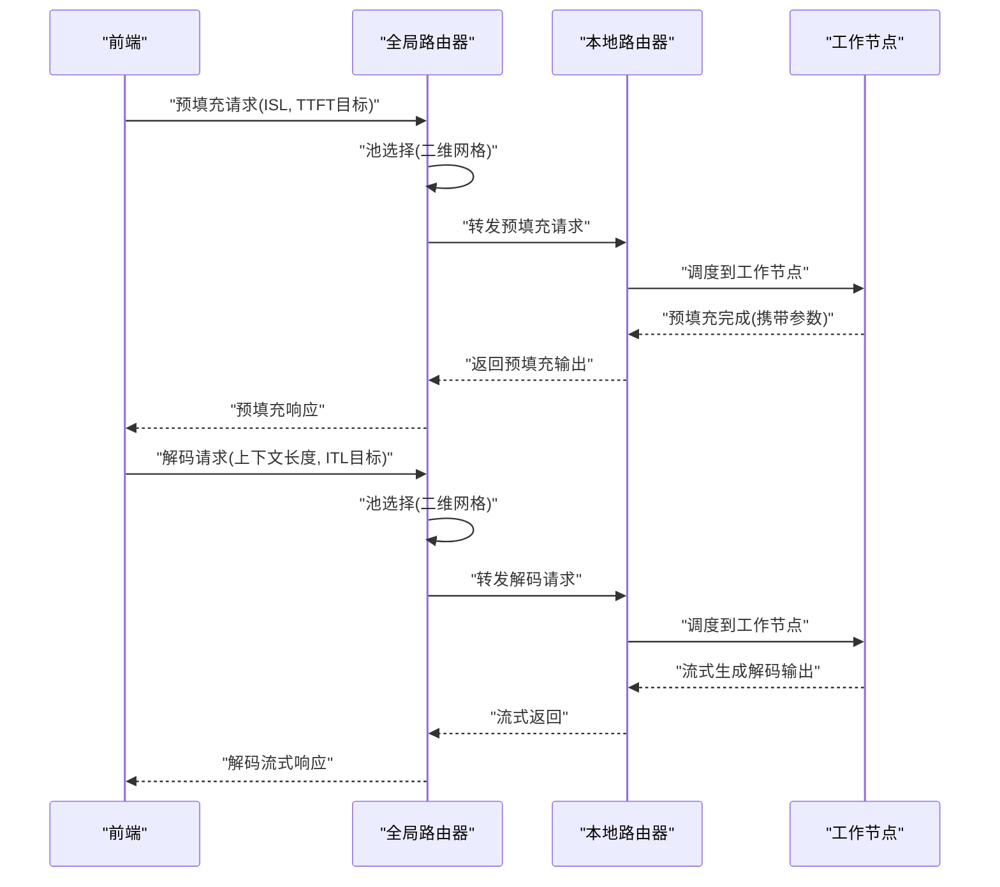
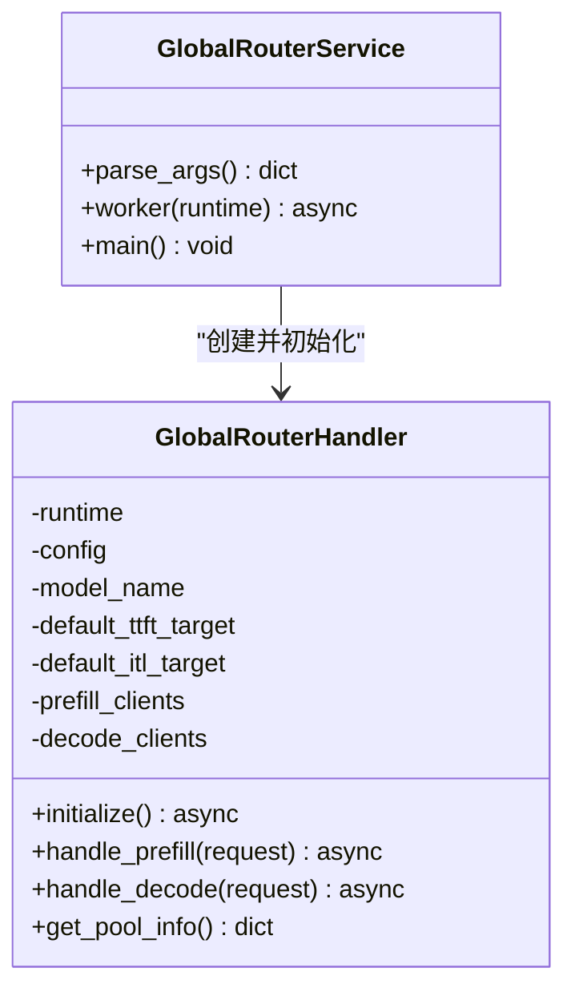
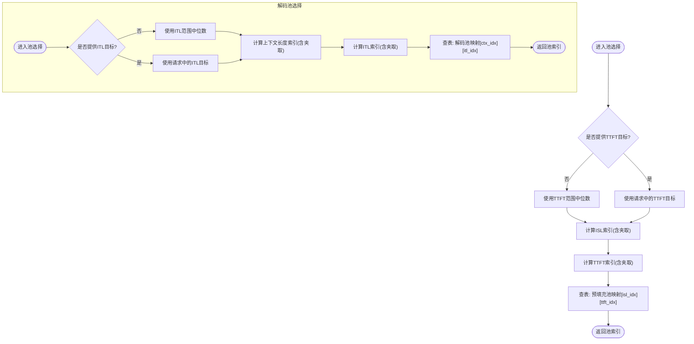
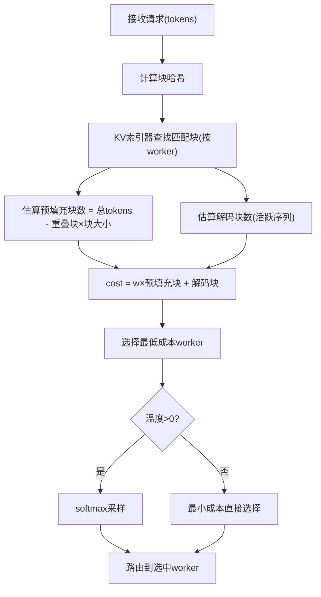
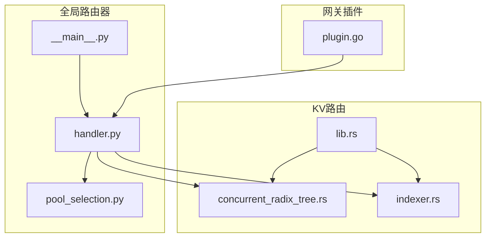

# 高级路由算法

<cite>
**本文引用的文件**
- [components/src/dynamo/global_router/__main__.py](file://components/src/dynamo/global_router/__main__.py)
- [components/src/dynamo/global_router/handler.py](file://components/src/dynamo/global_router/handler.py)
- [components/src/dynamo/global_router/pool_selection.py](file://components/src/dynamo/global_router/pool_selection.py)
- [components/src/dynamo/global_router/README.md](file://components/src/dynamo/global_router/README.md)
- [examples/hierarchical_planner/global_router_config.json](file://examples/hierarchical_planner/global_router_config.json)
- [docs/pages/design-docs/router-design.md](file://docs/pages/design-docs/router-design.md)
- [docs/pages/components/router/router-guide.md](file://docs/pages/components/router/router-guide.md)
- [lib/kv-router/src/lib.rs](file://lib/kv-router/src/lib.rs)
- [lib/kv-router/src/concurrent_radix_tree.rs](file://lib/kv-router/src/concurrent_radix_tree.rs)
- [lib/kv-router/src/indexer.rs](file://lib/kv-router/src/indexer.rs)
- [deploy/inference-gateway/epp/pkg/plugins/dynamo_kv_scorer/plugin.go](file://deploy/inference-gateway/epp/pkg/plugins/dynamo_kv_scorer/plugin.go)
- [components/src/dynamo/planner/utils/planner_core.py](file://components/src/dynamo/planner/utils/planner_core.py)
- [components/src/dynamo/planner/utils/prometheus.py](file://components/src/dynamo/planner/utils/prometheus.py)
</cite>

## 目录
1. [引言](#引言)
2. [项目结构](#项目结构)
3. [核心组件](#核心组件)
4. [架构总览](#架构总览)
5. [详细组件分析](#详细组件分析)
6. [依赖关系分析](#依赖关系分析)
7. [性能考量](#性能考量)
8. [故障排查指南](#故障排查指南)
9. [结论](#结论)
10. [附录](#附录)

## 引言
本技术文档聚焦Dynamo的高级路由算法，系统阐述以下内容：
- KV缓存感知路由的核心算法与权重计算
- 全局路由器的层次化架构、池选择机制与动态调整
- 路由决策的实时性保证、准确性优化与性能监控
- 完整配置参数、调优建议与性能基准方法
- 多节点部署、跨区域路由与故障转移最佳实践
- 扩展性设计、容量规划与运维监控指南

## 项目结构
Dynamo的路由体系由“前端/全局路由器/本地路由器/推理引擎”分层构成。全局路由器位于前端与本地路由器之间，负责基于请求特征（如输入序列长度、上下文长度）与SLA目标（TTFT/ITL）进行池选择，并将请求转发至对应命名空间内的本地路由器。

图表来源
- [components/src/dynamo/global_router/README.md](file://components/src/dynamo/global_router/README.md#L29-L52)

章节来源
- [components/src/dynamo/global_router/README.md](file://components/src/dynamo/global_router/README.md#L1-L168)

## 核心组件
- 全局路由器服务：作为进程启动，解析命令行参数，初始化处理器，注册为预填充与解码端点，同时并发服务两个端点。
- 全局路由器处理器：负责连接各池的本地路由器客户端，按请求特征与SLA目标选择池，转发请求并流式返回结果。
- 池选择策略：通过二维网格查找表（ISL/TTFT或上下文长度/ITL）实现快速池映射；支持默认目标值回退。
- KV缓存感知路由：在本地路由器侧，基于重叠块数量与解码块数量构建成本函数，结合权重平衡TTFT与ITL。

章节来源
- [components/src/dynamo/global_router/__main__.py](file://components/src/dynamo/global_router/__main__.py#L91-L176)
- [components/src/dynamo/global_router/handler.py](file://components/src/dynamo/global_router/handler.py#L23-L232)
- [components/src/dynamo/global_router/pool_selection.py](file://components/src/dynamo/global_router/pool_selection.py#L22-L318)
- [docs/pages/design-docs/router-design.md](file://docs/pages/design-docs/router-design.md#L31-L75)

## 架构总览
全局路由器采用“双端点注册 + 命名空间池”的层次化架构：
- 前端以统一接口向全局路由器发送预填充与解码请求
- 全局路由器根据配置的二维网格策略选择池
- 池内本地路由器再将请求路由到具体工作节点
- KV缓存感知路由在本地路由器侧完成，通过重叠块与解码块的成本函数进行权衡

图表来源
- [components/src/dynamo/global_router/README.md](file://components/src/dynamo/global_router/README.md#L150-L161)
- [components/src/dynamo/global_router/handler.py](file://components/src/dynamo/global_router/handler.py#L122-L214)

章节来源
- [components/src/dynamo/global_router/README.md](file://components/src/dynamo/global_router/README.md#L10-L168)
- [components/src/dynamo/global_router/handler.py](file://components/src/dynamo/global_router/handler.py#L23-L232)

## 详细组件分析

### 全局路由器服务与处理器
- 服务入口：解析参数、初始化日志、创建处理器、注册预填充与解码端点、并发服务
- 处理器职责：加载配置、建立到各池本地路由器的客户端、按请求特征选择池并转发、流式回传结果
- 连接管理：对每个池命名空间建立客户端，确保本地路由器可达

图表来源
- [components/src/dynamo/global_router/__main__.py](file://components/src/dynamo/global_router/__main__.py#L91-L176)
- [components/src/dynamo/global_router/handler.py](file://components/src/dynamo/global_router/handler.py#L23-L121)

章节来源
- [components/src/dynamo/global_router/__main__.py](file://components/src/dynamo/global_router/__main__.py#L39-L176)
- [components/src/dynamo/global_router/handler.py](file://components/src/dynamo/global_router/handler.py#L23-L232)

### 池选择策略与二维网格
- 预填充池选择：基于输入序列长度(ISL)与目标TTFT，计算网格索引并查表得到池索引
- 解码池选择：基于上下文长度与目标ITL，计算网格索引并查表得到池索引
- 默认目标：当请求未携带目标时，使用范围中位数作为默认值
- 配置示例：二维映射表维度与命名空间列表需与分辨率一致

图表来源
- [components/src/dynamo/global_router/pool_selection.py](file://components/src/dynamo/global_router/pool_selection.py#L44-L133)
- [components/src/dynamo/global_router/README.md](file://components/src/dynamo/global_router/README.md#L111-L133)

章节来源
- [components/src/dynamo/global_router/pool_selection.py](file://components/src/dynamo/global_router/pool_selection.py#L22-L318)
- [components/src/dynamo/global_router/README.md](file://components/src/dynamo/global_router/README.md#L74-L133)
- [examples/hierarchical_planner/global_router_config.json](file://examples/hierarchical_planner/global_router_config.json#L1-L24)

### KV缓存感知路由与成本函数
- 成本函数：cost = overlap_score_weight × 预填充块数 + 解码块数
- 重叠块：来自KV事件树的匹配块，反映可复用的KV缓存
- 解码块：当前请求的活跃序列与潜在新块估算
- 温度采样：非零温度下对成本logits做softmax采样，提升负载分布随机性
- 事件同步：通过NATS事件平面或JetStream持久流实现跨路由器状态一致性

图表来源
- [docs/pages/design-docs/router-design.md](file://docs/pages/design-docs/router-design.md#L35-L75)
- [docs/pages/components/router/router-guide.md](file://docs/pages/components/router/router-guide.md#L106-L130)
- [lib/kv-router/src/concurrent_radix_tree.rs](file://lib/kv-router/src/concurrent_radix_tree.rs#L297-L337)
- [lib/kv-router/src/indexer.rs](file://lib/kv-router/src/indexer.rs#L325-L359)

章节来源
- [docs/pages/design-docs/router-design.md](file://docs/pages/design-docs/router-design.md#L31-L168)
- [docs/pages/components/router/router-guide.md](file://docs/pages/components/router/router-guide.md#L106-L130)
- [lib/kv-router/src/lib.rs](file://lib/kv-router/src/lib.rs#L1-L30)
- [lib/kv-router/src/concurrent_radix_tree.rs](file://lib/kv-router/src/concurrent_radix_tree.rs#L297-L337)
- [lib/kv-router/src/indexer.rs](file://lib/kv-router/src/indexer.rs#L325-L359)

### 全局路由器与KV评分插件集成
- 插件参数：命名空间、组件名、模型名、是否启用KV路由、忙碌阈值、重叠分数权重、路由温度、是否使用KV事件、副本同步等
- 作用：在前端/网关侧为工作节点选择管道提供KV感知评分，配合全局路由器实现端到端低延迟与高吞吐

章节来源
- [deploy/inference-gateway/epp/pkg/plugins/dynamo_kv_scorer/plugin.go](file://deploy/inference-gateway/epp/pkg/plugins/dynamo_kv_scorer/plugin.go#L58-L241)

## 依赖关系分析
- 全局路由器服务依赖处理器与池选择模块
- 处理器依赖分布式运行时与本地路由器客户端
- 池选择模块依赖JSON配置文件与数据类定义
- KV路由依赖索引器与并发基数树，支持事件发布/订阅与JetStream持久化

图表来源
- [components/src/dynamo/global_router/__main__.py](file://components/src/dynamo/global_router/__main__.py#L91-L176)
- [components/src/dynamo/global_router/handler.py](file://components/src/dynamo/global_router/handler.py#L23-L121)
- [components/src/dynamo/global_router/pool_selection.py](file://components/src/dynamo/global_router/pool_selection.py#L22-L318)
- [lib/kv-router/src/lib.rs](file://lib/kv-router/src/lib.rs#L1-L30)
- [lib/kv-router/src/concurrent_radix_tree.rs](file://lib/kv-router/src/concurrent_radix_tree.rs#L297-L337)
- [lib/kv-router/src/indexer.rs](file://lib/kv-router/src/indexer.rs#L325-L359)
- [deploy/inference-gateway/epp/pkg/plugins/dynamo_kv_scorer/plugin.go](file://deploy/inference-gateway/epp/pkg/plugins/dynamo_kv_scorer/plugin.go#L58-L241)

章节来源
- [components/src/dynamo/global_router/__main__.py](file://components/src/dynamo/global_router/__main__.py#L91-L176)
- [components/src/dynamo/global_router/handler.py](file://components/src/dynamo/global_router/handler.py#L23-L232)
- [components/src/dynamo/global_router/pool_selection.py](file://components/src/dynamo/global_router/pool_selection.py#L22-L318)
- [lib/kv-router/src/lib.rs](file://lib/kv-router/src/lib.rs#L1-L30)
- [lib/kv-router/src/concurrent_radix_tree.rs](file://lib/kv-router/src/concurrent_radix_tree.rs#L297-L337)
- [lib/kv-router/src/indexer.rs](file://lib/kv-router/src/indexer.rs#L325-L359)
- [deploy/inference-gateway/epp/pkg/plugins/dynamo_kv_scorer/plugin.go](file://deploy/inference-gateway/epp/pkg/plugins/dynamo_kv_scorer/plugin.go#L58-L241)

## 性能考量
- 实时性保证
  - 预填充阶段：前端等待预填充完成，全局路由器通过池选择与本地路由器转发降低排队时间
  - 解码阶段：流式输出，减少端到端延迟
- 准确性优化
  - 使用KV事件树精确统计重叠块，避免子最优工作节点选择
  - 成本函数中重叠分数权重平衡TTFT与ITL，温度采样改善负载分布
- 性能监控
  - 观测指标：TTFT、ITL、请求速率、请求时长、ISL/OSL
  - Prometheus查询：通过增加窗口聚合计算平均值，支持按模型与命名空间过滤
  - 预测器：基于历史观测更新预测模型，指导动态调整

章节来源
- [docs/pages/design-docs/router-design.md](file://docs/pages/design-docs/router-design.md#L585-L610)
- [components/src/dynamo/planner/utils/prometheus.py](file://components/src/dynamo/planner/utils/prometheus.py#L62-L89)
- [components/src/dynamo/planner/utils/planner_core.py](file://components/src/dynamo/planner/utils/planner_core.py#L585-L610)

## 故障排查指南
- 连接失败
  - 现象：无法连接到某池本地路由器
  - 排查：检查命名空间、组件名与端点名称是否一致；确认本地路由器已就绪
- 池映射异常
  - 现象：请求被路由到错误池或越界
  - 排查：核对配置文件中分辨率与映射表维度；校验ISL/TTFT或上下文长度/ITL范围
- KV事件丢失
  - 现象：重叠块统计不准确导致成本函数偏差
  - 排查：确认事件传输模式（NATS Core/本地索引器或JetStream）；检查事件ID单调性与间隙恢复
- 性能退化
  - 现象：ITL上升、吞吐下降
  - 排查：调整重叠分数权重与路由温度；评估池内资源分配与副本同步设置

章节来源
- [components/src/dynamo/global_router/handler.py](file://components/src/dynamo/global_router/handler.py#L70-L121)
- [components/src/dynamo/global_router/pool_selection.py](file://components/src/dynamo/global_router/pool_selection.py#L152-L253)
- [docs/pages/design-docs/router-design.md](file://docs/pages/design-docs/router-design.md#L252-L265)

## 结论
Dynamo的高级路由算法通过“全局路由器+本地KV感知路由”的双层设计，在多池异构环境下实现了面向SLA的目标导向路由。二维网格策略简化了池选择逻辑，KV事件驱动的成本函数提升了缓存复用与负载均衡效果。结合可观测性与动态调整能力，系统可在多节点与跨区域场景中保持低延迟与高吞吐。

## 附录

### 配置参数与调优要点
- 全局路由器配置
  - 池数量与命名空间列表
  - 预填充/解码池选择策略：ISL/TTFT或上下文长度/ITL的范围与分辨率
  - 二维映射表：确保维度与分辨率一致
- KV路由配置
  - 重叠分数权重：权衡TTFT与ITL
  - 路由温度：引入随机性改善负载分布
  - 是否使用KV事件、副本同步、快照阈值与TTL等
- 示例配置
  - 参考示例配置文件，定义预填充与解码池的命名空间及网格映射

章节来源
- [components/src/dynamo/global_router/README.md](file://components/src/dynamo/global_router/README.md#L74-L133)
- [examples/hierarchical_planner/global_router_config.json](file://examples/hierarchical_planner/global_router_config.json#L1-L24)
- [docs/pages/components/router/router-guide.md](file://docs/pages/components/router/router-guide.md#L106-L130)

### 多节点部署与跨区域路由
- 多池命名空间：按区域/机架划分命名空间，分别部署本地路由器与工作节点
- 事件传输模式：生产环境推荐JetStream持久流，确保多副本一致性与重启后状态恢复
- 负载均衡：结合池内资源与副本同步，动态调整池映射与权重

章节来源
- [docs/pages/design-docs/router-design.md](file://docs/pages/design-docs/router-design.md#L151-L217)

### 故障转移与弹性
- 事件间隙检测与恢复：通过事件ID单调性检测缺失事件并回补
- 工作节点发现/移除：自动注入/清理该节点的KV状态
- 网关插件参数：通过命名空间与组件名控制路由行为

章节来源
- [docs/pages/design-docs/router-design.md](file://docs/pages/design-docs/router-design.md#L252-L265)
- [deploy/inference-gateway/epp/pkg/plugins/dynamo_kv_scorer/plugin.go](file://deploy/inference-gateway/epp/pkg/plugins/dynamo_kv_scorer/plugin.go#L58-L241)