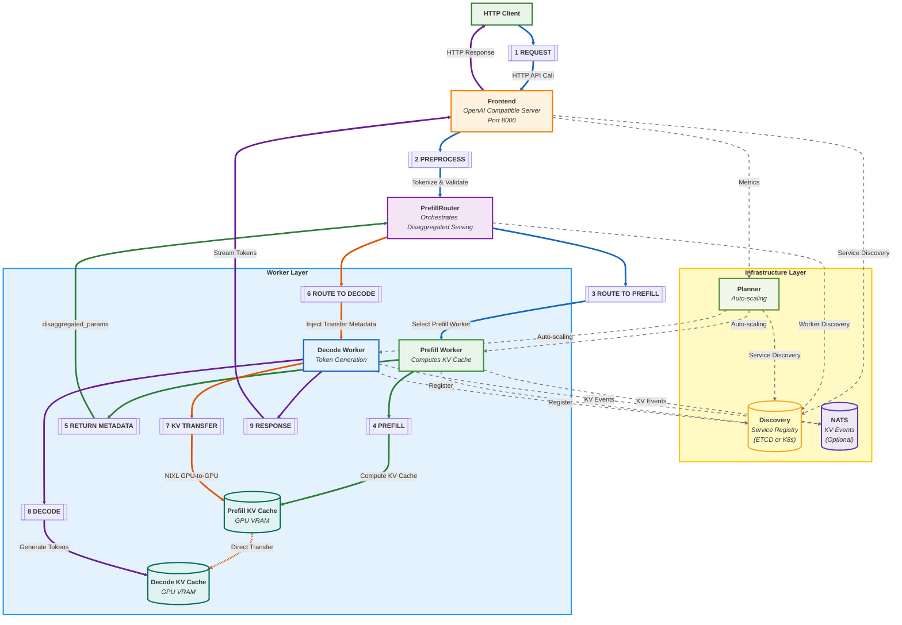

# NVIDIA Dynamo 架构与 KV 路由调研报告

> 基于 `lib/llm/src/kv_router/`、`lib/kv-router/src/` 源码及项目文档进行整理，聚焦：整体框架设计、组件协同、请求流程，以及 KV Cache（下文简称 KV）路由与传输机制。

---

## 1. Dynamo 框架总体设计概览

NVIDIA Dynamo 是面向大模型推理的分布式推理框架，其核心目标是：

- 在**高并发**与**低延迟**之间取得平衡；
- 支持多种后端引擎（vLLM、TensorRT‑LLM、SGLang 等）的统一调度；
- 利用 **Disaggregated Prefill & Decode（预填充 / 解码分离）** 提升资源利用率与吞吐。

从 `dynamo-flow.md` 的主流程可以看到，Dynamo 整体抽象为三层：

1. **客户端与前端层（Client / Frontend）**
   - 提供 OpenAI 兼容的 HTTP API（缺省端口 `8000`）；
   - 负责请求接入、校验、Chat Template 应用、分词 / Tokenization，以及将请求转换为内部统一格式。

2. **路由与控制层（Router Layer）**
   - **PrefillRouter**：PD 分离流程编排（详见第3章）；
   - **KvPushRouter / KvRouter / KvIndexer / KvScheduler**：KV 感知路由核心组件（详见第3章）；
   - **Planner**：容量规划与自动扩缩容；
   - **Discovery / NATS**：服务发现与 KV 事件传播（可选）。

3. **工作节点层（Worker Layer）**
   - **Prefill Worker**：执行预填充计算，生成 KV；
   - **Decode Worker**：基于 KV 做增量解码 / 采样，生成 token 流；
   - KV 数据存放在各自 GPU 显存中，通过 **NIXL** 做 GPU‑to‑GPU 传输，无需共享存储。

整体看，Dynamo 将“接入 / 编排 / 执行”三个职责显式拆开，有利于多后端集成、弹性扩缩容与跨集群部署。

---

## 2. 端到端请求流程与组件协同

### 2.1 主请求流（蓝色）

1. **S1 – Request**  
   客户端通过 HTTP 调用 Frontend（OpenAI 兼容 API）。

2. **S2 – Preprocess**  
   Frontend 对请求做预处理：
   - 套用 Chat 模板；
   - Tokenize + 参数校验；
   - 生成内部标准请求结构，然后发送给 PrefillRouter。

3. **S3 – Route to Prefill（PD 分离模式下）**  
   请求进入 **PrefillRouter**：
   - **启动时**：检测是否有 Prefill Worker 注册（通过 `ModelType.Prefill` 标记），如有则自动激活 PrefillRouter；
   - **每条请求到来时**：构建 `bootstrap_info`（包含 `bootstrap_host`、`bootstrap_port`、`bootstrap_room`），用于后续 NIXL 传输；
   - 选择 Prefill Worker 并发送请求（`max_tokens=1`，仅做预填充）。

### 2.2 预填充流（绿色）

4. **S4 – Prefill**  
   Prefill Worker 接收请求，执行预填充计算：
   - 基于输入 Token 做 Forward，生成完整的 KV Cache；
   - KV 存放在该 Worker 所在 GPU 的显存中（`Prefill KV Cache`）。

5. **S5 – Return Metadata**  
   完成预填充后，Prefill Worker 将结果返回给 PrefillRouter，但并不是直接返回完整 KV，而是：

   - 返回 `disaggregated_params` —— 这是**后端特定的传输元数据**；
   - 其中包含足以让 Decode Worker 通过 NIXL 与 Prefill Worker 协同完成 KV 传输的信息。

> 这里是 Dynamo Disaggregated Serving 的关键：  
> **推理过程被拆为“预填充 + 解码”两段，KV 仅在 Worker 之间直接传输，不通过前端，不写入共享存储。**

### 2.3 解码路由流（橙色）

6. **S6 – Route to Decode**  
   PrefillRouter 拿到 `disaggregated_params` 后：
   - 将其**注入解码请求**；
   - 设置 `overlap_score_weight=0`（PD 模式下 Decode 只看负载，不依赖本地缓存命中）；
   - 选择 Decode Worker 并发送请求。

7. **S7 – KV Transfer via NIXL**  
   Decode Worker 根据注入的元数据，与 Prefill Worker 协调，发起 KV GPU‑to‑GPU 传输：

   - 通过 **NIXL（NVIDIA Interchange Library）** 建立 GPU 间数据通道：
     - 支持 NVLink、InfiniBand/UCX 或 PCIe 等物理通道；
   - 传输路径：  
     `Prefill KV Cache (GPU VRAM) --> Decode KV Cache (GPU VRAM)`  
   - **非阻塞传输**：在很多后端实现中，KV 传输和 Decode 的 Forward Pass 可以并行 / pipeline 化，尽量减少对 GPU 计算的阻塞。

### 2.4 完成流（紫色）

8. **S8 – Decode**  
   Decode Worker 利用已经获取的 KV 开始增量解码，生成 token 流。

9. **S9 – Response**  
   解码出的 token 流通过 Frontend（OpenAI 兼容接口）进行 detokenization 等后处理，最终以流式响应或一次性响应的形式返回给客户端。

---

## 3. 核心组件协作关系

当一条请求到来时，五个核心组件按以下方式协作：

```
┌─────────────────────────────────────────────────────────────────────────┐
│                           Frontend (HTTP + Preprocess)                  │
│                              ↓ PreprocessedRequest                       │
├─────────────────────────────────────────────────────────────────────────┤
│  ┌─────────────────┐                                                    │
│  │  PrefillRouter  │  ← PD 分离模式下自动激活，协调 prefill 和 decode    │
│  │  (Operator)     │                                                    │
│  └────────┬────────┘                                                    │
│           │ 1. build_bootstrap_info(): 选 prefill worker + 拿 bootstrap │
│           │ 2. spawn_prefill_task(): 异步执行 prefill                   │
│           │ 3. 注入 disaggregated_params + bootstrap_info 到 decode 请求 │
│           ↓                                                             │
│  ┌─────────────────┐     ┌─────────────────┐     ┌─────────────────┐   │
│  │  KvPushRouter   │ ←── │    KvRouter     │ ←── │   KvScheduler   │   │
│  │ (Prefill 池)    │     │  (Worker 选择器) │     │ (成本计算 + 调度) │   │
│  │                 │     │                 │     │                 │   │
│  │ • 调用 chooser  │     │ • find_best_match│     │ • select_worker │   │
│  │   选 worker     │     │ • 不直接发请求   │     │ • cost 公式计算 │   │
│  │ • 用 PushRouter │     │                 │     │                 │   │
│  │   真正推送请求  │     └────────┬────────┘     └─────────────────┘   │
│  └─────────────────┘              │                                      │
│                                   ↓                                      │
│                          ┌─────────────────┐                            │
│                          │   KvIndexer     │                            │
│                          │ (RadixTree 索引) │                            │
│                          │                 │                            │
│                          │ • find_matches()│                            │
│                          │ • 维护全局缓存  │                            │
│                          │   块索引        │                            │
│                          └─────────────────┘                            │
│                                                                         │
│  ┌─────────────────┐     ┌─────────────────┐                           │
│  │  KvPushRouter   │ ←──  Decode 请求（带 bootstrap_info）              │
│  │ (Decode 池)     │                                                      │
│  │                 │                                                      │
│  │ • overlap_weight=0（PD 模式下）                                        │
│  │ • 纯负载均衡选 Decode Worker                                           │
│  └────────┬────────┘                                                      │
│           ↓                                                              │
│    Decode Worker → NIXL 拉取 KV → 生成 token                             │
└─────────────────────────────────────────────────────────────────────────┘
```

### 组件职责对照

| 组件 | 核心职责 | 关键方法/特性 |
|------|---------|--------------|
| **PrefillRouter** | PD 分离流程编排 | `generate()` → `build_bootstrap_info()` → `spawn_prefill_task()` → decode |
| **KvPushRouter** | 决策 + 执行一体化 | `chooser: KvRouter` 选 worker，`inner: PushRouter` 真正推送 |
| **KvRouter** | Worker 选择器，**不负责发送** | `find_best_match()` → 返回 `(worker_id, overlap_blocks)` |
| **KvIndexer** | 维护全局缓存块索引 | `find_matches()` 基于 RadixTree 做前缀匹配 |
| **KvScheduler** | 综合成本计算和调度 | `select_worker()` 执行 `cost = weight × prefill_blocks + decode_blocks` |

---

## 4. KV Cache 路由与 NIXL 传输设计（重点）

### 4.1 KV Cache 的角色与存储方式

在大模型推理中，KV Cache 表示了“历史序列的中间特征表示”，用于避免重复计算。Dynamo 中：

- 每个 Worker 维护本地的 KV：
  - Prefill Worker：负责生成**初始 KV**；
  - Decode Worker：在此基础上追加增量 KV；
- KV 存储于 GPU 显存，通常以“块 / Block”为单位管理；
- 不使用中心化共享存储做中转，减少带宽和延迟瓶颈。

### 4.2 PrefillRouter 的 KV 感知路由能力

PrefillRouter 是 KV 路由的核心组件，其能力包括：

- **KV 亲和路由（KV‑Aware Routing）：**
  - 通过缓存重用（cache overlap score）与负载信息（例如每个 Worker 的活跃 token 数、活跃 KV 块数），尽量把请求路由到“命中率更高”的 Worker；
  - 降低重复预填充带来的计算浪费。

- **多种路由模式：**
  - KV 模式：以 KV 命中 / 负载为优先；
  - 轮询 / 随机：简单均衡负载；
  - 直连：用于测试或特定部署拓扑。

在 `dynamo-flow.md` 的主流程中，虽然图侧重于单次请求的“Prefill → Decode”分离，但在实际系统中，同一 Worker 的 KV 可跨请求复用。  
PrefillRouter 利用 KV 统计信息，为后续请求选择更优的 Worker，从而把“KV 分离 + 路由”转化为吞吐和成本优势。

### 4.3 disaggregated_params：后端特定 KV 传输元数据

`disaggregated_params` 是连接 Prefill 阶段与 Decode 阶段的关键结构，其特点是：

- **只包含元信息，不直接承载 KV 数据**；
- 内容由具体后端决定，例如：
  - **SGLang**：可能使用 bootstrap 连接信息，用于建立后续 KV 通道；
  - **vLLM**：可能通过 **Block ID** 或 Allocation Handle 来标记 KV 在内存中的位置；
  - **TensorRT‑LLM**：使用不透明状态（opaque state）描述 KV 布局与句柄。

PrefillRouter 不理解这些字段的内部语义，它只负责：

1. 在 S5 阶段从 Prefill Worker 提取 `disaggregated_params`；
2. 在 S6 阶段将其注入 Decode 请求并转发到 Decode Worker。

这样做的好处是：

- 路由逻辑与后端实现解耦；
- 可以统一管理不同后端的 Disaggregated Serving 模式；
- 只要后端实现了对应的 `disaggregated_params` 协议，就能接入 Dynamo 的分离预填充 / 解码流程。

### 4.4 NIXL：KV GPU‑to‑GPU 传输加速层

NIXL（NVIDIA Interchange Library）是 KV GPU‑to‑GPU 传输的关键组件，其作用包括：

- 在 Prefill Worker 和 Decode Worker 之间建立高性能数据通道：
  - 支持 NVLink、InfiniBand/UCX 或 PCIe 等底层网络；
- 根据 `disaggregated_params` 的描述进行数据协同：
  - 确认 KV 位置、大小、布局；
  - 控制传输粒度与并行度；
- 尽量以**非阻塞 / pipeline** 的方式进行传输：
  - 在传输期间，Decode Worker 可以先对已到达的 KV 分块进行前向计算；
  - 避免“先完全传完 KV 再启动计算”的串行模式。

在流程图中，对应节点为：

- `S7`：Decode Worker 触发 KV 传输；
- `Prefill KV Cache -.-> Decode KV Cache`：虚线表示通过 NIXL 的直接传输，而非传统的 CPU / 内存中转。

---

## 5. 服务发现、事件与规划（Discovery / NATS / Planner）

除了主推理流程之外，Dynamo 在基础设施层还设计了：

1. **Service Discovery（服务发现）**
   - Kubernetes 环境：使用 CRD（`DynamoWorkerMetadata`）与 EndpointSlices 完成 Worker 注册与发现；
   - Bare Metal 环境：可使用 etcd 或文件系统做注册表；
   - Frontend、PrefillRouter、Worker、Planner 都会与 Discovery 交互，维护最新拓扑信息。

2. **NATS（KV Events，可选）**
   - 用于传播 KV 状态事件，支撑 KV 感知路由：
     - Worker 上报 KV 使用情况；
     - PrefillRouter 订阅这些事件，更新 KV 命中 / 负载视图；
   - 可以通过 `--no-kv-events` 关闭。

3. **Planner（规划器）**
   - Frontend 向 Planner 报告请求指标（QPS、延迟、失败率等）；
   - Planner 据此向 Prefill / Decode Worker 下发扩缩容命令，实现 SLA 驱动的资源规划；
   - 通过与 Discovery 联动，可以逐步调整集群拓扑。

这些基础设施组件与主路径是“虚线关系”：  
- 不直接影响单个请求的同步路径，但决定了整个系统的容量、拓扑与路由效果。

---

## 6. 整体架构与 KV 路由的 Mermaid 流程图

架构流程图：




### Prefill 与 Decode 路由配置差异

| 阶段 | Active Block Tracking | Overlap Score Weight | 说明 |
|------|----------------------|---------------------|------|
| **Prefill** | 禁用 | 1.0（优化 KV 复用） | 最大化 prefix 匹配 |
| **Decode** | 启用 | 0（PD 模式下） | 纯负载均衡，不依赖本地缓存 |

**成本公式**：`cost = overlap_score_weight × prefill_blocks + decode_blocks`

### 应用场景示例

假设配置 `overlap_score_weight = 1.0`，集群中有 3 个 Worker。路由算法将计算每个 Worker 的**综合成本**（公式：$Cost = \text{weight} \times \text{PrefillBlocks} + \text{DecodeBlocks}$），并选择成本最低的节点。

| Worker | 缓存块数 (Cache Blocks) | Prefill Blocks | Decode Blocks | 成本计算 ($1.0 \times P + D$) | 总成本 | 结果 |
| :---: | :---: | :---: | :---: | :--- | :---: | :---: |
| **W1** | 2 | 8 | 10 | $1.0 \times 8 + 10$ | **18** | |
| **W2** | 5 | 5 | 5 | $1.0 \times 5 + 5$ | **10** | ✅ **选中** |
| **W3** | 8 | 2 | 9 | $1.0 \times 2 + 9$ | **11** | |

**决策分析：**
*   **最终选择**：**W2** 被选中，因为其综合成本最低（10）。
*   **原因解读**：
    *   尽管 **W3** 拥有最多的缓存块数（8 个），理论上能带来最高的 KV 命中率（Overlap Score 最高），但其当前的 **Decode 负载偏高**（9 个活跃块）。
    *   在 `overlap_score_weight = 1.0` 的平衡策略下，系统认为 W3 新增请求带来的解码负载压力超过了缓存复用带来的收益。
    *   **W2** 在缓存复用（5 个块）和当前负载（5 个块）之间取得了最佳平衡，因此成为最优调度目标。

---

## 7. 总结与评估

### 1. 框架设计方面

- 通过 **Disaggregated Prefill & Decode**，将推理拆分为两阶段：  
  - 预填充阶段偏重「高计算量、长序列」；  
  - 解码阶段偏重「增量生成、交互延迟」。
- 这种分离设计使得不同阶段可以独立伸缩，并更容易做 QoS 分层与资源隔离。

### 2. 组件协同方面

- Frontend 专注接入与协议适配，保持简单可扩展。
- PrefillRouter 统一管理路由、KV 注入以及多后端集成，是系统智能调度的核心。
- Worker 层负责高性能推理执行，通过 NIXL 与 KV 管理实现高效数据流转。
- Discovery / NATS / Planner 则为整体系统提供「可观测 + 自动扩缩容 + 智能路由」的基础设施支撑。

### 3. KV 路由与传输方面（重点评估）

- **KV Cache 成为一等公民**：专门的 KV 感知路由、事件系统（NATS）、GPU‑to‑GPU 传输（NIXL）；
- **`disaggregated_params` 解耦**：后端 KV 表达与路由编排分离，支持多后端集成；
- **Conditional Disaggregation**：文档中的设计目标（按长度/队列动态决策）在当前代码（`prefill_router.rs`）中**尚未实现**——PD 分离仅基于 Worker 注册状态，而非单条请求的 `prompt_length` / `overlap_score`。

整体来看，Dynamo 将 **KV 重用 / 分离式服务 / 多后端统一编排** 结合，是针对大规模 LLM 推理的系统级设计。

---

## 8. 自定义引擎适配指南（参考 vLLM 实现）

若需在 Dynamo 中接入自定义推理引擎（类似 vLLM、SGLang、TRT-LLM），需完成以下三步：

### 8.1 Worker 注册（三要素：namespace.component.endpoint）

```python
from dynamo.llm import ModelInput, ModelType, register_llm
from dynamo.runtime import DistributedRuntime, dynamo_worker

@dynamo_worker()
async def worker(runtime: DistributedRuntime):
    # 1. 定义三要素
    component = runtime.namespace("my_model").component("backend")
    endpoint = component.endpoint("generate")
    
    # 2. 注册模型
    await register_llm(
        model_input=ModelInput.Tokens,    # 或 ModelInput.Text（自行处理分词）
        model_type=ModelType.Chat,        # 或 ModelType.Prefill / ModelType.Completions
        endpoint=endpoint,
        model_path="/path/to/model",
        kv_cache_block_size=16,           # KV 块大小，默认 16
    )
    
    # 3. 挂载请求处理器
    await endpoint.serve_endpoint(MyEngineHandler(engine).generate)
```

**关键参数说明**：
- `model_input`: `Tokens`（Dynamo 负责分词）或 `Text`（引擎自行处理）
- `model_type`: `Chat` / `Completions` / `Prefill` / `Decode`，PD 分离需分别注册 Prefill 和 Decode Worker
- `kv_cache_block_size`: 必须与实际引擎的 block 大小一致，影响 KV 索引匹配精度

### 8.2 请求处理器实现

```python
class MyEngineHandler:
    def __init__(self, engine):
        self.engine = engine
    
    async def generate(self, request):
        """
        request 格式（OpenAI Chat Completion）：
        {
            "messages": [...],
            "model": "my_model",
            "max_tokens": 100,
            "temperature": 0.7,
            ...
        }
        """
        # 调用自定义引擎生成
        async for token in self.engine.generate(request):
            yield {
                "choices": [{
                    "delta": {"content": token},
                    "index": 0,
                    "finish_reason": None
                }]
            }
```

### 8.3 KV 事件发布（启用 KV 感知路由）

若需让自定义引擎参与 KV 缓存感知路由，需在 KV 块分配/驱逐时发布事件：

```python
from dynamo.llm import KvEventPublisher

class CustomEnginePublisher:
    def __init__(self, component, worker_id: int, block_size: int):
        self.kv_publisher = KvEventPublisher(
            component=component,
            worker_id=worker_id,
            kv_block_size=block_size,
        )
        self.event_id = 0
    
    def on_blocks_stored(self, token_ids: list[int], block_hashes: list[int]):
        """KV 块分配后调用"""
        self.event_id += 1
        self.kv_publisher.publish_stored(
            event_id=self.event_id,
            token_ids=token_ids,
            block_hashes=block_hashes,      # 序列累积哈希，用于前缀匹配
            num_block_tokens=[len(token_ids)],
            parent_hash=parent_hash,        # 父块哈希（首块为 None）
        )
    
    def on_blocks_removed(self, block_hashes: list[int]):
        """KV 块驱逐时调用"""
        self.event_id += 1
        self.kv_publisher.publish_removed(
            event_id=self.event_id,
            block_hashes=block_hashes,
        )
```

**事件类型**：
- `BlockStored`: 新块存入缓存
- `BlockRemoved`: 块被驱逐
- `AllBlocksCleared`: 缓存重置

### 8.4 PD 分离模式支持（可选）

若需支持 Disaggregated Serving，需：

1. **分别注册 Prefill / Decode Worker**：
   ```python
   # Prefill Worker
   await register_llm(
       model_input=ModelInput.Tokens,
       model_type=ModelType.Prefill,    # 标记为 Prefill 类型
       endpoint=prefill_endpoint,
       ...
   )
   
   # Decode Worker
   await register_llm(
       model_input=ModelInput.Tokens,
       model_type=ModelType.Chat,       # Decode 端仍为 Chat/Completions
       endpoint=decode_endpoint,
       ...
   )
   ```

2. **实现 `disaggregated_params` 返回**：
   Prefill Worker 的 `generate()` 需返回包含 `disaggregated_params` 的响应，供 Decode Worker 通过 NIXL 拉取 KV：
   ```python
   yield {
       "choices": [...],
       "disaggregated_params": {
           # 后端特定格式：
           # vLLM: block_ids + slot_mapping
           # SGLang: bootstrap_host/port/room
           # TRT-LLM: opaque state handle
       }
   }
   ```

3. **NIXL 传输集成**：
   Decode Worker 根据 `disaggregated_params` 中的元数据，通过 NIXL 从 Prefill Worker 拉取 KV 到本地显存。

### 8.5 与 vLLM 实现的对比

| 适配项 | vLLM 实现 | 自定义引擎参考 |
|--------|----------|---------------|
| **Worker 注册** | `register_llm(ModelInput.Tokens, ModelType.Chat, ...)` | 相同 API |
| **KV 事件** | 通过 `ZmqKvEventPublisher` 转发 vLLM 内部事件 | 直接调用 `KvEventPublisher` |
| **PD 分离** | `VllmWorker` 分别用 `ModelType.Prefill` / `ModelType.Chat` 注册 | 相同模式 |
| **`disaggregated_params`** | vLLM 返回 block IDs + slot mapping | 根据引擎自定义格式 |
| **NIXL 集成** | vLLM 内部通过 NIXL 传输 blocks | 需自行实现或复用 NIXL 库 |

**参考代码**：
- vLLM Worker: `components/src/dynamo/vllm/main.py`
- KV 事件发布: `components/src/dynamo/vllm/publisher.py`
- 自定义引擎指南: `docs/pages/development/backend-guide.md`
- KV 事件集成: `docs/pages/integrations/kv-events-custom-engines.md`
